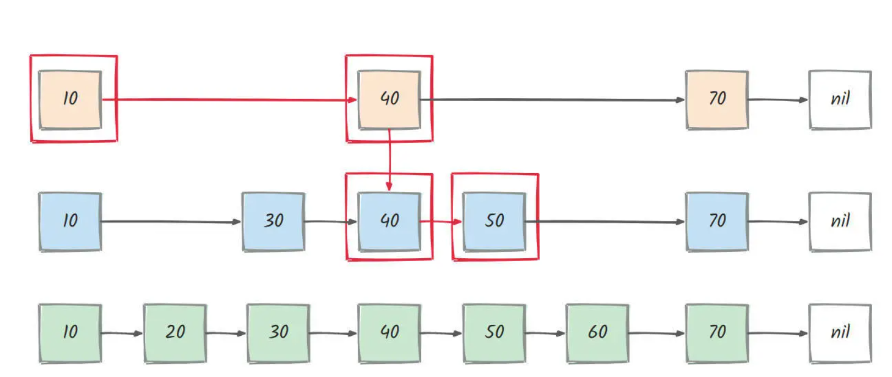
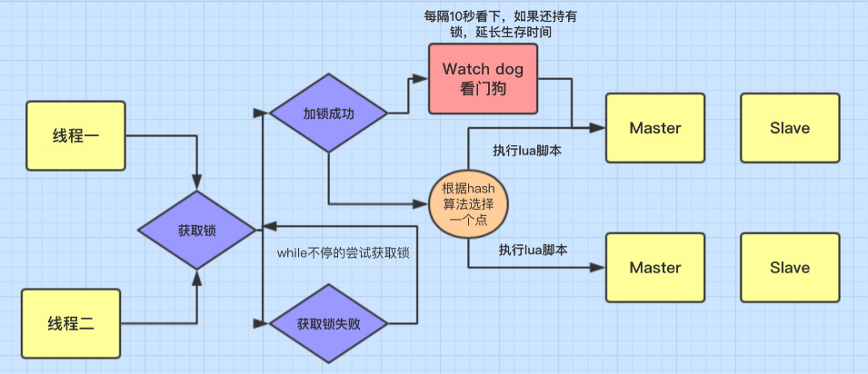
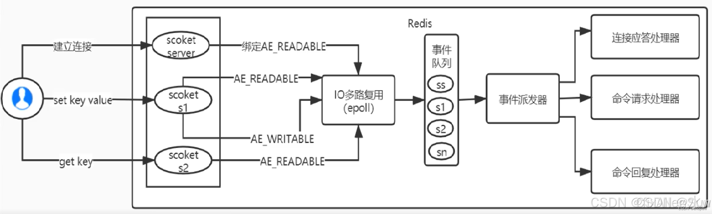
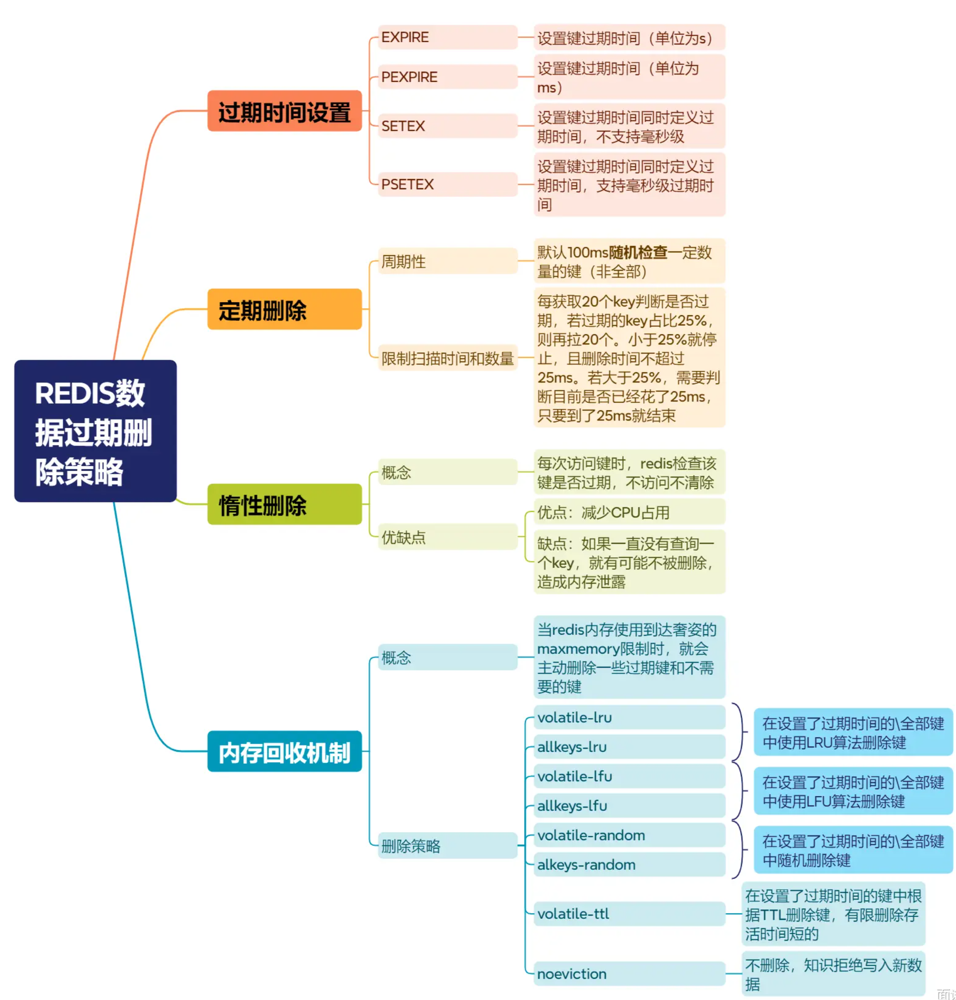
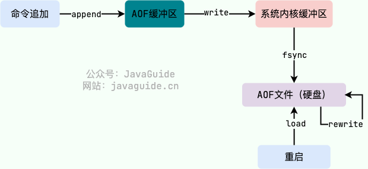
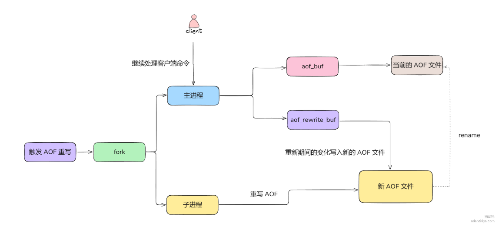
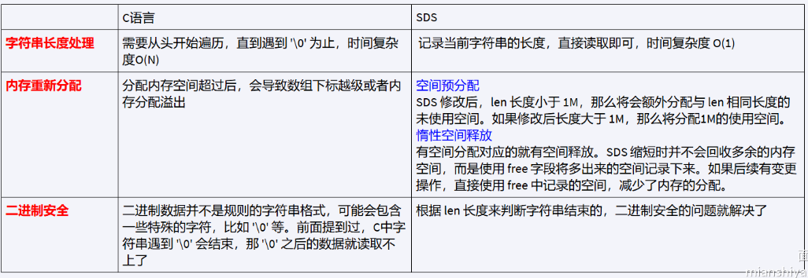

# Redis数据类型

**一、基本数据类型**

​	Redis 共有 5 种基本数据类型：String（字符串）、List（列表）、Set（集合）、Hash（散列）、Zset（有序集合）。

**1、字符串（String）**

* 概念：字符串是 Redis 中最基本、最常用的数据类型，可以存储 **字符串、整数、浮点数** 等值。每个键最多可以存储 512 MB 的数据

* 使用场景
  * 需要存储常规数据的场景：缓存 Session、Token、图片地址、序列化后的对象(相比较于 Hash 存储更节省内存)、需要计数的场景
  * 需要计数的场景：如用户单位时间的请求数（简单限流可以用到）、页面单位时间的访问数。

* 使用示例

```
SET name "Alice"         # 设置字符串
GET name                 # 获取字符串
INCR counter             # 自增
APPEND name " Johnson"   # 拼接字符串，结果为 "Alice Johnson"

```

| 指令                      | 说明                           |
| ------------------------- | ------------------------------ |
| `SET key value`           | 设置键的值                     |
| `GET key`                 | 获取键的值                     |
| `INCR key`                | 将键的整数值加 1               |
| `DECR key`                | 将键的整数值减 1               |
| `APPEND key value`        | 将字符串追加到键的原值后       |
| `MSET key value ...`      | 设置多个键值对                 |
| `MGET key ...`            | 获取多个键的值                 |
| `GETSET key value`        | 设置键的新值，并返回旧值       |
| `SETNX key value`         | 仅当键不存在时，设置键的值     |
| `SETEX key seconds value` | 设置键的值并设置过期时间（秒） |

**2、列表操作（List）**

* 概念：列表是一个双向链表，可以从左或右插入、弹出元素。它适合实现队列、栈等数据结构
* 使用场景
  * 信息流展示：最新文章、最新动态
  * 消息队列：过于简单且存在很多缺陷，不建议这样做。
* 使用示例：

```
LPUSH tasks "task1"               # 从左侧插入元素
RPUSH tasks "task2"               # 从右侧插入元素
LPOP tasks                        # 从左侧弹出，返回 "task1"
RPOP tasks                        # 从右侧弹出，返回 "task2"
LRANGE tasks 0 -1                 # 获取列表中所有元素
```


| 指令                    | 说明                                 |
| ----------------------- | ------------------------------------ |
| `LPUSH key value ...`   | 从左侧插入一个或多个值               |
| `RPUSH key value ...`   | 从右侧插入一个或多个值               |
| `LPOP key`              | 从左侧弹出元素                       |
| `RPOP key`              | 从右侧弹出元素                       |
| `LRANGE key start stop` | 获取指定范围内的元素                 |
| `LLEN key`              | 获取列表长度                         |
| `LINDEX key index`      | 获取指定索引的元素                   |
| `LSET key index value`  | 设置指定索引的值                     |
| `LTRIM key start stop`  | 对列表进行修剪，保留指定范围内的元素 |

**3、集合操作（Set）**

* 概念：集合是一个无序集合，元素不重复，适合用于存储一些不需要顺序、且不重复的数据
* 使用场景
  * 需要存放的数据不能重复的场景：网站 UV 统计（数据量巨大的场景还是 HyperLogLog更适合一些）、共同好友、文章点赞、动态点赞等场景。
* 使用示例：

```
SADD fruits "apple"              # 添加元素到集合
SADD fruits "banana"
SADD fruits "apple"              # 重复元素不会被添加
SMEMBERS fruits                  # 获取所有集合元素
SISMEMBER fruits "banana"        # 检查元素是否在集合中，返回 1 表示存在
SREM fruits "apple"              # 从集合中移除元素
```


| 指令                   | 说明                     |
| ---------------------- | ------------------------ |
| `SADD key member ...`  | 添加一个或多个元素到集合 |
| `SREM key member ...`  | 移除一个或多个元素       |
| `SMEMBERS key`         | 获取集合中的所有元素     |
| `SISMEMBER key member` | 检查元素是否在集合中     |
| `SCARD key`            | 获取集合的元素个数       |
| `SDIFF key ...`        | 获取多个集合的差集       |
| `SINTER key ...`       | 获取多个集合的交集       |
| `SUNION key ...`       | 获取多个集合的并集       |


**4、哈希（Hash）**

* 概念：哈希是一种键值对集合，适合存储对象或结构化的数据。每个哈希表可以包含多个字段和值（类似于对象或字典）
* 使用场景
  * 对象数据存储场景：用户信息、商品信息、文章信息、购物车信息。

* 使用示例

```
HSET user:1001 name "Alice"       # 设置哈希字段
HSET user:1001 age 30
HGET user:1001 name               # 获取字段
HGETALL user:1001                 # 获取所有字段和值
HDEL user:1001 age                # 删除字段
```


| 指令                          | 说明                     |
| ----------------------------- | ------------------------ |
| `HSET key field value`        | 设置哈希表字段的值       |
| `HGET key field`              | 获取哈希表字段的值       |
| `HMSET key field value ...`   | 设置多个字段及值         |
| `HMGET key field ...`         | 获取多个字段的值         |
| `HGETALL key`                 | 获取哈希表中所有字段和值 |
| `HDEL key field ...`          | 删除一个或多个字段       |
| `HLEN key`                    | 获取哈希表的字段数量     |
| `HEXISTS key field`           | 检查字段是否存在         |
| `HINCRBY key field increment` | 增加字段的整数值         |


**5、有序集合操作（Sorted Set）**

* 概念：有序集合类似于集合，不同的是每个元素关联一个分数，集合根据分数进行排序。

* 使用场景：适合用于排行榜、按分数排序的数据等场景
* 使用示例

```
ZADD leaderboard 100 "Alice"     # 添加元素及其分数
ZADD leaderboard 200 "Bob"
ZRANGE leaderboard 0 -1          # 按分数升序获取所有元素
ZRANGE leaderboard 0 -1 WITHSCORES  # 获取元素及其分数
ZREVRANGE leaderboard 0 -1       # 按分数降序获取所有元素
ZRANGEBYSCORE leaderboard 150 250  # 获取分数在150到250之间的元素
```


| 指令                                    | 说明                     |
| --------------------------------------- | ------------------------ |
| `ZADD key score member ...`             | 添加元素及其分数         |
| `ZREM key member ...`                   | 移除一个或多个元素       |
| `ZRANGE key start stop [WITHSCORES]`    | 按索引范围升序获取元素   |
| `ZREVRANGE key start stop [WITHSCORES]` | 按索引范围降序获取元素   |
| `ZRANGEBYSCORE key min max`             | 获取指定分数范围内的元素 |
| `ZCARD key`                             | 获取集合的成员个数       |
| `ZSCORE key member`                     | 获取指定成员的分数       |
| `ZINCRBY key increment member`          | 增加指定成员的分数       |


# Redis为什么快

**一、概述**

主要有3个方面的原因，分别是存储方式、优秀的线程模型以及1口模型、高效的数据结构。

* Redis将数据存储在**`内存`**中，提供快速的读写速度，相比于传统的磁盘数据库，内存访问速度快得多。
* Redis使用**`单线程`**事件驱动模型结合**`IO多路复用`**，避免了多线程上下文切换和竞争条件，提高了并发处理效率。
* Redis提供**`多种高效的数据结构`**(如字符串、哈希、列表、集合等)，这些结构经过优化，能够快速完成各种操作

**二、Redis多线程**

* 对于读写命令来说，Redis 一直是单线程模型。
* 不过，在 Redis 4.0 版本之后引入了多线程来执行一些大键值对的异步删除操作
  * `UNLINK`：可以看作是 `DEL` 命令的异步版本。
  * `FLUSHALL ASYNC`：用于清空所有数据库的所有键，不限于当前 `SELECT` 的数据库。
  * `FLUSHDB ASYNC`：用于清空当前 `SELECT` 数据库中的所有键
* Redis 6.0 版本之后引入了多线程来处理网络请求（提高网络 IO 读写性能）

# 缓存三兄弟

**一、缓存穿透**

1. **定义**：缓存穿透说简单点就是大量请求的 key 是不合理的，**根本不存在于缓存中，也不存在于数据库中** 。这就导致这些请求直接到了数据库上，根本没有经过缓存这一层，对数据库造成了巨大的压力，可能直接就被这么多请求弄宕机了。
2. **解决方案**
   * 缓存空数据：对于不存在的数据也在Redis建立缓存，值为空，并设置一个较短的TTL时间
   * 布隆过滤器：利用布隆过滤算法，在请求进入Redis之前先判断是否存在，如果不存在则直接拒绝请求

**二、缓存击穿**

1. **定义**：缓存击穿中，请求的 key 对应的是 **热点数据** ，该数据 **存在于数据库中，但不存在于缓存中（通常是因为缓存中的那份数据已经过期）** 。这就可能会导致瞬时大量的请求直接打到了数据库上，对数据库造成了巨大的压力，可能直接就被这么多请求弄宕机了。

2. **解决方案**

   * **永不过期**（不推荐）：设置热点数据永不过期或者过期时间比较长。

   * **互斥锁**（看情况）：在缓存失效后，通过设置互斥锁确保只有一个请求去查询数据库并更新缓存。
   * **提前预热**（推荐）：设置一个逻辑过期时间，查询到数据时通过对逻辑过期时间判断，来决定是否需要重建缓存
     * 重建缓存也通过互斥锁保证单线程执行
     * 重建缓存利用独立线程异步执行
     * 其它线程无需等待，直接查询到的旧数据即可

**三、缓存雪崩**

1. **定义**：在同一时段大量的缓存key同时失效或者Redis服务宕机，导致大量请求到达数据库，带来巨大压力。
2. **解决方案**
   * **设置随机失效时间**（可选）：为缓存设置随机的失效时间，例如在固定过期时间的基础上加上一个随机值，这样可以避免大量缓存同时到期，从而减少缓存雪崩的风险
   * **提前预热**（推荐）
   * **Redis 集群**：采用 Redis 集群，避免单机出现问题整个缓存服务都没办法使用
   * **多级缓存**：设置多级缓存，例如本地缓存+Redis 缓存的二级缓存组合，当 Redis 缓存出现问题时，还可以从本地缓存中获取到部分数据

# zset数据结构

**一、概述**

* 使用压缩列表（ziplist）：当 `ZSET` 中的元素数量较少（默认小于 128 个元素）且每个元素的值较小（默认小于 64 字节）时，Redis 会使用压缩列表来存储 `ZSET`。`Ziplist` 是一种紧凑的双向链表，节省内存，但插入和删除操作的性能相对较低。`Ziplist` 通过压缩元素间的空间实现更高的内存利用率，适合小数据量的场景
* 使用跳跃表(skiplist)+哈希表（hashtable）：当 Zset 存储的元素数量超过 zset-max-ziplist-entries 的值（默认128），或者任何元素的长度超过 zset-max-ziplist-value 的值时（默认64字节），Redis 会将底层结构从压缩列表转换为跳表+哈希表。
  * 跳表(Skip List)：跳跃表的查找和修改数据的性能较高，但是占用的内存也较多。
  * 哈希表(Hash Table)：Redis使用哈希表来存储ZSet中的成员和分数之间的映射关系。哈希表的键是ZSet的成员，值是该成员的分数。哈希表提供了O(1)的查找、更新和删除操作。

**二、为什么用跳表而不是红黑树**

* 相比红黑树而言实现简单：跳表基于多层链表实现，通过概率算法动态生成索引层级，没有左旋右旋等操作，逻辑理解上更为简单。而红黑树需要复杂的平衡操作（旋转）来维护结构，代码实现复杂度较高，理解门槛更高。
* 范围查询更高效：范围查询跳表可以通过Oog)的时间复杂度定位起点，然后在原始的链表中往后遍历即可。红黑树从结构上不支持范围查询。
* 结构更灵活：跳表的层数和节点结构是动态的，可以基于概率分布调整层数，灵活的适应不同的数据量（数据量大层级可以多一些，小的话层级少一些）。红黑树则无法调整。

**三、为什么用跳表而不是B+树**

* B+树节点更新比较复杂，涉及页合并和分裂，会导致额外的计算。
* B+树节点理论上占用内存也比跳表节点大。因为控制层级的情况下，大部分跳表节点仅需维护自身的值和一个指针（可能还有一个回退指针，redis的实现有回退指针），而B+树是多叉树，一个节点需要多指针，且节点内部还有若干指针。每个元素在叶子节点有一份完整数据内容，在非叶子节点还需要存储键的数据，所以内存开销相比跳表大。
* B+树其实更适合磁盘存储，特别是大规模存储数据。因为B+树完整数据都存储在叶子节点中，而非叶子节点只起到索引作用，这样内存中就能存放更多的索引，便于海量数据的快速检索。

# 跳表的原理

**一、概述**

​	跳表我们完全可以理解为在原始链表基础上，建立多级索引，通过多级索引检索定位将增删改查的时间复杂度变为 **O(log n)**。 每一层的元素是从下一层中随机选择的，通常使用概率1/2来决定一个元素是否出现在上一层。

* 查找：从最高层开始，逐层向下，直到找到目标元素或确定元素不存在。查找效率高，时间复杂度为O(logn)

* 插入：首先从最高层开始查找插入位置，然后随机决定新节点的层数，最后在相应的层中插入节点并更新指针。
* 删除：同样从最高层开始查找要删除的节点，并在各层中更新指针，以保持跳表的结构。

**二、详解**

​	查询元素：这里我们与传统的链表进行对比，来了解跳表查询的高效。
​	假设我们要查找50这个元素，如果通过传统链表的话（看最底层绿色的查询路线），需要查找4次，查找的时间复杂度为O（n）.
​	但如果使用跳表的话，其只需要从最上面的10开始，首先跳到40，发现目标元素比40大，然后对比后一个元素比70小。于是就前往下一层进行查找，然后40的下一个50刚好符合目标，就直接返回就可以了，这个过程的跳转次数是3次，即10->40顶层）->40（第二层）->50（第二层），其流程如下图所示：



三、

# redis分布式锁

[参考](https://blog.csdn.net/jiandanokok/article/details/114296755?ops_request_misc=%257B%2522request%255Fid%2522%253A%2522ef2561b375a2e2d6ae98e72b005ba720%2522%252C%2522scm%2522%253A%252220140713.130102334..%2522%257D&request_id=ef2561b375a2e2d6ae98e72b005ba720&biz_id=0&utm_medium=distribute.pc_search_result.none-task-blog-2~all~top_positive~default-1-114296755-null-null.142^v101^pc_search_result_base5&utm_term=%E5%88%86%E5%B8%83%E5%BC%8F%E9%94%81&spm=1018.2226.3001.4187)

一、定义

`SETNX` 是 Redis 提供的一个用于实现分布式锁的原子操作。`SETNX` 的全称是 “Set if Not exists”，它的作用是 **只有在键不存在时才设置键的值**。这使得 `SETNX` 非常适合实现分布式锁或确保某个资源的互斥访问。

`SETNX` 的操作具有原子性，即它会确保“检查键是否存在”和“设置键的值”这两个操作是不可分割的，这在并发环境下非常重要。

```
SETNX key value
如果键不存在，则 SETNX 会设置成功，返回 1。
如果键已经存在，则 SETNX 不会设置新值，返回 0。
```

二、使用 `SETNX` 实现分布式锁

`SETNX` 可以用来实现分布式锁，确保多个进程不会同时访问共享资源。这里是一个简单的分布式锁实现逻辑：

1. **尝试加锁**：使用 `SETNX key value`，只有当锁不存在时才能成功设置（即加锁成功），否则返回失败。
2. **设置过期时间**：为了防止死锁（加锁的进程异常退出后无法释放锁），可以通过 `EXPIRE key timeout` 设置锁的过期时间，确保锁在超时后自动释放。
3. **释放锁**：当任务完成时，主动删除该键来释放锁。

```
-- 加锁
SETNX lock_key my_value

-- 设置过期时间（避免死锁）
EXPIRE lock_key 10  -- 锁的有效期为10秒

```

> * **不可重入问题**
>
> * **原子性问题**：`SETNX` 和 `EXPIRE` 是两个命令，之间不是原子的，可能setnx执行后服务崩溃导致expire没执行，发生死锁。在 Redis 2.6.12 及以上版本，可以使用带 `PX` 参数的 `SET` 命令实现相同的功能：`SET lock_key my_value NX PX 10000`。这种用法依旧会存在自动续期问题。
>
> * **自动续期问题（超时释放）**：如果操作共享资源的时间大于过期时间，就会出现锁提前过期的问题，进而导致分布式锁直接失效。如果锁的超时时间设置过长，又会影响到性能，解决方案：使用Redisson


三、最佳实践

​	Redisson实现了分布式锁的**自动续期机制**、**锁的可重入加锁与释放锁**、锁的互斥自等待机制的机制，可以说Redisson对分布式锁的实现是实现了一整套机制

* 特性

  * 为了兼容老的Redis版本，Redisson 所有指令都通过 Lua 脚本执行，Redis 支持 Lua 脚本原子性执行。

  * Redisson 设置的Key 的默认过期时间为 30s，如果某个客户端持有一个锁超过了 30s 怎么办？Redisson 中有一个 Watchdog 的概念，翻译过来就是看门狗，它会在你获取锁之后，每隔 10s 帮你把 Key 的超时时间设为 30s。

  * 如果获取锁失败，Redisson会通过while循环一直尝试获取锁（可自定义等待时间，超时后返回失败）

  > 注意：**Redisson并不能有效的解决Redis的主从切换问题的**，**目前推荐使用Zookeeper分布式锁来解决。**

  

  

* 代码示例

  ```java
  import org.redisson.Redisson;
  import org.redisson.api.RLock;
  import org.redisson.api.RedissonClient;
  import org.redisson.config.Config;
  
  public class RedissonLockExample {
  
      public static void main(String[] args) {
          // 1. 配置 Redis 连接
          Config config = new Config();
          config.useSingleServer().setAddress("redis://127.0.0.1:6379");
  
          // 2. 创建 Redisson 客户端
          RedissonClient redisson = Redisson.create(config);
  
          // 3. 获取可重入锁
          RLock lock = redisson.getLock("myLock");
  
          try {
              // 4. 加锁（默认可重入）
              lock.lock();
  
              System.out.println("线程 " + Thread.currentThread().getName() + " 获取了锁");
  
              // 5. 模拟业务逻辑
              Thread.sleep(5000); // 业务处理 5 秒
  
              // 6. 可重入加锁示例
              lock.lock();
              System.out.println("线程 " + Thread.currentThread().getName() + " 再次获取了锁");
  
          } catch (InterruptedException e) {
              e.printStackTrace();
          } finally {
              // 7. 释放锁（两次加锁需要解锁两次）
              lock.unlock();
              System.out.println("线程 " + Thread.currentThread().getName() + " 释放了一次锁");
  
              lock.unlock();
              System.out.println("线程 " + Thread.currentThread().getName() + " 完全释放锁");
          }
  
          // 8. 关闭 Redisson 客户端
          redisson.shutdown();
      }
  }
  
  ```

  


# redis原子性

* **Lua脚本**：将复杂逻辑打包为原子操作
  * 具备原子性：在脚本执行过程中，不会被其他客户端的命令打断
  * 如果脚本执行过程中出现错误，整个脚本的执行会停止，且**没有回滚机制，已执行的部分操作不会被撤销**


# Redis哪些地方使用了多线程

1. redis4.0针对部分场景使用多线程，eg:

`UNLINK`：可以看作是 `DEL` 命令的异步版本。

`FLUSHALL ASYNC`：用于清空所有数据库的所有键，不限于当前 `SELECT` 的数据库。

`FLUSHDB ASYNC`：用于清空当前 `SELECT` 数据库中的所有键

2. Redis 6.0 在网络模型中正式引入了多线程

​	Redis 6.0 的多线程模型仅将网络 I/O 的读写任务分给多线程来完成，以加速网络数据传输。在这个模型下，Redis 的大部分逻辑仍然保持和单线程一致，变动的地方主要是**客户端请求的读取和响应的回写**。具体来说：

① **I/O 线程**的职责是异步读取客户端请求数据并将响应数据写回到客户端，解决网络传输的瓶颈。

② **I/O 线程不会执行命令**：读取完数据后，命令的实际解析和执行仍然在单线程中完成，以保证数据一致性和减少锁管理的复杂性。

​	这种设计带来的好处是，**Redis 的核心逻辑依然保持单线程模型的简单和高效性**，同时可以利用多线程来提升高并发场景下的网络 I/O 性能


# Redis怎么实现的io多路复用

​	Redis 采用单线程 Reactor 模式运行一个事件循环。多个客户端连接时，Redis 将每个客户端的 socket fd 注册到 epoll 中，epoll 高效监听这些 fd 是否有事件（如数据到来）。一旦有事件发生，事件循环会调用对应的处理器处理该事件。由于是非阻塞的，Redis 不会因为某个客户端未发送数据而卡住，从而实现高并发处理能力。



# Redis过期策略




# 缓存与数据库一致性的策略？

**一、3种常用的缓存读写策略**

* **Cache Aside Pattern** (旁路缓存)

  *  写

    * 先更新数据库

    * 然后直接删除缓存


  * 读

    * 从 cache 中读取数据，读取到就直接返回

    * cache 中读取不到的话，就从 db 中读取数据返回

    * 再把数据放到 cache 中


* Read/Write Through Pattern（读写穿透） : 缓存与数据库集成为一个服务，服务保证两者的一致性，对外暴露API接口。调用者调用API，无需知道自己操作的是数据库还是缓存，不关心一致性

* Write Behind Caching Pattern ：调用者只操作缓存，其他线程去异步处理数据库，实现最终一致

​	使用方案二增加了系统复杂度，不利于调用者排查有关问题，方案三会有一系列线程安全，造成数据库缓存不一致的情况，经过综合考虑选用旁路缓存的方式较为稳妥也最为常见

**二、为什么要先更新数据库？先删除缓存会造成什么后果？**

**1、如果先删除缓存再更新数据库，可能会发生什么？**

假设有 两个线程，一个是读线程（线程 A），一个是写线程（线程 B）：

错误流程（先删除缓存，后更新数据库）：

1. 线程 B（写操作）：删除 Redis 缓存。
2. 线程 A（读操作）：由于 Redis 已删除，读取数据库旧数据。
3. 线程 B（写操作）：更新数据库。
4. 线程 A（读操作）：旧数据写入 Redis，导致缓存数据回滚。

最终问题：

- **Redis 被写入了“过期数据”**，下次读取时，应用拿到的是 **错误的旧数据**，而数据库已经是新数据了。
- 这种情况会持续到 **Redis 缓存过期** 或 **数据库再次更新**，可能造成 **严重的数据不一致**。

**2、先更新数据库再删缓存就没有问题吗？**

​	理论上来说还是可能会出现数据不一致性的问题，不过概率非常小，因为缓存的写入速度是比数据库的写入速度快很多。想要真正解决只能用分布式锁或者业务层面。

**三、删除缓存失败后怎么办**

* **缓存失效时间变短（不推荐，治标不治本）**：我们让缓存数据的过期时间变短，这样的话缓存就会从数据库中加载数据。另外，这种解决办法对于先操作缓存后操作数据库的场景不适用。

* **增加缓存更新重试机制（常用）**：如果缓存服务当前不可用导致缓存删除失败的话，我们就隔一段时间进行重试，重试次数可以自己定。不过，这里更适合引入消息队列实现异步重试，将删除缓存重试的消息投递到消息队列，然后由专门的消费者来重试，直到成功。虽然说多引入了一个消息队列，但其整体带来的收益还是要更高一些。


# 怎么使用redis实现先进先出的队列，用什么命令

**LPUSH**：将元素插入到队列的左端（队列的头部）。

**RPOP**：从队列的右端（队列的尾部）弹出元素。

```
LPUSH myqueue "apple"
LPUSH myqueue "banana"
LPUSH myqueue "cherry"
RPOP myqueue  # 会返回 "apple"
RPOP myqueue  # 会返回 "banana"
RPOP myqueue  # 会返回 "cherry"

```


# Redis集群模式了解吗

* 作用：

  * 集群中有多个master,每个master保存不同数据（海量数据）

  * 每个master都可以有多个slave节点（高并发读）

  *  节点之间使用Gossip协议进行状态交换，以保持集群的一致性和故障检测。每个节点会周期性地发送PING和PONG消息，交换集群信息，使得集群信息得以同步。
  * master之间通过ping检测彼此健康状态

  * 客户端请求可以访问集群任意节点，最终都会被转发到正确节点（路由规则）

* 怎么存储和读取的：
  * 分片集群引入了哈希槽的概率，有16384个哈希槽。
  * 将16384个哈希槽分配到不同的实例。
  * 读写数据：根据有效部分计算哈希值，对16384进行取余(有效部分set{aaa}name tiantian)，余数作为插槽，寻找插槽所在的实例。
  
  一、redis分区方案
  
  二、redis通信协议
  
  

# 热Key问题是什么，如何解决？

**一、定义**

​	如果一个 key 的访问次数比较多且明显多于其他 key 的话，那这个 key 就可以看作是 hotkey。阿里云Redis对热Key的定义：QPS集中在特定的Key。例如，在Redis实例的总QPS在1w，而其中一个key的每秒访问量达到了7000。

**二、危害**

​	处理 hotkey 会占用大量的 CPU 和带宽，可能会影响 Redis 实例对其他请求的正常处理。此外，如果突然访问 hotkey 的请求超出了 Redis 的处理能力，Redis 就会直接宕机。这种情况下，大量请求将落到后面的数据库上，可能会导致数据库崩溃（缓存雪崩）

**三、如何发现**

* 使用 Redis 自带的 `--hotkeys` 参数来查找。
* 使用`MONITOR` 命令：非常消耗性能，单个客户端执行monitor就会损耗50%性能，**不推荐**
* 借助开源项目：京东的hotkey

**四、如何解决**

* 热点key拆分：将热点数据分散到多个Key中，例如通过引入随机前缀，使不同用户请求分散到多个Key,多个key分布在多实例中，避免集中访问单一Key.
* 多级缓存：在Redis前增加其他缓存层(如CDN、本地缓存)，以分担Redis的访问压力。
  * 例如，hotkey采用二级缓存的方式进行处理，将hotkey存放一份到JVM本地内存中（可以用Caffeine),京东hotkey就默认可以保存到caffeine
* 读写分离：通过Redis主从复制，将读请求分发到多个从节点，从而减轻单节点压力。
* 限流和降级：在热Key访问过高时，应用限流策略，减少对Redis的请求，或者在必要时返回降级的数据或空值。

# Big Key问题是什么，如何解决？

**一、定义**

简单来说，如果一个 key 对应的 value 所占用的内存比较大，那这个 key 就可以看作是 bigkey。具体多大才算大呢？阿里云Redis文档：

* Key本身的数据量过大：String类型的key，它的值为5MB

- Key中的成员数过多：例如，一个ZSET类型的Key，它的成员数量为10000个
- Key中的成员的数据量过大。例如，一个Hash类型的Key，它的成员数量只有2000个但这些成员的value总大小为100MB

**二、危害**

* 其他命令阻塞：由于 Redis 执行命令是单线程处理，然后在操作大 key 时会比较耗时，那么就会阻塞 Redis
* 客户端超时：因为操作大Key时耗时较长，可能导致客户端等待超时。
* 网络阻塞：每次获取大 key 产生的网络流量较大，如果一个 key 的大小是 1 MB，每秒访问量为 1000，那么每秒会产生 1000MB 的流量，这对于普通千兆网卡的服务器来说是灾难性的

* 内存分布不均。在集群模式下，不同slot分配到不同实例中，如果大ky都映射到一个实例，则分布不均，查询效率也会受到影响

**三、如何发现**

* 使用 Redis 自带的 `--bigkeys` 参数来查找
* 使用 Redis 自带的 SCAN 命令
* 借助开源工具分析 RDB 文件：例如redis-rdb-tools
* 借助公有云的 Redis 分析服务：如果用的是公有云的 Redis 服务的话，一般提供了 key 分析功能

**四、如何解决**

* **分割 bigkey**：将一个 bigkey 分割为多个小 key。例如，将一个含有上万字段数量的 Hash 按照一定策略（比如二次哈希）拆分为多个 Hash。

* **采用合适的数据结构**：例如，文件二进制数据不使用 String 保存、使用 HyperLogLog 统计页面 UV、Bitmap 保存状态信息（0/1）。
* **压缩**：对要存储的数据进行压缩，压缩之后再进行存储


# Redis持久化机制

**一、概述**

* RDB(Redis Database)快照：RDB是通过生成某一时刻的数据快照来实现持久化的，可以在特定时间间隔内保存数据的快照。适合灾难恢复和备份，能生成紧凑的二进制文件，但可能会在崩溃时丢失最后一次快照之后的数据。
  * 优点
    * 快速加载：RDB生成的快照文件是压缩的二进制文件，加载速度快
    * 低资源占用：RDB持久化在Redis主线程之外进行，不会对主线程产生太大影响
  * 缺点
    * 数据丢失风险：由于RDB是间隔性保存的快照，如果Redis崩溃，可能会丢失上次保存快照后的数据。
* AOF(Append Only File)日志：AOF通过将每个写操作追加到旧志文件中实现持久化，支持将所有写操作记录下来以便恢复。
  * 优点
    * 数据完整性：AOF可以提供更高的数据安全性，几乎不会丢数据
    * 可读性：AOF是文本格式，可以手动查看和编辑
  * 缺点
    * 文件更大：AOF机制生成的AOF文件比RDB文件更大，当数据集比较大时，AOF文件会比RDB文件占用更多的磁盘空间。
    * 耗时：AOF机制对于数据恢复的时间比RDB机制更加耗时，因为要重新执行AOF文件中的所有操作命令。
* 混合持久化
  * 当AOF重写的时候(注意混合持久化是在aof重写时触发的)。它会先生成当前时间的RDB快照，将其写入新的AOF文件头部位置。这段时间主线程处理的操作命令会记录在重写缓冲区中，RDB写入完毕后将这里的增量数据追加到这个新AOF文件中，最后再用新AOF文件替换旧AOF文件。
  * 如此一来，当Redis通过AOF文件恢复数据时，会先加载RDB,然后再重新执行指令恢复后半部分的增量数据，这样就可以大幅度提高数据恢复的速度！

**二、RDB补充**

RDB持久化命令：

* Save:在主线程生成RDB文件，因此生成其间，主进程无法执行正常的读写命令，需要等待RDB结束。

* bgsave:利用Fork操作得到子进程，在子进程执行RDB生成，不会阻塞主进程，默认使用bgsave。bgsave流程（重点）：
  * 检查子进程(检查是否存在AOF/RDB的子进程正在进行)，如果有返回错误
  * 触发持久化，调用rdbSaveBackground
  * 开始fork,子进程执行rdb操作，同时主进程响应其他操作。
    * Fork操作会产生短暂的阻塞，微秒级别操作过后，不会阻塞主进程，整个过程不是完全的非阻塞。
    * Fork操作利用了写时复制，类似与CopyOnWriteArrayList。
  * RDB完成后，替换原来的旧RDB文件，子进程退出。

**三、AOF补充**

**1、AOF工作流程**

* **命令追加（append）**：所有的写命令会追加到 AOF 缓冲区中。
* **文件写入（write）**：将 AOF 缓冲区的数据写入到 AOF 文件中。这一步需要调用write函数（系统调用），write将数据写入到了系统内核缓冲区之后直接返回了（延迟写）。注意！！！此时并没有同步到磁盘。
* **文件同步（fsync）**：AOF 缓冲区根据对应的持久化方式（ fsync策略）向硬盘做同步操作。这一步需要调用 fsync 函数（系统调用）， fsync针对单个文件操作，对其进行强制硬盘同步，fsync将阻塞直到写入磁盘完成后返回，保证了数据持久化。
* **文件重写（rewrite）**：随着 AOF 文件越来越大，需要定期对 AOF 文件进行重写，达到压缩的目的。
* **重启加载（load）**：当 Redis 重启时，可以加载 AOF 文件进行数据恢复。




**2、AOF持久化策略（fsync）**

AOF提供了三种写回策略，决定何时将数据同步到磁盘中：

* **always**：每次写操作后**立即调用**fsync,将数据同步到磁盘。这种策略保证了最高的数据安全性，但也会显著降低性能，因为每个写操作都要等待磁盘写入完成。
  * 设置always能一定保证数据不丢失吗？答案是不能！因为Redis是先执行命令再写入aof,所以如果执行命令写入aof这段时间Redis宕机了，重启后也无法利用aof恢复！所以Redis的持久化机制，并不能保证数据不丢失！
* **everysec**：**每秒调用一次**fsync,将数据同步到磁盘。这种策略在性能和数据安全性之间做了折中，默认情况下，Redis使用这种策略。最多会丢失1秒的数据。
* **no**：**由操作系统决定**何时将数据写入磁盘。通常，操作系统会在一定时间后或缓冲区满时同步数据到磁盘。这种策略具有最高的性能，但数据安全性较低，因为在Redis崩溃时可能会丢失较多的数据。

**3、AOF重写机制**

* AOF文件随着写操作的增加会不断变大，过大的AOF文件会导致恢复速度变慢，并消耗大量磁盘空间。所以，Redis提供了AOF重写机制，即对AOF文件进行压缩，通过最少的命令来重新生成一个等效的AOF文件。拿keyA举个例子，AOF记录了每次写命令如setA1、setA2、setA3。实际上前面的setA1、setA2是历史值，我们仅关心最新的值，因此AOF重写就是仅记录数据的最终值即可，即setA3,这样AOF文件就“瘦身”了。
* 注意：AOF重写并不是对现有的AOF文件进行修改，而是根据当前每个键的最新值转换为对应的写命令，写入新的AOF文件，形成一个新文件。




# Redis事务

* Redis支持事务，但它的事务与MySQL中的事务有所不同。MySQL中的事务主要支持ACID的特性，而Redis中的事务主要保证的是多个命令执行的原子性，即**Redis 事务提供了一种将多个命令请求打包的功能。然后，再按顺序执行打包的所有命令，并且不会被中途打断**
* 还有一个很重要的点，就是MySQL中的事务是支持回滚的，而Redis中的事务是不支持回滚的，即不支持原子性。
* Redis 事务实际开发中使用的非常少，功能比较鸡肋，不要将其和我们平时理解的关系型数据库的事务混淆了

# Redis String类型的底层实现是什么

​	Redis中的String类型底层实现主要基于SDS(Simple Dynamic String简单动态字符串)结构，并结合int、embstr、raw等不同的编码方式进行优化存储。

* 优点

  * 无需遍历，可直接获取字符串长度
  * 动态扩容

  

* 编码

  * int编码：用于存储可以解析为整数的字符串，内存消耗最小，适合数字值。

  * embstr编码：用于存储较短的字符串，将元数据和内容存储在同一块内存中，适合读多写少的场景。

  * raw编码：用于存储较长的字符串，元数据和内容分开存储，适合需要频繁操作的大字符串。


