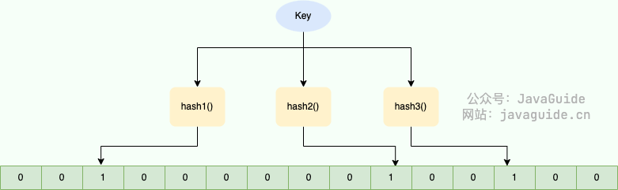
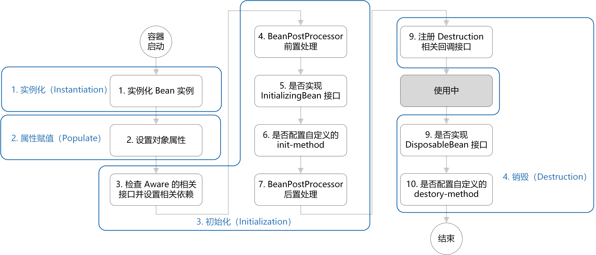

# 一、java重点

## Equals 和 == 的区别？

​	重写equals之前，equals效果等于==，即比较基本数据类型比的是值，比较引用数据类型比的是地址。重写equals后，比较引用数据类型比的是内容是否一致。

## 为什么重写equals一定要重写hashCode？

* 重写好equals后，两个对象的属性都相等，A.equals(B)就会返回true。但hash值不一定相同，则会插入到集合的不同位置
  * equals没重写前，比较的是地址
* 重写好hash后，逻辑上都相等的对象才会插入到集合的同一个桶
  * hash没重写前，默认实现会返回对象的内存地址转换后的哈希值


##  那重写hashCode后还需重写equals吗？

​	hashcode相等，两个对象不一定相等，所以判断发现两个对象的hashcode相等后还需判断是否每个属性值都相等。

## java中是值传递还是引用传递？

* 值传递：函数调用时，将实参的拷贝传递给形参，形参的变化不影响实参。

* 引用传递：函数调用时，将实参的地址传递给形参，形参的变化会直接影响实参。

​	java中只有值传递，如果实参是基本数据类型，那么我们对形参的变化是不影响实参的。如果是引用数据类型，由于栈中实参和拷贝(形参)指向堆中同一个对象，所以对形参所指向对象的改变也会影响实参所指向的对象。但对形参的指向的改变不会影响实参，就是说形参无法改变实参的指向。


## 三大特性

一、封装

​	封装指的是将对象的属性（字段）和行为（方法）封装在一个类中，并通过访问控制(如private、protected和public)来隐藏对象的内部实现细节。这样，外部的代码不能直接访问对象的内部数据，只能通过提供的公共方法（通常是getter和setter方法）来操作数据。

* 隐藏实现细节：用户不需要知道内部是如何实现的，只需要知道如何使用它
* 控制访问：通过设置不同的访问修饰符，可以控制哪些数据和方法可以被外部访问
* 提高安全性：避免了外部直接访问和修改对象的状态，从而防止数据被非法访问或修改

二、继承

​	继承是指类间的关系，允许一个类（子类）从另一个类（父类）继承属性和方法。通过继承，子类可以复用父类的代码，并可以在子类中扩展或重写父类的方法。

* 代码复用：子类可以继承父类的属性和方法，避免重复代码。
* 实现层次结构：通过继承，类之间可以形成一种“是一个”的关系，从而构建类的层次结构。
* 方法重写：子类可以根据需要重写父类的方法，以提供特定的实现。

三、多态

多态主要分为两种类型

* 编译时多态：也称为静态多态，主要表现为**方法重载**。方法重载是在同一个类中存在多个同名方法，但它们的参数列表不同（参数的数量、类型或顺序不同）。编译器根据方法签名（方法名和参数类型）来决定调用哪个方法。

* 运行时多态：也称为动态多态，主要表现为**方法重写**。方法重写是在继承关系中，子类重写父类的方法，以提供特定的实现。运行时多态是通过继承和接口实现的。当父类的引用指向子类的对象时，调用方法时会根据实际的对象类型来决定调用哪个方法。

* 代码示例

  ```java
  // 方法重载
  public class MathOperation {
      public int add(int a, int b) {
          return a + b;
      }
  
      public double add(double a, double b) {
          return a + b;
      }
  }
  
  // 方法重写
  public class Animal {
      public void sound() {
          System.out.println("Animal makes a sound");
      }
  }
  
  public class Dog extends Animal {
      @Override
      public void sound() {
          System.out.println("Dog barks");
      }
  }
  
  // 接口多态
  public class Main {
      public static void main(String[] args) {
          Animal myAnimal = new Dog(); // Animal类的引用指向Dog实例
          myAnimal.sound(); // 输出: Dog barks
      }
  }
  
  ```

  


## 异常详解

**一、异常继承关系**


**二、如何处理**

* try...catch：主动处理
  * 在finally子句中的代码是最后执行的，并且是 **一定会执行** 的，即使try语句块中的代码出现了异常。
* throws：在方法声明的位置上使用，抛给调用者来处理
* throw：主动抛出异常

**三、自定义异常**

1. 第一步：编写一个类**继承** **`Exception`** 或者 **`RuntimeException`**.
2. 第二步：提供两个 **`构造方法`**，一个**无参数**的，一个**带有String参数**的。

```java
//栈操作异常：自定义异常！
public class StackOperationException extends Exception{ // 编译时异常！
    public MyStackOperationException(){

    }

    public MyStackOperationException(String s){
        super(s);
    }
}

```

**自己项目中的自定义异常**

```java
package com.laungee.search.exception;
import com.laungee.search.common.ErrorCode;

/**
 * 自定义异常类
 *
 */
public class BusinessException extends RuntimeException {

    /**
     * 错误码
     */
    private final int code;

    public BusinessException(int code, String message) {
        super(message);
        this.code = code;
    }

    public BusinessException(ErrorCode errorCode) {
        super(errorCode.getMessage());
        this.code = errorCode.getCode();
    }

    public BusinessException(ErrorCode errorCode, String message) {
        super(message);
        this.code = errorCode.getCode();
    }

    public int getCode() {
        return code;
    }
}

```


## 反射详解

**一、定义**

**反射（Reflection）** 是 Java 提供的一种机制，允许程序在运行时获取类的信息（如类名、方法、字段等），并**动态调用方法或修改字段**，即使这些方法和字段在编译时未知

示例：使用反射调用方法

```java
import java.lang.reflect.Method;

class Person {
    public void greet(String name) {
        System.out.println("Hello, " + name);
    }
}

public class InvokeMethodExample {
    public static void main(String[] args) throws Exception {
        // 1. 获取 Person 类的 Class 对象
        Class<?> clazz = Person.class;

        // 2. 创建 Person 实例
        Object personInstance = clazz.getDeclaredConstructor().newInstance();

        // 3. 获取 greet 方法
        Method method = clazz.getMethod("greet", String.class);

        // 4. 通过反射调用方法
        method.invoke(personInstance, "Alice");
    }
}

```

**二、使用场景**

框架中、动态代理、注解（通过反射获取注解信息）

## public protected private？

* private：在同一类内可见；不能修饰类
* default：在同一包内可见
* protected：对同一包内的类、不同包的子类可见；不能修饰类
* public：对所有类可见


## String 为什么不可变？

* String类由final修饰，不可以被继承

* String底层是private final char[] value

  * 该数组是final修饰的，所以不能修改value的指向（不能改变引用），即不能指向新数组

  * 该数组又是private修饰，没有对外暴露公共的修改数组值的方法，所以一旦初始化后外界无法修改值


> 所以我们平时改变string，用replace等方法，都只是产生了新的string对象而已
>
> 但实际上我们可以通过反射的方式获取string的私有属性value[]，然后修改值，只是不推荐这么做。
>
> java 9之后底层是 private final byte[] value
>
> * 一个字符使用一个字节，减少内存占用
> * 计算机处理字节数组的效率更高，提高字符串处理的性能

## String是线程安全的？

String是不可变的（参考String为什么是不可变的），所以是线程安全的。

## String、StringBuffer和StringBuilder的异同？

相同点：底层都是通过char数组实现的
不同点：

* 可修改性：String对象一旦创建，其值是不能修改的，如果要修改，会重新开辟内存空间来存储修改之后的对象；而StringBuffer和StringBuilder对象的值是可以被修改的；
* 线程安全性：StringBuffer几乎所有的方法都使用synchronized实现了同步，线程比较安全，在多线程系统中可以保证数据同步，但是效率比较低；而StringBuilder 没有实现同步，线程不安全，在多线程系统中不能使用 StringBuilder，但是效率比较高。

* 动态扩容：StringBuilder和StringBuilder的默认长度为16，在添加元素时如果大于16，则将数组长度扩容为原来的2n+2倍(由于创建对象时可以传入参数，如传入0，这样的话+2就避免0左移1位还是0这样的问题)
* 使用场景：如果我们在实际开发过程中需要对字符串进行频繁的修改，不要使用String，否则会频繁创建新对象，造成内存空间的浪费；当需要考虑线程安全的场景下使用 StringBuffer，如果不需要考虑线程安全，追求效率的场景下可以使用 StringBuilder。

## New String()会创建几个对象？

1. String str = new String("ab")

* new 在堆中创建的对象

* 字符串常量池中的“ab"

​	字符串常量池中可能已有ab，所以最多2个

2. String str = "a"+"b"

​	编译器会将其优化为String str = "ab"，所以最多1个

3. ```java
   String s1 = "a";
   String s2 = s1+"b" //new StringBuilder().append(a).append(b).toString()
   ```

   第二行代码创建了几个对象？

   * new StringBuilder() //+号两边有变量，则会创建StringBuilder对象（jdk1.8）
   * 字符串常量池中的“b"
   * new String("ab")（调用了StringBuilder的toString方法，toString内部就是：new String(value, 0, count)，value就是append（a),append(b)的结果"ab",可通过字节码看出）

   这里要注意的是：并没有在字符串常量池中创建“ab"，所以会创建最多三个对象

   

4. String str = new String("a") + new String("b")

* new StringBuilder()
* new String("a")
* 字符串常量池中的"a"
* new String("b")
* 字符串常量池中的"b"
* new String("ab") //调用了StringBuilder的toString()方法

因此最多产生6个对象


5. intern方法相关（jdk1.8)

```java
String s1 = new String("a")+new String("b");
String s2 = s1.intern();将这个字符串对象尝试放入串池，有就不放，没有就放入，并把传池中的对象返回
System.out.println(s1=="ab");true
System.out.println(s2=="ab");true

```

```java
String x = "ab"
String s1 = new String("a")+new String("b");
String s2 = s1.intern();将这个字符串对象尝试放入串池，有就不放，没有就放入，并把传池中的对象返回
System.out.println(s1==x);false（因为串池中已经有ab了，s1就保持在堆中，不放入串池）
System.out.println(s2==x);true
```


## 集合相关

### java集合的继承关系

Java 集合可分为Collection和Map两种体系

- Collection接口：单列数据，定义了存取一组对象的方法的集合
  - List：元素有序、可重复的集合
  - Set：元素无序、不可重复的集合
- Map接口：双列数据，保存具有映射关系“key-value对”的集合


### ArrayList、LinkedList、Vector三者的异同

1. ArrayList

* 数据结构：动态数组（静态数组+扩容机制）
* 适用场景
  * 随机访问get和set，时间复杂度为O(1)
  * 插入和删除开销较大，因为要移动数据，并可能触发扩容
* 线程不安全

2. LinkedList

* 数据结构：双向链表

* 适用场景

  * 随机访问get和set，时间复杂度为O(n),因为要遍历链表
  * 插入和删除不需要移动数据，开销小。但是如果靠近末尾，ArrayList时间复杂度为O(1)，而LinkedList反而要遍历链表，时间复杂度为O(n)。所以只能说通常情况下，LinkedList更适合插入和删除，ArrayList更适合访问和更新。

* 线程不安全


3. Vector：与ArrayList相似，只不过是线程安全的，但开销跟大

### ArrayList扩容机制

> 注意:没有缩容机制.移除元素时,只是修改size值以及把原有的元素的引用值指向null

ArrayList中维护了一个Object类型的数组elementData:

```java
transient Object[] elementData;//transient:瞬间的,短暂的. 表示该属性不会被序列化
```

1、初始化

* 无参构造器,则初始elementData的容量为0,第一次添加(调用add方法),则扩容elementData为10,如果需要再次扩容则扩容elementData容量的1.5倍

* 有参构造器：如果使用的指定大小的构造器,则初始elementData容量为指定大小,如果需要扩容,则直接扩容elementData容量的1.5倍.

2、扩容

* 检查容量：在向 ArrayList 添加新元素时，首先会检查当前容量是否足够。如果容量不足，则需要扩容。
* 计算新容量：新容量通常是旧容量的 1.5 倍。具体来说，新的容量计算公式为 newCapacity = oldCapacity + (oldCapacity >> 1)。例如，如果当前容量是 10，那么新的容量将是 10 + (10 >> 1) = 10 + 5 = 15。
* 创建新数组：根据计算出的新容量，创建一个新的数组。
* 复制旧数据：将旧数组中的数据复制到新数组中。
* 替换旧数组：用新数组替换旧数组，即elementData 变量指向新数组，替换旧数组的引用
* 回收旧数组： 旧数组不再被使用，会被 Java 垃圾回收机制自动回收。

> 扩容是浅拷贝


### 说说list下都有哪些线程安全的类，底层具体如何实现？

见下一题

### ArrayList和LinkedList是否是线程安全

ArrayList

1. 使用vector
2. 使用Collections.synchronizedList：包装原始 List，保证多线程同步，但synchronizedList只保证基本操作是线程安全的**，**遍历时仍需要手动同步(在这个包装类中，对列表的各种操作方法（如 add、remove、get等）都添加了synchronized 修饰符)

3. 使用 JUC 中的 CopyOnWriteArrayList

   * **线程安全**：CopyOnWriteArrayList 是线程安全的，可以被多个线程同时访问和修改。

   * **写时复制（Copy-on-write）**：每次修改（如 `add()`, `remove()` 等）时，都会 **复制整个数组**，然后在新数组上进行相应的修改操作，最后将内部引用指向新的数组。这意味着修改操作的时间复杂度为 **O(n)**，但读取操作（如 get(), size()）是 **O(1)**，非常高效。
   * **适合读多写少的场景**：由于写操作需要复制整个数组，`CopyOnWriteArrayList` 适合 **读操作频繁**，而 **写操作少** 的应用场景。

LinkedList

* 使用Collections.synchronizedList

* 使用 JUC 中的 ConcurrentLinkedQueue：它本身就是专门为高并发场景设计的队列实现类，内部通过一些复杂的无锁算法（基于 CAS 操作等机制）来保证在多线程环境下多个线程对队列进行插入（ offer 方法、删除（poll 方法）、获取元素（peek 方法）等操作时的线程安全性

### fast-fail详解

**一、概述**

​	 “快速失败”也就是fail-fast，它是Java集合的一种错误检测机制，用于**保证集合迭代时语义的一致性**。在迭代（Iterator 遍历）过程如果有**结构性修改**（structural modification），那么迭代器会 立即抛出 ConcurrentModificationException。java.util包下的集合类都是快速失败机制的, 常见的的使用fail-fast方式遍历的集合有HashMap和ArrayList等。

​	通常发生在多线程情况下：当多个线程对集合进行结构上的改变的操作时，有可能会产生fail-fast机制。记住是有可能，而不是一定。例如：假设存在两个线程（线程1、线程2），线程1通过Iterator在遍历集合A中的元素，在某个时候线程2修改了集合A的结构（是结构上面的修改，而不是简单的修改集合元素的内容），那么这个时候程序就会抛出 ConcurrentModificationException 异常，从而产生fail-fast机制

```java
import java.util.*;

public class FailFastExample {
    public static void main(String[] args) {
        List<Integer> list = new ArrayList<>(Arrays.asList(1, 2, 3, 4, 5));
        Iterator<Integer> iterator = list.iterator();

        while (iterator.hasNext()) {
            Integer num = iterator.next();
            if (num == 3) {
                list.remove(num);  // 结构性修改，触发 Fail-Fast
            }
        }
    }
}

```

**原因**：

- 维护了一个 **`modCount`** 变量，记录 **修改次数**。
- `Iterator` 在创建时，会读取 `modCount` 的值，存入 **`expectedModCount`**。
- 每次调用 `next()` 时，`Iterator` 会检查 `modCount` 是否 **等于** `expectedModCount`。
- **如果 `modCount` 发生变化（调用 `add()` 或 `remove()`），则抛出 `ConcurrentModificationException`。**

**二、如何避免**

1. 使用 Iterator.remove()：它不会修改 modCount，所以不会触发 Fail-Fast
2. 使用java并发包(java.util.concurrent)中的CopyOnWriterArrayList类来代替ArrayList，使用 ConcurrentHashMap来代替hashMap


### HashMap的实现原理？

​	Hashmap有着1.7，1.8两个版本，1.8中Hashmap数据结构是数组加链表加红黑树的形式。

如何put元素时（采用尾插法，避免环形链表）：

* 首先计算key的hash值，计算方式为调用hashcode方法再进行扰动后

  （h = key.hashCode()) ^ (h >>> 16），>>>16是为了获取低位信息，与高位的hash^是为了让高位也参与运算，获取更加散列的值，减少哈希碰撞）得到hash值

* 再用hash&length-1得到最终的位置，效果等同hash%length，但能增加运算速度

得到位置之后，要判断该位置上是否有元素。

* 若无元素则直接添加
* 若有元素,则先比较hash值
  * 若hash不同,则直接添加key-value对
  * 若hash相同,则调用equals方法
    * 若返回false,则直接添加
    * 若返回true,则用新value替换旧value

在不断的添加过程中,会设计到扩容问题。默认扩容为0.75,而数组的默认长度为16，那么当添加元素个数达到12时(阈值)，触发扩容，数组长度扩大为原来的两倍，新位置为原来的位置或者原位置+旧数组长度

当链表长度大于8且数组长度大于64时，链表会变为红黑树结构，node变为treenode并且在下一次resize时，若链表长度少于6时，再转变为链表。

### 为什么hashmap数组长度为2的n次方？

​	如果length=2^n，则length-1用二进制表示则低位都是1，与hash值取与后能更好的保留hash值低位的信息；反之，二进制上出现0，任何数和0取与都是0，这样不能充分利用数组能保存的信息（即一个bit上只能存0，存的信息变少），会增加哈希碰撞的可能性。


### 扩容因子为什么是0.75有研究过吗?

HashMap的负载因子决定元素个数达到多少时候扩容。

* 假如我们设的比较大，元素比较多，空位比较少的时候才扩容，那么发生哈希冲突的概率就增加了，查找的时间成本就增加了。
* 我们设的比较小的话，元素比较少，空位比较多的时候就扩容了，发生哈希碰撞的概率就降低了，查找时间成本降低，但是就需要更多的空间去存储元素，空间成本就增加了
* 选择 0.75 这个值是为了在时间和空间成本之间达到一个较好的平衡点，既可以保证哈希表的性能表现，又能够充分利用空

源码解释：

```java
 * <p>As a general rule, the default load factor (.75) offers a good
 * tradeoff between time and space costs.  Higher values decrease the
 * space overhead but increase the lookup cost (reflected in most of
 * the operations of the {@code HashMap} class, including
 * {@code get} and {@code put}).  The expected number of entries in
 * the map and its load factor should be taken into account when
 * setting its initial capacity, so as to minimize the number of
 * rehash operations.  If the initial capacity is greater than the
 * maximum number of entries divided by the load factor, no rehash
 * operations will ever occur.
```


### HashMap 为什么选用红黑树这种数据结构优化链表？

见红黑树

### 红黑树详解

一种二叉查找树，但在每个节点增加一个存储位表示节点的颜色，可以是红或黑（非红即黑）。通过对任何一条从根到叶子的路径上各个节点着色的方式的限制，红黑树确保没有一条路径会比其它路径长出两倍，因此，红黑树是一种弱平衡二叉树（由于是弱平衡，可以看到，在相同的节点情况下，AVL树的高度低于红黑树），相对于要求严格的AVL树来说，它的旋转次数少，所以对于插入和删除操作较多的情况下，我们就用红黑树。

1. 为什么要用红黑树：

我们知道平衡二叉查找树的查找效率非常稳定，为O(logn)，但由于它要遵循左右子树高度差不超过1的规则，所以在插入和删除操作时要进行左旋和右旋来维持平衡。因此当有大量的插入和删除操作的情况时，AVL树就不适合了，而红黑树就应运而生了。

2. 红黑树的特性：

* 每个节点或红或黑
* 根节点是黑色
* 每个叶子节点都是黑色的空节点
* 任何相邻的节点都不能同时为红色
* 从任意一个结点出发到空的叶子结点经过的黑结点个数相同

3. 红黑树与AVL树的比较:

* 红黑树对平衡要求更低，更擅长插入删除

* AVL树更擅长查找

### 为什么头插法会导致循环链表？

hashmap在扩容时使用头插法可能出现循环链表, 后果就是调用get()方法时可能陷入死循环. 为什么会出现循环链表呢?

[链接](https://blog.csdn.net/littlehaes/article/details/105241194?ops_request_misc=%257B%2522request%255Fid%2522%253A%2522167860630316800182119767%2522%252C%2522scm%2522%253A%252220140713.130102334.pc%255Fall.%2522%257D&request_id=167860630316800182119767&biz_id=0&utm_medium=distribute.pc_search_result.none-task-blog-2~all~first_rank_ecpm_v1~rank_v31_ecpm-1-105241194-null-null.142^v73^pc_search_v2,201^v4^add_ask,239^v2^insert_chatgpt&utm_term=%E4%B8%BA%E4%BB%80%E4%B9%88%E5%A4%B4%E6%8F%92%E6%B3%95%E4%BC%9A%E5%AF%BC%E8%87%B4%E5%BE%AA%E7%8E%AF%E9%93%BE%E8%A1%A8%EF%BC%9F&spm=1018.2226.3001.4187)

### HashMap和HashTable的区别？

相同点：都实现map,cloneable(可克隆）,serializable（可序列化）三个接口

不同点：

* HashTable内部方法用syncronized修饰，是线程同步的，也就是线程安全的，HashMap线程不安全，但性能高于HashTable。
* HashTable不允许键or值为null，而hashmap允许一个键为null，允许多个值为null
* 计算hash值方法不同，hashtable直接用hashcode方法，而hashmap用的是自定义的哈希算法（加了两次扰动，增加散列性）
* 初始化容量不同，hashtable为11，hashmap为16
* 扩容机制不同，hashtable为当前容量翻倍+1(保证为奇数），hashmap只是翻倍

### 实现一个保证迭代顺序的HashMap？

使用LinkedHashMap,他继承于HashMap,并维护了一个双向链表，用头节点记录插入的第一个元素，然后每个元素都会用before和after两个指针指向前后元素，以此保证迭代顺序。

### HashMap什么时候会线程不安全？

​	如果线程A和线程B同时进行put操作，刚好这两条不同的数据hash值一样，并且该位置数据为null，所以这线程A、B都会进入第6行代码中。假设一种情况，线程A进入后还未进行数据插入时挂起，而线程B正常执行，从而正常插入数据，然后线程A获取CPU时间片，此时线程A不用再进行hash判断了，问题出现：线程A会把线程B插入的数据给**覆盖**，发生线程不安全。

```java
 final V putVal(int hash, K key, V value, boolean onlyIfAbsent,
                   boolean evict) {
         Node<K,V>[] tab; Node<K,V> p; int n, i;
         if ((tab = table) == null || (n = tab.length) == 0)
             n = (tab = resize()).length;
         if ((p = tab[i = (n - 1) & hash]) == null) //如果没有hash碰撞则直接插入元素
             tab[i] = newNode(hash, key, value, null);
         else {
```


### HashMap和TreeMap的区别

* 数据结构：HashMap是数组+链表+红黑树；TreeMap是红黑树
* 排序区别：HashMap不排序，TreeMap按照key排序
* null值区别
  * HashMap：key和value都可以为null
    * 允许 null 作为 key，但只能有一个 null 的key。
    * 允许 null 作为 value，可以有多个 null的 value。
  * TreeMap：key不可以为null,value可以为null
* 性能（使用场景）
  * HashMap：插入、删除和定位元素效率高
  * TreeMap：适用于按自然顺序或自定义顺序遍历键
* 线程安全：两者都不是线程安全的

### 遍历集合的方式;for和迭代器遍历哪个更快

1. 遍历集合的方式

* 迭代器

* 普通for循环

* 增强for循环

```java
List<String> list = new ArrayList<>();
list.add("a");
list.add("b");
list.add("c");

//迭代器
Iterator<String> iterator = list.iterator();
while(iterator.hasNext()) {
    System.out.println(iterator.next());
}
//普通for循环
int size = list.size();
for (int i = 0; i < size; i++) {
    System.out.println(list.get(i));
}

//增强for循环（foreach）
for (String s : list) {
    System.out.println(s);
}
```

2. 遍历速度

* 遍历顺序存储集合，如ArrayList，for>foreach>iterator,for直接通过索引获取数据
* 遍历链式存储集合，如LinkedList，iterator>foreach>for,for每次遍历需要重新获取位置，而iterator直接将指针指向下一个节点就行

增强for循环是语法糖，底层就是iterator,在遍历arraylist时，foreach比iterator有优化，但是linkedlist时没有优化，此时会更慢。


### 两个List（存储的对象student），如何比较他们内部元素是否都一样？

1. 重写equals和hash方法
2. 排序
3. 调用A.equals(B)

代码示例

```java
import java.util.ArrayList;
import java.util.List;

class Student {
    String name;
    int age;

    public Student(String name, int age) {
        this.name = name;
        this.age = age;
    }

    @Override
    public boolean equals(Object obj) {
        if (this == obj) return true;
        if (obj == null || getClass() != obj.getClass()) return false;
        Student student = (Student) obj;
        return age == student.age && name.equals(student.name);
    }

    @Override
    public int hashCode() {
        //相同的name，hashcode()相同；Java 的 String 类已经重写了 hashCode()
        return name.hashCode() + age * 31;
    }
}

public class ListComparison {
    public static void main(String[] args) {
        List<Student> list1 = new ArrayList<>();
        List<Student> list2 = new ArrayList<>();

        list1.add(new Student("Alice", 20));
        list1.add(new Student("Bob", 22));

        list2.add(new Student("Alice", 20));
        list2.add(new Student("Bob", 22));

        System.out.println(list1.equals(list2)); // true（假设顺序相同）
    }
}

```


### 给你一个对象，按照其中一个字段排序，怎么做？

1、使用Comparator

```java
import java.util.*;

class Person {
    String name;
    int age;

    public Person(String name, int age) {
        this.name = name;
        this.age = age;
    }

    @Override
    public String toString() {
        return name + " (" + age + ")";
    }
}

public class Main {
    public static void main(String[] args) {
        List<Person> people = new ArrayList<>(Arrays.asList(
            new Person("Alice", 30),
            new Person("Bob", 25),
            new Person("Charlie", 35)
        ));

        // 按年龄升序排序
        people.sort(Comparator.comparingInt(person -> person.age));

        System.out.println(people);  // 输出: [Bob (25), Alice (30), Charlie (35)]
    }
}

```


2、让对象实现Comparable

```java
class Person implements Comparable<Person> {
    String name;
    int age;

    public Person(String name, int age) {
        this.name = name;
        this.age = age;
    }

    @Override
    public int compareTo(Person other) {
        return Integer.compare(this.age, other.age); // 按年龄升序排序
    }

    @Override
    public String toString() {
        return name + " (" + age + ")";
    }
}

public class Main {
    public static void main(String[] args) {
        List<Person> people = new ArrayList<>(Arrays.asList(
            new Person("Alice", 30),
            new Person("Bob", 25),
            new Person("Charlie", 35)
        ));

        Collections.sort(people); // 按 `compareTo` 规则排序

        System.out.println(people);  // 输出: [Bob (25), Alice (30), Charlie (35)]
    }
}

```


## 设计模式

### 了解哪些设计模式

设计模式分类：

* 创建型模式：用于创建对象的设计模式。可以简化用户创建对象的过程，降低耦合度，使用户不用关心对象具体的创建过程。
  * 单例模式
  * [工厂模式](https://blog.csdn.net/a745233700/article/details/120253639)
  * 建造者模式

* 结构型模式：组织对象之间的结构，使其易于扩展
  * 代理模式
  * 装饰者模式
  * 享元模式：共享相同内容，实现对象的复用，如字符串常量池。
* 行为型模式：主要用于决定对象做出何种行为
  * 观察者模式：又被称为发布-订阅模式，它定义了一种一对多的依赖关系，让多个观察者对象监听某一个主题对象。当这个主题对象状态变化时，会通知所有的观察者对象及时更新自己。zookeeper就是实现了观察者设计模式的分布式服务管理框架。

### 单例模式详解？

1. 定义

​	单例模式：在内存中只会创建一个对象的设计模式，所有需要用到的地方都共享这一个对象实例

2. 类型

* 饿汉式：在类加载时已经创建好该单例对象，等待被程序使用
* 懒汉式：在真正需要使用对象时才去创建该单例对象

使用情形：

如果对内存要求不高，建议使用饿汉式，因为代码简单还没有线程安全问题

如果在开发中对内存要求非常高，内存有限，建议使用懒汉式，在用的时候再创建

3. 基本实现

饿汉式：

```java
public class Singleton(){
    private Singleton(){}
    private static final Singleton singleton = new Singleton();//final:防止子类重写，破坏单例模式，即避免意外的修改
    public static Singleton getInstance(){
        return singleton;
    }
}
```

懒汉式：

```java
public class Singleton(){
    private Singleton(){}
    private static Singleton singleton;
    public static Sington getInstance(){
        if(sinleton == null){
            singleton = new Singleton();
        }
        return singleton;
    }
}
```

4. 优化

上述懒汉式的实现方式只适用于单线程，多线程环境下可能导致创建多个对象。

因此采用双重检查+锁的方式实现多线程安全（直接只用锁会导致性能低下）

```java
public class Singleton(){
    private Singleton(){}
    private static Singleton singleton;
    public static Sington getInstance(){
        if(singleton == null){
            syncronized(Singleton.class){
                if(singleton == null){//防止别的线程已经创建好对象
                    singleton = new Singleton();
                }
            }
        }
        return singleton;
    }
}
```

上述写法还会导致多线程下指令重排的问题：在不破坏数据依赖性的前提下，代码执行顺序可以不按照代码编写顺序来，以提高单线程下cpu性能。

创建一个对象，在jvm中分为三个步骤：

* 为该对象分配内存空间
* 初始化
* 将对象引用指向分配好的内存空间

其中第二步和第三步可以颠倒顺序，也就是说线程1创建对象的时，还未初始化就将对象引用指向分配好的空间的话，线程2判断对象就不为空了，就会直接返回这个对象，由于该对象还未初始化，所以会报错

解决方案：用volatile修饰变量，所以完整版本：

```java
public class Singleton(){
    private Singleton(){}
    private static volatile Singleton singleton;
    public static Sington getInstance(){
        if(singleton == null){
            syncronized(Singleton.class){
                if(singleton == null){//防止别的线程已经创建好对象
                    singleton = new Singleton();
                }
            }
        }
        return singleton;
    }
}
```

5. 单例模式的破坏

* 反射：强制访问类的私有构造器，创建另一个对象
* 序列化与反序列化

可以用枚举类避免上述问题：Java 枚举类的设计在语言层面就天然防御了反射和序列化攻击。通过枚举类来实现单例，Java 虚拟机会确保在任意情况下枚举类只被实例化一次

```java
public enum Singleton {
    INSTANCE;

    // 可以添加其他需要的业务方法
    public void doSomething() {
        System.out.println("Singleton using Enum!");
    }
}

```


### 代理模式详解

[参考1](https://blog.csdn.net/qq_45034708/article/details/115030032)

[参考2](https://blog.csdn.net/xiaofeng10330111/article/details/90384502?ops_request_misc=%257B%2522request%255Fid%2522%253A%2522412efa6842c980ada0bd989991e3746f%2522%252C%2522scm%2522%253A%252220140713.130102334.pc%255Fall.%2522%257D&request_id=412efa6842c980ada0bd989991e3746f&biz_id=0&utm_medium=distribute.pc_search_result.none-task-blog-2~all~first_rank_ecpm_v1~hot_rank-1-90384502-null-null.142^v101^pc_search_result_base5&utm_term=%E5%8A%A8%E6%80%81%E4%BB%A3%E7%90%86%E5%92%8C%E9%9D%99%E6%80%81%E4%BB%A3%E7%90%86%E7%9A%84%E5%8C%BA%E5%88%AB&spm=1018.2226.3001.4187)

代理模式的主要作用是**控制对目标对象的访问**，并在不修改目标对象的前提下，扩展其功能。常见的使用场景包括：

- **延迟加载**：在目标对象实际需要使用时才创建或加载它（如虚拟代理）。
- **控制访问权限**：可以通过代理限制某些操作，控制对目标对象的访问。
- **记录日志或监控**：通过代理可以记录对目标对象的所有访问和操作，方便日志记录或监控。
- **性能优化**：代理可以在调用目标对象前后加入缓存或优化逻辑，提升性能。
- **远程代理**：允许在不同地址空间中访问目标对象（如远程方法调用，RMI）。

**静态代理**：静态代理是定义父类或者接口，然后被代理对象（即目标对象）与代理对象一起实现相同的接口或者是继承相同父类。**代理对象与目标对象实现相同的接口**，然后通过调用相同的方法来调用目标对象的方法。

**动态代理**

* 动态代理也叫JDK代理、接口代理。它使**代理对象不需要实现接口**（但目标对象要实现接口），代理对象的生成，是利用JDK的API，动态的在内存中构建代理对象
* 动态代理的优势在于可以很方便的对代理类的函数进行**统一的处理**，而不用修改每个代理类中的方法。是因为所有被代理执行的方法，都是通过在InvocationHandler中的invoke方法调用的，所以我们只要在invoke方法中统一处理，就可以对所有被代理的方法进行相同的操作了。例如，下面的日志打印，所有的被代理对象执行的方法都会打印日志，然而我只做了很少的代码量

```java
import java.lang.reflect.InvocationHandler;
import java.lang.reflect.Method;
import java.lang.reflect.Proxy;

// 1. 定义接口
interface Service {
    void doTask();
    void doAnotherTask(String taskName);
}

// 2. 目标类（被代理对象）
class RealService implements Service {
    @Override
    public void doTask() {
        System.out.println("执行任务...");
    }

    @Override
    public void doAnotherTask(String taskName) {
        System.out.println("执行任务：" + taskName);
    }
}

// 3. 代理处理器（InvocationHandler） - 统一处理所有方法
class LoggingHandler implements InvocationHandler {
    private final Object target;

    public LoggingHandler(Object target) {
        this.target = target;
    }

    @Override
    public Object invoke(Object proxy, Method method, Object[] args) throws Throwable {
        System.out.println("[日志] 方法调用: " + method.getName() + ", 参数: " + (args == null ? "无" : args[0]));
        Object result = method.invoke(target, args); // 调用真实对象的方法
        System.out.println("[日志] 方法 " + method.getName() + " 执行完成");
        return result;
    }
}

// 4. 测试动态代理
public class DynamicProxyExample {
    public static void main(String[] args) {
        // 创建目标对象
        RealService realService = new RealService();

        // 创建代理对象
        Service proxyInstance = (Service) Proxy.newProxyInstance(
                realService.getClass().getClassLoader(), 
                realService.getClass().getInterfaces(), 
                new LoggingHandler(realService)
        );

        // 调用代理方法（会经过 invoke 统一处理）
        proxyInstance.doTask();
        proxyInstance.doAnotherTask("数据分析");
    }
}

```


**Cglib代理**：Cglib代理也叫作**子类代理**，它使**目标对象不需要实现接口**，是在内存中构建一个子类对象从而实现对目标对象功能扩展，有的也将Cglib代理归属到动态代理。

```java
import com.proxy.UserManager;
import net.sf.cglib.proxy.Enhancer;
import net.sf.cglib.proxy.MethodInterceptor;
import net.sf.cglib.proxy.MethodProxy;
 
import java.lang.reflect.Method;
 
/**
 * Cglib动态代理：
 * (需要导入两个jar包，asm-5.0.3.jar,cglib-3.1.jar 版本可自行选择)
 */
 
//Cglib动态代理，实现MethodInterceptor接口
public class CglibProxy implements MethodInterceptor {
    private Object target;//需要代理的目标对象
 
    //重写拦截方法
    @Override
    public Object intercept(Object o, Method method, Object[] args, MethodProxy methodProxy) throws Throwable {
        System.out.println("Cglib动态代理，监听开始！");
        Object result = method.invoke(target,args);//方法执行参数：target 目标对象 arr参数数组
        System.out.println("Cglib动态代理，监听结束！");
        return result;
    }
 
    //定义获取代理对象的方法
    public UserManager getCglibProxy(Object targetObject) {
        this.target = targetObject;//为目标对象target赋值
        Enhancer enhancer = new Enhancer();
        //设置父类,因为Cglib是针对指定的类生成一个子类，所以需要指定父类
        enhancer.setSuperclass(targetObject.getClass()); //UserManagerImpl
        enhancer.setCallback(this);//设置回调
        Object result = enhancer.create();//创建并返回代理对象
        return (UserManager) result;
    }
 
 
//    public static void main(String[] args) {
//        CglibProxy cglibProxy = new CglibProxy(); //实例化CglibProxy对象
//        UserManager user = cglibProxy.getCglibProxy(new UserManagerImpl());//获取代理对象
//        user.delUser("admin");
//    }
 
}
```


### 工厂模式

**工厂模式**是一种用于创建对象的设计模式，其目的是将对象的创建过程与使用过程分离，以提高代码的灵活性、可复用性和可维护性

1. 简单工厂模式（Simple Factory）

**简单工厂模式**是最基础的一种工厂模式，通过一个工厂类根据输入的条件来决定创建哪一个具体的产品对象。简单工厂模式通常用一个静态方法来创建不同类型的实例。

**优点**：

- 通过使用工厂类来创建对象，客户端无需关心对象的具体实现过程。
- 更容易添加新产品。

**缺点**：

- 违反了**开闭原则**，每次新增产品都需要修改工厂类。
- 工厂类容易变得复杂，难以维护。

```java
// 产品接口
public interface Car {
    void drive();
}

// 具体产品
public class SedanCar implements Car {
    @Override
    public void drive() {
        System.out.println("Driving a sedan car");
    }
}

public class SUVCar implements Car {
    @Override
    public void drive() {
        System.out.println("Driving an SUV car");
    }
}

// 简单工厂类
public class CarFactory {
    public static Car createCar(String type) {
        if ("sedan".equalsIgnoreCase(type)) {
            return new SedanCar();
        } else if ("suv".equalsIgnoreCase(type)) {
            return new SUVCar();
        } else {
            throw new IllegalArgumentException("Unknown car type");
        }
    }
}

// 客户端代码
public class Main {
    public static void main(String[] args) {
        Car sedan = CarFactory.createCar("sedan");
        sedan.drive();
        
        Car suv = CarFactory.createCar("suv");
        suv.drive();
    }
}

```


2. 工厂方法模式（Factory Method）

**工厂方法模式**通过**定义一个抽象的工厂接口**，并由实现类来决定具体创建哪个产品。这种方式符合**开闭原则**，更有利于扩展。

**优点**：

- 遵循**开闭原则**，通过增加新的工厂类来创建新产品，而不需要修改现有代码。
- 易于扩展，新增产品类型时，只需要创建一个新的工厂类。

**缺点**：

- 增加了系统的复杂性，因为每个产品都需要对应一个工厂类

```java
// 产品接口
public interface Car {
    void drive();
}

// 具体产品
public class SedanCar implements Car {
    @Override
    public void drive() {
        System.out.println("Driving a sedan car");
    }
}

public class SUVCar implements Car {
    @Override
    public void drive() {
        System.out.println("Driving an SUV car");
    }
}

// 抽象工厂
public interface CarFactory {
    Car createCar();
}

// 具体工厂
public class SedanCarFactory implements CarFactory {
    @Override
    public Car createCar() {
        return new SedanCar();
    }
}

public class SUVCarFactory implements CarFactory {
    @Override
    public Car createCar() {
        return new SUVCar();
    }
}

// 客户端代码
public class Main {
    public static void main(String[] args) {
        CarFactory sedanFactory = new SedanCarFactory();
        Car sedan = sedanFactory.createCar();
        sedan.drive();
        
        CarFactory suvFactory = new SUVCarFactory();
        Car suv = suvFactory.createCar();
        suv.drive();
    }
}

```


3. 抽象工厂模式

**抽象工厂模式**用于创建一系列相关的或互相依赖的对象，而无需指定具体的类。这种模式提供了一个接口来创建多个产品对象。

**优点**：

- 提供了一种**创建一族相关产品**的方式，避免了客户代码与具体类之间的紧耦合。
- **符合开闭原则**，便于扩展。

**缺点**：

- 难以支持新的产品类型，新增产品系列需要修改所有的工厂接口和工厂实现类。

```java
// 产品族接口
public interface Engine {
    void start();
}

public interface Tire {
    void produce();
}

// 具体产品
public class SedanEngine implements Engine {
    @Override
    public void start() {
        System.out.println("Starting sedan engine");
    }
}

public class SedanTire implements Tire {
    @Override
    public void produce() {
        System.out.println("Producing sedan tire");
    }
}

public class SUVEngine implements Engine {
    @Override
    public void start() {
        System.out.println("Starting SUV engine");
    }
}

public class SUVTire implements Tire {
    @Override
    public void produce() {
        System.out.println("Producing SUV tire");
    }
}

// 抽象工厂
public interface CarPartsFactory {
    Engine createEngine();
    Tire createTire();
}

// 具体工厂
public class SedanPartsFactory implements CarPartsFactory {
    @Override
    public Engine createEngine() {
        return new SedanEngine();
    }

    @Override
    public Tire createTire() {
        return new SedanTire();
    }
}

public class SUVPartsFactory implements CarPartsFactory {
    @Override
    public Engine createEngine() {
        return new SUVEngine();
    }

    @Override
    public Tire createTire() {
        return new SUVTire();
    }
}

// 客户端代码
public class Main {
    public static void main(String[] args) {
        CarPartsFactory sedanFactory = new SedanPartsFactory();
        Engine sedanEngine = sedanFactory.createEngine();
        Tire sedanTire = sedanFactory.createTire();
        sedanEngine.start();
        sedanTire.produce();

        CarPartsFactory suvFactory = new SUVPartsFactory();
        Engine suvEngine = suvFactory.createEngine();
        Tire suvTire = suvFactory.createTire();
        suvEngine.start();
        suvTire.produce();
    }
}

```

##  抽象类和接口的区别

* 抽象类
  * 单继承
  * 构造方法：有构造方法，用于子类实例化使用。
  * 成员变量：可以是变量，也可以是常量。
  * 成员方法：可以是抽象的，也可以是非抽象的。
* 接口
  * 多实现
  * 构造方法：没有构造方法
  * 成员变量：只能是常量。默认修饰符：public static final
  * 成员方法：jdk1.7只能是抽象的。jdk1.8可以写以default和static开头的具体方法

> 抽象类是对本质属性的抽象，接口是对动作的抽象，
>
> 抽象类表示的是，这个对象是什么。接口表示的是，这个对象能做什么。比如，男人，女人，这两个类（如果是类的话……），他们的抽象类是人。说明，他们都是人。
>
> 人可以吃东西，狗也可以吃东西，你可以把“吃东西”定义成一个接口，然后让这些类去实现它.
>
> 所以，在高级语言上，一个类只能继承一个类（抽象类）(正如人不可能同时是生物和非生物)，但是可以实现多个接口(吃饭接口、走路接口)。
>
> 当你关注一个事物的本质的时候，用抽象类；当你关注一个操作的时候，用接口。
> 


## Java的IO模型？BIO和NIO的区别？

* BIO：同步阻塞IO，在此种方式下，用户进程在发起一个IO操作以后，必须等待IO操作的完成，只有当真正完成了IO操作以后，用户进程才能运行
* NIO：同步非阻塞IO，在此种方式下，用户进程发起一个IO操作以后边可返回做其它事情，但是用户进程需要时不时的询问IO操作是否就绪，这就要求用户进程不停的去询问，从而引入不必要的CPU资源浪费。
* AIO：异步非阻塞IO，此种方式下是指应用发起一个IO操作以后，不等待内核IO操作的完成，等内核完成IO操作以后会通知应用程序，这其实就是同步和异步最关键的区别，同步必须等待或者主动的去询问IO是否完成

[参考](https://blog.csdn.net/m0_38109046/article/details/89449305)

> 我认为：同步和异步讲究的是被调用方是不是直接返回，如异步就是直接返回调用(异步就是发起一个调用后，立刻得到被调用者的回应表示已接收到请求)，而同步就是要等被调用方处理完才返回，那么怎么算处理完，就得调用方一直等（阻塞）或者去主动轮询（非阻塞）。而阻塞和非阻塞讲究的是调用方主动不主动去等待（调用方线程挂起），等着就是阻塞，不等而去做别的事就是非阻塞


## final是什么？可以被继承吗？

final关键字代表最终的、不可改变的

* 修饰类，表示不能被继承
* 修饰方法，表示不能被重写
* 修饰局部变量
  * 对于基本类型来说，不可变说的是变量当中的数据不可改变
  * 对于引用类型来说，不可变说的是变量当中的地址值不可改变

* 修饰成员变量：
  * 不变（同局部变量）
  * 对于final的成员变量，要么使用直接赋值，要么通过构造方法赋值。二者选其一。

String类就是用final修饰的。


## 两个double相加，比如0.1+0.1=0.200001这类问题如何解决

* 使用精度更高的数据类型

​	可以使用BigDecimal或其他高精度数值类型来避免浮点数精度问题。使用BigDecimal时需要注意，需要使用BigDecimal的构造方法来创建BigDecimal对象，而不能直接使用浮点数作为参数

```java
BigDecimal a = new BigDecimal("0.1");//传入string类型的才可避免精度丢失问题
BigDecimal b = new BigDecimal("0.1");
BigDecimal c = a.add(b);
System.out.println(c); // 输出0.2
```


## Java为什么不用多继承

* 避免命名冲突：假如C继承A和B,而A和B有相同的方法或属性，此时C就不知道调用谁的方法或属性，产生歧义性

## 不可变类和可变类

- 什么是java的不可变类Immutable和可变类Mutable
  举个例子，String和StringBuilder，两个类功能上很多相似点。String是一个不可变对象，对于String的每一次修改都会产生一个新的String对象（不严谨）。StringBuilder是一个可变类，对象的每一次修改是对其本身的一个修改，不产生新的对象。
- 那么如何设计一个不可变类？对象一旦创建，便不可被修改。
  - 属性设为private final。类也是final的，不可被继承，从而防止子类通过覆写方法来改变对象的行为。
  - 只保留类似getter的访问方法，无setter。并且，如果成员变量是一个引用类型，那么getter返回的是该引用对象的一个拷贝。


## 什么是socket？

​	在网络编程中，网络上的两个程序通过一个双向的通信连接实现数据的交换，这个连接的一端称为一个socket(网络套接字，端口号与IP地址的组合)

```java
public class test   {
    public static void main(String[] args) {
    }
    //客户端
    @Test
    public void client()  {
        Socket socket = null;
        OutputStream os = null;
        try {
            //1.创建Socket对象，指明服务器端的ip和端口号
            InetAddress inet = InetAddress.getByName("192.168.85.1");
            socket = new Socket(inet,8899);
            //2.获取一个输出流，用于输出数据
            os = socket.getOutputStream();
            //3.写出数据的操作
            os.write("你好，我是客户端HH".getBytes());
        } catch (IOException e) {
            e.printStackTrace();
        } finally {
            //4.资源的关闭
            if(os != null){
                try {
                    os.close();
                } catch (IOException e) {
                    e.printStackTrace();
                }
            }
            if(socket != null){
                try {
                    socket.close();
                } catch (IOException e) {
                    e.printStackTrace();
                }

            }
        }
    }
    //服务端
    @Test
    public void server()  {

        ServerSocket ss = null;
        Socket socket = null;
        InputStream is = null;
        ByteArrayOutputStream baos = null;
        try {
            //1.创建服务器端的ServerSocket，指明自己的端口号
            ss = new ServerSocket(8899);
            //2.调用accept()表示接收来自于客户端的socket
            socket = ss.accept();
            //3.获取输入流
            is = socket.getInputStream();

            //不建议这样写，可能会有乱码
//        byte[] buffer = new byte[1024];
//        int len;
//        while((len = is.read(buffer)) != -1){
//            String str = new String(buffer,0,len);
//            System.out.print(str);
//        }
            //4.读取输入流中的数据
            baos = new ByteArrayOutputStream();
            byte[] buffer = new byte[5];
            int len;
            while((len = is.read(buffer)) != -1){
                baos.write(buffer,0,len);
            }

            System.out.println(baos.toString());

            System.out.println("收到了来自于：" + socket.getInetAddress().getHostAddress() + "的数据");

        } catch (IOException e) {
            e.printStackTrace();
        } finally {
            if(baos != null){
                //5.关闭资源
                try {
                    baos.close();
                } catch (IOException e) {
                    e.printStackTrace();
                }
            }
            if(is != null){
                try {
                    is.close();
                } catch (IOException e) {
                    e.printStackTrace();
                }
            }
            if(socket != null){
                try {
                    socket.close();
                } catch (IOException e) {
                    e.printStackTrace();
                }
            }
            if(ss != null){
                try {
                    ss.close();
                } catch (IOException e) {
                    e.printStackTrace();
                }
            }
        }
    }
}
```


## java中object的方法有哪些？


* equals：等价于==；String等类对其重写了。
* getclass：返回Class类型的对象
* hashCode：返回该对象的哈希码值
* toString
* wait：多线程时用到的方法，作用是让当前线程进入等待状态，同时也会让当前线程释放它所持有的锁。直到其他线程调用此对象的 notify() 方法或 notifyAll() 方法，当前线程被唤醒

## 

## java基础类型，以及int和long的大小

| 数据类型  | 字节大小 | 位宽  | 默认值   | 取值范围                                         |
| --------- | -------- | ----- | -------- | ------------------------------------------------ |
| `byte`    | 1 字节   | 8 位  | 0        | -128 到 127                                      |
| `short`   | 2 字节   | 16 位 | 0        | -32,768 到 32,767                                |
| `int`     | 4 字节   | 32 位 | 0        | -2^31 到 2^31-1(-2,147,483,648 到 2,147,483,647) |
| `long`    | 8 字节   | 64 位 | 0L       | -2^63 到 2^63-1                                  |
| `float`   | 4 字节   | 32 位 | 0.0f     | ±1.4E-45 到 ±3.4028235E38                        |
| `double`  | 8 字节   | 64 位 | 0.0d     | ±4.9E-324 到 ±1.7976931348623157E308             |
| `char`    | 2 字节   | 16 位 | '\u0000' | 0 到 65,535                                      |
| `boolean` | 不定     | 不定  | `false`  | `true` 或 `false`                                |

## java的基本数据类型有哪些，和对应的引用数据类型有什么区别？有了Integer等引用数据类型为什么还需要int等基本数据类型？

整型：byte、short、int、long

字符型：char

浮点型：float、double

布尔型：boolean

| 基本数据类型 | 包装类    |
| ------------ | --------- |
| byte         | Byte      |
| short        | Short     |
| int          | Integer   |
| long         | Long      |
| float        | Float     |
| double       | Double    |
| char         | Character |
| boolean      | Boolean   |

1. 有了Int，为什么还要用Integer?

​	主要是因为面向对象的思想，因为Java语言是面向对象的，这也是它只所以流行的原因之一，对象封装有很多好处，可以把属性也就是数据跟处理这些数据的方法结合在一起，比如Integer就有parseInt()等方法来专门处理int型相关的数据，另一个非常重要的原因就是在Java中绝大部分方法或类都是用来处理类类型对象的，如ArrayList集合类就只能以类作为他的存储对象，而这时如果想把一个int型的数据存入list是不可能的，必须把它包装成类，也就是Integer才能被List所接受。所以Integer的存在是很必要的.
​	int默认值为0，Integer默认为null。即Integer可以区分出未赋值和值为0的区别，int则无法表达出未赋值的情况，例如，要想表达出没有参加考试和考试成绩为0的区别，则只能使用Integer

2. 有了Integer，为什么还要用Int?

​	基本类型都是直接存储在栈内存中，不需要动态分配内存。栈的存取速度比堆快，因此基本类型变量的操作比引用类型变量更快。

## Integer.parseInt和valueOf的区别

| 方法               | 返回类型 | 作用                      | 适用场景                            |
| ------------------ | -------- | ------------------------- | ----------------------------------- |
| parseInt(String s) | int      | 解析字符串为 int          | 需要基本类型 int 进行计算时         |
| valueOf(String s)  | Integer  | 解析字符串为 Integer 对象 | 需要 Integer 对象，适用于集合等场景 |

```java
public class Main {
    public static void main(String[] args) {
        Integer num = Integer.valueOf("123");
        int num1 = Integer.parseInt("123");
        System.out.println(num + 10);  // 输出 133
    }
}

```

> `Integer.valueOf()` 可能比 `parseInt()` 更高效，因为 Java 的 `Integer` 类使用了 **缓存池**（范围 `-128` ~ `127`），在这个范围内重复调用 `Integer.valueOf()` 会返回相同的对象，而 `parseInt()` 每次都会创建新的 `int` 值。


## 装箱和拆箱

 **自动装箱**：Java 自动将基本数据类型转换为对应的包装类型对象

```java
int a = 5;
Integer boxedA = a; // 自动装箱，等价于 Integer boxedA = Integer.valueOf(a);

```

 **自动拆箱**：Java 自动将包装类型转换为基本数据类型

```java
Integer boxedA = 10;
int a = boxedA; // 自动拆箱，等价于 int a = boxedA.intValue();
```

Integer等包装类的拆箱与装箱过程中会有什么问题

1. 频繁的拆装箱会有性能开销
2. 空指针异常

```java
Integer intWrapper = null;
int i = intWrapper;  // 会抛出 NullPointerException
因此，在拆箱前，必须确保对象不为 null。
```

3. 对象比较问题：包装类对象是引用类型，不同于基本类型的值比较。如果直接使用 `==` 比较 `Integer` 对象，比较的是引用地址而不是值。这可能会导致意外的结果：

   ```java
   Integer a = 1000;
   Integer b = 1000;
   System.out.println(a == b);  // 输出 false，因为它们是两个不同的对象
   ```

   对于小范围值（-128 到 127），`Integer` 对象会被缓存并复用，因此：

   ```java
   java复制代码Integer a = 100;
   Integer b = 100;
   System.out.println(a == b);  // 输出 true，可能因为它们指向同一个缓存对象
   ```

   如果希望比较包装类的值，应使用 `.equals()` 方法：

   ```java
   System.out.println(a.equals(b));  // 输出 true
   ```


## 注解的详解

**一、什么是注解**

​	注解也叫**元数据**，例如我们常见的@Override和@Deprecated，注解是JDK1.5版本开始引入的一个特性，用于对代码进行说明，可以对包、类、接口、字段、方法参数、局部变量等进行注解

一般常用的注解可以分为三类：

1. **一类是Java自带的标准注解**，包括@Override（标明重写某个方法）、@Deprecated（标明某个类或方法过时）和@SuppressWarnings（标明要忽略的警告），使用这些注解后编译器就会进行检查。
2. **一类为元注解，元注解是用于定义注解的注解**，包括@Retention（标明注解被保留的阶段）、@Target（标明注解使用的范围）、@Inherited（标明注解可继承）、@Documented（标明是否生成javadoc文档）
3. **一类为自定义注解**，可以根据自己的需求定义注解

**二、如何使用**

自定义注解并用反射获取：

```java
import java.lang.reflect.Method;
#注解的生命周期（编译期，运行期）
@Retention(RetentionPolicy.RUNTIME)
#限定注解的适用范围（类、方法、字段）
@Target(ElementType.METHOD)
@interface MyMethodAnnotation {
    String name();
}

class MyClass {
    @MyMethodAnnotation(name = "methodA")
    public void methodA() { }
}

public class Main {
    public static void main(String[] args) throws Exception {
        Method method = MyClass.class.getMethod("methodA");
        if (method.isAnnotationPresent(MyMethodAnnotation.class)) {
            MyMethodAnnotation annotation = method.getAnnotation(MyMethodAnnotation.class);
            System.out.println("方法A的注解值：" + annotation.name()); // 输出: methodA
        }
    }
}

```


**三、注解的实现原理**

​	注解本质是一个继承了Annotation的特殊接口，其**具体实现类是Java运行时生成的动态代理类**。

​	注解的内部原理是在解析类注解时，将类注解上配置的值存储到一个Map集合中，并且基于注解接口生成一个动态的代理对象，同时在构建该动态代理对象的AnnotationInvocationHandler对象时，将之前解析到的Map集合传入。接下来在调用注解对象获取属性值时，**实际调用的其实是动态代理对象的获取属性值的方法**，从而触发AnnotationInvocationHandler的invoke方法执行，在该方法内，从Map集合中将属性对应的值返回。

# 二、JVM

## JVM相关

### JVM熟悉吗？设置栈大小的参数是啥？

| jvm内存参数 | 含义                                        |
| ----------- | ------------------------------------------- |
| -xms        | 初始堆内存                                  |
| -xmx        | 最大堆内存                                  |
| -xmn        | Java Heap Young区大小，不熟悉最好保留默认值 |
| -xss        | 设置每个线程的栈大小                        |

设定 `-Xms = -Xmx` 可以**确保 JVM 从一开始就拥有稳定的内存空间**，减少运行时的内存管理开销。当 `-Xms` 和 `-Xmx` 设为不同的值时，JVM 需要动态调整堆的大小，这可能会引发**额外的开销**。

### jvm,jre,jdk的区别和联系

​	jvm∈jre∈jdk

* jvm用于将字节码文件翻译成具体平台的机器码

* jre=jvm+lib，提供了jvm运行字节码文件用到的java核心类库（运行时类库）。此时可以运行java程序了
* jdk=jre+编译工具，他是java的开发工具包，有了jdk便可以编译和运行java程序

### 编译执行和解释执行的区别是什么，JVM是哪种？

* 编译执行：是指程序在执行之前，首先通过编译器将源代码编译为机器代码，然后直接在CPU上运行。常见的编译语言如C、C++。
  * 优点：编译后的程序运行速度快，因为机器代码是针对目标平台直接生成的，且不需要在运行时再进行翻译。
  * 缺点：程序必须针对每个平台重新编译，跨平台性差；另外，编译后生成的机器代码难以调试和逆向工程。

* 解释执行：解释执行是指源代码不经过编译器的预先编译，而是在运行时通过解释器逐行翻译并执行。常见的解释语言如Python、Ruby.
  * 优点：跨平台性好，因为代码在每个平台上都是通过相应平台的解释器来运行的，且开发周期更短。
  * 缺点：运行速度较慢，因为每次执行时都需要进行动态翻译和解释。

**JVM采用编译执行和解释执行相结合的方式：**

* 解释执行：JVM会逐行解释执行字节码，尤其是程序初次运行时，这种方式有助于程序的跨平台性。
* 即时编译(JIT)：JVM引入了即时编译器(Just-ln-Time Compiler)，在程序运行时将热点字节码（经常执行的代码）编译为本地机器码，避免反复解释，提升性能。因此，JVM实际上是混合使用解释执行和编译执行。

### Java的JIT和AOT是什么？

* JIT(即时编译)：程序运行时将热点字节码（经常执行的代码）编译为本地机器码

  * 代码缓存：编译后的机器码会被缓存，以便在后续执行时直接使用，而不是重新编译。这样可以进一步减少开销和提高执行速度。

  * 执行本地代码：经过 JIT 编译器编译后的本地机器码会直接在 CPU 上执行，这比解释执行要快得多。

* AOT(Ahead-Of-Time，预编译)：AOT编译是在构建阶段的编译期间对全部Java字节码进行静态分析，并将其编译为目标平台的机器码。编译后的代码可以直接运行在目标硬件上，无需在运行时通过JVM进行解释或即时编译

  * 优点
    * 快速启动：由于代码已经编译为本地机器码，AOT减少了程序启动时的编译开销，适合需要快速启动的应用场景
    * 更小的内存占用：在不需要JIT编译器的情况下，AOT编译减少了JVM的内存占用
  * 缺点
    * 缺乏运行时优化：AOT编译器由于缺乏运行时信息，AOT 只能基于静态分析进行代码优化，无法像JIT编译器那样利用运行时的动态信息进行深度优化。可能导致在长时间运行的应用程序中性能低于JIT
    * 平台依赖性：AOT编译出的机器码是针对特定平台的，缺乏跨平台的灵活性
  * 使用场景：AOT主要用于要求快速启动的应用程序，如微服务、容器化应用、嵌入式系统，以及对启动性能比较敏感的场景。

### jvm的主要组成部分及其作用

jvm由四个部分组成：类加载器、运行时数据区（虚拟机栈、本地方法栈、堆、方法区、程序计数器）、执行引擎（解释器，jit即时编译器、垃圾回收器）和本地库接口组成。

jvm运行流程：首先通过编译器将java程序编译成字节码(这里和jvm无关)，类加载器再将字节码文件加载到内存中，放在运行时数据区的方法区内，由于字节码文件只是jvm的一套指令集，不能直接交给底层操作系统去执行，所以由执行引擎将其解释为机器码，交由cpu执行，而整个过程中会需要调用其他语言的方法，所以需要用到本地库接口。


### 运行时数据区（jvm内存结构）

**一、概述**

* 虚拟机栈：由栈帧组成（栈帧代表一个被调用的方法），包含了局部变量表，操作数栈，方法返回地址、指向运行时常量的引用、附加信息

* 本地方法栈：java调用本地的c/c++的方法，用于和底层操作系统交互

* 堆：存放对象和字符串常量池

  * 字符串常量池：存放的是字符串常量的引用值 

* 方法区：类信息、常量、静态变量、即时编译器编译后的代码缓存等数据

  * 运行时常量池：在每个类或接口的class文件中存储编译时生成的常量信息，并在类加载时进入JVM方法区（Java8之后是metaspace)。

    

* 程序计数器：用于保存jvm下一条所要执行的指令地址，用于多线程切换时，让线程知道自己执行到哪了

  > 方法区和堆是线程共享的，其他三个是线程私有的。
  >
  > 虚拟机栈和本地方法栈为什么是私有的？这是为了保证线程中的局部变量不被其他线程访问到


**二、JDK 1.7 为什么要将字符串常量池移动到堆中？**

​	主要是因为永久代（方法区实现）的 GC 回收效率太低，只有在整堆收集 (Full GC)的时候才会被执行 GC。Java 程序中通常会有大量的被创建的字符串等待回收，将字符串常量池放到堆中，能够更高效及时地回收字符串内存。

### 为什么用元空间取代永久代？

* 永久代使用jvm内存，容易发生内存溢出的问题，而元空间放在本地内存中，内存上限高，不容易出现oom的问题
* 减少gc扫描的时间，提升性能

**为什么字符串常量池放在堆里？**

​	元空间gc频率低，放在堆里可以及时的进行gc，腾出空间

### 堆内存分配

**一、堆分代的内存比例**

* 堆分为新生代和老年代，默认情况下，新生代：老年代=1/3：2/3
* 默认情况，Eden：Suvivor(from区)：Survivor(to区)为8:1:1

**二、为什么新生代被划分为S0,S1和Eden区**

主要是为了提高新生代内存的利用率

* 因为新生代对象朝生夕死的特性，适合复制算法。按正常思路将新生代一分为二，划两块区域，每次只使用其中一个，GC后将存活的复制到另一个区域，然后清理老区域非存活对象，这样替换使用两块区域可以避免内存碎片的存在。但如果一分为二的话，**空间利用率只有一半**了（每次分配对象只能占据一半的内存大小），这样不太划算。
* 然后利用两个Survivor来交替接收gc后存活的对象。比如当前用Eden+s0两块区域，gc的时候将存活的对象拷贝至s1,然后清理Eden和s0,接着使用Eden+s1作为新的对象分配区域。后面gc后，把存活的对象拷贝至s0,就这样往复使用两个Survivor区即可，这种划分手段就提升了内存的利用率。并且程序可以根据自身的特性调整Eden区和Survivor区的比例，默认8:1:1。

## 类相关

### Java类的生命周期


1. 加载：通过全类名获取类的信息，并生成class对象到内存中（方法区）

   * 通过全类名获取定义此类的二进制字节流。
   * 将字节流所代表的静态存储结构转换为方法区的运行时数据结构。
   * 在内存中生成一个代表该类的 `Class` 对象，作为方法区这些数据的访问入口。

2. 连接：做一些加载后的验证工作以及一些初始化前的准备工作（与加载和初始化阶段交替进行）

   * 验证：当一个类被加载之后，必须要验证一下这个类是否合法，比如这个类是不是符合字节码的格式、变量与方法是不是有重复、数据类型是不是有效、继承与实现是否合乎标准等等。总之，这个阶段的目的就是保证加载的类是能够被jvm所运行。
   * 准备：为类中的静态变量分配内存并设置默认值
   * 解析：把常量池中的符号引用转换为直接引用

   > 符号引用（Symbolic References） 是一组符号来描述所引用的目标，符号可以是任何形式的字面量，只要使用时能无歧义地定位到目标即可。
   >
   > 主要包括下面：
   >
   > - 类和接口的全限定名
   > - 字段的名称和描述符
   > - 方法的名称和描述符
   >
   > 比如我们要在内存中找一个类里面的一个叫做show的方法，显然是找不到。但是在解析阶段，jvm就会把show这个名字转换为指向方法区的的一块内存地址，比如c17164，通过c17164就可以找到show这个方法具体分配在内存的哪一个区域了。这里show就是符号引用，而c17164就是直接引用。在解析阶段，jvm会将所有的类或接口名、字段名、方法名转换为具体的内存地址

3. 初始化：为静态变量和静态代码块执行初始化工作

> 一个类的初始化顺序：父类的静态成员变量 > 父类静态代码块 > 子类静态成员变量 > 子类静态代码块 > 父类成员变量 > 父类构造代码块 > 父类构造器 > 子类成员变量 > 子类构造代码块 > 子类构造器
>
> 这里要注意：在类的初始化阶段，只会初始化与类相关的静态赋值语句和静态语句，也就是有static关键字修饰的信息，而没有static修饰的赋值语句和执行语句在实例化对象的时候才会运行。

4. 使用：分为主动引用和被动引用，主动饮用会引起类的初始化，而被动引用不会引起类的初始化
   * 主动引用
     * 通过new关键字实例化对象、读取或设置类的静态变量、调用类的静态方法。
     * 通过反射方式执行以上三种行为。
     * 初始化子类的时候，会触发父类的初始化。
     * 作为程序入口直接运行时（也就是直接调用main方法）
   * 被动引用
     * 引用父类的静态字段，只会引起父类的初始化，而不会引起子类的初始化。
     * 定义类数组，不会引起类的初始化。
     * 引用类的常量，不会引起类的初始化。

5. 卸载：卸载类即该类的 Class 对象被 GC。
   * 该类所有的实例都已经被回收，也就是 Java 堆中不存在该类的任何实例。
   * 加载该类的 `ClassLoader` 已经被回收。
   * 该类对应的 `java.lang.Class` 对象没有在任何地方被引用，无法在任何地方通过反射访问该类的方法。
   
   > 如果以上三个条件全部满足，jvm就会在方法区垃圾回收的时候对类进行卸载，类的卸载过程其实就是在方法区中清空类信息，java类的整个生命周期就结束了。
   >
   > 在 JVM 生命周期内，由 jvm 自带的类加载器加载的类是不会被卸载的。但是由我们自定义的类加载器加载的类是可能被卸载的。
   >
   > 只要想通一点就好了，JDK 自带的 `BootstrapClassLoader`, `ExtClassLoader`, `AppClassLoader` 负责加载 JDK 提供的类，所以它们(类加载器的实例)肯定不会被回收。而我们自定义的类加载器的实例是可以被回收的，所以使用我们自定义加载器加载的类是可以被卸载掉的。

​	 

### JVM如何加载一个类的过程

系统加载 Class 类型的文件主要三步：**加载->连接->初始化**。连接过程又可分为三步：**验证->准备->解析**。

* 加载：将类的字节码载入方法区，根据class文件的描述创建class对象
* 连接
  * 验证：验证class字节流的数据是否符合jvm规范
  * 准备：为类中的静态变量分配内存并设置默认值
  * 解析：将常量池中的符号引用解析为直接引用

* 初始化：为静态变量和静态代码块执行初始化工作

### 双亲委派模型

**一、概述**

​	**双亲委派模型**：如果一个类加载器收到了类加载的请求，它首先不会自己去加载这个类，而是让父类加载器去加载，一直传递到最顶层的启动类加载器。只有当父类加载器无法加载时，才会反向传递给子类加载器加载。

Java中提供如下四种类型的加载器，前三个为jvm内置的ClassLoader：

* 启动类加载器(BootstrapClassLoader)：加载JAVA_HOME\lib下的核心类库，（ %JAVA_HOME%/lib目录下的 rt.jar、resources.jar、charsets.jar等 jar 包和类）以及被 -Xbootclasspath参数指定的路径下的所有类。

  * rt.jar：rt 代表“RunTime”，rt.jar是 Java 基础类库，包含Java doc里面看到的所有的类的类文件。也就是说，我们常用内置库 java.xxx.都在里面，比如java.util、java.io、java.nio、java.lang（`String` 类位于java.lang 包）、java.sql、java.math。

* 扩展类加载器(ExtClassLoader)：加载JAVA_HOME\lib\ext下的所有类库

* 应用类加载器(AppClassLoader)：加载用户类路径的所有类库，这是默认的类加载器

* 自定义加载器：加载用户自定义路径下的类包

  > 类加载器的作用：
  >
  > * 动态加载类：在运行时根据需要加载类，而不是在编译时加载所有类。
  > * 隔离不同的类命名空间：通过不同的类加载器，可以隔离同名类，使得它们不会相互冲突。

  

**二、优点**

* 避免了类的重复加载：双亲委派模型要求一个类加载器在尝试加载一个类时，首先委托其父类加载器进行加载。这个过程一直向上递归，直到顶层的启动类加载器。这样做的好处是，当一个类已经被一个在委派链更高位置的类加载器加载时，下面的类加载器就不会再次加载该类，从而避免了类的重复加载。这种机制确保了Java类（尤其是java.*包中的类）的唯一性，因为这些核心类库由根类加载器加载，而根类加载器对于JVM来说是唯一的
* 保护了程序的安全性，防止核心的API被修改：通过双亲委派模型，Java环境的核心类库，如Java API的类，都是由根类加载器来加载的。这意味着用户定义的类加载器无法替代这些核心类库中的类。这样就防止了恶意代码替换标准的Java API类库，从而提高了Java平台的安全性

**三、破坏双亲加载模型**

* 为什么要破坏

  * 因为在某些情况下父类加载器需要委托子类加载器去加载class文件。受到加载范围的限制，父类加载器无法加载到需要的文件。以JDBC为例，DriverManager是被启动类加载器加载的，而Driver的实现类基本都是第三方提供的，第三方的类不能被启动类加载器加载。

  * 无法加载相同的类的不同版本：不同的应用程序可能会依赖同一个第三方类库的不同版本，但是不同版本的类库中某一个类的全路径名可能是一样的。

* 如何破坏

  * 自定义类加载器加载一个类需要
    * 如果不想打破双亲委派模型，就重写 ClassLoader类中的 findClass() 方法即可
    * 如果想打破双亲委派模型，那么就重写整个loadClass()方法，设定自己的类加载逻辑。想要打破即重写的时候让自己去加载不让父加载器去加载。
  
  * 使用线程上下文类加载器:如果创建线程时还未设置，他将从父线程中继承一个，如何在应用程序的全局范围内都没有设置的话，那这个类加载器默认就是应用程序类加载器
  
  ```java
  public class Main{
  	public static void main(String[]args){
          ClassLoader contextClassLoader = Thread.currentThread().getContextClassLoader();
      }
  }
  ```
  


## 对象相关

### 创建一个对象的过程

* 类加载检查：虚拟机遇到一条new指令时，首先去检查这个指令的参数能否在常量池中定位到一个类的符号引用。然后检查这个符号引用代表的类是否已经被加载、解析和初始化过。如果没有，那必须先执行相应的类加载过程。

  > 为什么要检查类是否加载？
  > 因为类的加载通常是懒加载，只有在使用这个类时才会去加载，而且一般不会重复加载。

* 分配内存：类加载完成后，对象所需要内存的大小也就确定了。此时虚拟机会在堆内存中划分一块确定大小的内存空间出来，分配给新生对象。分配方式有 **“指针碰撞”** 和 **“空闲列表”** 两种，**选择哪种分配方式由 Java 堆是否规整决定，而 Java 堆是否规整又由所采用的垃圾收集器是否带有压缩整理功能决定**。

  * 指针碰撞

    * 适用场合：堆内存规整（即没有内存碎片）的情况下。
    * 原理：用过的内存全部整合到一边，没有用过的内存放在另一边，中间有一个分界指针，只需要向着没用过的内存方向将该指针移动对象内存大小位置即可。
    * 使用该分配方式的 GC 收集器：Serial, ParNew

  * 空闲列表

    * 适用场合：堆内存不规整的情况下。

    * 原理：虚拟机会维护一个列表，该列表中会记录哪些内存块是可用的，在分配的时候，找一块儿足够大的内存块儿来划分给对象实例，最后更新列表记录。

    * 使用该分配方式的 GC 收集器：CMS

      

* 初始化零值：这一步就是将分配到的内存空间都初始化为零值（不包括对象头），例如int类型赋值为0，boolean类型赋值为false，引用类型赋值为null等。这样对象的成员变量就可以在没有赋值情况下使用了，只不过访问对象的成员变量都是零值。
* 设置对象头：这一步，虚拟机要对对象进行必要的设置，例如这个对象是哪个类的实例、如何才能找到类的元数据信息、对象的哈希码、对象的GC分代年龄等信息。这些信息存放在对象的对象头（Object Header）之中。根据虚拟机当前的运行状态的不同，如是否启用偏向锁等，对象头会有不同的设置方式。
* 执行初始化
  * 父类实例成员变量声明和实例初始化块（按照声明顺序）
  * 父类构造方法
  * 子类实例成员变量声明和实例初始化块（按照声明顺序）
  * 子类构造方法

### Java对象的内存布局


* 对象头

  * 标记字段（Mark Word）：用于存储对象自身的运行时数据， 如哈希码（HashCode）、GC 分代年龄、锁状态标志、线程持有的锁、偏向线程 ID、偏向时间戳等等。

  * 类型指针（Klass pointer）：对象指向它的类元数据的指针，虚拟机通过这个指针来确定这个对象是哪个类的实例。
  * 数组长度

* 实例数据：**对象真正存储的有效信息**，也是在程序中所定义的各种类型的字段内容

* 对齐填充：对齐填充部分不是必然存在的，也没有什么特别的含义，仅仅起占位作用。 因为 Hotspot 虚拟机的自动内存管理系统要求对象起始地址必须是 8 字节的整数倍，换句话说就是对象的大小必须是 8 字节的整数倍。而对象头部分正好是 8 字节的倍数，因此，当对象实例数据部分没有对齐时，就需要通过对齐填充来补全

  


### Java对象的生命周期

1. 创建阶段：为对象分配内存空间，调用父类和子类的构造函数等等
2. 应用阶段：对象至少被一个强引用持有，除非显示的使用软引用、弱引用、虚引用
3. 不可见阶段：程序的运行已经超出了该对象的作用域了
4. 不可达阶段：对象不再被不论什么强引用所持有
5. 收集阶段：GC发现对象处于不可达阶段并且GC已经对该对象的内存空间重新分配做好准备，对象进程收集阶段。如果，该对象的finalize()函数被重写，则执行该函数。
6. 终结阶段：对象的finalize()函数执行完成后，对象仍处于不可达状态，该对象进程终结阶段
7. 对象内存空间重新分配阶段：GC对该对象占用的内存空间进行回收或者再分配，该对象彻底消失

### 对象实例都放在堆里面吗？有没有例外

1. 栈上分配：见逃逸分析
2. TLAB分配：全称Thread Local Allocation Buffer, 即：线程本地分配缓存。这是一块线程专用的内存分配区域。TLAB占用eden区的空间。在TLAB启用的情况下（默认开启），JVM会为每一个线程分配一块TLAB区域。
   * 这是为了加速对象的分配。由于对象一般分配在堆上，而堆是线程共用的，因此可能会有多个线程在堆上申请空间，而每一次的对象分配都必须线程同步，会使分配的效率下降。考虑到对象分配几乎是Java中最常用的操作，因此JVM使用了TLAB这样的线程专有区域来避免多线程冲突，提高对象分配的效率
   * 局限性：TLAB空间一般不会太大（默认情况下仅占有整个 Eden 空间的 1%），所以大对象无法进行TLAB分配，只能直接分配到堆上


### 逃逸分析

1. 定义：如果能证明一个对象不会逃逸到方法或线程之外，也就是别的方法或线程无法通过任何途径访问到这个对象，则可能为这个变量进行一些高效的优化。
2. 优化方式
   * 栈上分配：让对象直接分配在**栈**上，方法结束时自动销毁，避免 GC
   * 标量替换：标量就是不可分割的量，java中基本数据类型，reference类型都是标量。相对的一个数据可以继续分解，它就是聚合量。如果把一个对象拆散，将其成员变量恢复到基本类型来访问就叫做标量替换。如果逃逸分析证明一个对象不会被外部访问，并且这个对象可以被拆散的话，那么程序真正执行的时候可能在栈上创建若干个成员变量
   * 同步消除：发现对象不会被多个线程共享时，移除不必要的同步操作如syncronized


## 垃圾回收相关

### 讲一讲GC？

垃圾回收主要在堆中进行，所以垃圾一般指的是在堆中存在的，可以被销毁的对象。

**一、如何判断是垃圾**

* 引用计数法：堆中每个对象都有一个引用计数器，对象刚创建时计为1，当有一个地方引用它时，计数器+1，当这个引用被释放时（超过生命周期），计数器-1，值为0时，就成为垃圾
  * 优点：实现简单
  * 缺点：难以检测循环引用（两个对象互相引用->计数器不能归0->无法回收->内存泄露）

* 可达性分析法：如何判断一个对象是否可达，就需满足以下两个条件中的一项：

  * 对象属于根对象
    * 系统类
    * 虚拟机栈引用的对象
    * 本地方法栈引用的对象
    * 活动线程使用的对象
    * 正在加锁的对象
    * 方法区中常量引用的对象
    * 方法区中类静态属性引用的对象
    * ...
  
  * 对象被一个可达的对象引用
  
  简单来说，就是看该对象是否有一条路径可以到达根对象
  

**二、垃圾回收算法**

* 标记清除算法：该算法分为标记和清除两个阶段，首先标记出所有要被回收的对象，再统一回收掉被标记的对象，标记的过程就是可达性分析判定为垃圾对象的标记过程
  * 优点：不需要进行对象的移动，当存活的对象较多时，性能高
  * 缺点：标记和清除的效率都不高，当要回收的对象很多时，效率低；会产生大量不连续的内存碎片，导致之后要为大对象分配内存时找不到连续的内存空间而触发另一次垃圾回收。
  
* 标记复制算法：将内存区域分成大小相等的两块，当第一块内存用完时，将存活的对象移动至第二块内存，再把已使用的内存清理掉。
  * 优点：每次都是针对整个半区进行回收，分配内存时不用考虑内存碎片问题，按顺序分配即可，即运行简单高效。解决内存碎片问题
  * 缺点：当存活对象很多时，复制的效率会很低；每次使用一半的区域，空间浪费大；

* 标记整理算法：标记所有需要被回收的对象->将所有存活的对象移动至内存的一段->将边界外的内存空间全都回收掉
  * 优点：解决内存碎片问题；解决复制效率低和空间利用率低的问题
  * 缺点：会暂停所有应用程序来垃圾回收(因为移动需要更新对象引用），所以得综合考虑利弊
  
* 分代回收算法：收集器根据对象存活的不同生命周期将堆分为了新生代和老年代两个区域。新生代存活生命周期短的对象（如刚生成的对象），老年代存放生命周期长的对象。空间占比，默认为新生代：老年代=1：2。

  ​	一般来说是将新生代划分为一块较大的Eden空间和两块较小的Survivor空间，每次使用Eden空间和其中的一块Survivor空间，当进行回收时，将Eden和Survivor中还存活的对象复制到另一块Survivor空间中，然后清理掉Eden和刚才使用过的Survivor空间。

  * 新生代：区域分为eden、survivor from和survivor to三个部分，默认占比是8：1：1，采用的是标记复制算法。
    * 首先新生成的对象放在eden区
    * 当eden区满了后，触发minor GC，根据可达性分析算法将存活下来的对象复制到to区域中，然后清理掉eden区，同时to中对象的寿命+1
    * from和to交换位置，保证垃圾回收前to为空
    * 第二次垃圾回收时，将eden区和from中存活的对象复制到to区域中，寿命+1,再交换from和to区域，如此往复
    * 每经历一轮垃圾回收寿命加1，寿命超过15时，进入老年代。
  * 老年代：寿命超过15or大对象，都会放入老年代（大对象复制的开销大，并且会导致新生代空间不够进而频繁minor gc),老年代可采用标记清除or整理算法。

**三、垃圾回收器**

* Serial：新生代收集器，单线程、简单高效，采用的是标记复制算法，会stop the world

* ParNew：Serial的多线程版本

* CMS(concurrent mark sweep)

  * 分为四个阶段：虽然初始标记和重新标记会stw，但最耗时的部分是并发标记和清除，这两部分是与用户线程并发执行的，所以总体而言达到了近似并发的目的；适用于停顿时间短，响应时间快的场景。
    * 初始标记：标记出GC roots能直接关联到的对象，速度很快，会stw
    * 并发标记：继续GC roots 追溯的过程，与用户线程并发执行
    * 重新标记：修正在并发标记期间，因用户线程运行而导致标记发生变动的那一部分，需要stw
    * 并发清除：清除GC roots不可达的对象，与用户线程一起工作
  

  
  
  * 缺点
  
    * 内存碎片
  
    * 浮动垃圾（并发清理时用户线程也在运行，则会产生新垃圾，这些垃圾没有被标记，则只能等到下一次垃圾回收时再清理）
  
    * 对处理器资源敏感，并发阶段，虽然不会暂停用户线程，但会占用处理器资源，导致应用程序变慢，降低吞吐量。
  
* G1：将内存分为多个大小相等的region,每个region又标记为eden,survivor,老年代和H(用来大对象)。

  * 阶段：前三个阶段与cms大致类似，最后一个阶段会根据回收价值、成本和用户期待的停顿时间来指定回收计划,并且会stw（因此不会产生浮动垃圾）。

    * 初始标记

    * 并发标记

    * 最终标记

    * 筛选回收


  * 优点

    * **并行与并发**：G1 GC能够充分利用多核处理器的优势，通过并行执行垃圾收集任务来提高效率。同时，它的大部分工作都是与应用线程并发执行的，从而减少了停顿时间

    * **提高了内存的利用率**：使用region,不会存在新生代or老年代分配过大造成浪费


    * **使用标记-整理算法**：在整体上，G1 GC使用标记-整理算法来回收内存，以减少内存碎片的产生。但在两个Region之间进行垃圾收集时，它则采用标记-复制算法。这种组合策略有助于兼顾内存利用率和垃圾收集效率
    
    * **优先回收垃圾最多区域**：G1 GC通过跟踪每个Region中的垃圾堆积情况，并根据回收价值和成本进行排序，优先回收垃圾最多的Region。这种策略有助于最大限度地提高垃圾收集的效率
    
    * **可预测的停顿时间**：G1 GC通过建立一个可预测的停顿时间模型，允许用户明确指定在一个特定时间片段内，垃圾收集所造成的停顿时间不得超过某个阈值。这使得G1 GC非常适合需要严格控制停顿时间的应用场景


###  CMS和G1区别？

* CMS只能用于老年代垃圾回收，G1都行

* CMS采用标记清除，G1在region之间采用标记复制/标记整理，所以前者会有内存碎片问题。
* CMS会产生浮动垃圾，因为CMS在并发清除阶段没有stw，而G1有stw
* G1以region为单位进行垃圾回收（回收垃圾最多的region)，大大减少stw时间，并且可以指定最大停顿时间
* G1由于每个region都要维护记忆集，所以内存占用高。因此小内存应用中cms优于g1

记忆集的作用：用来解决跨代引用问题（minor gc时，如果gc roots位于老年代，那就要扫描整个老年代区域，效率低，因此在新生代维护一个记忆集，记忆集以卡表的形式实现，卡表就是一个字节数组，数组的每一个元素（卡页）都指代了一块内存区域，当这个区域存在跨代引用时，就把值置为1，称为脏页。因此，在垃圾回收时，只需要将脏页区域加入gc roots扫描。(G1的卡表结构要比这个一般结构更复杂）（卡表状态用写屏障来维护）

### CMS为什么用要用标记清除，而不是用其他的算法？

* 空间效率：与标记-复制算法相比，标记-清除算法不需要额外的空间来存放复制过程中的存活对象。在处理老年代这样的大内存区域时，这一点尤其重要，因为老年代通常包含大量存活对象，且对象的生命周期较长。标记-清除算法可以直接在原地清理死亡对象，避免了复制存活对象所需的大量额外空间

### 对象可以被回收，就代表一定会被回收吗？

​	即使在可达性分析法中不可达的对象，也并非是“非死不可”的，这时候它们暂时处于“缓刑阶段”，要真正宣告一个对象死亡，至少要经历两次标记过程；

* **第一次标记**：标记不可达的对象

* **筛选**：在对象被回收之前，JVM 会检查该对象是否重写了 finalize() 方法。如果重写了，JVM 会将该对象放入 finalization队列中。

* **第二次标记**：执行完 finalize()后，如果对象仍然不可达，它就会被最终回收；如果执行 finalize() 后，该对象重新变得可达（通过某些引用），它就会避免被回收。

​	finalize() 方法的主要目的是在对象被垃圾回收前进行清理工作。然而，由于其不确定性和潜在的性能问题，finalize() 被认为是一个不可靠的资源管理方式。在 Java 中，更推荐使用 try-with-resources 语句和 AutoCloseable 接口来进行资源管理。对于更复杂的清理需求，可以使用 PhantomReference 和 ReferenceQueue 进行更加精细的控制


### Class对象会被判定为垃圾对象吗

* jvm自带的类加载器加载的类，不会
* 自定义类加载器加载的类，可以被判定为垃圾对象

​	**详情见类的卸载**

### Minor GC、Major GC、Full GC？

**一、概述**

* minor gc：新生代eden区空间满时发生，只清理新生代

* major gc：老年代空间满时发生，只清理老年代
* full gc：清理新生代、老年代和方法区

**二、触发条件**

* 调用system.gc
* 老年代空间不足
* 方法区空间不足
* 通过minor gc进入老年代的对象大小大于老年代可用空间大小
* 空间分配担保：minor gc中，eden和survivor from中存活对象向to区域复制时，如果to 区域空间不足，就会把to区域无法容纳的对象送入老年代，但如果老年代空间不足以容纳（如何判断无法容纳：因为在这次回收中活下来的对象大小在完成回收前是无法得知的，所以就取每一次晋升至老年代的对象大小的平均值作为经验值，来和老年代剩余空间比），则会触发full gc。

**三、解决办法**

* **调整 JVM 参数**：根据应用程序的内存需求合理设置 JVM 参数，增加堆内存大小
* **监控和诊断**：使用 JVM 监控工具，如 VisualVM 或 JConsole，来监控内存使用情况和 GC 事件
* **选择合适的垃圾收集器**：根据应用程序的特点选择合适的垃圾收集器，以减少 Full GC 的发生

### 内存泄漏和内存溢出

内存泄漏：是指程序在申请内存后，无法释放已申请的内存空间，导致系统无法及时回收内存并且分配给其他进程使用。通常少次数的内存无法及时回收并不会到程序造成什么影响，但是如果在内存本身就比较少获取多次导致内存无法正常回收时，就会导致内存不够用，最终导致内存溢出。

内存溢出：指程序申请内存时，没有足够的内存供申请者使用，导致数据无法正常存储到内存中。

### 内存发生泄漏，怎么查找问题出现的地方？

1. 导致内存泄漏的原因？

* 静态属性导致内存泄露：会导致内存泄露的一种情况就是大量使用static静态变量。在Java中，静态属性的生命周期通常伴随着应用整个生命周期

```java
public class StaticTest {
    public static List<Double> list = new ArrayList<>();
 
    public void populateList() {
        for (int i = 0; i < 10000000; i++) {
            list.add(Math.random());
        }
        Log.info("Debug Point 2");
    }
 
    public static void main(String[] args) {
        Log.info("Debug Point 1");
        1
        Log.info("Debug Point 3");
    }
}
解决方案：第一，尽量减少静态变量；第二，如果使用单例，尽量采用懒加载
```

* 未关闭的资源：无论什么时候当我们创建一个连接或打开一个流，JVM都会分配内存给这些资源。比如，数据库链接、输入流和session对象。忘记关闭这些资源，会阻塞内存，从而导致GC无法进行清理。
* 不当的equals方法和hashCode方法实现

```java
public class Person {
    public String name;
    
    public Person(String name) {
        this.name = name;
    }
}
@Test
public void givenMap_whenEqualsAndHashCodeNotOverridden_thenMemoryLeak() {
    Map<Person, Integer> map = new HashMap<>();
    for(int i=0; i<100; i++) {
        map.put(new Person("jon"), 1);
    }
    Assert.assertFalse(map.size() == 1);
}

//上述代码中将Person对象作为key，存入Map当中。理论上当重复的key存入Map时，会进行对象的覆盖，不会导致内存的增长。但由于上述代码的Person类并没有重写equals方法，因此在执行put操作时，Map会认为每次创建的对象都是新的对象，从而导致内存不断的增长。
```


### System.gc()的条件，调用System.gc()一定会触发垃圾回收嘛

​	提醒可以进行垃圾回收：在调用System.gc()时，JVM会根据当前的内存使用情况和垃圾回收策略等因素来判断是否需要执行垃圾回收。如果JVM认为当前内存不足，或者执行垃圾回收可以显著减少内存占用，那么就会立即执行垃圾回收操作。否则，JVM也有可能不立即执行垃圾回收，而是等待更合适的时机再执行。


## java的四种引用，强软弱虚引用

1. 强引用：强引用是最常见的引用类型，它通过new关键字创建的对象引用。只要存在强引用，垃圾回收器就不会回收这个对象。例如：

```java
public class StrongReferenceExample {
    public static void main(String[] args) {
        Object obj = new Object(); // 强引用
        obj = null; // 只有手动置 null，GC 才会回收
    }
}

```

2. 软引用：软引用是一种相对弱的引用类

   * **在内存不足时，GC 才会回收**，避免 OOM，但当系统内存充足时，不会回收
   * 适用于**缓存数据**，比如图片缓存、对象池。能够在内存不足时释放一些缓存对象，防止OOM

   ```java
   import java.lang.ref.SoftReference;
   
   public class SoftReferenceExample {
       public static void main(String[] args) {
           SoftReference<byte[]> softRef = new SoftReference<>(new byte[10 * 1024 * 1024]); // 10MB数组
           System.out.println("Before GC: " + softRef.get());
   
           System.gc(); // 触发 GC，但软引用不会立即被清理
           System.out.println("After GC: " + softRef.get());
   
           try {
               byte[] largeArray = new byte[100 * 1024 * 1024]; // 分配 100MB，触发 OOM
           } catch (OutOfMemoryError e) {
               System.out.println("OOM发生后，软引用对象是否存在：" + softRef.get());
           }
       }
   }
   
   ```

   

3. 弱引用

   * **只要发生 GC，就会立即回收**，即使内存充足。

   * 适用于**非必须对象**，比如**存储在 `WeakHashMap` 里的缓存**。

   ```java
   import java.lang.ref.WeakReference;
   
   public class WeakReferenceExample {
       public static void main(String[] args) {
           WeakReference<String> weakRef = new WeakReference<>(new String("Weak Reference Test"));
           System.out.println("Before GC: " + weakRef.get());
   
           System.gc(); // 触发 GC，弱引用会被立即回收
           System.out.println("After GC: " + weakRef.get());
       }
   }
   
   ```

4. 虚引用：最弱的引用类型，虚引用的存在主要用于**`对象回收跟踪`**，通过配合引用队列使用，能够在对象被垃圾回收时得到通知。

   * **对象完全不可访问**（`get()` 方法永远返回 `null`）。

   * **仅用于 GC 监听**，当对象即将被回收时，JVM 会通知 `ReferenceQueue`。

   * **主要用于管理堆外内存、监控对象回收**，比如 `DirectByteBuffer`。
   
   ```java
   import java.lang.ref.PhantomReference;
   import java.lang.ref.ReferenceQueue;
   
   public class PhantomReferenceExample {
       public static void main(String[] args) {
           // 创建一个对象
           Object obj = new Object();
   
           // 创建一个引用队列
           ReferenceQueue<Object> queue = new ReferenceQueue<>();
   
           // 创建一个虚引用，并关联到引用队列
           PhantomReference<Object> phantomRef = new PhantomReference<>(obj, queue);
   
           // 置空强引用
           obj = null;
   
           // 获取虚引用的对象（虚引用无法通过get()获取对象）
           System.out.println(phantomRef.get()); // 输出: null
   
           // 手动触发垃圾回收
           System.gc();
   
           // 检查引用队列，如果有对象被回收，则队列不为空
           if (queue.poll() != null) {
               // 执行一些清理操作
               System.out.println("Performing cleanup operations...");
           }
       }
   }
   
   ```


## 浅拷贝与深拷贝的区别？

* 浅拷贝：拷贝只复制对象的引用，而不复制引用指向的实际对象。也就是说，浅拷贝创建一个新对象，但它的字段（若是对象类型）指向的是原对象中的相同内存地。


* 深拷贝：深拷贝不仅复制对象本身，还递归复制对象中所有引用的对象。这样新对象与原对象完全独立，修改新对象不会影响到原对象。即包括基本类型和引用类型，堆内的引用对象也会复制一份。

  


  ​	深拷贝创建的新对象与原对象完全独立，任何一个对象的修改都不会影响另一个。而修改浅拷贝对象中引用类型的字段会影响到原对象，因为它们共享相同的引用。


# 三、juc

## 进程和线程？

程序是静态文件，把程序编译成二进制文件加载到内存里，并为其分配资源，开始执行之后，就成为了进程（动态的，程序的一次执行过程）。线程属于进程，它是进程的一条执行路径。举个通俗的例子，正在运行的软件迅雷就是一个进程，而下载的多个任务就是多个线程。

具体展开，进程和线程的区别：

* 根本区别：进程是操作系统资源分配的基本单位，线程是cpu任务调度和执行的基本单位
* 包含关系：进程包含多个线程，线程属于进程
* 拥有资源：进程拥有自己独立的代码和数据空间（程序上下文）；线程之间共享代码段和数据空间
* 内存分配：同一进程的线程共享地址空间；进程之间有着独立的内存地址
* 开销：进程的创建、切换和销毁的开销都要大于线程

那么进程切换开销为什么比线程大?

​	切换指的是上下文切换，上下文是进程运行所保存的状态，保存了上下文后，进程下次运行时才知道从哪里开始重新运行。上下文包含：用户栈、内核栈、寄存器的内容等等。而进程的上下文切换比线程多一个虚拟内存的切换（最主要的原因）

​	虚拟内存：

* 虚拟内存是计算机系统内存管理的一种技术，它允许程序在逻辑上使用更多的内存空间，而不受物理内存大小的限制。通过虚拟内存技术，操作系统为每个程序提供了一个看似连续的地址空间，这个地址空间被称为虚拟地址空间。然而，这些虚拟地址并不直接对应物理内存中的实际位置。相反，它们通过内存管理单元（MMU）的页表映射转换成物理地址，
* 当内存不够用时，会匀出一部分磁盘作为虚拟的内存来使用，也就是把不常用的程序先放入磁盘（外存）中，等之后要用时再加载入物理内存。
* 还有一个很重要的作用就是内存保护，不同的进程拥有各自的虚拟内存，虚拟内存通过页表映射为不同的物理内存地址，这样就不会出现进程1占用进程2的物理内存而导致进程崩溃

​	由于不同的进程有着各自的虚拟内存空间，也就维护了各自的页表（将虚拟内存映射为物理内存），然而页表查询是一个缓慢的过程，因此就需要用到cache(TLB)，chache记录了常用的地址映射）。**因此进程切换会导致页表也要切换，也就意味着cache失效，这样的话查询效率就会大幅降低，表现出来就是应用程序变慢了。而线程之间是共享进程的虚拟内存的，也就不存在切换页表，缓存失效等问题。**

线程的五个状态

* 新建
* 就绪
* 运行
* 阻塞
* 终止


java线程的状态：

- 线程**初始**状态：`NEW`
- 线程**运行**状态：`RUNNABLE`
- 线程**阻塞**状态：`BLOCKED`
- 线程**等待**状态：`WAITING`
- **超时等待**状态：`TIMED_WAITING`
- 线程**终止**状态：`TERMINATED`


**blocked和waiting有啥区别**

1. BLOCKED是锁竞争失败后被被动触发的状态，WAITING是人为的主动触发的状态；
2. BLCKED的唤醒时自动触发的，而WAITING状态是必须要通过特定的方法来主动唤醒。


## 如果一个线程挂了会影响到其他线程吗

1. 主线程

​	如果主线程崩溃（比如未捕获异常导致终止），**不会影响** 其他正在运行的子线程，它们仍会继续运行

2. 独立线程

​	如果一个普通的 Java 线程在执行过程中抛出未捕获的异常并终止，**它不会直接影响其他线程**，除非它持有某些共享资源，或其他线程依赖它的执行结果

3. 线程池中的线程

​	如果挂掉的是线程池中的一个线程，进程可能会尝试重新创建一个新的线程来替代挂掉的线程，以保持线程池的容量，**因此不会影响**

4. 守护线程

​	如果挂掉的是一个守护线程（后台线程），进程通常**不会**受到影响，因为守护线程的生命周期不直接影响进程的生命周期。

## 什么线程安全与线程不安全？

​	多个线程访问共享变量时得到的运行结果与预期一致时就是线程安全的（或者说多线程并行运行的结果和单线程串行运行的结果能一致就是线程安全的）。通俗来说，加锁的就是线程安全的，不加锁就是线程不安全的。（要保证原子性、可见性和有序性）

如何保证线程安全？


## 介绍一下java内存模型？

1. 定义：JMM：描述了多线程访问变量的一种规范

​	Java 内存模型 是 Java 多线程访问变量的一种规范，主要解决 **多线程环境下的可见性、有序性和原子性** 问题。JMM 规定了 **线程与主存之间的交互规则**，保证 Java 在 **不同 CPU 架构、不同操作系统** 下都能正确运行并保持一致性。

​	JMM规定了所有的变量都存储在主内存中，主内存是多线程共享的，线程不能直接读写主内存中的数据，而是将其拷贝到自己的工作内存中再运算。线程不能直接访问其他线程的工作内存，线程间变量值的传递要通过主内存来，也就是说线程1在自己的工作内存中更新值后刷新回主内存，然后再被其他线程拷贝回自己的工作内存。

2. 为什么要有JMM：为了屏蔽各种硬件和操作系统的内存访问差异，使得java程序在各种平台下都能有一致的内存访问效果。

3. JMM的三个特征：

* 原子性：一个or多个操作，要么都被执行，要么都不执行，不能只执行一半，也不能被外界因素（别的线程）干扰。这里要注意的是：单个操作是原子的，但组合到一起就不是原子的。

  * 举例：i++分为三个步骤：线程从主内存种读取i的值到工作内存，+1，再把值更新到主内存。但这样会被别的线程干扰，如线程1读取i的值0后，线程2将其更新为1，这样线程1读取到的值就是旧值了，就不能保证原子性了。（volatile只能保证你读取到当前最新的值0，但如果线程2再将其更新为1后再进行后续的操作的话，就是操作旧值了）
  * 可用syncronized保证原子性
  * CAS

* 可见性：当一个线程对共享变量进行修改后，其他线程能立即看到该变量修改后的值

  * 可用volatile实现：volatile如何实现可见性：每次在工作内存中修改值是都会立即同步到主内存，使用一个值时都会从主内存中刷新

  * 可用syncronized实现：保证同一时间只能有一个线程获得锁，然后执行同步方法，并在释放锁前将变量的修改刷新至主内存
  * CAS
  
* 有序性：指的是 Java 代码在多线程环境下的执行顺序符合预期，避免因指令重排导致的并发问题

  * 可用volatile、syncronized、Lock相关工具包
  * happens-before实现自然的有序性，即不用额外的代码控制

4. happens-before：用于定义多线程程序中内存操作的顺序规则，保证可见性和有序性，如果操作X happens-before Y，那么X的结果一定对于Y是可见的，且X执行顺序在Y之前。这其实只是对程序员的保障，是程序员需要遵循的，实际上，只要重排序后不影响结果，编译器可以随意优化。也就是说编译器要做到优化后的结果要与按照Happens-Before原则执行的结果一致，happens-before原则是对编译器优化的一种约束。

具体的规则：

- 程序顺序规则：一个线程中的每个操作，happens-before于该线程中的任意后续操作。
- 监视器锁规则：对一个锁的解锁，happens-before于随后对这个锁的加锁。
- volatile变量规则：对一个volatile域的写，happens-before于任意后续对这个volatile域的读。
- 传递性：如果A happens-before B，且B happens-before C，那么A happens-before C。
- start()规则：如果线程A执行操作ThreadB.start()（启动线程B），那么A线程的ThreadB.start()操作happens-before于线程B中的任意操作。
- join()规则：如果线程A执行操作ThreadB.join()并成功返回，那么线程B中的任意操作happens-before于线程A从ThreadB.join()操作成功返回。
- 程序中断规则：对线程interrupted()方法的调用先行于被中断线程的代码检测到中断时间的发生。
  对象finalize规则：一个对象的初始化完成（构造函数执行结束）先行于发生它的finalize()方法的开始。
- ...

## volatile如何保证有序性？

打破有序性的罪魁祸首就是指令重排序，可用volatile来避免指令重排序

指令重排序：在保证数据依赖性的情况下，代码执行顺序和编写顺序可以不一致

- 好处：指令2的执行无需等待指令1的执行完成，这样可以大大提升cpu处理性能，串行语义下没有问题，但在多线程下可能导致问题，如单例模式下：

  ```java
  public class Singleton {
      private Singleton (){}
  
      private static boolean isInit = false;
      private static Singleton instance;
  
      public static Singleton getInstance() {
          if (!isInit) {//判断是否初始化过
              instance = new Singleton();//初始化
              isInit = true;//初始化标识赋值为true
          }
          return instance;
      }
  }
   
  ```

面试时通俗点的描述：单例模式下有对象就返回该对象，没有则创建。线程1在创建对象前先将标记置为true，这样线程2通过标记判断后以为有对象了，就将对象返回了，而实际上对象还未创建，所以就会报错。

volatile避免指令重排序的原理：

通过内存屏障的方法保证：

* 当执行到volatile读or写操作时，其前面的操作已经全部完成，其后面的操作还没执行；
* 不能将volatile变量前的语句放到其之后，不能将后面的语句放到volatile之前


## 乐观锁和悲观锁？

1. 定义：

* 乐观锁：总是假设最好的情况，每次去拿数据时都认为别人不会修改，所以不会上锁，但是在更新的时候会判断别人是否修改过数据，如果修改过，则重新读取数据和更新，可以使用CAS算法实现。适用于多读情形。

* 悲观锁：总是假设最坏的情况，每次去拿数据时都认为别人会修改，所以会上锁，只有当自己修改完后才会释放锁，让给别的线程。常见的有syncronized，reentrantlock,数据库中的行锁，读写锁。适用于多写的情形。

2. 实现

* 乐观锁的实现：CAS（Compare and Swap)

  在 Java 中，实现 CAS（Compare-And-Swap, 比较并交换）操作的一个关键类是`Unsafe`。`Unsafe`类中的 CAS 方法是`native`方法。`native`关键字表明这些方法是用本地代码（通常是 C 或 C++）实现的，而不是用 Java 实现的。这些方法直接调用底层的硬件指令来实现原子操作。也就是说，Java 语言并没有直接用 Java 实现 CAS。

  CAS：使用了3个操作数：内存地址V、旧的预期值A、要修改的新值B

  只有在当前内存地址V中的值等于A时，才会将V中的值改为B。（通俗来说，就是先将内存中的值取出来（A），再进行更新操作之前,将当前内存中的实际值与预期值（A）比较，如果一样就更新，不一样就说明被别的线程修改过，那么就要重新读取和更新，也就是CAS自旋）

  CAS的缺点：

  * 只能保证单个共享变量的原子性操作

  * ABA：线程1获取内存值A后阻塞，线程2将A改为B，线程3将B改回A，此时线程1察觉不到值被修改过，比较了下，发现当前内存值和刚刚获取的内存值都是A，于是执行更新操作

    ABA会带来的影响：普通场景下ABA可能并不会造成不良影响，某些业务场景下可能会导致问题，例如：我银行账户有100块，需要取出来50块，但由于提款机硬件出问题导致提交了2次，理想情况肯定是只有一个提交成功，只扣50块。实际可能发生：线程1和线程2都读取了值100，线程1阻塞，线程2成功更新为50，此时线程3再将值从50改到100（汇款操作），线程1恢复运行时发现旧值与当前内存值都是100，则进行扣除操作。

    如何解决：引入版本号机制，一旦别的线程修改了内存值，就将版本号+1，这样就算经历了ABA，也能察觉到修改（即要检查value也要检查版本号，都和预期值相同才修改）

  * CPU开销过大：高并发下，多线程写的情况下，可能导致更新一直失败，然后不断自旋，增加cpu压力。

    CAS只能保证原子性（只能保证单个共享变量），因此可以配合volatile保证并发三特性，即实现线程安全

* 悲观锁的实现：

  * syncronized
  * reentrantlock

## 讲一讲JUC包下的类

[参考1](https://blog.csdn.net/qq_43575801/article/details/128057659)

[参考2](https://blog.csdn.net/Kiwi_fruit/article/details/125946539)

1. 原子类：原子类内部用的是 CAS 实现，所以性能要比加锁实现 i++ 高很多
2. locks包下的类
   * ReentrantLock
   * AQS类

3. 同步工具类

   * Semophore（信号量）:`synchronized` 和 `ReentrantLock` 都是一次只允许一个线程访问某个资源，而`Semaphore`(信号量)可以用来控制同时访问特定资源的线程数量。Semaphore 的使用简单，我们这里假设有 N(N>5) 个线程来获取 `Semaphore` 中的共享资源，下面的代码表示同一时刻 N 个线程中只有 5 个线程能获取到共享资源，其他线程都会阻塞，只有获取到共享资源的线程才能执行。等到有线程释放了共享资源，其他阻塞的线程才能获取到。

   * CountDownLatch(计数器):`CountDownLatch` 允许 `count` 个线程`阻塞`在一个地方，直至所有线程的任务都执行完毕。`CountDownLatch` 是一次性的，计数器的值只能在构造方法中初始化一次，之后没有任何机制再次对其设置值，当 `CountDownLatch` 使用完毕后，它不能再次被使用
   * Cyclicbarrier（循环栅栏）:与CountDownLatch类似,但功能更多

   > CountDownLatch 和 CyclicBarrier 的不同之处
   >
   > * CountDownLatch 是一次性的，只能用一次，而 CyclicBarrier可以多次使用
   > * 当计数为0时，下一步的动作实施者是不一样的。对于CountDownLatch，下一步的动作实施者是“主线程”；对于CyclicBarrier，下一步动作实施者是“其他线程”。从定义理解：CountDownLatch是一个或多个线程等待其他线程；而CyclicBarrier是多个线程互相等待

4. 并发容器类
   * ConcurrentHashMap
   * CopyOnWriteArrayList
5. 线程池

## Syncronized详解

一、定义

​	Synchronized是Java中解决并发问题的一种最常用的方法，也是最简单的一种方法，它是由JVM实现的可重入、不公平的重量级锁

二、用法

* 修饰实例方法，给当前实例加锁

  ```java
  class Example {
      public synchronized void instanceMethod() {
          System.out.println(Thread.currentThread().getName() + " 正在执行 instanceMethod...");
          try { Thread.sleep(2000); } catch (InterruptedException e) {}
          System.out.println(Thread.currentThread().getName() + " 退出 instanceMethod.");
      }
  }
  
  public class SynchronizedDemo {
      public static void main(String[] args) {
          Example example = new Example();
  
          new Thread(example::instanceMethod, "线程1").start();
          new Thread(example::instanceMethod, "线程2").start();
      }
  }
  //线程1获得 example 对象锁，执行 instanceMethod，线程2需要等待线程1执行完成后才能进入 instanceMethod。
  //但是如果 线程2 运行的是 另一个 Example 实例 的 instanceMethod，不会受 线程1 的影响。
  ```

* 修饰静态方法，给当前类对象加锁

  ```java
  class Example {
      public static synchronized void staticMethod() {
          System.out.println(Thread.currentThread().getName() + " 正在执行 staticMethod...");
          try { Thread.sleep(2000); } catch (InterruptedException e) {}
          System.out.println(Thread.currentThread().getName() + " 退出 staticMethod.");
      }
  }
  
  public class SynchronizedDemo {
      public static void main(String[] args) {
          new Thread(Example::staticMethod, "线程1").start();
          new Thread(Example::staticMethod, "线程2").start();
      }
  }
  //由于 staticMethod 被 synchronized 修饰，锁是 Example.class，因此所有线程都必须 依次执行 方法，无论它们是否属于同一个 Example 实例。
  ```

  

* 修饰代码块，指定加锁对象，对给定对象加锁

  ```java
  class Example {
      private final Object lock = new Object();
  
      public void methodWithBlock() {
          System.out.println(Thread.currentThread().getName() + " 进入 methodWithBlock...");
          
          synchronized (lock) {  // 这里锁的是 lock 对象
              System.out.println(Thread.currentThread().getName() + " 获取 lock 锁，执行临界区代码...");
              try { Thread.sleep(2000); } catch (InterruptedException e) {}
              System.out.println(Thread.currentThread().getName() + " 释放 lock 锁.");
          }
          
          System.out.println(Thread.currentThread().getName() + " 退出 methodWithBlock.");
      }
  }
  
  public class SynchronizedDemo {
      public static void main(String[] args) {
          Example example = new Example();
  
          new Thread(example::methodWithBlock, "线程1").start();
          new Thread(example::methodWithBlock, "线程2").start();
      }
  }
  //synchronized(lock) 只锁住 lock 对象，所以 线程1 和 线程2 需要 争抢 lock 锁。但是 methodWithBlock 方法的 其他部分 不受影响，可以并发执行。
  ```

  > synchronized修饰代码块还有下述用法：
  >
  > **`synchronized (this)` 和 `synchronized (Example.class)` 的区别**：
  >
  > - `synchronized (this)`: **只锁当前实例**，多个实例可并发。
  > - `synchronized (Example.class)`: **锁整个类对象**，所有实例共享一个锁，互斥执行。

三、实现原理

* 当我们执行Syncronized(Obj)时，就会将Obj中对象头里的MarkWord指向一个Monitor，这个Monitor就是我们所谓的锁，Monitor由三部分组成：Owner、Entrylist和WaitSet。
* Owner所关联的线程，就是当前获取了锁，也就是执行了Syncronized(Obj)的线程。
* 假如线程1是Owner，而现在又来了一个线程2执行Syncronized（Obj)，那线程2就会陷入阻塞状态，进入EntryList。如果此时线程1释放了锁，位于阻塞队列（EntryList)中的线程2和线程3就可以去争夺锁，谁抢到谁就是Owner，不是按照谁先来谁就能获取锁的顺序，因此是Syncronize的是非公平的。
* Owner线程发现条件不满足时，调用wait方法，即可进入WaitSet，调用notify/notifyall时唤醒，进入EntryList，参与锁的竞争


四、锁升级

JDK1.6版本为了弥补Synchronized的性能缺陷，设计了Synchronized锁的膨胀升级。

* 无锁：当对象锁被创建出来时，在线程获得该对象锁之前，对象处于无锁状态
* 偏向锁：当一个线程访问同步块并获取锁时，锁就进入偏向模式。当这个线程再次请求锁时，无需任何同步操作，这减少了不必要的同步开销（如锁状态检查和转换、线程挂起和唤醒等）。只有当另一个线程尝试获取这个锁时，偏向模式才会被取消，并且锁会升级到轻量级锁。

> 偏向锁 **利用对象头的 `Mark Word` 存储锁的偏向信息**，如果一个线程获取了锁，JVM 直接在 `Mark Word` 里记录该线程的 ID，**下次这个线程再进入 `synchronized`，不需要执行 CAS 或加锁操作**，提高性能。

* 轻量级锁：如果有多个线程要加锁，但加锁时间是错开的，不存在竞争，则获取的是轻量级锁
* 重量级锁：多个线程要加锁，cas自旋获取锁失败，即多个线程存在竞争关系，则升级为重量级锁

​	Syncronized为什么被称为重量级锁：早期，Synchronized属于重量级锁，效率低下，当一个线程尝试获取一个已被其他线程持有的锁时，该线程会阻塞，在操作系统层面上，这会导致线程状态的转换（从运行状态到阻塞状态），伴随着上下文切换的开销。上下文切换涉及保存和加载不同线程的上下文信息，这是一个成本相对较高的操作，特别是在高度争用的环境下，频繁的锁竞争会导致大量的上下文切换。

五、Synchronized可重入原理

原理参照偏向锁解释

可重入（Reentrant）指的是**同一线程**在已经持有锁的情况下，可以**再次获取同一把锁**，而不会发生死锁。这意味着：

- **同一个线程**可以进入它已经获得锁的 `synchronized` 代码块或方法。
- **锁的计数**会增加，每进入一次 `synchronized` 代码，计数+1，退出时计数-1，直到归零时真正释放锁。

```java
public class ReentrantExample {
    public synchronized void method1() {
        System.out.println(Thread.currentThread().getName() + " 进入 method1");
        method2();  // 这里再次进入 method2
        System.out.println(Thread.currentThread().getName() + " 退出 method1");
    }

    public synchronized void method2() {
        System.out.println(Thread.currentThread().getName() + " 进入 method2");
    }

    public static void main(String[] args) {
        ReentrantExample example = new ReentrantExample();
        new Thread(example::method1, "Thread-1").start();
    }
}

```

`Thread-1` 进入 `method1()` 后持有 `this` 锁，**调用 `method2()` 时仍能获取同一把锁**，不会被阻塞。

这是 `synchronized` **可重入性**的体现，否则 `method2()` 需要等待 `method1()` 释放锁，会导致死锁。

原理参照偏向锁

## AQS详解

一、什么是 AQS？

AQS（`AbstractQueuedSynchronizer`）是 Java 并发包（`java.util.concurrent`，简称 **JUC**）中的 。

AQS 是一个抽象类，为同步器提供了通用的 **执行框架**。它定义了 **资源获取和释放的通用流程**，而具体的资源获取逻辑则由具体同步器通过重写模板方法来实现。 因此，可以将 AQS 看作是同步器的 **基础“底座”**，而同步器则是基于 AQS 实现的 **具体“应用”**，例如 **可重入锁**（`ReentrantLock`）、**信号量**（`Semaphore`）和 **倒计时器**（`CountDownLatch`）

二、AQS核心思想

AQS 主要采用 **“状态 + CLH 等待队列”** 来管理线程的同步：

1. **用 `int state` 变量表示同步状态**（如锁是否被占用）

   * **`state == 0`**：表示锁是空闲的，当前线程可以尝试获取锁

   * **`state > 0`**：表示锁已被其他线程持有，当前线程需要进入 **等待队列**。

2. **使用 CAS（Compare-And-Swap）修改 `state` 变量** 以保证线程安全。

3. **如果 CAS 失败，当前线程进入 CLH 变体队列（FIFO 等待队列），等待唤醒**。


AQS 的 CLH 变体队列是一个双向队列，会暂时获取不到锁的线程将被加入到该队列中，CLH 变体队列和原本的 CLH 锁队列的区别主要有两点：

- 由 **自旋** 优化为 **自旋 + 阻塞** ：自旋操作的性能很高，但大量的自旋操作比较占用 CPU 资源，因此在 CLH 变体队列中会先通过自旋尝试获取锁，如果失败再进行阻塞等待。
- 由 **单向队列** 优化为 **双向队列** ：在 CLH 变体队列中，会对等待的线程进行阻塞操作，当队列前边的线程释放锁之后，需要对后边的线程进行唤醒，因此增加了 `next` 指针，成为了双向队列


> 自旋锁实现简单，同时避免了操作系统进程调度和线程上下文切换的开销，但他有两个缺点：
>
> - 第一个是锁饥饿问题。在锁竞争激烈的情况下，可能存在一个线程一直被其他线程”插队“而一直获取不到锁的情况。
> - 第二是性能问题。在实际的多处理上运行的自旋锁在锁竞争激烈时性能较差
>
> CLH 锁是对自旋锁的一种改进，有效的解决了以上的两个缺点。首先它将线程组织成一个队列，保证先请求的线程先获得锁，避免了饥饿问题。其次锁状态去中心化，让每个线程在不同的状态变量中自旋，这样当一个线程释放它的锁时，只能使其后续线程的高速缓存失效，缩小了影响范围，从而减少了 CPU 的开销

## ReentrantLock详解？

ReentrantLock是java并发包（java.util.concurrent,简称JUC）的locks包下的类，是lock接口的实现类

ReentrantLock是基于AQS实现的,基本实现可以概括为：先通过CAS尝试获取锁。如果此时已经有线程占据了锁，那就加入CLH队列并且被挂起。当锁被释放之后，唤醒合适线程，然后CAS再次尝试获取锁。

> ReentrantLock 直接实现了 `Lock` 接口，并且基于 `AQS` 来管理同步状态。
>
> ```java
> public class ReentrantLock implements Lock, java.io.Serializable {
>     private final Sync sync;
> }
> 
> ```
>
> `ReentrantLock` **并没有直接继承 `AQS`**，而是 **内部持有 `AQS` 的子类 `Sync`** 来完成锁的管理。


详解:以可重入的互斥锁 `ReentrantLock` 为例，它的内部维护了一个 `state` 变量，用来表示锁的占用状态。`state` 的初始值为 0，表示锁处于未锁定状态。当线程 A 调用 `lock()` 方法时，会尝试通过 `tryAcquire()` 方法独占该锁，并让 `state` 的值加 1。如果成功了，那么线程 A 就获取到了锁。如果失败了，那么线程 A 就会被加入到一个等待队列（CLH 变体队列）中，直到其他线程释放该锁。假设线程 A 获取锁成功了，释放锁之前，A 线程自己是可以重复获取此锁的（`state` 会累加）。这就是可重入性的体现：一个线程可以多次获取同一个锁而不会被阻塞。但是，这也意味着，一个线程必须释放与获取的次数相同的锁，才能让 `state` 的值回到 0，也就是让锁恢复到未锁定状态。只有这样，其他等待的线程才能有机会获取该锁。

## ReentrantLock和Syncronized区别

相同点：

* 都是可重入锁（同一线程可多次获得本对象上的锁），可重入锁意义：防止死锁
* 都是悲观锁

不同点

* `synchronized` 是Java的关键字, 由 JVM 实现，需要依赖**操作系统提供的线程互斥原语（mutex）**，而`Lock`标准库的类和接口，其中一个最常用的子类（ ReentrantLock ，可重入锁），由Java语言自己实现的，**不需要依赖操作系统**。
* `syncronized`由编译器来保证加锁释放锁，`Lock`需要`手动加锁释放锁`
* `synchronized` 在获取锁失败的线程时，死等；`lock`可以使用`trylock`等待一段时间之后自动放弃加锁，线程恢复执行（等待可中断）
* `ReentrantLock支持公平锁`：多个线程等待同一个锁时，必须按照申请锁的时间顺序获得锁，Synchronized锁非公平锁，ReentrantLock默认的构造数是创建的非公平锁，可以通过参数true设为公平锁，但公平锁表现的性能不是很好
* `synchronized`不支持读写锁，`Lock`子类`ReentrantReadWriteLock`支持读写锁。
* 更强大的唤醒机制.` synchronized` 是通过 Object 的 `wait / notify `实现等待-唤醒. 每次唤醒的是一个**随机**等待的线程.`ReentrantLock`搭配 `Condition` 类实现等待-唤醒, 可以更精确控制唤醒某个指定的线程
* 性能区别：高并发线程竞争激烈时，ReentrantLock性能更好，多线程竞争不激烈时Syncronized性能好。原因：ReentrantLock有利用CAS自旋操作来实现锁，在大并发的情况下synchronized线程间切换会有很大的资源消耗。

**如何选择使用哪个锁?**

- 锁竞争不激烈的时候, 使用 synchronized, 效率更高, 自动释放更方便.
- 锁竞争激烈的时候, 使用 ReentrantLock, 搭配 trylock 更灵活控制加锁的行为, 而不是死等.
- 如果需要使用公平锁, 使用 ReentrantLock.


## 说一说ConcurrentHashMap

**一、ConcurrentHashMap的实现原理**

 jdk1.7下：

 ConcurrentHashMap由Segment数组和HashEntry数组构成。即ConcurrentHashMap将哈希桶数组切分成一段一段的小数组，即Segment，而Segment又由n个HashEntry组成。每一段segment实现了reentrantlock锁，保证在同一时间内，一段segment只能被一个线程访问，并且当这段segment被锁住时，别的segment依旧能被其他线程访问，实现了并发访问。

jdk1.8：

ConcurrentHashMap与HashMap的数据结构一样，由Node数组、链表和红黑树组成。在锁的实现上，抛弃了原有的Segment分段锁，而是通过CAS+Syncronized实现了更细粒度的锁，只会锁住单个node节点，这样就不会影响别的数组元素的读写，大大提高并发度。

JDK1.7 与 JDK1.8 中ConcurrentHashMap 的区别？

* 数据结构：取消了 Segment 分段锁的数据结构，取而代之的是数组+链表+红黑树的结构。
* 保证线程安全机制：JDK1.7 采用 Segment 的分段锁机制实现线程安全，其中 Segment 继承自 ReentrantLock 。JDK1.8 采用CAS+synchronized保证线程安全。
* 锁的粒度：JDK1.7 是对需要进行数据操作的 Segment 加锁，JDK1.8 调整为对每个数组元素加锁（Node）。

**二、JDK1.8 中为什么使用内置锁 synchronized替换可重入锁 ReentrantLock？**

* synchronized`无需手动锁管理`，编程模型更简单，不需要明确的调用锁的获取和释放方法

* 现代 JVM对 synchronized 锁进行了很多优化，如偏向锁、轻量级锁等。这些优化使得 synchronized 在`低竞争和无竞争场景`下的性能非常接近无锁操作
* synchronized 的使用让代码更加`直观和易读`，减少了因锁管理带来的复杂性，提高了代码的可维护性
* 在多数情况下，synchronize `足够高效`，适合 大多数无须手动控制锁的场景

**三、ConcurrentHashMap 和 Hashtable 的效率哪个更高？为什么？**

ConcurrentHashmap效率跟高，因为它实现了更细粒度的锁，提高了并发度。`Hashtable` 使用 `synchronized` 关键字对`整个哈希表`加锁，每次`读写操作都必须`先获取整个表的锁

**四、为什么ConcurrentHashMap不支持key或value为null?**

## start()方法和run()方法的区别？

start方法：

* 启动当前线程，当前线程进入就绪态
* 调用run方法

start方法会执行线程前的相应准备工作，然后在执行run方法运行线程体，这才是真正的多线程工作。只有调用了start方法才能启动新的线程，而直接运行run方法只会在主线程里执行run这个普通方法。


## 创建多线程的方式

1. 概述

* 继承Thead类的方式
  * 创建一个继承于Thread类的子类
  * 重写run方法
  * 创建Thread类的子对象
  * 通过Thread类的对象调用start()
  
* 实现Runnable接口的方式
  * 创建一个实现Runnable接口的类	
  * 重写run方法
  * 创建一个该实现类的对象
  * 将该对象作为参数传递给Thread类的构造器，创建Thread类的对象
  * 通过Thread类的对象调用start()

* 实现Callable接口的方式

  * 创建一个实现Callable接口的类

  * 重写call方法

  * 创建一个该实现类的对象

  * 将该对象作为参数传给FutureTask的构造器中，创建一个FutureTask对象

  * 将该FutureTask对象作为参数传给Thread类的构造器中，创建Thread类对象

    （FutureTask同时实现了Future和Runnable接口，也就是说FutureTask可以作为Runnable任务提交给线程池）

  * 调用start方法

  * 获取call方法的返回值

* 使用`ExecutorService`线程池

* 使用`CompletableFuture`类

2. 继承和实现方式的区别

开发中优先选择：实现Runnable接口的方式

原因：

* 实现的方式没有类的单继承性的局限性
* 实现的方式更适合用来处理多个线程有共享数据的情况（共用同一个实现类对象）

3. Runnable和Callable区别

callable有返回值，能对外抛出异常而runnable不行，所以当我们需要知道任务执行的结果时，callable是个更好的选择

4. 代码实现展示

方式1：

```java
/**
 * 多线程的创建，方式一：继承于Thread类
 * 1.创建一个继承于Thread类的子类
 * 2.重写Thread的run()方法 ---> 将此线程的方法声明在run()中
 * 3.创建Thread类的子对象
 * 4.通过此对象调用start()
 *
 * 例子:遍历100以内的所有的偶数
 */

//1.创建一个继承于Thread类的子类
class MyThread extends Thread{
    //重写Thread类的run()
    @Override
    public void run() {
        for(int i = 1;i < 100;i++){
            if(i % 2 == 0){
                System.out.println(i);
            }
        }
    }
}

public class ThreadTest {
    public static void main(String[] args) {
        //3.创建Thread类的子对象
        MyThread t1 = new MyThread();

        //4.通过此对象调用start():①启动当前线程 ②调用当前线程的run()
        t1.start();

        //如下操作仍在main线程中执行的
        for(int i = 1;i < 100;i++){
            if(i % 2 == 0){
                System.out.println(i + "***main()***");
            }
        }
    }
}

```

方式2：

```java
/**
 * 创建多线程的方式二：实现Runnable接口
 * 1.创建一个实现了Runnable接口的类
 * 2.实现类去实现Runnable中的抽象方法:run()
 * 3.创建实现类的对象
 * 4.将此对象作为参数传递到Thread类的构造器中，创建Thread类的对象
 * 5.通过Thread类的对象调用start()
 */

/**
 *  比较创建线程的两种方式。
 *  开发中：优先选择：实现Runnable接口的方式
 *  原因：1. 实现的方式没有类的单继承性的局限性
 *       2. 实现的方式更适合来处理多个线程有共享数据的情况。
 *  
 *  联系：public class Thread implements Runnable
 *  相同点：两种方式都需要重写run(),将线程要执行的逻辑声明在run()中。
 */

//1.创建一个实现了Runnable接口得类
class MThread implements Runnable{

    //2.实现类去实现Runnable中的抽象方法:run()
    @Override
    public void run() {
        for(int i = 0;i < 100;i++){
            if(i % 2 == 0){
                System.out.println(Thread.currentThread().getName() + ":" + i);
            }
        }
    }
}

public class ThreadTest1 {
    public static void main(String[] args) {
        //3.创建实现类的对象
        MThread m1 = new MThread();
        //4.将此对象作为参数传递到Thread类的构造器中，创建Thread类的对象
        Thread t1 = new Thread(m1);
        //5.通过Thread类的对象调用start():①启动线程 ②调用当前线程的run() --> 调用了Runnable类型的target的run()
        t1.start();

        //再启动一个线程，遍历100以内的偶数
        Thread t2 = new Thread(m1);
        t2.setName("线程2");
        t2.start();
    }
}

```

方式3：

```java
import java.util.concurrent.Callable;
import java.util.concurrent.FutureTask;

class CallableExample implements Callable<String> {
    private final int num;

    public CallableExample(int num) {
        this.num = num;
    }

    @Override
    public String call() throws Exception {
        Thread.sleep(1000); // 模拟计算
        return "线程执行结果: " + num * num;
    }
}

public class Main {
    public static void main(String[] args) throws Exception {
        CallableExample callable1 = new CallableExample(10);
        FutureTask<String> futureTask1 = new FutureTask<>(callable1);

        Thread thread1 = new Thread(futureTask1);
        thread1.start();

        // 获取计算结果
        String result = futureTask1.get();
        System.out.println(result);
    }
}

```


方式4：

```java
import java.util.concurrent.ExecutorService;
import java.util.concurrent.Executors;

public class ThreadPoolExample {

    public static void main(String[] args) {
        // 创建一个固定大小的线程池
        ExecutorService executor = Executors.newFixedThreadPool(3);

        // 提交多个任务到线程池执行
        executor.execute(new Task("Task 1"));
        executor.execute(new Task("Task 2"));
        executor.execute(new Task("Task 3"));

        // 关闭线程池，不再接受新任务，已提交的任务继续执行
        executor.shutdown();
    }

    static class Task implements Runnable {
        private final String name;

        Task(String name) {
            this.name = name;
        }

        @Override
        public void run() {
            System.out.println("Executing : " + name + " inside : " + Thread.currentThread().getName());
            try {
                Thread.sleep(1000); // 模拟任务执行耗时
            } catch (InterruptedException e) {
                Thread.currentThread().interrupt();
                System.out.println("Task " + name + " was interrupted.");
            }
            System.out.println("Task " + name + " completed.");
        }
    }
}

```

方式5：

```java
public class UseCompletableFuture {
    public static void main(String[] args) throws InterruptedException {
        CompletableFuture<String> cf = CompletableFuture.supplyAsync(() -> {
            System.out.println("5......");
            return "zhuZi";
        });
        // 需要阻塞，否则看不到结果
        Thread.sleep(1000);
    }
}
```


## CompletableFuture详解

一、定义

`Future` 在实际使用过程中存在一些局限性比如不支持异步任务的编排组合、获取计算结果的 `get()` 方法为阻塞调用。

Java 8 才被引入`CompletableFuture` 类可以解决`Future` 的这些缺陷。`CompletableFuture` 除了提供了更为好用和强大的 `Future` 特性之外，还提供了函数式编程、异步任务编排组合（可以将多个异步任务串联起来，组成一个完整的链式调用）等能力。

二、使用

1. 创建

`supplyAsync`是创建带有返回值的异步任务。它有如下两个方法，一个是使用默认线程池(ForkJoinPool）的方法，一个是带有自定义线程池的重载方法

```java
public static void main(String[] args) throws ExecutionException, InterruptedException {
        CompletableFuture<String> cf = CompletableFuture.supplyAsync(() -> {
            System.out.println("do something....");
            return "result";
        });
 
        //等待任务执行完成
        System.out.println("结果->" + cf.get());
}
 
 
public static void main(String[] args) throws ExecutionException, InterruptedException {
        // 自定义线程池
        ExecutorService executorService = Executors.newSingleThreadExecutor();
        CompletableFuture<String> cf = CompletableFuture.supplyAsync(() -> {
            System.out.println("do something....");  
            return "result";
        }, executorService);
 
        //等待子任务执行完成
        System.out.println("结果->" + cf.get());
}
```

2. 异步回调处理

`CompletableFuture` **支持 `thenApply()`、`thenAccept()` 等非阻塞回调**，任务完成后会自动触发，而future只能通过get()阻塞回调

```java
CompletableFuture.supplyAsync(() -> {
    try { Thread.sleep(1000); } catch (InterruptedException e) {}
    return 10;
}).thenAccept(result -> System.out.println("Result: " + result));

```

> **completeablefuture的thenapply和thencompose的区别**
>
> **`thenApply`**：当你需要对 `CompletableFuture` 的结果进行转换时使用，返回的结果是直接转换后的值，不涉及新的 `CompletableFuture`。
>
> - 用于“计算”操作后，结果可以直接返回。
>
> **`thenCompose`**：当你需要在原 `CompletableFuture` 的基础上执行一个返回另一个 `CompletableFuture` 的操作时使用。它用于避免嵌套的 `CompletableFuture`，实现了异步操作的“展平”。
>
> - 用于执行链式异步操作，其中后续操作依赖于前一个异步操作的结果，并返回一个新的 `CompletableFuture`。
>
> ```java
> // thenApply 示例
> CompletableFuture<String> future = CompletableFuture.supplyAsync(() -> "Hello")
>         .thenApply(value -> value + " World");  // value 是 String，返回的也是 String
> 
> // thenCompose 示例
> CompletableFuture<String> future2 = CompletableFuture.supplyAsync(() -> "Hello")
>         .thenCompose(value -> CompletableFuture.supplyAsync(() -> value + " World"));  // 返回的是一个新的 CompletableFuture
> 
> ```
>
> **总结：**
>
> - `thenApply` 适合处理不需要返回 `CompletableFuture` 的异步结果。
> - `thenCompose` 适合处理需要返回另一个 `CompletableFuture` 的异步结果。

3. 任务编排

* thenCombine:`CompletableFuture` **提供了 `thenCombine()` 直接合并结果**

```java
CompletableFuture<Integer> future1 = CompletableFuture.supplyAsync(() -> 10);
CompletableFuture<Integer> future2 = CompletableFuture.supplyAsync(() -> 20);

future1.thenCombine(future2, (a, b) -> a + b)
       .thenAccept(System.out::println);

```

* allOf,anyOf
  * allOf：**`allOf()` 方法会等到所有的 `CompletableFuture` 都运行完成之后再返回**
  * anyOf ：**`anyOf()` 方法不会等待所有的 `CompletableFuture` 都运行完成之后再返回，只要有一个执行完成即可！**

三、注意点

1. 使用自定义线程池

异步回调方法可以选择是否传递线程池参数Executor，这里我们建议**强制传线程池，且根据实际情况做线程池隔离**。

​	当不传递线程池时，会使用ForkJoinPool中的公共线程池CommonPool，这里所有调用将共用该线程池，核心线程数=处理器数量-1（单核核心线程数为1），所有异步回调都会共用该CommonPool，核心与非核心业务都竞争同一个池中的线程，很容易成为系统瓶颈。手动传递线程池参数可以更方便的调节参数，并且可以给不同的业务分配不同的线程池，以求资源隔离，减少不同业务之间的相互干扰

```java
private ThreadPoolExecutor executor = new ThreadPoolExecutor(10, 10,
        0L, TimeUnit.MILLISECONDS,
        new LinkedBlockingQueue<Runnable>());

CompletableFuture.runAsync(() -> {
     //...
}, executor);
```

2. 父子任务线程池隔离

线程池循环引用会导致死锁

```java
public Object doGet() {
  ExecutorService threadPool1 = new ThreadPoolExecutor(10, 10, 0L, TimeUnit.MILLISECONDS, new ArrayBlockingQueue<>(100));
  CompletableFuture cf1 = CompletableFuture.supplyAsync(() -> {
  //do sth
    return CompletableFuture.supplyAsync(() -> {
        System.out.println("child");
        return "child";
      }, threadPool1).join();//子任务
    }, threadPool1);
  return cf1.join();
}
```

​	如上代码块所示，doGet方法第三行通过supplyAsync向threadPool1请求线程，并且内部子任务又向threadPool1请求线程。threadPool1大小为10，当同一时刻有10个请求到达，则threadPool1被打满，子任务请求线程时进入阻塞队列排队，但是父任务的完成又依赖于子任务，这时由于子任务得不到线程，父任务无法完成。主线程执行cf1.join()进入阻塞状态，并且永远无法恢复。

​	为了修复该问题，需要将父任务与子任务做线程池隔离，两个任务请求不同的线程池，避免循环依赖导致的阻塞。

3. 尽量避免使用get()

`CompletableFuture`的`get()`方法是阻塞的，尽量避免使用。如果必须要使用的话，需要添加超时时间，否则可能会导致主线程一直等待，无法执行其他任务。

```java
    CompletableFuture<String> future = CompletableFuture.supplyAsync(() -> {
        try {
            Thread.sleep(10_000);
        } catch (InterruptedException e) {
            e.printStackTrace();
        }
        return "Hello, world!";
    });

    // 获取异步任务的返回值，设置超时时间为 5 秒
    try {
        String result = future.get(5, TimeUnit.SECONDS);
        System.out.println(result);
    } catch (InterruptedException | ExecutionException | TimeoutException e) {
        // 处理异常
        e.printStackTrace();
    }
}
```

上面这段代码在调用 `get()` 时抛出了 `TimeoutException` 异常。这样我们就可以在异常处理中进行相应的操作，比如取消任务、重试任务、记录日志等


4. 正确进行异常处理

* 使用 `whenComplete` 方法可以在任务完成时触发回调函数，并正确地处理异常，而不是让异常被吞噬或丢失。
* 使用 `exceptionally` 方法可以处理异常并重新抛出，以便异常能够传播到后续阶段，而不是让异常被忽略或终止

​	由于异步执行的任务在其他线程上执行，而异常信息存储在线程栈中，因此当前线程除非阻塞等待返回结果，否则无法通过try\catch捕获异常。CompletableFuture提供了异常捕获回调exceptionally，相当于同步调用中的try\catch。使用方法如下所示：

```java
@Autowired
private WmOrderAdditionInfoThriftService wmOrderAdditionInfoThriftService;//内部接口
public CompletableFuture<Integer> getCancelTypeAsync(long orderId) {
    CompletableFuture<WmOrderOpRemarkResult> remarkResultFuture = wmOrderAdditionInfoThriftService.findOrderCancelledRemarkByOrderIdAsync(orderId);//业务方法，内部会发起异步rpc调用
    return remarkResultFuture
      .exceptionally(err -> {//通过exceptionally 捕获异常，打印日志并返回默认值
         log.error("WmOrderRemarkService.getCancelTypeAsync Exception orderId={}", orderId, err);
         return 0;
      });
}
```

有一点需要注意，CompletableFuture在回调方法中对异常进行了包装。大部分异常会封装成CompletionException后抛出，真正的异常存储在cause属性中，因此如果调用链中经过了回调方法处理那么就需要用Throwable.getCause()方法提取真正的异常。但是，有些情况下会直接返回真正的异常（[Stack Overflow的讨论](https://stackoverflow.com/questions/49230980/does-completionstage-always-wrap-exceptions-in-completionexception)），最好使用工具类提取异常，如下代码所示：

```java
@Autowired
private WmOrderAdditionInfoThriftService wmOrderAdditionInfoThriftService;//内部接口
public CompletableFuture<Integer> getCancelTypeAsync(long orderId) {
    CompletableFuture<WmOrderOpRemarkResult> remarkResultFuture = wmOrderAdditionInfoThriftService.findOrderCancelledRemarkByOrderIdAsync(orderId);//业务方法，内部会发起异步rpc调用
    return remarkResultFuture
          .thenApply(result -> {//这里增加了一个回调方法thenApply，如果发生异常thenApply内部会通过new CompletionException(throwable) 对异常进行包装
      //这里是一些业务操作
        })
      .exceptionally(err -> {//通过exceptionally 捕获异常，这里的err已经被thenApply包装过，因此需要通过Throwable.getCause()提取异常
         log.error("WmOrderRemarkService.getCancelTypeAsync Exception orderId={}", orderId, ExceptionUtils.extractRealException(err));
         return 0;
      });
}
```

上面代码中用到了一个自定义的工具类ExceptionUtils，用于CompletableFuture的异常提取，在使用CompletableFuture做异步编程时，可以直接使用该工具类处理异常。实现代码如下：

```java
public class ExceptionUtils {
    public static Throwable extractRealException(Throwable throwable) {
          //这里判断异常类型是否为CompletionException、ExecutionException，如果是则进行提取，否则直接返回。
        if (throwable instanceof CompletionException || throwable instanceof ExecutionException) {
            if (throwable.getCause() != null) {
                return throwable.getCause();
            }
        }
        return throwable;
    }
}
```

四、结合项目

```java
        // 自定义线程池
        ThreadPoolExecutor customExecutor = new ThreadPoolExecutor(
                20,                         // 核心线程数
                50,                        // 最大线程数
                60L,                       // 线程空闲存活时间
                TimeUnit.SECONDS,           // 存活时间单位
                new LinkedBlockingQueue<>(10000),  // 阻塞队列容量
                new ThreadPoolExecutor.CallerRunsPolicy() // 拒绝策略：由调用线程处理任务
        );

        // 用于保存所有批次的 CompletableFuture
        List<CompletableFuture<Void>> futures = new ArrayList<>();

        // 分批处理避免长事务，假设每次处理 1000 条数据
        int batchSize = 1000;
        int totalQuestionListSize = validQuestionIdList.size();
        for (int i = 0; i < totalQuestionListSize; i += batchSize) {
            // 生成每批次的数据
            List<Long> subList = validQuestionIdList.subList(i, Math.min(i + batchSize, totalQuestionListSize));
            List<QuestionBankQuestion> questionBankQuestions = subList.stream().map(questionId -> {
                QuestionBankQuestion questionBankQuestion = new QuestionBankQuestion();
                questionBankQuestion.setQuestionBankId(questionBankId);
                questionBankQuestion.setQuestionId(questionId);
                questionBankQuestion.setUserId(loginUser.getId());
                return questionBankQuestion;
            }).collect(Collectors.toList());

            QuestionBankQuestionService questionBankQuestionService = (QuestionBankQuestionServiceImpl) AopContext.currentProxy();
            // 异步处理每批数据并添加到 futures 列表
            CompletableFuture<Void> future = CompletableFuture.runAsync(() -> {
                questionBankQuestionService.batchAddQuestionsToBankInner(questionBankQuestions);
            }, customExecutor).exceptionally(ex -> {
                log.error("批处理任务执行失败", ex);
                return null;
            });

            futures.add(future);
        }

        // 等待所有批次操作完成
        CompletableFuture.allOf(futures.toArray(new CompletableFuture[0])).join();

        // 关闭线程池
        customExecutor.shutdown();
```


## 线程池相关

### 线程池详解

**一、定义**

什么是线程池？线程池有什么好处？

通俗来说，就是管理线程的池子。它可以容纳多个线程，其中的线程可以反复利用，省去频繁创建销毁的开销

好处：

* 降低资源开销：线程复用，减少线程创建和销毁的消耗
* 提高响应速度：当有任务到达时，可以直接拿池子里的线程，省去创建的过程
* 提高线程的可管理性：避免无限制的创建，通过线程池进行统一的分配、调优和监控


**二、常见线程池**


Java 线程池主要通过 `java.util.concurrent.ExecutorService` 接口实现，具体的线程池实现类主要在 `java.util.concurrent.Executors` 和 `java.util.concurrent.ThreadPoolExecutor` 类中。下面是几种常见的线程池类型及其用途：

1. **FixedThreadPool**：固定数量的线程池。创建一个固定线程数的线程池，任何时候最多有N个线程处于活跃状态，并且如果一个线程因为执行异常而结束，那么线程池会补充一个新线程。
2. **CachedThreadPool**：缓存线程池。创建一个可缓存线程的线程池，如果线程池的当前规模超出了处理需求，将回收空闲（60秒不执行任务）线程，当需求增加时，此线程池又可以智能的添加新线程来处理任务。此线程池不会对线程池大小做限制。
3. **SingleThreadExecutor**：单线程化的线程池。创建一个单线程的Executor，确保所有的任务都在同一个线程中按顺序执行。
4. **ScheduledThreadPool**：计划任务线程池。创建一个线程池，它可以安排在给定延迟后运行命令或者定期地执行。

**三、线程池关键参数**

**线程池的关键参数**：

- corePoolSize：核心池的大小。
- maximumPoolSize：最大线程数。
- keepAliveTime：当线程数大于核心时，这是多余空闲线程在终止前等待新任务的最长时间。
- TimeUnit：keepAliveTime 的时间单位。
- workQueue：用来存储等待执行的任务的阻塞队列。
- threadFactory：线程工厂，用来创建线程。
- handler：拒绝策略，当任务太多来不及处理，用来拒绝任务。

**四、拒绝策略**

**拒绝策略(RejectedExecutionHandler)**：

1. **AbortPolicy**：直接抛出异常。
2. **CallerRunsPolicy**：只用调用者所在线程来运行任务。
3. **DiscardPolicy**：不处理，直接丢弃掉。
4. **DiscardOldestPolicy**：丢弃队列中等待最久的任务，然后把当前任务加入到队列中尝试再次提交

**五、工作原理**

**工作原理**：

1. 如果当前运行的线程数小于核心线程数，那么就会新建一个线程来执行任务。

2. 如果当前运行的线程数等于或大于核心线程数，但是小于最大线程数，那么就把该任务放入到任务队列里等待执行。

3. 如果向任务队列投放任务失败（任务队列已经满了），但是当前运行的线程数是小于最大线程数的，就新建一个线程来执行任务。

4. 如果当前运行的线程数已经等同于最大线程数了，新建线程将会使当前运行的线程超出最大线程数，那么当前任务会被拒绝，拒绝策略会调用`RejectedExecutionHandler.rejectedExecution()`方法。


### 线程数和QPS之间的关系

如果我们假设：

- **请求的平均处理时间** 为 `T` 秒（包含 CPU 计算 + I/O 等）。
- **系统最大可用线程数** 为 `N`。

那么，理论上的最大 QPS：

QPS=N/T

但在实际场景中，线程切换、锁竞争、GC 等因素都会影响 QPS，所以这个值只是一个上限

> Queries Per Second，意思是每秒查询率。指一台服务器每秒能够响应的查询次数，用于衡量特定的查询服务器在规定时间内所处理流量多少，主要针对专门用于查询的服务器的性能指标

> Transactions Per Second，意思是每秒事务数。一个事务是指客户端向服务器发送请求然后服务器做出反应的过程，具体的事务定义，可以是一个接口、多个接口、一个业务流程等等
>
> QPS vs TPS：QPS基本类似于TPS，但是不同的是，对于一个页面的一次访问，形成一个TPS；但一次页面请求，可能产生多次对服务器的请求，服务器对这些请求，就可计入“QPS”之中。如，访问一个页面会请求服务器2次，一次访问，产生一个“T”，产生2个“Q”

### 线程池里面的核心线程数设置多少合适

1. 对于计算密集型任务（消耗CPU资源），设置核心线程数为n+1或者n(n是CPU核心数)，可以充分利用CP
   U,多一个线程是为了可以在某些线程短暂阻塞或执行调度时，确保有足够的线程保特CPU繁忙，最大化CPU的利用率。
2. 对于IO密集型任务（消耗IO资源），可以增大核心线程数为CPU核心数的2-4倍，可以提升并发执行任务的数量。

### 线程执行完任务怎么通知阻塞队列

### 多个空闲线程怎么分配阻塞队列的任务

* 如果任务队列里有任务，线程就会获取任务并执行。
* 如果任务队列为空，线程会阻塞等待（或者超时返回）。
* 如果等待超时，且当前线程数量超过核心线程数，线程会被回收


### 线程池刚创建的时候会不会创建线程

* ScheduledThreadPool：会立即创建 `corePoolSize` 个线程，因为 `ScheduledThreadPoolExecutor` 预创建了核心线程，即使没有任务提交
* 其他预设的线程池和自定义线程池：任务提交时创建


## wait()和sleep()的区别?

共同点：都会暂停当前线程并让出cpu

不同点：wait()会释放锁，需要notify()唤醒，sleep不会释放锁

## join和sleep的区别

**join()**

1. 用途：`join()`方法用于让当前执行线程等待`join`线程执行结束。其主要用途是确保线程按照一定的顺序执行。例如，如果线程`B`需要在线程`A`执行完后再执行，那么在线程`B`中调用`A.join()`会让线程`B`处于等待状态直到线程`A`完成。
2. 锁释放：调用`join()`方法时，当前线程不会释放已经持有的任何锁资源。
3. 异常：如果在等待期间线程被中断，`join()`会抛出一个`InterruptedException`。

**sleep()**

1. 用途：`sleep()`方法用于让当前执行的线程暂停执行指定的时间（使当前线程进入阻塞状态），让出CPU给其他线程，但是不会释放对象锁或监视器。它主要用于给其他线程运行的机会或者在特定的时间内让当前线程暂停操作。
2. 锁释放：调用`sleep()`方法时，如果当前线程持有某个对象锁，即使线程睡眠，也不会释放锁。
3. 异常：`sleep()`方法也可能在睡眠期间被中断，这种情况下它会抛出`InterruptedException`。

## 死锁是什么？如何检测死锁？怎么预防死锁？

1. 死锁：两个或以上的线程互相持有对方所需要的资源而陷入等待

2. 死锁产生四大必要条件：

* 资源互斥：资源在同一时刻只能被一个线程使用

* 占有且请求：已经得到资源的进程或线程，继续请求新的资源，并持续占有旧的资源。

* 资源不可剥夺：资源已经分配进程或线程后，不能被其它进程或线程强制性获取，除非资源的占有者主动释放。

* 循环等待：死锁发生时，系统中必定有两个或两个以上的进程或线程组成一条等待环路

3. 产生死锁的原因

* 竞争资源
  * 竞争不可剥夺资源（如打印机资源，一个线程抢占后，别的线程只能等）
  * 竞争临时性资源
* 进程间（线程间）推进顺序不合理（6中死锁代码演示便是）

4. 如何检测

然后建立资源分配表和进程等待表

最简单的便是使用死锁检测工具

* Jconsole：对java应用程序的资源消耗和性能进行监控，提供可视化界面。你可以直接点击要检测的线程，选择死锁检测就ok

5. 怎么预防

破坏四大必要条件

* 破坏资源不可剥夺：设置超时时间，一定时间内未获取到想要的锁，就释放当前占有的锁（释放已占有的资源）
* 破坏占用且请求条件：一次性分配所有资源
  缺点：系统资源会被严重浪费，因为有些资源可能开始时使用，而有些资源结束时才使用。
* 破坏循环等待条件：给每个资源进行编号，进程或线程按照顺序请求资源，只有拿到前一个资源，才能继续请求下一个资源。（或者设置线程的优先级）
  缺点：资源的编号必须相对稳定，资源添加或销毁时会受到影响。

6. 死锁代码演示

```java
/**
 * 演示线程的死锁
 *
 * 1.死锁的理解：不同的线程分别占用对方需要的同步资源不放弃，
 *       都在等待对方放弃自己需要的同步资源，就形成了线程的死锁
 * 2.说明:
 *      》出现死锁后，不会出现异常，不会出现提示，只是所有的线程都处于阻塞状态，无法继续
 *      》我们使用同步时，要避免出现死锁。
 */
public class ThreadTest {
    public static void main(String[] args) {

        StringBuffer s1 = new StringBuffer();
        StringBuffer s2 = new StringBuffer();

        new Thread(){
            @Override
            public void run() {

                synchronized (s1){
                    s1.append("a");
                    s2.append("1");

                    try {
                        Thread.sleep(100);
                    } catch (InterruptedException e) {
                        e.printStackTrace();
                    }

                    synchronized (s2){
                        s1.append("b");
                        s2.append("2");

                        System.out.println(s1);
                        System.out.println(s2);
                    }
                }
            }
        }.start();

        new Thread(new Runnable() {
            @Override
            public void run() {
                synchronized (s2){
                    s1.append("c");
                    s2.append("3");

                    try {
                        Thread.sleep(100);
                    } catch (InterruptedException e) {
                        e.printStackTrace();
                    }

                    synchronized (s1){
                        s1.append("d");
                        s2.append("4");

                        System.out.println(s1);
                        System.out.println(s2);
                    }
                }
            }
        }).start();
    }
}

```


## 同步和异步？线程同步和线程互斥？

**同步**：发出一个调用之后，在没有得到结果之前， 该调用就不可以返回，一直等待。

**异步**：调用在发出之后，不用等待返回结果，该调用直接返回

线程互斥：同一时刻，某一共享资源（代码块）只能被一个线程访问，具有唯一性和排他性

线程同步：在线程互斥的基础之上，实现线程访问的有序性。可用syncronized等保证

（同步是一种更为复杂的互斥，而互斥是一种特殊的同步）

## 多线程和异步的关系（多线程编程角度）

1. **多线程用于实现异步**：
   - 在多线程编程中，可以通过创建多个线程来执行不同的任务（如I/O任务和计算任务）。如果这些线程之间没有相互阻塞，那么这些任务就可以被认为是异步执行的。
   - 例如，一个线程处理I/O操作，另一个线程执行计算任务。它们在各自的线程中并行执行，而不会阻塞对方，从而实现异步操作。
2. **异步的实现方式**：
   - 异步可以通过多线程来实现。例如，Java中的`CompletableFuture`和线程池。
   - 异步也可以在单线程环境中实现。例如，JavaScript中的事件循环机制，Node.js中的异步I/O操作。
3. **多线程不等于异步**：
   - 多线程编程并不总是异步的。多个线程可以并行执行任务，但如果它们之间存在同步机制（如锁、信号量等），则这些任务实际上是同步执行的。
   - 例如，两个线程在同一时刻需要访问同一个资源，但通过同步机制确保一个线程完成任务后，另一个线程才能开始。这种情况下，尽管使用了多线程，任务之间是同步的。

> 异步是任务之间不互相阻塞，但是任务本身可能是阻塞的，所以异步不等于非阻塞


## 多线程编程题

### 如何让A、B、C三个线程按C、B、A的方式执行

```java
public class ThreadOrderExecution {
    public static void main(String[] args) throws InterruptedException {
        Thread threadC = new Thread(() -> System.out.println("Thread C is running."));
        Thread threadB = new Thread(() -> {
            try {
                threadC.join();  // 等待线程C执行完成
                System.out.println("Thread B is running.");
            } catch (InterruptedException e) {
                e.printStackTrace();
            }
        });
        Thread threadA = new Thread(() -> {
            try {
                threadB.join();  // 等待线程B执行完成
                System.out.println("Thread A is running.");
            } catch (InterruptedException e) {
                e.printStackTrace();
            }
        });

        // 启动顺序不影响实际执行依赖逻辑，但这里我们按照A、B、C的顺序启动
        threadA.start();
        threadB.start();
        threadC.start();
    }
}

```


### 两个线程交替打印1-100

```java
public class Solution {
    private static final Object lock = new Object();
    private static int count = 1;
    private static final int MAX = 100;

    public static void main(String[] args) {
        Thread t1 = new Thread(() -> {
            while (true) {
                synchronized (lock) {
                    while (count % 2 == 0) {
                        try {
                            lock.wait();
                        } catch (InterruptedException e) {
                            e.printStackTrace();
                        }
                    }
                    if (count > MAX) {
                        lock.notify();
                        break;
                    }
                    System.out.println(Thread.currentThread().getName() + ": " + count++);
                    lock.notify();
                }
            }
        }, "Thread-1");

        Thread t2 = new Thread(() -> {
            while (true) {
                synchronized (lock) {
                    while (count % 2 == 1) {
                        try {
                            lock.wait();
                        } catch (InterruptedException e) {
                            e.printStackTrace();
                        }
                    }
                    if (count > MAX) {
                        break;
                    }
                    System.out.println(Thread.currentThread().getName() + ": " + count++);
                    lock.notify();
                }
            }
        }, "Thread-2");

        t1.start();
        t2.start();
    }
}

```


### 三个线程交替打印1-100

```java
public class Solution {

    private static final Object lock = new Object();
    private static int count = 1;
    private static final int MAX = 100;
    private static int turn = 0; // 0, 1, 2 分别代表三个线程

    public static void main(String[] args) {
        Runnable printTask = () -> {
            String threadName = Thread.currentThread().getName();
            int threadId = Integer.parseInt(threadName.split("-")[1]); // 获取线程的唯一标识 (0,1,2)

            while (true) {
                synchronized (lock) {
                    while (count <= MAX && turn != threadId) {
                        try {
                            lock.wait(); // 等待自己的回合
                        } catch (InterruptedException e) {
                            e.printStackTrace();
                        }
                    }

                    if (count > MAX) {
                        lock.notifyAll();
                        break;
                    }

                    System.out.println(threadName + ": " + count++);
                    turn = (turn + 1) % 3; // 轮到下一个线程
                    lock.notifyAll(); // 唤醒所有线程
                }
            }
        };

        // 创建并启动三个线程
        new Thread(printTask, "Thread-0").start();
        new Thread(printTask, "Thread-1").start();
        new Thread(printTask, "Thread-2").start();
    }

}

```


### 统计每个用户每分钟内的访问次数

```java
import java.util.concurrent.ConcurrentHashMap;
import java.util.concurrent.TimeUnit;
import java.util.concurrent.atomic.LongAdder;

public class RequestRateLimiter {
    
    // 用于存储每个用户的访问次数计数器
    private ConcurrentHashMap<String, LongAdder> userRequestCounts = new ConcurrentHashMap<>();
    
    // 统计的时间间隔（比如每分钟重置一次计数）
    private final long interval;
    
    public RequestRateLimiter(long intervalInSeconds) {
        this.interval = intervalInSeconds;
        startResetTask();
    }

    /**
     * 每次用户访问时调用此方法
     * @param userId 用户的唯一标识符
     */
    public void recordRequest(String userId) {
        // 获取或者初始化用户的访问计数器
        userRequestCounts.computeIfAbsent(userId, key -> new LongAdder()).increment();
    }

    /**
     * 获取用户的当前访问次数
     * @param userId 用户的唯一标识符
     * @return 用户的访问次数
     */
    public long getRequestCount(String userId) {
        return userRequestCounts.getOrDefault(userId, new LongAdder()).sum();
    }

    /**
     * 定期重置每个用户的访问计数器
     */
    private void startResetTask() {
        // 定时任务，每隔指定的时间间隔重置计数
        new Thread(() -> {
            while (true) {
                try {
                    TimeUnit.SECONDS.sleep(interval);  // 等待指定的时间间隔
                } catch (InterruptedException e) {
                    Thread.currentThread().interrupt();
                    return;
                }
                // 重置每个用户的计数器
                userRequestCounts.clear();
            }
        }).start();
    }
    
    public static void main(String[] args) {
        RequestRateLimiter limiter = new RequestRateLimiter(60);  // 每分钟重置一次

        // 模拟用户请求
        limiter.recordRequest("user1");
        limiter.recordRequest("user1");

        System.out.println("User1's current request count: " + limiter.getRequestCount("user1"));  // 输出 2
    }
}

```


**其中concurrentHashMap用法：**

**键存在**：

- 如果 `key` 已经存在于 `ConcurrentHashMap` 中，则直接返回 `key` 对应的值，`mappingFunction` 不会被调用。

**键不存在**：

- 调用 `mappingFunction` 计算值。
- 如果计算出的值不为 `null`，则插入 `ConcurrentHashMap`，然后返回这个值。
- 如果计算出的值为 `null`，则不会插入任何内容，并返回 `null`。

```java
import java.util.concurrent.ConcurrentHashMap;

public class ComputeIfAbsentExample {
    public static void main(String[] args) {
        ConcurrentHashMap<String, Integer> map = new ConcurrentHashMap<>();
        
        // 如果 "a" 不存在，则计算其值
        Integer value1 = map.computeIfAbsent("a", key -> key.length());
        System.out.println("Value for 'a': " + value1); // 1
        
        // "a" 已存在，不会调用 mappingFunction
        Integer value2 = map.computeIfAbsent("a", key -> 100);
        System.out.println("Value for 'a': " + value2); // 1
        
        // "b" 不存在，计算后插入
        Integer value3 = map.computeIfAbsent("b", key -> key.length() * 2);
        System.out.println("Value for 'b': " + value3); // 2
    }
}

```


### 手撕阻塞队列/生产者消费者

```java
import java.util.LinkedList;
import java.util.List;

public class MyBlockingQueue {
    private List<Task> queue;
    private int capacity;
    private int size;
    private final Object lock = new Object();

    public MyBlockingQueue(int capacity) {
        queue = new LinkedList<>();
        this.capacity = capacity;
        this.size = 0;
    }

    public void put(Task task) throws InterruptedException {
        synchronized (lock) {
            while (size >= capacity) {
                lock.wait();
            }
            lock.notifyAll();
            size++;
            queue.add(task);
        }
    }

    public Task get() throws InterruptedException {
        synchronized (lock) {
            while (size <= 0) {
                lock.wait();
            }
            lock.notifyAll();
            size--;
            return queue.remove(0);
        }
    }

    private static class Task {
        private final String name;

        public Task(String name) {
            this.name = name;
        }

        @Override
        public String toString() {
            return name;
        }
    }

    public static void main(String[] args) {
        MyBlockingQueue queue = new MyBlockingQueue(5);

        Thread producer = new Thread(() -> {
            try {
                for (int i = 1; i <= 10; i++) {
                    Task task = new Task("Task-" + i);
                    System.out.println("Producing: " + task);
                    queue.put(task);
                    Thread.sleep(500);
                }
            } catch (InterruptedException e) {
                Thread.currentThread().interrupt();
            }
        });

        Thread consumer = new Thread(() -> {
            try {
                for (int i = 1; i <= 10; i++) {
                    Task task = queue.get();
                    System.out.println("Consuming: " + task);
                    Thread.sleep(1000);
                }
            } catch (InterruptedException e) {
                Thread.currentThread().interrupt();
            }
        });

        producer.start();
        consumer.start();

        try {
            producer.join();
            consumer.join();
        } catch (InterruptedException e) {
            Thread.currentThread().interrupt();
        }
    }
}

```


## Threadlocal详解

1. threadlocal定义：ThreadLocal叫做线程变量，意思是ThreadLocal中填充的变量属于当前线程，该变量对其他线程而言是隔离的，也就是说该变量是当前线程独有的变量。ThreadLocal为变量在每个线程中都创建了一个副本，那么每个线程可以访问自己内部的副本变量


2. threadlocal和syncronized区别

3. 三种原型

| 类                         | 是否支持子线程继承 | 是否支持线程池传递 | 适用场景                                                     |
| -------------------------- | ------------------ | ------------------ | ------------------------------------------------------------ |
| `ThreadLocal`              | 否                 | 否                 | 线程局部变量，不需跨线程传递的场景                           |
| `InheritableThreadLocal`   | 是                 | 否                 | 父子线程继承的场景（子线程需为新建线程）                     |
| `TransmittableThreadLocal` | 是                 | 是                 | 专门为了解决 **在线程池** 或 **线程复用** 场景下传递父线程变量的问题 |

4. 内存泄漏问题

​	我们知道 TheadLocaL 变量对 ThreadLocal 对象有强引用，如果 TheadLocaLMap 的 Entry 的 key 也持有 ThreadLocal 对象的强引用，那即使 TheadLocaL 生命周期结束了，设置成 null 了，但由于 TheadLocaLMap 的 Entry 的 key 持有 ThreadLocal 的强引用，导致 ThreadLocal 不会被 JVM GC 回收，同时 value 就跟不会被 JVM GC 回收了，如果 TheadLocaLMap 的 Entry 的 key 持有 ThreadLocal 的是弱引用，此时当 ThreadLocal 被设置为 null 的时候，由于弱应用的特性，JVM GC 时候就会对 ThreadLocal 进行回收，最多就是 value 没有被回收。


**避免ThreadLocal内存泄漏**

* 使用完 ThreadLocal ，调用其 remove 方法删除对应的 Entry

- 使用完 ThreadLocal ，当前 Thread 也随之运行结束

> ThreadLocalMap 为什么要使用弱引用？
>
> 1. key是强引用，会导致整个entry对象和threadlocal对象都无法释放，造成更严重的内存泄漏问题
> 2. 系统的保障：在 ThreadLocalMap 中的set/getEntry 方法中，会对 key 为 null（也即是 ThreadLocal 为 null ）进行判断，如果为 null 的话，那么会把 value 置为 null 的．这就意味着使用完 ThreadLocal，CurrentThread 依然运行的前提下，就算忘记调用 remove 方法，弱引用比强引用可以多一层保障：**弱引用的 ThreadLocal 会被回收，对应value在下一次 ThreadLocaIMap 调用 set/get/remove 中的任一方法的时候会被清除，从而避免内存泄漏．**
>    


## 线程间通信的方式

1. 共享变量：

   线程可以通过共享变量进行通信，但是需要注意同步问题，通常会结合使用锁、条件变量等机制。

2. 互斥锁：

   互斥锁用于保护共享资源的访问。只有获得互斥锁的线程才能访问受保护的资源，其他线程会被阻塞直到锁被释放。

3. 条件变量：

   条件变量允许线程以无竞争的方式等待特定的条件满足。条件变量通常与互斥锁结合使用，以防止竞争条件。

4. 信号量：

   信号量是一种计数器，用于控制对共享资源的访问。信号量可以用于线程同步，防止多个线程同时访问共享资源。

5. 消息队列

## AtomicInteger是怎么更新保证原子性的？

`AtomicInteger` 的 **原子性保证** 主要依赖 **CAS 操作**

```java
// 获取 Unsafe 实例
private static final Unsafe unsafe = Unsafe.getUnsafe();
private static final long valueOffset
// 确保“value”字段的可见性
private volatile int value;

public final int getAndIncrement() {
    return unsafe.getAndAddInt(this, valueOffset, 1);
}
// 如果当前值等于预期值，则原子地将值设置为newValue
// 使用 Unsafe#compareAndSwapInt 方法进行CAS操作
public final boolean compareAndSet(int expect, int update) {
    return unsafe.compareAndSwapInt(this, valueOffset, expect, update);
}

// 原子地将当前值加 1 并返回加之前的值（旧值）
// 使用 Unsafe#getAndAddInt 方法进行CAS操作。
public final int getAndIncrement() {
    return unsafe.getAndAddInt(this, valueOffset, 1);
}
//等价于：
public final int getAndIncrement() {
    int current;
    do {
        current = get(); // 读取当前值
    } while (!compareAndSet(current, current + 1)); // CAS 失败则重试
    return current;
}
```


## 高并发点赞设计

1. **用户点赞请求**：用户发起点赞请求，负载均衡器（如 Nginx）会将点赞请求分配到后端的不同服务器实例上，避免某一台服务器压力过大
2. **布隆过滤器去重**：利用布隆过滤器快速判断用户是否已点赞，避免重复操作。


3. **消息队列异步处理**：有效的点赞请求进入消息队列（如 Kafka、RabbitMQ）进行异步处理，防止直接写入数据库造成压力。


> **缓存结构**：队列中的点赞操作更新 Redis 缓存中的计数，提供高效的点赞计数查询。
>
> * **Set**：适合需要追踪每个用户的点赞记录，适用于需要查询用户是否已点赞的应用(点赞去重)。
>
> * **Hash**：适合存储多个内容的点赞计数，适合场景中只需要快速获取点赞总数。
> * **Bitmap**：适合大规模用户点赞的情况，节省空间、性能高，适合只需判断用户是否点赞且不需要存储具体用户 ID 的场景。Bitmap 使用偏移量定位用户，如果用户 ID 过大，容易导致偏移量浪费空间
>
> ```redis
> # Hash 示例：为每个内容记录点赞计数
> HINCRBY post_likes 123 1    # 文章ID 123 的点赞数加 1
> HINCRBY post_likes 456 1    # 文章ID 456 的点赞数加 1
> 
> # 查询某个文章的点赞数
> HGET post_likes 123    # 返回 123 的点赞数
> 
> # 获取所有点赞计数
> HGETALL post_likes     # 返回所有内容的点赞计数
> 
> 
> ----------------------------------------------------------------
> 
> # Set 示例：为文章ID 123 存储点赞的用户ID
> SADD post:123:likes user_1    # 用户 user_1 对文章 123 点赞
> SADD post:123:likes user_2    # 用户 user_2 对文章 123 点赞
> 
> # 检查用户是否已点赞
> SISMEMBER post:123:likes user_1    # 返回 1 表示 user_1 已点赞，0 表示未点赞
> 
> # 获取点赞总数
> SCARD post:123:likes    # 返回集合的大小，即点赞总数
> 
> -----------------------------------------------------------------
> 
> # BitMap 示例
> # 用户 user_1001 对内容 post_id=123 点赞
> SETBIT post:123:likes 1001 1    # 将 post:123:likes 位图中 user_1001 的位置置为 1，表示已点赞
> 
> # 检查用户 user_1001 是否对 post_id=123 点赞
> GETBIT post:123:likes 1001    # 返回 1 表示已点赞，0 表示未点赞
> 
> # 获取 post_id=123 的点赞总数
> BITCOUNT post:123:likes    # 返回 post:123:likes 中值为 1 的位的数量，即点赞的总数
> ```
>
> 


## 布隆过滤器原理

**一、定义**

​	布隆过滤器是概率性数据结构，用于检查元素是否存在集合中。布隆过滤器并不存储集合中的所有元素，而是存储元素的哈希表示，因此牺牲了一些精确性：当布隆过滤报告某元素在集合中不存在时，那么它一定不存在；报告某元素存在时，允许出现“假阳性”，有时会错误地报告某个元素在集合中，而实际上它不存在，这样的权衡使得布隆过滤器非常节省空间且速度快



**二、原理**

**当一个元素加入布隆过滤器中的时候，会进行如下操作：**

1. 使用布隆过滤器中的哈希函数对元素值进行计算，得到哈希值（有几个哈希函数得到几个哈希值）。
2. 根据得到的哈希值，在位数组中把对应下标的值置为 1。

**当我们需要判断一个元素是否存在于布隆过滤器的时候，会进行如下操作：**

1. 对给定元素再次进行相同的哈希计算；
2. 得到值之后判断位数组中的每个元素是否都为 1，如果值都为 1，那么说明这个值在布隆过滤器中，如果存在一个值不为 1，说明该元素不在布隆过滤器中。

**不同的字符串可能哈希出来的位置相同，这种情况我们可以适当增加位数组大小或者调整我们的哈希函数。**

综上，我们可以得出：**布隆过滤器说某个元素存在，小概率会误判。布隆过滤器说某个元素不在，那么这个元素一定不在**

**缺点**

1. 存在一定的误判率：由于哈希函数的计算结果有可能冲突，布隆过滤器会出现一定程度的误判。这意味着在判断一个元素存在时，可能会出现一定的虚警情况，需要进行进一步的确认。
2. 无法删除元素：由于布隆过滤器的位数组中的位只能置为1而不能置为0，所以无法从布隆过滤器中删除已插入的元素。如果需要删除元素的功能，布隆过滤器可能不适用。


## 布谷鸟过滤器原理

**一、定义**

​	布谷鸟过滤器本质上是一个 **桶数组**，每个桶中保存若干数量的 **指纹**（指纹由元素的部分 Hash 值计算出来）。通常每个桶大小为4个字节，可以存储4个指纹，每个指纹占一个字节(2^8 = 256种)

二、原理

1. **指纹（Fingerprint）**：布谷鸟过滤器不直接存储元素本身，而是存储一个由元素通过哈希函数计算得到的短小指纹（通常是几个位到十几位）。

2. **两个候选位置**：与布谷鸟哈希类似，对一个元素x进行哈希时，会得到两个可能的存放位置（桶）Index1和Index2。

   - 第一个位置Index1来自对x进行哈希取模操作。
   - 第二个位置Index2则是通过Index1和x的指纹计算得到（通常为Index1 XOR hash(fingerprint(x)))的结果。

   换句话说，每个元素对应两个候选桶，元素的指纹可以放入这两个桶中的任意一个。

3. **插入过程（Insertion）**：

- 尝试将元素指纹放入第一个候选桶Index1，如果Index1有空位则直接放入。
- 如果Index1没空，就试着放入第二个候选桶Index2，如果Index2也没空，那就需要“挪动”已有元素（类似布谷鸟哈希，将现有桶中某个指纹踢走，让它去自己的另一候选桶）。
- 通过这种不断“踢”走与安置，如果最终无法在有限次数内成功插入，就表示过滤器接近饱和，需要扩容或处理冲突。

4. **查询（Lookup）**：
   给定一个元素x，计算它的两个候选桶Index1和Index2，然后查看这两个桶中是否有x对应的指纹。如果找到相同指纹则认为元素存在（存在一定的误报率，但不会漏报已插入的元素），如果两个桶都没有这个指纹，则认为元素不存在。

**优点**

1. 支持删除操作。

2. 在相同误报率下通常更节省空间：布谷鸟过滤器记录元素更加紧凑，如果期望误报率在 3% 以下，半排序桶布谷鸟过滤器每个元素所占用的空间要比布隆过滤器中单个元素占用空间要小

3. 查询速度也很快（通常只需要两次哈希）

**缺点**

1. 插入性能可能会受到影响：随着插入元素越多，空间利用率不断提高，发生冲突的可能性越大，发生冲突之后，可能会不断的触发元素的重定位，插入性能会变差，一般通过最大重试次数来限制
2. 插入重复元素次数存在上限：布隆过滤器插入重复元素没有负面影响，只是再标记相同的位，而布谷鸟过滤器插入重复元素会触发元素的重定位，因此它的重复元素插入存在上限


## 分布式系统理论

​	CAP理论指出，在分布式系统中，这三个属性最多只能同时满足两个，三者不可兼得。

> 在现实世界的分布式系统中，**网络分区（Partition）是不可避免的**，无论是由于网络延迟、服务器宕机还是数据中心间的连接问题。因此，分区容忍性（P）通常是默认必须满足的特性。

* 一致性（Consistency）：每次读取请求都能得到最新的写入数据，所有节点的数据始终保持一致
* 可用性（Availability）：强调分布式系统在任何时候都能够响应请求，即使在部分节点故障的情况下，系统也能够继续处理请求
* 分区容错性（Partition tolerance）：当网络分区（Partition，即节点间的网络连接出现问题）发生时，系统仍然可以继续运行
  

## 分布式ID

**一、定义**

​	当系统数据量过大，数据查询已经达到瓶颈，进行分库分表后，我们需要对分散在各个库表中的数据记录进行唯一标识，从而保证数据完整性以及避免数据冲突

**二、实现方式**

1. **数据库**
   * 数据库主键自增：选择一个数据库作为中央数据库，利用该库中一个表的自增主键机制生成递增序列值分布式 ID。
   * 数据库号段模式：数据库主键自增这种模式，每次获取 ID 都要访问一次数据库，ID 需求比较大的时候，肯定是不行的。数据库号段，在 “数据库单点自增序列” 方案上做的优化。这种方式是每个应用服务节点从中央数据库获取一批分布式 ID 段，然后在本地缓存；直到该段用完，则需要更新数据库中的初始值，再次获取新批次的分布式 ID，并重新缓存分布式 ID 到服务本地

2. **UUID**(通用唯一标识符)：由 32 个十六进制数组成的字符串和 4 个“-”构成，整体长度为 36。通常基于时间戳、计算机硬件标识符、随机数等元素生成，在分布式系统中可以确保能生成全局唯一的 ID。虽然，**UUID 可以做到全局唯一性，但是，我们一般很少会使用它**

   * 优点：ID 生成性能非常高：本地生成，没有网络消耗。
   * 缺点
     * 无序并且无单调递增，InnoDB 引擎下，数据库主键的无序性会严重影响数据库性能，不适合做索引；
     * ID 较长，占用更多存储空间（128位），可能导致存储和索引效率低下
     * 不安全（基于 MAC 地址生成 UUID 的算法会造成 MAC 地址泄露)
     * 需要解决重复 ID 问题（当机器时间不对的情况下，可能导致会产生重复 ID）

3. **雪花算法**（SnowFlake）：是 Twitter 公司开源的一种生成 64 位 long类型 ID 的服务，基于时间戳、节点机器 ID 和序列号。该分布式 ID 由 4 个部分构成

   

   > **sign(1bit)**:符号位（标识正负），始终为 0，代表生成的 ID 为正数。
   >
   > **timestamp (41 bits)**:一共 41 位，用来表示时间戳，单位是毫秒，可以支撑 2 ^41 毫秒（约 69 年）
   >
   > **datacenter id + worker id (10 bits)**:一般来说，前 5 位表示机房 ID，后 5 位表示机器 ID（实际项目中可以根据实际情况调整）。这样就可以区分不同集群/机房的节点。
   >
   > **sequence (12 bits)**:一共 12 位，用来表示序列号。 序列号为自增值，代表单台机器每毫秒能够产生的最大 ID 数(2^12 = 4096),也就是说单台机器每毫秒最多可以生成 4096 个 唯一 ID。

   * **优点**：生成速度比较快、生成的 ID 有序递增、比较灵活（可以对 Snowflake 算法进行简单的改造比如加入业务 ID）

   * **缺点**：需要解决重复 ID 问题（ID 生成依赖时间，在获取时间的时候，可能会出现时间回拨的问题，也就是服务器上的时间突然倒退到之前的时间，进而导致会产生重复 ID）、依赖机器 ID 对分布式环境不友好（当需要自动启停或增减机器时，固定的机器 ID 可能不够灵活

## 分布式锁

**一、定义**

​	分布式锁（Distributed Lock）是一种在分布式系统环境下用于保证多个进程或多个节点之间互斥访问共享资源的机制。由于传统的**线程级锁（synchronized, ReentrantLock）** 只能保证单个进程内的互斥，而在分布式环境中，多个服务实例可能同时访问同一资源，因此需要**分布式锁**来协调对资源的访问。

**二、特点**

- **互斥**：任意一个时刻，锁只能被一个线程持有。
- **高可用**：锁服务是高可用的，当一个锁服务出现问题，能够自动切换到另外一个锁服务。并且，即使客户端的释放锁的代码逻辑出现问题，锁最终一定还是会被释放，不会影响其他线程对共享资源的访问。这一般是通过超时机制实现的。
- **可重入**：一个节点获取了锁之后，还可以再次获取锁。

除了上面这三个基本条件之外，一个好的分布式锁还需要满足下面这些条件：

- **高性能**：获取和释放锁的操作应该快速完成，并且不应该对整个系统的性能造成过大影响。
- **非阻塞**：如果获取不到锁，不能无限期等待，避免对系统正常运行造成影响

**三、实现方式**

1. 基于数据库的分布式锁：数据库也可以用来实现分布式锁，通常是通过 **悲观锁或乐观锁** 来保证互斥访问。

   * 悲观锁（排他锁）：利用`select … where xx=yy for update`排他锁，该方式有很多缺陷，**一般不建议使用**
     * 在 RR 事务级别，select 的 for update 操作是基于`间隙锁（gap lock）` 实现的，是一种悲观锁的实现方式，所以存在`阻塞问题`。
     * 高并发情况下，大量请求进来，会导致大部分请求进行排队，影响数据库稳定性，也会`耗费`服务的CPU等`资源`
   * 乐观锁：表中添加一个时间戳或者是版本号的字段来实现，`update xx set version=new_version where xx=yy and version=Old_version`，通过增加递增的版本号字段实现乐观锁。**抢购、秒杀**就是用了这种实现以防止超卖。

2. 基于Redis的分布式锁（详见redis笔记）：Redisson实现了分布式锁的自动续期机制、锁的互斥自等待机制、锁的可重入加锁于释放锁的机制，可以说Redisson对分布式锁的实现是实现了一整套机制

3. 基于ZooKeeper实现分布式锁：ZooKeeper 分布式锁是基于 **临时顺序节点** 和 **Watcher（事件监听器）** 实现的。

   * 获取锁：
     * 首先我们要有一个持久节点`/locks`，客户端获取锁就是在`locks`下创建临时顺序节点。
     * 假设客户端 1 创建了`/locks/lock1`节点，创建成功之后，会判断 `lock1`是否是 `/locks` 下最小的子节点。
     * 如果 `lock1`是最小的子节点，则获取锁成功。否则，获取锁失败。
     * 如果获取锁失败，则说明有其他的客户端已经成功获取锁。客户端 1 并不会不停地循环去尝试加锁，而是在前一个节点比如`/locks/lock0`上注册一个事件监听器。这个监听器的作用是当前一个节点释放锁之后通知客户端 1（避免无效自旋），这样客户端 1 就加锁成功了。

   * 释放锁：
     * 成功获取锁的客户端在执行完业务流程之后，会将对应的子节点删除。
     * 成功获取锁的客户端在出现故障之后，对应的子节点由于是临时顺序节点，也会被自动删除，避免了锁无法被释放,即**避免死锁问题**
     * 我们前面说的事件监听器其实监听的就是这个子节点删除事件，子节点删除就意味着锁被释放。

**总结**：

- 追求数据可靠性/强一致性：使用Zookeeper。推荐基于 **Curator** 框架来实现。不过，现在很多项目都不会用到 ZooKeeper，如果单纯是因为分布式锁而引入 ZooKeeper 的话，那是不太可取的，不建议这样做，为了一个小小的功能增加了系统的复杂度
- 追求性能：选择Redis，推荐Redisson。实际项目中不建议使用 Redlock 算法，成本和收益不成正比，可以考虑基于 Redis 主从复制+哨兵模式实现分布式锁


## 常见的限流算法

1. **固定窗口**
   * **核心思想**：它在固定的时间窗口内记录请求的次数，一旦请求次数达到预设的上限，后续请求会被拒绝
   * **工作流程**
     * 设置一个时间窗口（例如 1 秒、1 分钟等）。
     * 使用一个计数器记录在当前时间窗口内的请求数量。
     * 如果计数器达到限制次数，则拒绝后续请求；否则增加计数器。
     * 当时间窗口结束时，重置计数器
   * **优点**：实现简单，适合处理短时间内的高并发请求。
   * **缺点**：**临界问题**，在时间窗口的边界处可能出现"流量突发"，例如在窗口末尾和下一个窗口的开始时连续发出大量请求。
   * **使用场景**
     * 对时间精度要求不高的场景，如简单的API限流。但由于其存在时间窗口临界点的突增问题，不适合对流量控制要求较高的场景。
     * sentinel中采用的计数器算法就是滑动窗口计数算法。

2. **滑动窗口**

   * **核心思想**：滑动窗口算法是对计数器算法的一种优化，它将时间窗口进一步划分为多个小的时间片段，从而避免计数器算法的临界问题。每个小窗口内维护一个计数器，当请求到达时，滑动窗口根据当前时间计算跨越的时间片段，并更新计数器。
   * **工作流程**
     * 将大时间窗口（如 1 分钟）分成多个小时间窗口（如 10 秒），并为每个小时间窗口维护请求计数。
     * 每次请求到达时，判断它属于哪个小窗口，并更新相应计数器。
     * 同时计算过去的所有小窗口总请求数，如果总数超过限流阈值，则拒绝请求。

   * **优点**：缓解了计数器算法的临界问题，流量分布更加平滑。

   * **缺点**：实现相对复杂，需要额外的存储空间维护多个小时间窗口。

   * **使用场景**：适合希望更加平滑限流的场景，尤其是对流量有一定均匀要求的服务。

3. **令牌桶算法**

   * **核心思想**：系统维护一个固定容量的令牌桶，这个桶以恒定的速率往里面添加令牌，每个令牌代表一个请求的许可。当一个请求到达时，它需要从令牌桶中获取一个令牌，只有当令牌桶中有足够的令牌时，请求才会被允许通过，否则请求会被拒绝或等待。
     * **关键参数**：
       * **桶容量**（Bucket Capacity）：表示令牌桶可以存储的最大令牌数量。
       * **令牌生成速率**（Token Generation Rate）：表示每秒钟系统向令牌桶中添加的令牌数量。

   * **工作流程**

     * 令牌桶初始化时，设定桶容量和令牌生成速率。

     * 每隔一定时间（例如每秒），往桶中添加一个令牌，但不会超过桶的容量。

     * 当请求到达时，如果令牌桶中有足够的令牌，就允许请求通过，并从令牌桶中消耗一个令牌；否则，请求被限制或等待，直到有足够的令牌。

   * **优点**：可以处理瞬时的流量峰值，如果桶中有足够的令牌，请求才可以被立即处理。同时，令牌桶算法也可以平滑地控制请求速率。
   * **使用场景**：适用于**允许一定程度的突发流量**，但总体流量需要受控的场景

4. **漏桶算法**

   * **原理**：漏桶算法可以看作是一个水桶模型，桶的容量代表系统能处理的最大请求数，请求是向桶中注水，水以固定速率流出。如果桶满了，则会丢弃新的请求。

   * **工作流程**
     * 创建一个固定容量的桶。
     * 请求到达时将其放入桶中，桶以固定的速率处理请求。
     * 如果桶已满，拒绝新请求。
   * **优点**：请求处理速率是固定的，能够很好地平滑突发流量。
   * **缺点**：固定处理速率可能无法适应某些突发流量大的场景，可能导致部分请求被丢弃。
   * **使用场景**：适用于处理具有固定速率的请求处理场景，如网络流量控制等。
     

# Spring 

## IOC

控制反转，简单点说，就是创建对象的控制权，被反转到了Spring框架上。通常，我们实例化一个对象时，都是使用类的构造方法来new一个对象，这个过程是由我们自己来控制的，而控制反转就把new对象的工交给了Spring容器。

IOC的主要实现方式：

* 依赖注入：由IoC容器动态地将某个对象所需要的外部资源（包括对象、资源、常量数据）注入到组件(Controller, Service等）之中。简单点说，就是IoC容器会把当前对象所需要的外部资源动态的注入给我们

## AOP

 1. 定义

    ​	面向切面编程，也是面向特定方法的编程。就是对于某一类方法，将与业务逻辑无关但共性的功能抽取出来集中到一个地方进行管理，达到解耦的目的。AOP 常用于对核心业务逻辑进行增强，而不改变其原始代码。Spring 框架通过动态代理和字节码操作实现了AOP。

2. 相关概念

* 连接点：JoinPoint,可以被AOP控制的方法
* 通知：Advice,指哪些重复的逻辑，也就是共性功能
* 切入点：PointCut，匹配连接点的条件，通知仅会在切入点方法执行时被应用
* 切面：Aspect，描述通知与切入点的对应关系（通知+切入点）
* 目标对象：Target，通知所应用的对象
* 织入：Weaving，织入是将切面和目标对象连接起来的过程，也就是将通知应用到切点匹配的连接点上。常见的织入时机有两种，分别是编译期织入（Compile-Time Weaving 如：AspectJ）和运行期织入（Runtime Weaving 如：AspectJ、Spring AOP）


3. 实现原理

AOP 的常见实现方式有动态代理、字节码操作等方式。

Spring的AOP底层是基于动态代理技术来实现的，也就是说在程序运行的时候，会自动的基于动态代理
技术为目标对象生成一个对应的代理对象。如果要代理的对象，实现了某个接口，那么 Spring AOP 会使用 **JDK Proxy**，去创建代理对象，而对于没有实现接口的对象，就无法使用 JDK Proxy 去进行代理了，这时候 Spring AOP 会使用 **Cglib** 生成一个被代理对象的子类来作为代理


>在**静态代理**中，必须手动为每个目标类编写一个对应的代理类，这意味着如果有多个类需要增强，则需要为每一个类编写一个代理类。这样的代码是**重复且冗余**的，不便于维护。而**动态代理**通过反射机制，可以在运行时动态生成代理对象，不需要手动编写代理类，大大减少了代码的重复性


## 讲讲Spring依赖注入的方式

1. 字段注入(属性注入)

```java
@Component
public class UserService {

    @Autowired  // 自动注入依赖
    private UserRepository userRepository;
}

```

**优点**：简洁，代码量最少，适合简单的依赖注入场景。

**缺点**：不符合面向对象的最佳实践，因为对象的依赖关系隐藏在类内部，不易测试，特别是在单元测试时，无法直接在构造函数中传入依赖;更容易违背单一职责原则；不能注入final修饰的属性.

2. setter方法注入

```java
@Component
public class UserService {
    private UserRepository userRepository;

    @Autowired  // 自动注入依赖
    public void setUserRepository(UserRepository userRepository) {
        this.userRepository = userRepository;
    }
}

```

**优点**：setter注入满足单一设计/职责原则(因为setter方法的特性,一个setter方法只对应一个对象,不会有注入多个对象的可能性,所以满足单一设计/职责原则)

**缺点**：不能注入final修饰的对象;由于setter方法是可以被多次调用的,有修改的风险,所以注入的对象就可能被修改.

3. 构造函数注入

```java
@Component
public class UserService {
    private final UserRepository userRepository;

    @Autowired  // 自动注入依赖
    public UserService(UserRepository userRepository) {
        this.userRepository = userRepository;
    }
}

```

**优点**：

* 通用性更好：构造方法注入因为基于java的,JDK是最底层框架,所以无论在哪一个容器/框架都可以适用
* 注入的对象不会被修改：构造方法注入的对象不会被修改,因为构造方法只会执行一次.

**缺点**：构造方法可以注入多个对象,也就违背了单一设计原则;写法不简便


## 注解相关

### Spring、SpringMVC和SpringBoot常用注解

**一、Spring常用注解**

**（1）Spring 核心注解（Bean 管理 & 依赖注入）**

| 注解        | 作用                                                         |
| ----------- | ------------------------------------------------------------ |
| @Component  | 标记一个普通 Spring 组件，Spring 容器会自动扫描并管理该 Bean。 |
| @Service    | 业务层组件，@Component 的特殊化，语义化更明确。              |
| @Repository | 持久层组件，通常用于 DAO 层，提供数据库操作。                |
| @Controller | 控制层                                                       |
| @Bean       | 用于 Java 配置类 (@Configuration)，手动定义一个 Bean。       |
| @Autowired  | 依赖注入，Spring 自动装配 Bean。                             |
| @Scope      | 指定bean的作用域范围。                                       |
| @Qualifier  | 当存在多个 Bean 时，用于指定具体注入的 Bean。                |
| @Primary    | 当多个 Bean 可注入时，标记默认注入的 Bean。                  |
| @Value      | 读取配置文件中的值并注入                                     |

**（2）Spring AOP 相关注解**

| 注解            | 作用                               |
| --------------- | ---------------------------------- |
| @Aspect         | 标记为 AOP 切面类。                |
| @Before         | 在目标方法执行前执行。             |
| @After          | 在目标方法执行后执行。             |
| @AfterReturning | 在目标方法成功返回后执行。         |
| @AfterThrowing  | 在目标方法抛出异常后执行。         |
| @Around         | 环绕通知，控制方法执行的整个流程。 |

**（3）Spring 配置相关注解**

| 注解            | 作用                                                        |
| --------------- | ----------------------------------------------------------- |
| @Configuration  | 指定当前类为 Spring 配置类，可替代 applicationContext.xml。 |
| @ComponentScan  | 指定 Spring 扫描的包，自动发现 @Component 等组件。          |
| @PropertySource | 引入外部 properties 配置文件。                              |
| @Import         | 引入其他配置类。                                            |

**二、SpringMVC常用注解**

Spring MVC 是 Spring 提供的 Web 框架，主要用于构建基于 MVC 模式的 Web 应用。

**（1）请求处理**

| 注解            | 作用                                                         |
| --------------- | ------------------------------------------------------------ |
| @RequestMapping | 处理 URL 映射，可用于类或方法上。                            |
| @GetMapping     | 处理 GET 请求（@RequestMapping(method = RequestMethod.GET) 的简化版）。 |
| @PostMapping    | 处理 POST 请求（@RequestMapping(method = RequestMethod.POST) 的简化版）。 |
| @PutMapping     | 处理 PUT 请求。                                              |
| @DeleteMapping  | 处理 DELETE 请求。                                           |

**（2）参数绑定**

| 注解            | 作用                                           |
| --------------- | ---------------------------------------------- |
| @RequestParam   | 绑定请求参数（如 ?name=张三 解析为 name）。    |
| @PathVariable   | 绑定 URL 路径变量（如 /user/{id} 解析为 id）。 |
| @RequestBody    | 绑定请求体（JSON 反序列化为 Java 对象）。      |
| @RequestHeader  | 绑定请求头参数。                               |
| @CookieValue    | 绑定 Cookie 值。                               |
| @ModelAttribute | 预处理请求数据并绑定到 Model。                 |

**（3）返回数据**

| 注解            | 作用                                            |
| --------------- | ----------------------------------------------- |
| @ResponseBody   | 直接返回数据（通常是 JSON 或 XML）。            |
| @RestController | @Controller + @ResponseBody，用于 RESTful API。 |
| @ResponseStatus | 指定返回的 HTTP 状态码。                        |

三、**SpringBoot常用注解**

Spring Boot 是基于 Spring 的自动化框架，简化了配置，提供了开箱即用的开发体验。

Spring Boot 核心注解

| 注解                     | 作用                                                         |
| ------------------------ | ------------------------------------------------------------ |
| @SpringBootApplication   | Spring Boot 入口类，包含 @Configuration、@EnableAutoConfiguration、@ComponentScan。 |
| @EnableAutoConfiguration | 启用 Spring Boot 自动配置（通常不单独使用）。                |
| @ComponentScan           | 自动扫描 Spring 组件。                                       |
| @Configuration           | Spring 配置类，通常与 @Bean 一起使用。                       |

### @Resource和@Autowired区别

@Resource

* **属于 JSR-250 规范**，来自 **Java 标准库**，不依赖 Spring，可以在其他 Java 框架中使用（如 Java EE）

* 先根据名称查找，如果（根据名称）查找不到，再根据类型进行

@Autowired

* **Spring 专有注解**，不属于 Java 标准库
* 先根据类型（byType）查找，如果存在多个 Bean 再根据名称（byName）进行查找

@Autowired 支持属性注入、构造方法注入和 Setter 注入，而 @Resource 只支持属性注入和 Setter 注入


### @Component和@Service区别

* 功能上没有区别：从 Spring 的角度来看，@Service 只是 @Component 的一个特化版本。它们的作用都是将类交给 Spring 容器管理并进行自动注入。

* 语义化的区分：@Service 更侧重于表示该类属于服务层（业务逻辑层）。虽然@Component也可以用在服务类上，但使用 @Service 会让代码更具表达性，使开发者更容易理解该类的角色。


| 注解        | 含义                                         |
| ----------- | -------------------------------------------- |
| @Component  | 最普通的组件，可以被注入到spring容器进行管理 |
| @Repository | 作用于持久层                                 |
| @Service    | 作用于业务逻辑层                             |
| @Controller | 作用于表现层（spring-mvc的注解）             |


@RequestBody和@ResponseBody

1、@RequestBody 注解

- **作用**：将HTTP请求的**请求体**内容（通常是JSON或XML）自动绑定到一个Java对象。

- **使用场景**：当客户端通过POST、PUT等方法发送数据时，使用此注解可以将请求中的数据自动映射到方法参数中。

  ```java
  @PostMapping("/user")
  public ResponseEntity<User> createUser(@RequestBody User user) {
      // 请求体会被自动绑定到User对象
      return ResponseEntity.status(HttpStatus.CREATED).body(user);
  }
  
  ```

  

2、@ResponseBody

* **作用**：将方法的返回值自动转化为HTTP响应的**响应体**内容，通常是JSON或XML，直接返回给客户端。

* **使用场景**：当你希望返回的数据直接写入HTTP响应体中，而不是返回一个视图（例如在RESTful API中，直接返回数据）。

  ```java
  @PostMapping("/user")
  @ResponseBody
  public User createUser(@RequestBody User user) {
      // 处理创建用户的逻辑
      return user; // 返回用户信息，响应体会自动转换为JSON
  }
  
  ```

> 当使用 `@RestController` 注解时，不需要显式地使用 `@ResponseBody` 注解了。

### 介绍一下@Configuration注解

​	@Configuration用于定义配置类，可替换xml配置文件，被注解的类内部包含有一个或多个被@Bean注解的方法，这些方法将会被AnnotationConfigApplicationContext或AnnotationConfigWebApplicationContext类进行扫描，并用于构建bean定义，初始化Spring容器。

1. **标识配置类**：当一个类使用了 `@Configuration` 注解时，它表示这个类包含了 Bean 定义（即被 Spring 管理的组件）。这种配置方式是 Java 配置（Java-based Configuration），取代了传统的 XML 配置方式。
2. **包含 Bean 定义**：在 `@Configuration` 注解的类中，通常会用 `@Bean` 注解标记的方法来定义 Spring 容器中的 Bean。每个用 `@Bean` 注解标记的方法都会返回一个对象，这个对象会被 Spring 管理，并注册为容器中的 Bean。
3. **单例模式**：`@Configuration` 注解的类默认是单例的，这意味着在 Spring 容器启动时，`@Configuration` 类中的 Bean 会被创建一次，并在整个应用程序的生命周期内共享。即使多个 `@Bean` 方法创建了 Bean，Spring 会确保它们是唯一的，并且每个 Bean 只会被初始化一次。
4. **支持方法级别的配置**：`@Configuration` 可以配合其他注解使用，如 `@ComponentScan`、`@EnableAutoConfiguration` 等来进一步增强类的配置功能。

```java
import org.springframework.context.annotation.Bean;
import org.springframework.context.annotation.Configuration;

@Configuration
public class AppConfig {

    @Bean
    public MyService myService() {
        return new MyServiceImpl();
    }

    @Bean
    public MyRepository myRepository() {
        return new MyRepositoryImpl();
    }
}

```


## Spring的循环依赖问题

一、问题描述

循环依赖是指 Bean 对象循环引用，是两个或多个 Bean 之间相互持有对方的引用

```java
@Component
public class CircularDependencyA {
    @Autowired
    private CircularDependencyB circB;
}

@Component
public class CircularDependencyB {
    @Autowired
    private CircularDependencyA circA;
}
```

二、spring如何解决循环依赖

1. 核心概念：三级缓存

   * 一级缓存（singletonObjects）：存储完全初始化完成的单例Bean

   * 二级缓存  (earlySingletonObjects)：存储尚未完全初始化，但已实例化的Bean,用于提前暴露对象，避免循环依赖问题

   * 三级缓存（singletonFactories）：存储对象工厂（ObjectFactory），ObjectFactory的getObject方法可以生成前期暴露的对象

2. 解决流程：spring注入有三级缓存。主要解决大部分循环依赖的问题。正常情况：如果AB两个循环依赖，spring结合三级缓存这样解决：
   * 一开始创造A时候查询一级缓存（里面存成品），发现没找到则看二级缓存是否在创建中（有没有半成品）。都没有则需要创建A的bean,调用的是createBean。过程分别是**实例化、属性注入、初始化**
   * A实例化之后往三级缓存加入个A的getObject方法，这个就是解决**循环依赖的关键**。
   * 到了属性注入，因为A依赖B因此需要创建B。同样的路线B也要createBean。**不一样的也是解决循环依赖的一环**：到了属性注入，查询二级缓存的A为创建中，则调用三级缓存的工厂getObject创建一个半成品的A,放入到二级缓存中，并完成B的第二步属性注入
   * 后面初始化initializeBean,完成B的Bean创建，放到一级缓存。
   * 回到A刚刚卡在属性注入，现在可以成功注入B,然后初始化，A也完成了Bean创建，并放入一级缓存。

3. 如果构造函数内存在循环依赖还能解决吗？

   * 如果循环依赖都是构造器注入，则失败

   * 如果循环依赖不完全是构造器注入，则可能成功，可能失败，具体跟BeanName的字母序有关系。

     * 如果说A是构造器注入B，B是set注入A，则说明A需要B的时刻提前了，在实例化new A(B b)的时候就需要B。此时A没有往三级缓存放getObject,因此到了创建依赖B的时候，无法获取A的getObject工厂方法，只能继续new A,造成循环依赖的**死循环**

   * 可通过`@Lazy`解决（不能应对所有情况）

     * 首先 Spring 会去创建 A 的 Bean，创建时需要注入 B 的属性；
     * 由于在 A 上标注了 @Lazy 注解，因此 Spring 会去创建一个 B 的代理对象，将这个代理对象注入到 A 中的 B 属性；
     * 之后开始执行 B 的实例化、初始化，在注入 B 中的 A 属性时，此时 A 已经创建完毕了，就可以将 A 给注入进去。

     > @Lazy能够在一定程度上打破循环依赖链，允许 Spring 容器顺利地完成 Bean 的创建和注入。但这并不是一个根本性的解决方案，尤其是在构造函数注入、复杂的多级依赖等场景中，@Lazy 无法有效地解决问题(比如在A对象中不仅注入B，还使用了B的方法，这又会导致B对象的实例化，导致@lazy失效)。因此，最佳实践仍然是尽量避免设计上的循环依赖。

4. 为什么要三级缓存，二级不行吗？

* AOP代理和Bean的早期引用问题：二级缓存虽然可以解决循环依赖的问题，但在涉及到动态代理(AOP)时，直接使用二级缓存不做任何处理会导致我们拿到的Bean是未代理的原始对象。如果二级缓存内存放的都是代理对象，则违反了Bean的生命周期。
  * 正常代理对象的生成是基于后置处理器，是在被代理的对象初始化后期调用生成的，所以如果你提早代理了其实是违背了B定义的生命周期。所以Spring先在一个三级缓存放置一个工厂，如果产生循环依赖，那么就调用这个工厂提早得到代理对象，如果没产生依赖，这个工厂根本不会被调用，所以Bean的生命周期就是对的。

## Bean相关

### Bean的生命周期




1. Bean的实例化阶段：在 Spring 容器启动时，容器会根据配置文件（或注解）扫描到需要管理的 Bean，然后通过反射机制实例化这些 Bean。这里把对象实例化，只是把对象给创建出来，而对象具体的属性是还没注入的。比如我的对象是UserService，而UserService对象依赖着SendService对象，这时候的SendService还是null的

2. Bean的设置属性阶段：Spring 会通过构造函数、字段或 setter 方法来注入 Bean 所需的依赖。依赖注入可以使用 @Autowired注解来自动完成，也可以使用 XML 配置文件手动指定

   > 在设置属性阶段后，postProcessBeforeInitialization方法执行前，会执行很多Aware类型的接口，这种类型接口作用是加载资源到Spring容器中，Aware前面的名字就对应哪种资源，依次加载的是：
   >
   > BeanNameAware
   > BeanClassLoaderAware
   > BeanFactoryAware
   > EnvironmentAware
   > ResourceLoaderAware
   > ApplicationEventPublisherAware
   > ApplicationContextAware
   > 看到这里应该明白BeanFactory和ApplicationContext的区别了：
   > BeanFactoryAware之前加载的资源都是公共的。BeanFactoryAware后面加载的资源都是ApplicationContext独有的

3. Bean的初始化阶段：在初始化之前，首先判断该Bean是否实现了Aware相关的接口，如果存在则填充相关的资源。接着按照以下顺序执行初始化：

   * before


   * init

     * @PostConstruct

     ```java
     @Component
     public class MyBean {
         @PostConstruct
         public void init() {
             System.out.println("Bean 初始化方法：执行初始化操作");
         }
     }
     
     ```

     * 实现了InitializingBean接口
     * 定义的init-method方法


   * after


4. 使用bean

5. Bean的销毁阶段

### Bean的作用域


| 作用域      | 描述                                                         |
| ----------- | ------------------------------------------------------------ |
| singleton   | 在 Spring IoC 容器中仅存在一个 Bean 实例，Bean 以单例方式存在，Bean 作用域范围的默认值。 |
| prototype   | 每次从容器中调用 Bean 时，都返回一个新的实例，即每次调用 getBean()时，相当于执行 new XxxBean()。 |
| request     | 每次 HTTP 请求都会创建一个新的 Bean，该作用域仅适用于 web 的 Spring WebApplicationContext 环境。 |
| session     | 同一个 HTTP Session 共享一个 Bean，不同 Session 使用不同的 Bean。该作用域仅适用于 web 的 Spring WebApplicationContext 环境。 |
| application | 限定一个 Bean 的作用域为 ServletContext 的生命周期。该作用域仅适用于 web 的 Spring WebApplicationContext 环境。 |

### Bean是线程安全的吗

一、问题

​	Spring框架中的Bean**默认是线程不安全**的。线程安全问题**与Bean的作用域有关**。单例Bean在多线程环境下可能存在安全问题，而原型Bean每次请求创建新实例，因此线程安全。

举例

* 无状态的单例bean(线程安全)

  ```java
  @Component
  public class StatelessBean {
      public String processRequest(String request) {
          // 该方法是无状态的，不依赖于实例变量
          return "Processed: " + request;
      }
  }
  //在这个例子中，StatelessBean没有实例字段，每个方法的操作只依赖于传入的参数，多个线程访问该方法时是线程安全的，因为它没有共享的状态。
  ```

  

* 有状态的单例bean(线程不安全)

  ```java
  @Component
  public class StatefulBean {
      private int counter = 0;
  
      public int incrementCounter() {
          // 多个线程可能同时修改counter的值，导致线程安全问题
          return counter++;
      }
  }
  //在这个例子中，StatefulBean有一个counter字段，多个线程可能同时访问incrementCounter方法，导致counter值的竞态条件。由于counter++不是原子操作，多个线程可能会导致counter的值错误。
  ```

二、解决方案

* 将作用域改为原型：每次请求都会创建一个新的Bean实例，从而避免线程安全问题
* 使用ThreadLocal：为每个线程提供一个独立的变量副本，从而解决线程安全问题。
* 使用同步机制：如使用synchronized关键字或ReentrantLock加锁修改操作，保证线程安全
* 使用线程安全的数据结构：如使用AtomicInteger、ConcurrentHashMap等
  

### 如果一个Bean没有注册成功，会报什么错？服务能够正常启动吗？

？


## Spring事务相关

### **Spring事务原理**

当一个方法标注了 @Transactional，Spring AOP 就会生成该类的**代理对象**，当一个事务方法被调用时，Spring AOP 会进行拦截，并在方法调用前后加入事务管理逻辑


### Spring事务实现形式

一、编程式事务管理

通过 `TransactionTemplate`或者`TransactionManager`手动管理事务，实际应用中很少使用，但是对于你理解 Spring 事务管理原理有帮助。

使用`TransactionTemplate` 进行编程式事务管理的示例代码如下

```java
@Autowired
private TransactionTemplate transactionTemplate;
public void testTransaction() {

        transactionTemplate.execute(new TransactionCallbackWithoutResult() {
            @Override
            protected void doInTransactionWithoutResult(TransactionStatus transactionStatus) {

                try {

                    // ....  业务代码
                } catch (Exception e){
                    //回滚
                    transactionStatus.setRollbackOnly();
                }

            }
        });
}
```

使用 `TransactionManager `进行编程式事务管理的示例代码如下：

```java
@Autowired
private PlatformTransactionManager transactionManager;

public void testTransaction() {

  TransactionStatus status = transactionManager.getTransaction(new DefaultTransactionDefinition());
          try {
               // ....  业务代码
              transactionManager.commit(status);
          } catch (Exception e) {
              transactionManager.rollback(status);
          }
}
```

**二、声明式事务管理**

1. **基于XML配置**

**优点：**

- 适用于 **Spring 2.x 及之前版本**。
- 适用于 **XML 配置驱动的项目**。

**缺点：**

- XML 配置繁琐，可读性较差。
- 难以维护，不够灵活。

```java
<!-- 1. 定义事务管理器 -->
<bean id="transactionManager" class="org.springframework.jdbc.datasource.DataSourceTransactionManager">
    <property name="dataSource" ref="dataSource"/>
</bean>

<!-- 2. 配置事务通知 -->
<tx:advice id="txAdvice" transaction-manager="transactionManager">
    <tx:attributes>
        <tx:method name="get*" read-only="true"/>
        <tx:method name="add*" propagation="REQUIRED"/>
        <tx:method name="update*" propagation="REQUIRED"/>
        <tx:method name="delete*" propagation="REQUIRED"/>
    </tx:attributes>
</tx:advice>

<!-- 3. AOP 事务拦截 -->
<aop:config>
    <aop:pointcut id="serviceMethods" expression="execution(* com.example.service.*.*(..))"/>
    <aop:advisor advice-ref="txAdvice" pointcut-ref="serviceMethods"/>
</aop:config>

```

2. 基于 `@Transactional` 注解


### Spring**事务传播行为**

事务传播行为是指多个含有事务的方法相互调用时，事务如何在这些方法间传播。

| 传播行为          | 说明                                                         |
| ----------------- | ------------------------------------------------------------ |
| **REQUIRED**      | 默认。支持当前事务，如果当前没有事务，就新建一个事务。这是最常见的选择。 |
| **SUPPORTS**      | 支持当前事务，如果当前没有事务，就以非事务方式执行。         |
| **MANDATORY**     | 支持当前事务，如果当前没有事务，就抛出异常。                 |
| **REQUIRES_NEW**  | 新建事务，如果当前存在事务，把当前事务挂起。                 |
| **NOT_SUPPORTED** | 以非事务方式执行操作，如果当前存在事务，就把当前事务挂起。   |
| **NEVER**         | 以非事务方式执行，如果当前存在事务，则抛出异常。             |
| **NESTED**        | 必须在事务状态下执行，如果没有事务则新建事务，如果当前有事务则创建一个嵌套事务。 |

**REQUIRED**

* 如果外部方法没有开启事务的话，`Propagation.REQUIRED`修饰的内部方法会新开启自己的事务，且开启的事务相互独立，互不干扰。
* 如果外部方法开启事务并且被`Propagation.REQUIRED`的话，所有`Propagation.REQUIRED`修饰的内部方法和外部方法均属于同一事务 ，只要一个方法回滚，整个事务均回滚

举个例子：如果例子中`aMethod()`和`bMethod()`使用的都是`PROPAGATION_REQUIRED`传播行为的话，两者使用的就是同一个事务，只要其中一个方法回滚，整个事务均回滚。

```java
@Service
Class A {
    @Autowired
    B b;
    @Transactional(propagation = Propagation.REQUIRED)
    public void aMethod {
        //do something
        b.bMethod();
    }
}
@Service
Class B {
    @Transactional(propagation = Propagation.REQUIRED)
    public void bMethod {
       //do something
    }
}
```


### Spring事务隔离级别

spring提供了五种事务隔离级别：

* DEFAULT（默认）：使用底层数据库的默认隔离级别。如果数据库没有特定的设置，通常默认为READ_COMMITTED;Mysql则是REPEATABLE_READ。
* READ_UNCOMMITTED（读未提交）：最低的隔离级别，允许事务读取尚未提交的数据，可能会导致脏读、不可重复读和幻读。
* READ_COMMITTED（读已提交）：仅允许读取已经提交的数据，避免了脏读，但可能会出现不可重复读和幻读问题。
* REPEATABLE_READ（可重复读）：确保在同一个事务内的多次读取结果一致，避免脏读和不可重复读，但可能会有幻读问题。
*  SERIALIZABLE（可串行化））：最高的隔离级别，通过强制事务按顺序执行，完全避免脏读、不可重复读和幻读，代价是性能显著下降。

### Spring事务错误回滚

​	@Transactional注解默认回滚策略是只有在遇到`RuntimeException`(运行时异常) 或者 `Error` 时才会回滚事务，而不会回滚 `Checked Exception`（受检查异常），如`IOException`。这是因为 Spring 认为`RuntimeException`和 `Error` 是不可预期的错误，而受检异常是可预期的错误，可以通过业务逻辑来处理。

​	如果想要修改默认的回滚策略，可以使用 `@Transactional` 注解的 `rollbackFor` 和 `noRollbackFor` 属性来指定哪些异常需要回滚，哪些异常不需要回滚。例如，如果想要让所有的异常都回滚事务，可以使用如下的注解

```java
@Transactional(rollbackFor = Exception.class)
public void someMethod() {
// some business logic
}
```

如果想要让某些特定的异常不回滚事务，可以使用如下的注解：

```java
@Transactional(noRollbackFor = CustomException.class)
public void someMethod() {
// some business logic
}
```


### Spring事务在什么时候会失效

一般而言失效的情况都是用了声明式事务即@Transactional注解，如果使用了这个注解那么在以下几个情况下会导致事务失效：

* 设置错误，没捕捉到：rollbackFor没设置对，比如默认没有任何设置(RuntimeException或者Error才能捕获)，则方法内抛出IOException则不会回滚，需要配置@Transactional(rollbackFor=Exception.class).
* 异常被捕获：异常被捕获了，比如代码抛错，但是被catch了，这样事务无法正常获取到错误，因此不会回滚。
* 自调用问题：同一个类中方法调用，因此事务是基于动态代理实现的，同类的方法调用不会走代理方法，因此事务自然就失效了。
* @Transactional应用在非public修饰的方法上，Spring事务管理器判断非公共方法则不应用事务。

* @Transactional应用在final和static方法上，因为aop(Spring Boot2.x版本默认是cglib,Spring自身默认是jdk,一般现在用的都是SpringBoot)默认是cglib代理，无法对final方法子类化。static是静态方法，属于类，不属于实例对象，无法被代理！


### **自己项目中的事务使用**

​	批量操作中，一次性处理过多数据会导致事务过长，影响数据库性能。可以通过**`分批处理来避免长事务问题`，**确保部数据异常不会影响整个批次的数据保存。
​	假设操作10w条数据，其中有1条数据操作异常，如果是长事务，那么修改的10w条数据都需要回滚，而分批事务仅需回滚一批既可，降低长事务带来的资源消耗，同时也提升了稳定性。

```java
// 分批处理避免长事务，假设每次处理 1000 条数据
int batchSize = 1000;
int totalQuestionListSize = validQuestionIdList.size();
for (int i = 0; i < totalQuestionListSize; i += batchSize) {
    // 生成每批次的数据
    List<Long> subList = validQuestionIdList.subList(i, Math.min(i + batchSize, totalQuestionListSize));
    List<QuestionBankQuestion> questionBankQuestions = subList.stream().map(questionId -> {
        QuestionBankQuestion questionBankQuestion = new QuestionBankQuestion();
        questionBankQuestion.setQuestionBankId(questionBankId);
        questionBankQuestion.setQuestionId(questionId);
        questionBankQuestion.setUserId(loginUser.getId());
        return questionBankQuestion;
    }).collect(Collectors.toList());

    QuestionBankQuestionService questionBankQuestionService = (QuestionBankQuestionServiceImpl) AopContext.currentProxy();
    // 异步处理每批数据并添加到 futures 列表
    CompletableFuture<Void> future = CompletableFuture.runAsync(() -> {
        questionBankQuestionService.batchAddQuestionsToBankInner(questionBankQuestions);
    }, customExecutor).exceptionally(ex -> {
        log.error("批处理任务执行失败", ex);
        return null;
    });

    futures.add(future);
}

// 等待所有批次操作完成
CompletableFuture.allOf(futures.toArray(new CompletableFuture[0])).join();

// 关闭线程池
customExecutor.shutdown();
```

```java
    /**
     * 批量添加题目到题库（事务，仅供内部调用）
     * @param questionBankQuestions
     */
    @Override
    @Transactional(rollbackFor = Exception.class)
    public void batchAddQuestionsToBankInner(List<QuestionBankQuestion> questionBankQuestions) {
        try {
            boolean result = this.saveBatch(questionBankQuestions);
            ThrowUtils.throwIf(!result, ErrorCode.OPERATION_ERROR, "向题库添加题目失败");
        } catch (DataIntegrityViolationException e) {
            log.error("数据库唯一键冲突或违反其他完整性约束, 错误信息: {}", e.getMessage());
            throw new BusinessException(ErrorCode.OPERATION_ERROR, "题目已存在于该题库，无法重复添加");
        } catch (DataAccessException e) {
            log.error("数据库连接问题、事务问题等导致操作失败, 错误信息: {}", e.getMessage());
            throw new BusinessException(ErrorCode.OPERATION_ERROR, "数据库操作失败");
        } catch (Exception e) {
            // 捕获其他异常，做通用处理
            log.error("添加题目到题库时发生未知错误，错误信息: {}", e.getMessage());
            throw new BusinessException(ErrorCode.OPERATION_ERROR, "向题库添加题目失败");
        }
    }
```

> @Transactional的工作机制是基于AOP实现的，AOP又是使用动态代理实现的。如果目标
> 对象实现了接口，默认情况下会采用JDK的动态代理，如果目标对象没有实现了接口，会使用CGLIB动态
> 代理。

> 在Spring的事务管理中，默认只有运行时异常 RuntimeException才会回滚。
>
> 如果还需要回滚指定类型的异常，可以通过rollbackFor属性来指定。

**事务的自调用问题**

​	当一个方法被标记了@Transactional注解的时候，Spring事务管理器只会在被其他类方法调用的时候生
效，而不会在一个类中方法调用生效。
​	这是因为Spring AOP工作原理决定的。因为Spring AOP使用动态代理来实现事务的管理，它会在运行的
时候为带有@Transactional注解的方法生成代理对象，并在方法调用的前后应用事物逻辑。如果该方法被
其他类调用我们的代理对象就会拦截方法调用并处理事务。但是在一个类中的其他方法内部调用的时候，我
们代理对象就无法拦截到这个内部调用，因此事务也就失效了。

​	解决方案

```java
@Service
public class MyService {

private void method1() {
     ((MyService)AopContext.currentProxy()).method2(); // 先获取该类的代理对象，然后通过代理对象调用method2。
     //......
}
@Transactional
 public void method2() {
     //......
  }
}
```


# SpringMVC

### Spring MVC执行流程

SpringMVC:是一种应用了MVC设计模式（软件设计规范）的web框架


简易图：


完整复杂图：


**流程说明（重要）：**

1. 客户端（浏览器）发送请求，前端控制器 `DispatcherServlet`拦截请求。
   * 例如，浏览器访问：http://localhost:8080/user/list
   
   > 在 `web.xml` 或 Spring Boot 自动配置中，`DispatcherServlet` 绑定到了 `/*`，因此所有请求都会先经过它。

2. `DispatcherServlet` 根据请求信息调用 `HandlerMapping` 。`HandlerMapping` 根据 URL 去匹配查找能处理的 `Handler`（也就是我们平常说的 `Controller` 控制器） ，并会将请求涉及到的拦截器和 `Handler` 一起封装并返回给DispatcherServlet。

   * HandlerMapping 负责**根据请求的 URL 找到对应的 Controller 方法**，例如：

     ```java
     @Controller
     public class UserController {
         @GetMapping("/user/list")
         public String getUserList(Model model) {
             model.addAttribute("users", List.of("Alice", "Bob", "Charlie"));
             return "userList";
         }
     }
     //这里 HandlerMapping 解析出：/user/list -> UserController.getUserList()
     //另外，它还会返回与请求相关的拦截器信息（如果有的话）。
     
     ```

     


3. `DispatcherServlet` 调用 `HandlerAdapter`适配器执行 `Handler` 。**如果成功获得HandlerAdapter，此时将开始执行拦截器的preHandler(…)方法**【正向】，然后才执行handler。

4. `Handler` 完成对用户请求的处理后，会返回一个 `ModelAndView` 对象给`DispatcherServlet`，`ModelAndView` 顾名思义，包含了数据模型以及相应的视图的信息。`Model` 是返回的数据对象，`View` 是个逻辑上的 `View`。**此时将开始执行拦截器的postHandle(...)方法【逆向】和异常处理processHandlerException**

   * 在 `UserController.getUserList()` 方法中：

   	```java
     model.addAttribute("users", List.of("Alice", "Bob", "Charlie"));
     return "userList";
   	```
   
   *    这个方法返回一个 `String` 作为视图名称 `"userList"`，Spring MVC 会将其转换为：
   
     ```java
     ModelAndView modelAndView = new ModelAndView("userList");
     modelAndView.addObject("users", List.of("Alice", "Bob", "Charlie"));
     ```
   
     


​       

5. `ViewResolver`(视图解析器) 解析逻辑 View，找到实际的 View。

   * Spring MVC 通过 `ViewResolver` 解析 `userList`：

     ```java
     spring.mvc.view.prefix=/WEB-INF/views/
     spring.mvc.view.suffix=.jsp
     ```

   * 视图解析器把 `"userList"` 转换为：

     ```java
     /WEB-INF/views/userList.jsp
     ```

6. `DispaterServlet` 把返回的 `Model` 传给 `View`进行渲染。**渲染视图完毕执行拦截器的afterCompletion(…)方法【逆向】**

   * 视图（`userList.jsp`）会从 `Model` 中获取 `users` 数据：

     ```java
     <ul>
         <c:forEach items="${users}" var="user">
             <li>${user}</li>
         </c:forEach>
     </ul>
     
     ```

   * 这个 JSP 页面最终会渲染成：

     ```java
     <ul>
         <li>Alice</li>
         <li>Bob</li>
         <li>Charlie</li>
     </ul>
     ```

7. `DispatcherServlet `返回最终的 View 给请求者（浏览器）
   * `DispatcherServlet` 把最终生成的 HTML 作为 **HTTP 响应** 返回给浏览器，用户看到渲染后的页面。


上述流程是传统开发模式（JSP，Thymeleaf 等）的工作原理。然而现在主流的开发方式是前后端分离，这种情况下 Spring MVC 的 `View` 概念发生了一些变化。由于 `View` 通常由前端框架（Vue, React 等）来处理，后端不再负责渲染页面，而是只负责提供数据，因此：

- 前后端分离时，后端通常不再返回具体的视图，而是返回**纯数据**（通常是 JSON 格式），由前端负责渲染和展示。
- `View` 的部分在前后端分离的场景下往往不需要设置，Spring MVC 的控制器方法只需要返回数据，不再返回 `ModelAndView`，而是直接返回数据，Spring 会自动将其转换为 JSON 格式。相应的，`ViewResolver` 也将不再被使用。


# SpringBoot

## SpringBoot特点

**一、起步依赖**

​	起步依赖就是引入一堆starter依赖，它们集成了一些常用依赖，我们只需要引入起步依赖，其他的依赖都会自动的通过Maven的依赖传递进来。比如：springboot-starter-web，这是web开发的起步依赖，在web开发的起步依赖当 中，就集成了web开发中常见的依赖：json、web、webmvc、tomcat等

**二、自动配置**

​	SpringBoot的自动配置就是当Spring容器启动后，一些配置类、bean对象就自动存入到了IOC容器中，不需要我们手动去声明，从而简化了开发，省去了繁琐的配置操作。

​	分析自动配置原理就是来解析在SpringBoot项目中，在引入依赖之后是如何将依赖jar包当中所定义的配置类以及bean加载到SpringIOC容器中的

**原理分析：**

​	自动配置原理源码入口就是@SpringBootApplication注解，在这个注解中封装了3个注解，分别

是：

* @SpringBootConfiguration：声明当前类是一个配置类

```java
@Target({ElementType.TYPE})
@Retention(RetentionPolicy.RUNTIME)
@Documented
@Configuration
@Indexed
public @interface SpringBootConfiguration {
    @AliasFor(
        annotation = Configuration.class
    )
    boolean proxyBeanMethods() default true;
}
//@Indexed提高 Spring 组件扫描的性能。
//原理：
//在应用中使用 @ComponentScan 扫描 package 时，如果 package 中包含很多的类，那么 Spring 启动的时候就会变慢。提升性能的一个方案就是提供一个 Component 的候选列表，Spring 启动时直接扫描注入这些列表就行了，而不需要一个个类去扫描，再筛选出候选 Component。@Indexed 是 Spring 5 引入的优化机制，它会在 编译阶段 生成 META-INF/spring.components 索引文件。
```


* @ComponentScan：进行组件扫描（SpringBoot中默认扫描的是启动类所在的当前包及其子包）
* @EnableAutoConfiguration
  * 封装了@Import注解（Import注解中指定了一个ImportSelector接口的实现类）
    * 在实现类重写的selectImports()方法，读取当前项目下所有依赖jar包中META-INF/spring.factories和META-INF/spring/org.springframework.boot.autoconfigure.AutoConfiguration.imports

​	当SpringBoot程序启动时，就会加载配置文件当中所定义的配置类，并将这些配置类信息(类的全限定

名)封装到String类型的数组中，最终通过@Import注解将这些配置类全部加载到Spring的IOC容器

中，交给IOC容器管理。

​	简化来说，就是@EnableAutoConfiguration会加载spring.factories和AutoConfiguration.imports中定义的配置类和其定义的bean，当然了，如果有@Conditional注解的话，那么就会按照一定的条件进行判断，在满足给定条件后才会注册对应的bean对象到Spring的IOC容器中


## SpringBoot启动流程


设置程序运行的主类：deduceMainApplicationClass(); 这个方法仅仅是找到main方法所在的类，为后面的扫包作准备，deduce是推断的意思，所以准确地说，这个方法作用是推断出主方法所在的类；

开启计时器：程序运行到计时器，就已经进入了run方法的主体了，第一步调用的run方法是静态方法，那个时候还没实例化SpringApplication对象，现在调用的run方法是非静态的，是需要实例化后才可以调用的，进来后首先会开启计时器，这个计时器有什么作用呢？顾名思义就使用来计时的嘛，计算springboot启动花了多长时间

刷新上下文：


## 请求到SpringBoot具体处理函数的流程

[参考](https://blog.csdn.net/JokerLJG/article/details/123247460?ops_request_misc=&request_id=&biz_id=102&utm_term=%E8%AF%B7%E6%B1%82%E5%88%B0SpringBoot%E5%85%B7%E4%BD%93%E5%A4%84%E7%90%86%E5%87%BD%E6%95%B0%E7%9A%84%E6%B5%81%E7%A8%8B&utm_medium=distribute.pc_search_result.none-task-blog-2~all~sobaiduweb~default-0-123247460.142^v101^pc_search_result_base5&spm=1018.2226.3001.4187)


1. 过滤器链chain.doFilter之前的执行（过滤器是在Server容器中的，如Tomcat）；
2. 拦截器链preHandle方法执行
3. 路径映射、参数绑定（参数解析、参数转换、参数校验）
4. Controller的具体方法执行；
5. 返回值处理（含信息转换）；
6. 拦截器链postHandle方法执行
7. 异常解析器处理异常（@ControllerAdvice、自定义异常解析器都在这里执行）；
8. 视图解析渲染
9. 拦截器链afterCompletion方法执行
10. 过滤器链chain.doFilter之后的执行

就是在springmvc的执行流程前后加上了tomcat容器的过滤器
