# sql语句执行顺序

* from
* on
* join
* where
* group by 
* 聚合函数
* having
* select
* distinct
* order by
* limit

由于mysql对sql做了扩展，因此group by 和having后也可使用select中的别名


# 执行一条 SQL 查询语句，期间发生了什么？

* **连接器**： 身份认证和权限相关(登录 MySQL 的时候)。
* 查询缓存: 执行查询语句的时候，会先查询缓存（MySQL 8.0 版本后移除，因为这个功能不太实用）。
  * 查询缓存有着一个致命的缺点，那就是查询缓存失效十分频繁。这里所说的查询缓存失效是指的只要有对一个表的更新，这个表上所有的查询缓存都会被清空。因此可能你废了很大的劲把结果存起来，还没使用呢，就被一个更新全清空了！这在高更新环境中会导致缓存命中率非常低
* **分析器**: 没有命中缓存的话，SQL 语句就会经过分析器，分析器说白了就是要先看你的 SQL 语句要干嘛，再检查你的 SQL 语句语法是否正确。
  * **查询分析**
    * **词法分析**：将 SQL 语句分解成**关键字、标识符、操作符**等基本单元。
    * **语法分析**：检查 SQL 语句是否符合 SQL 语法规则

  * **查询检查**
    * 检查关系名、属性名等是否存在和有效
    * 检查通过将sql查询语句转换成内部表示，即**语法分析树（查询树）**

* **优化器**： 按照 MySQL 认为最优的方案去执行。
  * 代数优化：对关系代数表达式进行等价变换，该表其中操作的次序和组合，如选择和投影提早做
  * 物理优化：物理优化是指存储路径和底层操作算法的选择
    * 基于规则的启发式优化
    * 基于代价估算的优化

* **执行器**: 执行语句，然后从存储引擎返回数据。


# Innodb和MyISAM区别

* InnoDB 是 MySQL 默认的存储引擎,是一个将表中的数据存储到磁盘上的存储引擎,支持事务，行级锁和外键

  * Innodb的数据是按数据页（默认16KB)为单位进行读写的

  * 为了高效查询数据所在的数据页，InnoDB采用b+树作为索引，每个节点都是一个数据页

* MyISAM：MyISAM管理非事务表。它提供高速存储和检索，以及全文搜索能力。如果应用中需要执行大量的SELECT查询，那么MyISAM是更好的选择


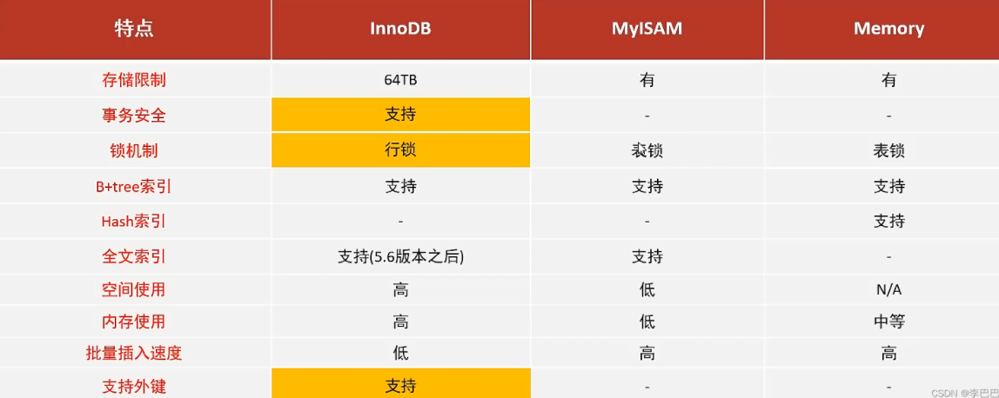


# 索引相关

## 介绍下索引

1. 索引的分类

* 按 [数据结构] 分类：B+树索引，Hash索引，Full-text索引
  * B+树索引：通过树形结构存储数据，适用于范围查询(如BETWEEN)和精确查询（如=），支持有序数据的快速查找、排序和聚合操作。是MySQL默认的索引类型，常用于InnoDB和MylSAM引擎
  * Hash索引：基于哈希表的结构，适用于等值查询（如=），查询速度非常快，但不支持范围查询（如>、<）。哈希索引不存储数据的顺序，常用于Memory引擎

* 按 [物理存储] 分类：聚簇索引，非聚簇索引（二级索引、辅助索引）
  * 聚簇索引的**数据行的物理存储顺序与索引顺序一致**
  * 当表有主键时，主键就是聚簇索引；如果表没有定义主键，InnoDB 会选择一个唯一非空索引作为聚簇索引；如果也没有这样的索引，InnoDB 会生成一个隐藏的自增 ID 来充当聚簇索引。
  * 聚簇索引的B+树叶子节点存放的是实际数据（所有完整的用户记录）
  * 非聚簇索引里存储的是主键值
* 按 [字段特性] （用途）分类：主键索引，唯一索引，普通索引，前缀索引
  * 主键索引：唯一且非空
  * 唯一索引：唯一但可以为null且可以有多个null值(多个NULL 视为不同值)
    * 一个表可以有多个唯一索引
* 按 [字段个数] 分类：单列索引，联合索引
* 特殊类型：覆盖索引（指查询所需的所有数据都能从索引中获取，不需要回表）

2. 什么时候使用索引

* 经常用于where查询条件的字段
* 经常用于group by 和 order by 的字段：group by和 order by 涉及数据排序，索引可以减少**排序操作（Sorting）**的开销，提高性能
* 用于连接的字段

3. 索引优化

* 前缀索引优化：使用前缀索引是为了减小索引字段大小，可以增加一个索引页中存储的索引值，有效提高索引的查询速度。在一些大字符串的字段作为索引时，使用前缀索引可以帮助我们减小索引项的大小。

* 覆盖索引优化：指的是在二级索引中就能查找到所需字段值，而不需要回到聚簇索引中查询，避免查询。比如我们要查询商品的名称和价格，那我们就建立一个联合索引[商品ID,名称,价格]，这样二级索引中存在所需数据，就不需要再次检索主键索引，从而避免回表。

* 使用自增主键：如果插入主键的值是随机的，那插入数据时，可能会插在数据页中间的某个位置，导致页分裂，自增主键保证了新记录总是在索引的最后面添加，这样可以避免频繁的页分裂和数据重组。

* 索引最好设置为not null

  * 第一原因：索引列存在 NULL 就会导致优化器在做索引选择的时候更加复杂，更加难以优化，因为可为 NULL 的列会使索引、索引统计和值比较都更复杂，比如进行索引统计时，count 会省略值为NULL 的行。
  * 第二个原因：NULL 值是一个没意义的值，但是它会占用物理空间，所以会带来的存储空间的问题，因为 InnoDB 存储记录的时候，如果表中存在允许为 NULL 的字段，那么行格式中至少会用 1 字节空间存储 NULL 值列表，如下图的紫色部分

  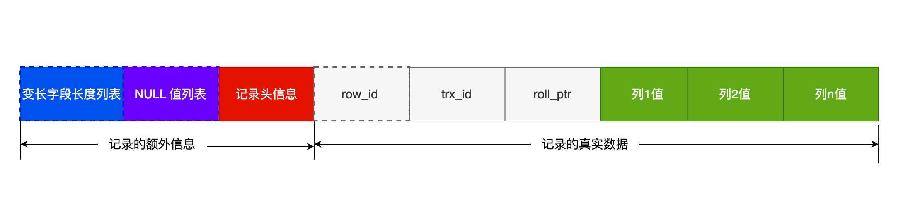

4. 索引失效

* 当我们使用左或者左右模糊匹配的时候，也就是 like %x 或者 like %x%这两种方式都会造成索引失效。而x%右模糊就不会失效，因为可以按照利用B+树有序的特点，去查找到x。而左模糊匹配，%林，如陈林，张林，王林，B+树不知道按照哪个索引值比较
* 对索引使用函数或表达式计算，eg:

```
select * from t_user where length(name)=6;
select * from t_user where id + 1 = 10;
```

* 联合索引不符合最左匹配原则：它要求查询条件必须从索引的最左列开始，按顺序逐列匹配，才能有效利用组合索引的加速效果。如联合索引如果是（A,B,C），此时只有(A),(A,B),(A,B,C)是有效的
* 在 WHERE 子句中，如果在 OR 前的条件列是索引列，而在 OR 后的条件列不是索引列，那么索引会失效

* 联合索引中，出现范围查询(>,<)，范围查询右侧的列索引失效。

## 联合索引是什么？遵循什么原则

1. 定义：它是将多个列组合在一起形成的索引
2. 工作原理：联合索引会按照索引中定义的多个列依次排序，并根据排序结果建立索引树。例如，一个 `(A, B, C)` 的联合索引会首先按照 `A` 列排序，若 `A` 列的值相同，再按 `B` 列排序，最后按 `C` 列排序。这种方式可以加速多列查询的匹配过程。

3. 最左前缀匹配原则：联合索引按顺序排列并按顺序使用，因此联合索引只能用于查询中包含**最左连续字段 **的情况。例如 `(A, B, C)` 的联合索引可以用于 `(A)`、`(A, B)` 和 `(A, B, C)` 的查询，但不能用于 `(B, C)` 或仅 `(C)` 的查询。

```SQL
-- 假设存在联合索引 (A, B, C)
SELECT * FROM table WHERE A = 1;      -- 使用索引
SELECT * FROM table WHERE A = 1 AND B = 2;  -- 使用索引
SELECT * FROM table WHERE A = 1 AND B = 2 AND C = 3;  -- 使用索引
SELECT * FROM table WHERE B = 2;      -- 不使用索引
SELECT * FROM table WHERE C = 3;      -- 不使用索引

```


## 为什么Mysql采用B+树作为索引？

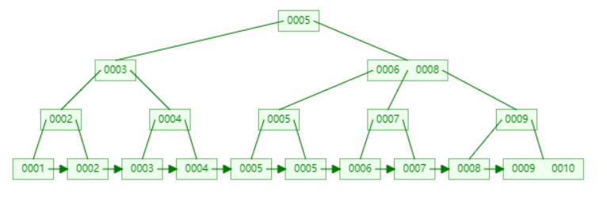

1. 什么是B+树？（B+树的特点？）

* 一个节点可以有多个子节点
* 非叶子节点存放索引，只有叶子节点存放数据
* 叶子节点之间用双向链表进行连接

2. 为什么Mysql采用B+树作为索引？

* B+树 vs 二叉树：随着数据量的增加，二叉树会越来越高，磁盘IO次数也会越来越多，而B+树在千万级别的数据量下，依旧能维持在3~4层，减少磁盘IO

* B+树 vs B树
  * **磁盘I/O和索引节点利用率**:B+树的非叶子节点不存储数据，只存储键值，这意味着B+树的非叶节点可以存更多的键，从而减少树的高度，降低磁盘I/O次数。
  * **范围查询**:B+树叶子节点维护了双向链表，因此能进行范围查询，而B树不能范围查询
  * **删除和插入性能**:B+树由于其叶子节点包含所有数据并且通过链表连接，使得其在进行插入和删除操作时更加高效，因为这些操作大多在叶子节点上完成，不需要频繁地修改内部节点
  * B树的优点：由于B树的每一个节点都包含key和value，因此我们根据key查找value时，只需要找到key所在的位置，就能找到value，但B+树只有叶子结点存储数据，索引每一次查找，都必须一次一次，一直找到树的最大深度处，也就是叶子结点的深度，才能找到value。也就是说B树最优复杂度为O(1)，而B+树固定为O(logn)
  
  B 树更适合键值对型的聚合数据库，比如 MongoDB，查询次数最优为 O(1)。虽然遍历数据的查询是相对常见的，但是 MongoDB 认为查询单个数据记录远比遍历数据更加常见，由于 B 树的非叶结点也可以存储数据，所以查询一条数据所需要的平均随机 IO 次数会比 B+ 树少

## 请详细描述B+树查询数据的全过程

​	首先从根节点开始，逐层搜索，直到找到叶子节点，即对应的数据页。在确定了待查找数据就存在于这个数据页上之后，我们将这个数据页加载到内存，通过页目录做二分查找，定位出一个粗略的记录分组，最后在这个分组里通过链表遍历的方式来找到指定记录行。

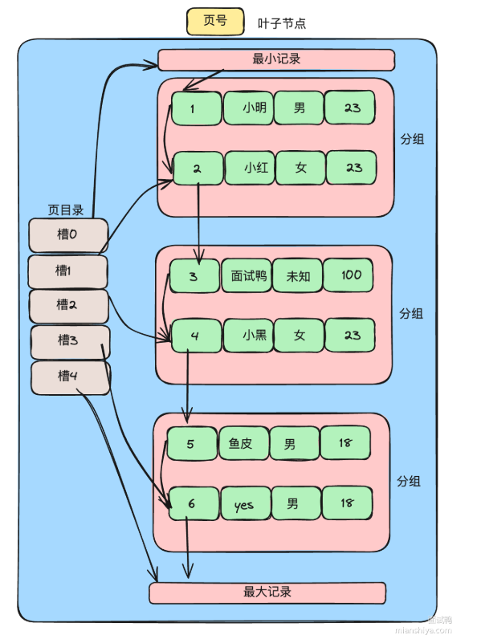

## 索引下推

一、定义

​	索引下推(Index Condition Pushdown,ICP)是一种减少回表查询，提高查询效率的技术。它允许MySQL在使用索引查找数据时，将部分查询条件下推到存储引擎层过滤，而不是先将所有匹配的数据行返回给查询处理层(server层)再进行过滤，从而减少需要从表中读取的数据行，减少了IO(本该由Server层做操作，交由存储引擎层因此叫做“下推”)。

* 索引下推是应用在**联合索引**上的

* 在 MySQL 5.6 之前，索引只能用于**精确匹配索引列或范围查询的最左前缀列**，而对于 **无法通过索引直接过滤的记录**，仍然需要回表（访问主键索引或数据文件）来执行剩余的条件判断

二、举例

* 如联合索引index_name_age,假设数据库中有数据（张三，18）、（张三，28）、（张三，48）、（张三，8）
* 没有索下推，查询name='张三'和age>30的数据时，会先匹配有四条数据name=张三'匹配成功，回表四次查询出带有name=张三'的四条数据，然后再根据age>30对这四条数据进行范围查找
* 使用索引下推，查询name=张三'和āge>30的数据时，会先匹配有四条数据name='张三'匹配成功，然后age>30的数据，过滤完成后，再用主键索引去进行一次回表操作

三、注意点

* 索引下推在MySQL5.6及以后的版本支持，InnoDB和MyISAM这两个存储引擎都生效。
* 如果查询中引用了子查询索引下推可能不会生效，具体看explain。
* 使用了函数或表达式索引下推也不能生效，这个和是否能命中索引的条件是一样的。
* 使用了聚簇索引（主键）查询，索引下推也不会生效，因为其是对于非聚簇索引来进行减少回表次数。


## 4层b+树能放多少

在Innodb存储引擎里面，咱们最小存储单元是页，而一个页的大小默认是16KB。

也即代表B+树的每个节点可以存16KB数据，这里我们假设我们的一行数据大小是1K，那么我们一个节点就可以存16行数据。注意：我们真正的数据都是存在叶子节点的，所以这里是指叶子节点可以存放16行数据。

非叶子节点存放的是主键值与指针，所以这里假设主键类型为bigint，占用8Byte，指针可以设置为占用6Byte，总共就为14Byte，这样就可以算出一个节点大概可以存放多少个指针了（指针指向下一层节点），大概为16KB/14Byte=1170个。

由此，可以推算出，2层B+树的话，可以存放1170x16=18720行数据。3层B+树的话，可以存放1170x1170x16=21902400行数据，也就差不多2000w条数据了。而4层就是200亿行数据


# 事务相关


## 介绍下事务？

**一、事务的四大特性？**

* 原子性（Atomicity)：一个事务中的所有操作，要么全部成功，要么全部失败，不会结束在中间某个环节，一旦事务在执行过程中发生错误，就会回滚到事务发生前的状态
* 一致性（Consistency)：要求数据库从一个正确状态变为另一个正确状态，不会破坏数据完整性。
* 隔离性（Isolation)：多个事务并发执行时，一个事务的执行不会影响到其他事务的执行
* 持久性（Durability)：事务处理结束后，其对数据的修改就是永久的，即便系统故障也不会丢失

**二、InnoDB 引擎通过什么技术来保证事务的这四个特性的呢？**

- 原子性是通过 undo log（回滚日志） 来保证的；

- 持久性是通过 redo log （重做日志）来保证的；
- 隔离性是通过 MVCC（多版本并发控制） 或锁机制来保证的；
- 一致性则是通过其他三个特性保证；

**三、并行事务会引发哪些问题？**

* 脏读：一个事务读取到了另一个事务已修改但未提交的数据

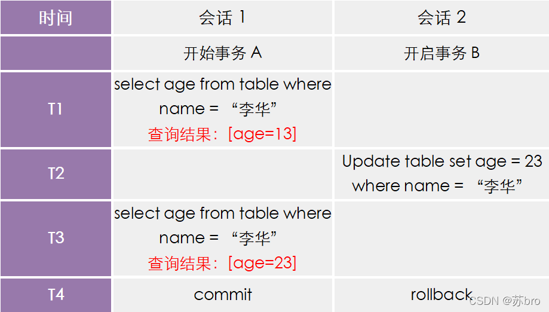

* 不可重复读：在一个事务内多次读取同一个数据，出现了前后两次读到的数据不一样的情况

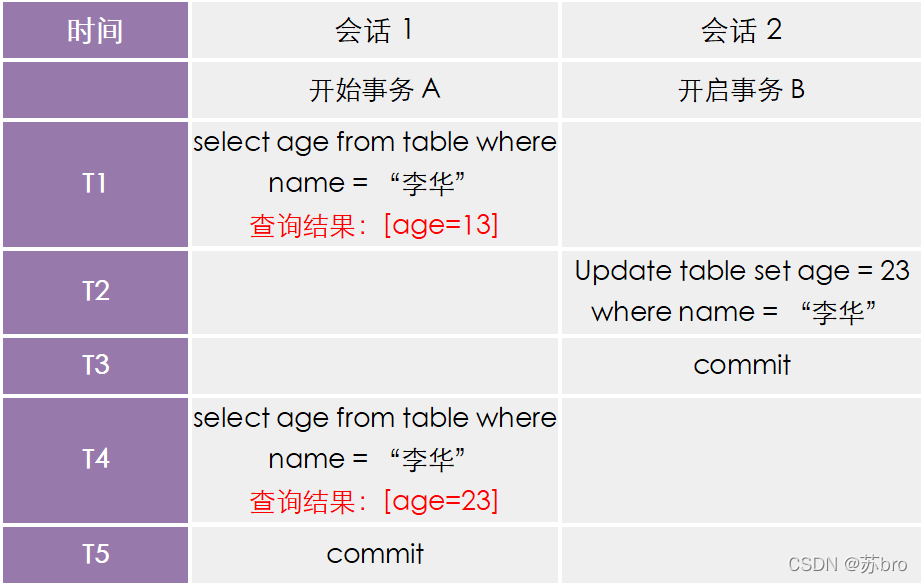

* 幻读：在一个事务内多次查询某个符合查询条件的「记录数量」，出现前后两次查询到的记录数量不一样的情况

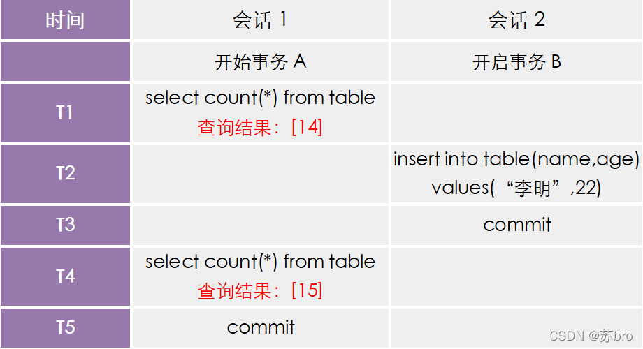

**四、事务的隔离级别有哪些？**

- 读未提交（read uncommitted），指一个事务还没提交时，它做的变更就能被其他事务看到；
- 读提交（read committed），指一个事务提交之后，它做的变更才能被其他事务看到；
- 可重复读（repeatable read），指一个事务执行过程中看到的数据，一直跟这个事务启动时看到的数据是一致的，MySQL InnoDB 引擎的**默认隔离级别**；
- 串行化（serializable ）；会对记录加上读写锁，在多个事务对这条记录进行读写操作时，如果发生了读写冲突的时候，后访问的事务必须等前一个事务执行完成，才能继续执行；

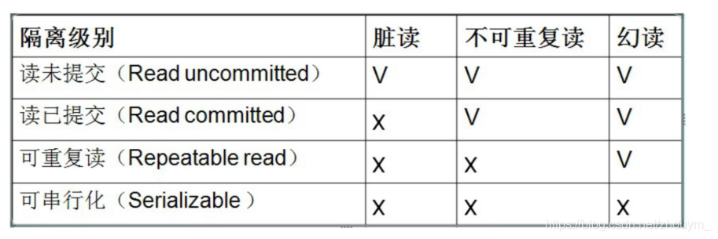


## Mysql如何避免幻读？

`InnoDB`存储引擎在 RR 级别下通过 `MVCC`和 `Next-key Lock` 来解决幻读问题：

**1、执行普通 `select`，此时会以 `MVCC` 快照读的方式读取数据**

​	在**快照读**的情况下，RR 隔离级别只会在事务开启后的第一次查询生成 `Read View` ，并使用至事务提交。所以在生成 `Read View` 之后其它事务所做的更新、插入记录版本对当前事务并不可见，实现了可重复读和防止快照读下的 “幻读”

**2、执行 select...for update/lock in share mode、insert、update、delete 等当前读**

​	**当前读**是指读取**数据的最新版本**，并且会**加锁**以确保数据的一致性。如果其它事务有插入新的记录，并且刚好在当前事务查询范围内，就会产生幻读！`InnoDB` 使用 Next-key Lock来防止这种情况。当执行当前读时，会锁定读取到的记录的同时，锁定它们的间隙，防止其它事务在查询范围内插入数据。只要我不让你插入，就不会发生幻读。


## MVCC原理

**一、概述**

​	MVCC(Multi--Version Concurrency Control,多版本并发控制)是一种并发控制机制，允许多个事务同时读取和写入数据库，而无需互相等待，从而提高数据库的并发性能，实现了读已提交和可重复读两种隔离级别，实现了事务的隔离性。
​	在MVCC中，数据库为每个事务创建一个数据快照。每当数据被修改时，MySQL不会立即覆盖原有数据，而是生成新版本的记录。每个记录都保留了对应的版本号或时间戳。多版本之间串联起来就形成了一条版本链，这样不同时刻启动的事务可以无锁地获得不同版本的数据。

**二、原理**

`MVCC` 的实现依赖于：**隐藏字段、Read View、undo log**。在内部实现中，`InnoDB` 通过数据行的 `DB_TRX_ID` 和 `Read View` 来判断数据的可见性，如不可见，则通过数据行的 `DB_ROLL_PTR` 找到 `undo log` 中的历史版本。每个事务读到的数据版本可能是不一样的，**在同一个事务中，用户只能看到该事务创建 `Read View` 之前已经提交的修改和该事务本身做的修改。**

1. 隐藏字段

`DB_TRX_ID（6字节）`：表示最后一次插入或更新该行的事务 id。此外，`delete` 操作在内部被视为更新，只不过会在记录头 `Record header` 中的 `deleted_flag` 字段将其标记为已删除

`DB_ROLL_PTR（7字节）` 回滚指针，指向该行的 `undo log` 。如果该行未被更新，则为空

`DB_ROW_ID（6字节）`：如果没有设置主键且该表没有唯一非空索引时，`InnoDB` 会使用该 id 来生成聚簇索引

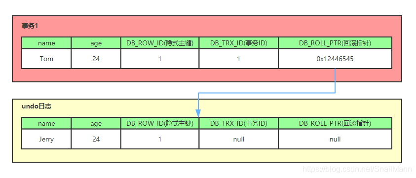

2. undo log
3. Read View：主要是用来做可见性判断的, 即当我们某个事务执行快照读的时候，对该记录创建一个 `Read View` 读视图，把它比作条件用来判断当前事务能够看到哪个版本的数据，既可能是当前最新的数据，也有可能是该行记录的`undo log`里面的某个版本的数据。

>  数据可见性算法：在 `InnoDB` 存储引擎中，创建一个新事务后，执行每个 `select` 语句前，都会创建一个快照（Read View），**快照中保存了当前数据库系统中正处于活跃（没有 commit）的事务的 ID 号**。其实简单的说，保存的是系统中当前不应该被本事务看到的其他事务 ID 列表（即 m_ids）。当用户在这个事务中要读取某个记录行的时候，`InnoDB` 会将该记录行的 `DB_TRX_ID` 与 `Read View` 中的一些变量及当前事务 ID 进行比较，判断是否满足可见性条件


**三、RC 和 RR 隔离级别下 MVCC 的差异**

在事务隔离级别 `RC` 和 `RR` （InnoDB 存储引擎的默认事务隔离级别）下，`InnoDB` 存储引擎使用 `MVCC`（非锁定一致性读），但它们生成 `Read View` 的时机却不同

- 在 RC 隔离级别下的 **`每次select`** 查询前都生成一个`Read View` (m_ids 列表)

> **在 RC 隔离级别下，事务在每次查询开始时都会生成并设置新的 Read View，所以导致不可重复读**

- 在 RR 隔离级别下只在事务开始后 **`第一次select`** 数据前生成一个`Read View`（m_ids 列表）


##  RedoLog 、BinLog和UndoLog	

* RedoLog：redo log是物理日志，记录"某页(Page)某位置的数据被修改为某值”。它不记录逻辑操作（如“插入一行”），而是直接记录对**事务在数据页上的修改**（数据页的插入点、记录的偏移量和插入的实际数据并更新页目录、页头等元数据）

  * innoDB层面
  * 物理日志，记录该数据页更新的内容
  * 顺序循环写，日志空间大小固定
  * 作用：crash-safe（崩溃恢复）
    * MySQL 采用 **WAL 机制（Write-Ahead Logging）**，确保事务提交前，先写 `redo log`。
    * **如果数据库崩溃了，`redo log` 重新执行已提交事务，恢复数据**

* BinLog：用于记录数据库执行的写入性操作(不包括查询)信息

  * Server层面
  * 逻辑日志，记录的是这个更新语句的原始逻辑（sql语句），以二进制的形式记录
  * 追加写，是指一份写到一定大小的时候会更换下一个文件，不会覆盖

  主从复制

  * 作用：主从复制、数据恢复(到特定的时间点)

* UndoLog：回滚日志，它的作用是在事务发生异常或主动回滚时，用于撤销已执行的操作，确保数据库数据能够回到事务开始前的状态，保证事务的 **原子性**

  * insert undo log:代表事务在 insert 新记录时产生的 undo log, 只在事务回滚时需要，并且在事务提交后可以被立即丢弃
    * 对于 `INSERT` 操作，Undo Log 记录的是“删除”操作，因为如果事务回滚，需要撤销插入的数据。

  * update undo log:事务在进行 update 或 delete 时产生的 undo log ; 不仅在事务回滚时需要，在快照读时也需要；所以不能随便删除，只有在快速读或事务回滚不涉及该日志时，对应的日志才会被 purge 线程统一清除
    * 对于 `DELETE` 操作，Undo Log 记录的是“插入”操作，用来恢复被删除的数据。
    * 对于 `UPDATE` 操作，Undo Log 记录的是修改前的旧值，用来恢复原来的值

> 更新操作：
> 查询数据到内存->记录undo log->记录redo log预提交）->更新内存->记录binlog->记录redolog（已提交）
> 任意一步出问题，都可以回滚或者重塑


## 什么是Write-Ahead Logging(WAL)技术？

在MySQL InnoDB存储引擎中，重做日志(Redo Log)就是WAL的实现，用于保证事务的持久性和崩溃恢复能力。InnoDB重做日志的工作机制如下：

1. 当一个事务开始时，所有对数据库的修改首先记录到重做日志缓冲区中。
2. 重做日志缓冲区的数据会周期性地刷新到磁盘上的重做日志文件(ib logfile0和ib logfile1).
3. 当事务提交时，InnoDB确保重做日志已写入磁盘，然后将数据页的修改写入数据文件。
4. 如果系统崩溃，InnoDB会在启动时通过重做日志重新应用所有未完成的事务(已提交但是未完全落盘)，以恢复数据库到一致状态。

## 事务的两阶段提交

**一、定义**

​	二阶段提交是mysql为了保证redo log和binlog一致性使用的一种机制。可以在崩溃恢复时保证数据的一致性。分为两个阶段：准备阶段+提交阶段

* 准备阶段：InnoDB引擎会先写redo log,并且将其标记为prepare阶段，表示事务已经准备提交但是还没有完成；
* 提交阶段：当redo log变成prepare阶段之后，mysql server层会写binlog，binlog写完之后，会通知InnoDB引擎，将redo log标记成commit状态。表示事务完成。

**二、为什么需要二阶段提交**

为什么：为了保证数据的一致性
如何保证：**通过对比XID**

* 扫描redo log,如果发现有prepare状态的redo log,则拿XID去binlog里面找，如果找到了具有相同XID的事务记录，说明数据已经保存好了，当前这个事务可以直接提交，否则回滚。

**1、redo log处于preparel阶段，binlog还没写入，mysql挂了**
	事务还没有提交，binlog里面还没有，所以只要redo log的不做数，数据就是一致的。

**2、redo log处于preparel阶段，binlog写入了，mysql挂了**
	对比redo log和binlog是否一致，一致的话，则提交事务，不一致就回滚，也能保证数据一致。

**三、组提交**

​	组提交：一种优化redo写入的技术。一组事务的redo log会全部先写入到redo log buffer中，然后一起刷盘到文件中，主要是减少io,提高并发性能。


# 锁相关

## Mysql锁机制

**一、锁分类**

按锁粒度从大到小分类：`表锁`，`页锁`和`行锁`；以及特殊场景下使用的`全局锁`

* 全局锁：全局锁就是对整个数据库实例加锁，加锁后整个实例就处于只读状态，后续的DML的写语句，DDL语句，已经更新操作的事务提交语句都将被阻塞。其典型的使用场景是做全库的逻辑备份，对所有的表进行锁定，从而获取一致性视图，保证数据的完整性。

```sql
flush tables with read lock ;
unlock tables ;
```

* 表级锁

  * 表锁：表锁的语法是lock tables … read/write。可以用unlock tables主动释放锁，也可以在客户端断开的时候自动释放。lock tables语法除了会限制别的线程的读写外，也限定了本线程接下来的操作对象。如果在某个线程A中执行lock tables t1 read,t2 wirte;这个语句，则其他线程写t1、读写t2的语句都会被阻塞。同时，线程A在执行unlock tables之前，也只能执行读t1、读写t2的操作。连写t1都不允许

  * 元数据锁：meta data lock , 元数据锁，简写MDL。MDL加锁过程是系统自动控制，无需显式使用，在访问一张表的时候会自动加上。MDL锁主要作用是维护表元数据的数据一致性，**在表上有活动事务的时候，不可以对元数据进行写入操作。为了避免DML与DDL冲突**，保证读写的正确性。这里的元数据，大家可以简单理解为就是一张表的表结构。 也就是说，某一张表涉及到未提交的事务时，是不能够修改这张表的表结构的。

    ​	在MySQL5.5中引入了MDL，**当对一张表进行增删改查的时候，加MDL读锁(共享)；当对表结构进行变更操作的时候，加MDL写锁(排他)**。

    ​	常见的SQL操作时，所添加的元数据锁：

    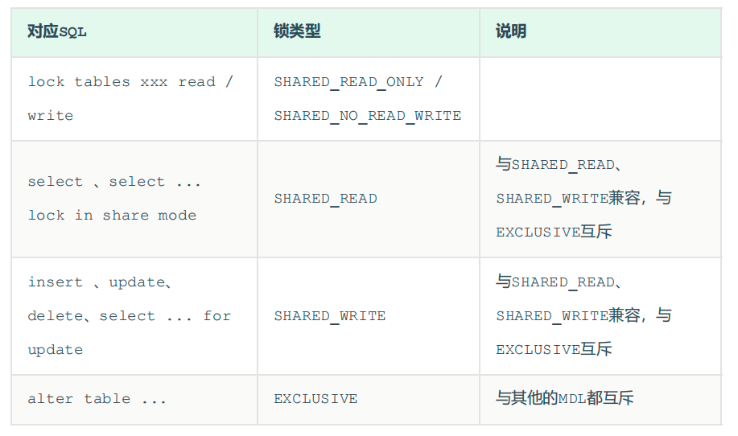

  * 意向锁：意向锁的存在是为了协调行锁和表锁的关系，主要功能就是避免为了判断表是否存在行锁而去全表扫描。意向锁是自动加的。

    - 意向共享锁（IS锁）：事务在请求S锁前，要先获得IS锁

    - 意向排他锁（IX锁）：事务在请求X锁前，要先获得IX锁

    IS和IX之间是共享的，意向锁（共享和排他）和表级别的X锁是冲突的

* 行级锁：InnoDB存储引擎加锁默认是行锁，例如对某行数据添加共享锁、排它锁，都称为行锁。针对 唯一索引进行检索时，对已存在的记录进行等值匹配时，将会自动优化为行锁。不通过索引条件检索数据(InnoDB的行锁是针对于索引加的锁)，那么InnoDB将对表中的所有记录加锁，此时就会升级为表锁

  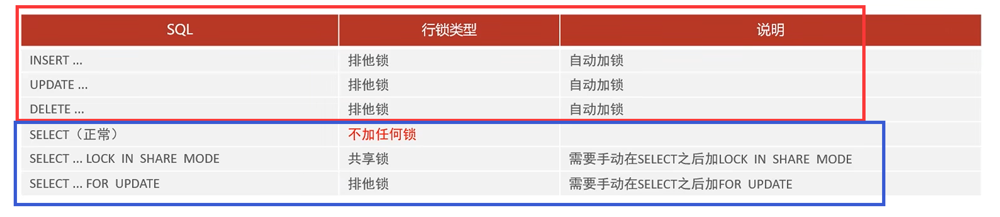

  * 记录锁（Record Lock）: 锁定单个行记录的锁，防止其他事务对此进行 update 和 delete 
  * 间隙锁（Gap Lock）： 锁定索引记录间隙，不含该记录，确保索引记录间隙不变，防止其他事务在这个间隙进行 insert，产生幻读。在 RR 隔离级别下都支持。

  *   临键锁（Next-Key Lock）：行锁和间隙锁的组合，同时锁住数据，并锁住数据前面的间隙 Gap，左开右闭，在 RR 隔离级别下支持。

  >    默认情况下，InnoDB 在 REPEATABLE READ 事务隔离级别运行，InnoDB 使用 next-key 锁进行搜索和索引扫描，以防止幻读。

二、临键锁的优化

* 对**唯一索引**进行**等值查询**
  * 记录存在：将会自动优化为行锁
  * 记录不存在：将会自动优化为间隙锁
    * 举例：当前有id为0,4,8,16的数据，查询id=9的记录时，则(8,16)加间隙锁
* 对**普通索引**进行**等值查询**
  * 记录存在：临键锁+间隙锁，间隙锁：向下遍历到第一个不符合条件的值停止
    * 举例：当前有id为0,4,8,16的数据，查询id=8的数据，则(4,8]加临键锁，(8,16)加间隙锁
  * 记录不存在：间隙锁
    * 举例：当前有id为0,4,8,16的数据，查询id=15的数据，临键锁会退化为间隙锁，最终加锁范围是 (8,16)
* 对**唯一索引**进行**范围查询**：会访问到不满足条件的第一个值为止
  * 举例：当前有id为0,4,8,16的数据，查询id>=8和id<9的数据，最终加锁为[8,16)
    * 最开始要找的第一行是 id = 8，因此 next-key lock(4,8]，但是由于 id 是唯一索引，且该记录是存在的，因此会退化成记录锁，也就是只会对 id = 8 这一行加锁；
    * 由于是范围查找，就会继续往后找存在的记录，也就是会找到 id = 16 这一行停下来，然后加 next-key lock (8, 16]，但由于 id = 16 不满足 id < 9，所以会退化成间隙锁，加锁范围变为 (8, 16)。


* 对**普通索引**进行**范围查询**：临键锁不会退化为间隙锁和记录锁。
  * 举例：当前有id为0,4,8,16的数据，查询id>=8和id<9的数据，最终加锁为(4,16]
    * 最开始要找的第一行是 b = 8，因此 next-key lock(4,8]，但是由于 b 不是唯一索引，并不会退化成记录锁。
    * 但是由于是范围查找，就会继续往后找存在的记录，也就是会找到 b = 16 这一行停下来，然后加 next-key lock (8, 16]，因为是普通索引查询，所以并不会退化成间隙锁。

## 可重复读下事务A读了十条数据，事务B可以往这十条数据中插入或者修改数据吗

* 如果是当前读，如select * from A where id >= 1 and id <=10 for update，则会加临键锁，那么不可插入和更新
* 如果是快照读，可以


# 什么是MySQL的主从同步？如何实现的

**一、概述**

* 将一个MySQL服务器上的更新操作(insert、.update、delete)复制到其他数据库服务器上就是主从同步。

* 使用场景：数据备份、读写分离。

**二、如何实现**

* 主库提交事务，数据库的所有写操作都会记录到binlog日志文件中
* 主库的dump线程会监听binlog日志变更并推送给从库
* 从库的io线程接收日志，并写入到中继日志(Relay log)中
* 从库的SQL线程读取中继日志，并重放更新数据

**三、主从同步的类型**

* 异步复制：主库不用等从库的确认。(性能高，有数据不一致风险)
* 半同步复制：通过参数设置，要等到几个从库确认（性能折中，数据一致性较高）
* 全同步复制：等所有的从库确认后。(效率低，数据一致性高)


# MySQL 删除自增 id，随后重启 MySQL 服务，再插入数据，自增 id 会从几开始？

eg.比如一张 id 自增的表中有 8 条数据，删除两条后，重启 MySQL 服务后，又插入一条数据，那么此时自增的 id 会从几开始呢？

* 使用InnoDB引擎
  * mysql8.0以前，自增id会丢失（因为 InnoDB表把自增主键的最大ID记录到内存中），重启后会重新计算自增主键最大ID，因此是7
  * mysql8.0以后，自增id不会丢失（记录在redo 日志）中，因此是9
* 使用 myisam 引擎的情况下，不管 MySQL 版本为多少，自增的 id 都不会丢失。

# char和varchar的区别

* 定长和变长：char表示定长，长度固定，如果插入数据的长度小于定义的长度则用空格填充；varchar表示变长，插入数据长度小于定义长度时，按实际长度存储
* 空间存储：char由于是定长，更消耗空间，varchar更节省空间
* 查找效率：char由于长度固定，存取速度要比varchar快
* 存储容量：char最多255个字符，varchar最多65532个字符

varchar 和 text的区别

text

* 变长
* 需要额外的字节存储长度
* 不能指定最大长度，适合存储大文本


#  删除表可以用什么

1. drop：删除表数据和表结构

2. truncate：删除表中所有数据，不删表结构

3. delete：删除表中所有或部分数据，不删表结构。（delete from...where...)

不同点：

* 删除的范围：drop（删除表中所有数据及表结构）>truncate（删除表中所有数据,本质上是先删表再建表）>=delete（删除表中所有数据或部分数据）
* 查询条件：delete可以使用查询条件进行表中数据删除，drop和truncate不可以
* 命令类型：delete属于DML，drop和truncate属于DDL
* 数据能否恢复：delete删除的数据可以恢复(事务回滚），但是drop和truncate删除的数据不能恢复
* 执行效率：drop>truncate>delete（delete是一条一条删除）
  

# SQL优化

* InnoDB引擎使用varchar代替char

* 某些字段可以用数值类型替代字符串类型

  * 节省空间
  * 避免计算时再从字符串转换从数值类型

* 避免索引失效的情况

  * 左模糊和左右模糊
  * or连接的两个字段，有一个不是索引列
  * 对索引使用函数或表达式计算
  * 使用联合索引但不符合最左匹配原则

* 索引不要建立在有大量重复数据，区分度低的字段上，如性别

* 尽量在where和order by常出现的字段使用索引，不要随便就建立索引

* 批量插入数据

  ```mysql
  //多次单条插入
  INSERT INTO student (id,NAME) VALUES(4,'name1');
  INSERT INTO student (id,NAME) VALUES(5,'name2');
  //一次插入多条：
  INSERT INTO student (id,NAME) VALUES(4,'name1'),(5,'name2');
  //避免每条语句都要开启事务和提交事务，而批量处理是一次事务开启和提交，自然速度飞升
  ```

* 一次性删除太多数据，可能造成锁表，会有lock wait timeout exceed的错误，所以建议分批操作

* update字段不加索引会锁表

* 尽量使用union all替代union（union在进行表链接后会筛选掉重复的记录，所以在表链接后会对所产生的结果集进行排序运算，删除重复的记录再返回结果。实际大部分应用中是不会产生重复的记录，最常见的是过程表与历史表UNION）

# 数据库三大范式

* 第一范式：属性不可再分，即表中的每个列都不可以再进行拆分

​	如表中字段有id,姓名,性别，这些字段一看就不能再分。而再比如现在有一个字段contact,将手机号码和住址放在了一起，而我们需要查询单独的手机号码或住址，此时就应该把contact字段再切分，才满足1NF

* 第二范式：在满足1NF的前提下，表中不存在部分依赖，非主键列要完全依赖于主键（主要是说在联合主键的情况下，非主键列不能只依赖于主键的一部分）比如联合主键为stu_id(学生id)和course_id(课程id)，那么score字段完全依赖于stu_id和course_id，而couse_name（课程名称）字段只依赖于couse_id，就不符合2NF

* 第三范式：满足第二范式；且不存在传递依赖，即非主属性不能与非主属性之间有依赖关系，非主属性必须直接依赖于主属性，不能间接依赖主属性。（A -> B, B ->C, A -> C）

  比如现在有字段：课程号，老师名称，老师电话，老师职位。那么很明显，老师电话和老师职位依赖于老师名称，并间接依赖于课程号，这就是传递依赖，不符合3NF

* BCNF：消除主属性对于不包含它的码的部分与传递函数依赖。如（A,B,C)为主属性，若A->B,B->A，则存在传递依赖，不符合BCNF。虽然，不满足BCNF，会导致一些冗余和一致性的问题。但是，将表分解成满足BCNF的表又可能丢失一些函数依赖。所以，一般情况下不会强制要求关系表要满足BCNF。


# 为什么主键通常设置为自增

1. **提高插入效率**：自增主键按顺序递增，新的数据行总是追加到表的末尾，减少了中间插入带来的`页分裂`和重排，提升了插入性能。

2. **保持聚簇索引的顺序**：在 InnoDB 中，主键默认作为聚簇索引，自增主键可以确保数据按顺序存储，便于快速范围查询和排序。

3. **避免主键冲突**：在高并发环境下，自增主键由数据库自动生成，不需要人工管理，避免了重复和冲突的风险。

4. **便于管理和维护**：自增主键通常是整数型，占用空间小，查询效率高，也方便调试和定位数据。


# 分库分表


1. 对于分库分表的理解，什么场景，具体怎么实现，选型的权衡，重点在于水平和垂直的区别

   

**一、分类概述**

* 垂直分库：就是把单一数据库按照业务进行划分，不同的业务使用不同的数据库，进而将一个数据库的压力分担到多个数据库
* 水平分库：是把同一个表按一定规则拆分到不同的数据库中，每个库可以位于不同的服务器上，这样就实现了水平扩展，减少单一数据库的读写压力
* 垂直分表：将一张表的不同列拆分到多个表中，以减少每张表的字段数量和提高查询效率。例如，用户表可以分为基本信息表和详细信息表。
* 水平分表：将同一张表的数据按行划分，分散到多个表中。例如，可以按用户ID的范围将数据分为多个表(如user_1、user_2)。

**二、为什么要分库分表**

* 分库：是为了解决服务器资源受单机限制，顶不住高并发访问的问题，把请求分配到多台服务器上，降低服务器压力。

* 分表：是为了解决由于单张表数据量多大，而导致查询慢的问题。大致三、四千万行数据就得拆分，不过具体还是得看每一行的数据量大小，有些字段都很小的可能支持更多行数，有些字段大的可能一千万就顶不住了。

**三、分片算法**

分片算法主要解决了数据被水平分片之后，数据究竟该存放在哪个表的问题。

* 哈希分片：哈希分片是通过对某个字段(通常是主键或ID)进行哈希运算，将数据均匀分配到多个表中。分析查询模式，如查询主要基于用户ID ➝ user_id 适合作为分片键
  * 优点：可以有效避免数据倾斜，保证数据在各个表均匀分布，适合随机读写的场景
  * 缺点：无法进行范围查询
* 范围分片：范围分表是按照某个字段的范围将数据划分到不同的表中，通常用于时间戳、ID等连续性字段。
  * 优点
    * 易于理解和实现，适合对时间敏感的数据
    * 方便进行范围查询
  * 缺点：数据分布可能不均匀

**四、分库分表带来的问题**

* join 操作：数据分布在不同数据库，导致无法使用 join 操作。这样就导致我们需要手动进行数据的封装，比如你在一个数据库中查询到一个数据之后，再根据这个数据去另外一个数据库中找对应的数据
* 事务问题：单机事务无法满足，要引入分布式事务
* 全局ID唯一问题：以前单库单表直接使用数据库的白增D即可，但是分库分表之后，使用自增D会导致重复主键的情况，此时需要利用雪花算法或者其他全局唯一ID发号器来生成唯一主键，即**引入分布式ID**

* 跨库聚合查询问题：分库分表会导致常规聚合查询操作，如 group by，order by 等变得异常复杂。这是因为这些操作需要在多个分片上进行数据汇总和排序，而不是在单个数据库上进行。为了实现这些操作，要么自己在业务代码中排序，要么利用ES存储全量数据排序查询

**五、分库分表大致流程**

* 分析业务需求：确定数据量及增长趋势，评估分库分表的必要性。（需要一定的预判但是不要过度设计）
* 设计分库分表方案：选择合适的分片算法
* 实现数据路由：根据分库分表策略设计数据路由机制，一般通过应用层代码或数据库中间件来实现，将请求路由到相应的数据库或表。
* 数据迁移：将现有数据迁移到新的分库分表结构中，可以通过批量导入、ETL工具或脚本来完成。

​	可引入中间件，如ShardingSphere 绝对可以说是当前分库分表的首选！ShardingSphere 的功能完善，除了支持读写分离和分库分表，还提供分布式事务、数据库治理、影子库、数据加密和脱敏等功能。

​	现在很多公司都是用的类似于 TiDB 这种**分布式关系型数据库**，不需要我们手动进行分库分表（数据库层面已经帮我们做了），也不需要解决手动分库分表引入的各种问题，直接一步到位，内置很多实用的功能（如无感扩容和缩容、冷热存储分离）！如果公司条件允许的话，个人也是比较推荐这种方式

**六、主从分库一般怎么做数据同步**

* 停机迁移
* 双写：对老库的更新操作（增删改），同时也要写入新库（双写）
* 数据库同步工具 如Canal 做增量数据迁移（依赖 binlog，开发和维护成本较低）

# 给一个购物车场景，有商品id和用户让选分片键，选了用户如果来个商品id查询怎么办

* 就选用户作为分片键，因为购物车数据和用户强相关，大多数查询是用户查看自己的购物车，所以 user_id 作为分片键更合理
* 建一个路由映射表，存商品id和用户id，这样可以从该表查到商品id对应的用户id，再去按照用户查询就好了


# explain命令

**一、EXPLAIN 命令简介**

EXPLAIN 命令用于获取 MySQL 查询的执行计划信息。它可以显示查询语句如何被 MySQL 解析和执行，包括使用了哪些索引、表的连接方式、查询的行数估计等。通过分析这些信息，我们可以找出查询性能瓶颈，并进行相应的优化。

使用方式：

```sql
在 MySQL 中，使用 EXPLAIN 命令非常简单。只需要在查询语句前加上“EXPLAIN”关键字即可。例如：
EXPLAIN SELECT * FROM table_name WHERE column_name = 'value';
执行上述语句后，MySQL 会返回一个包含查询执行计划信息的结果集。
```

**二、使用 EXPLAIN 命令的方法**

`id`：查询的标识符。如果有多个查询（如子查询或连接查询），每个查询都会有一个唯一的 id。
`select_type`：查询的类型，如 SIMPLE（简单查询）、PRIMARY（主查询）、SUBQUERY（子查询）等。
`table`：查询涉及的表名。
`partitions`：查询涉及的分区，如果表没有分区，则为 NULL。
`type`：连接类型，也就是访问表的方式，表示 MySQL 如何查找表中的行。常见的连接类型有 `ALL`（全表扫描）、`index`（索引全扫描）、`range`（索引范围扫描）、`ref`（使用非唯一索引的等值查询）、`eq_ref`：对唯一索引的引用，效率较高、`const`：查询是基于常量值进行的匹配,表示通过索引只能匹配到一行数据。连接类型的性能从好到坏依次为：const > eq_ref > ref > range > index > ALL。
`possible_keys`：可能使用的索引。
`key`：实际使用的索引。如果为 NULL，表示没有使用索引。
`key_len`：索引字段的长度。
`ref`：连接条件所引用的列或常量
`rows`：MySQL 估计需要扫描的行数。
`filtered`：表示查询结果经过表过滤后的预计百分比，它显示了查询条件对表数据的过滤效果。filtered = (满足表条件的记录数 / 该表的总记录数) * 100%。它的值越大，表示索引过滤性越好（表示索引直接命中，而不需要一条条过滤）；值越小，表示索引过滤性越差，甚至没有使用到索引。由此可见，filtered的100%确实是要比1%要好
`Extra`：额外的信息，如使用了临时表、文件排序等。

**三、实例解析**

假设我们有一个名为 `users` 的表，包含 `id`、`name`、`age`、`email` 等字段，并且在 `name` 字段上建立了索引。我们执行以下查询：

```sql
EXPLAIN SELECT * FROM users WHERE name = 'John';
```

假设返回的结果如下：

```sql
id | select_type | table | partitions | type | possible_keys | key | key_len | ref | rows | filtered | Extra
-- | ------ | ------ | ------ | ------ | ------ | ------ | ------ | ------ | ------ | ------ | ------
1 | SIMPLE | users | NULL | ref | name_idx | name_idx | 767 | const | 10 | 100.00 | NULL
```

在这个例子中，我们可以看出以下信息：

`id` 为 1，表示这是一个简单查询。
`type` 为 `ref`，表示使用了非唯一索引的等值查询，性能较好。
`key` 为 `name_idx`，表示实际使用了 name 字段上的索引。
`rows` 为 10，表示 MySQL 估计需要扫描 10 行数据。
`filtered` 为 100.00，表示查询结果没有进行过滤。

如果我们执行一个没有使用索引的查询，比如：

```sql
EXPLAIN SELECT * FROM users WHERE age = 30;
```

假设返回的结果如下：

```sql
id | select_type | table | partitions | type | possible_keys | key | key_len | ref | rows | filtered | Extra
-- | ------ | ------ | ------ | ------ | ------ | ------ | ------ | ------ | ------ | ------ | ------
1 | SIMPLE | users | NULL | ALL | NULL | NULL | NULL | NULL | 1000 | 10.00 | Using where

```

在这个例子中，我们可以看出：

- `type` 为 `ALL`，表示进行了全表扫描，性能较差。
- `key` 为 `NULL`，表示没有使用索引。
- `rows` 为 1000，表示 MySQL 估计需要扫描 1000 行数据。
- `Extra` 为 `Using where`，表示使用了 `WHERE` 子句进行过滤。


# count(*),count(1),count(字段)区别

* count(*)：统计所有行，包括null
* count(1)：现代的 SQL 优化器通常会将 `COUNT(1)` 和 `COUNT(*)` 优化为相同的执行计划，因此性能基本相同
* count(字段)：只有当指定列的值`不为 NULL` 时，该行才会被计入结果，由于需要检查每行中的特定列是否为 NULL，性能可能略低于 COUNT(*) 和 COUNT(1)。


# MyBatis中 #{}和${}的区别是什么？

* #{}针是预编译处理，${}是字符串替换。
* Mybatis在处理#{}时，会将sql中的#{}替换为?号，调用PreparedStatement的set方法来赋值；
* Mybatis在处理${}时，就是把${}替换成变量的值。
* 使用#{}可以有效的防止SQL注入，提高系统安全性

```sql
#{}对应的变量自动加上单引号''
-- 转换前
select * from #{param}
-- 转换后
select * from 'user'

#${}对应的变量是不会被加上单引号''的。
-- 转换前
select * from ${param}
-- 转换后
select * from user

```


# 数据库哪些字段你有设置过默认值

```sql
-- 用户表
create table if not exists user
(
    id           bigint auto_increment comment 'id' primary key,
    userAccount  varchar(256)                           not null comment '账号',
    userPassword varchar(512)                           not null comment '密码',
    unionId      varchar(256)                           null comment '微信开放平台id',
    mpOpenId     varchar(256)                           null comment '公众号openId',
    userName     varchar(256)                           null comment '用户昵称',
    userAvatar   varchar(1024)                          null comment '用户头像',
    userProfile  varchar(512)                           null comment '用户简介',
    userRole     varchar(256) default 'user'            not null comment '用户角色：user/admin/ban',
    editTime     datetime     default CURRENT_TIMESTAMP not null comment '编辑时间',
    createTime   datetime     default CURRENT_TIMESTAMP not null comment '创建时间',
    updateTime   datetime     default CURRENT_TIMESTAMP not null on update CURRENT_TIMESTAMP comment '更新时间',
    isDelete     tinyint      default 0                 not null comment '是否删除',
    index idx_unionId (unionId)
) comment '用户' collate = utf8mb4_unicode_ci;
```


MySQL 如何建立索引？索引建太多的缺点？影响读还是写效率？
