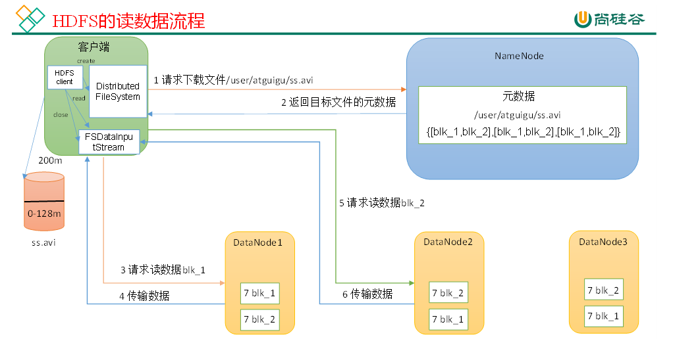

# 一、Hadoop

## 1. 介绍一下Hadoop

1. 定义：

   hadoop是一个分布式系统基础架构，主要是为了解决海量数据的存储和海量数据的分析计算问题

2. 组件：

​	Hadoop主要由HDFS,MapReduce和Yarn三个组件构成

* HDFS（Hadoop distributed file system)：是一个分布式文件系统，它将文件数据布局到多台机器上，并拥有副本机制，因此有着高容错、高吞吐和高可扩展性等特点，适合一写多读的场景

  > HDFS只支持单用户写，不支持并发写（hdfs的不能并发写指的是：同位置同名文件只能有一个writer，否则会使得所有的上传请求失败）

* MapReduce：是一个分布式运算程序的编程框架，有着“分而知之”的思想，通过map任务并行处理任务，再通过reduce任务进行结果汇总

* Yarn：是一个分布式资源调度的平台，负责资源统一管理和分配，Yarn上不仅提交hadoop任务，也可以提交其他计算框架的任务，如spark等


## 2.请说下HDFS的组织架构

* Client：客户端
  * 切分文件，将文件切分成一个个块
  * 与NameNode交互，获取块的存储位置
  * 与DataNode交互，读写数据
  * Client还提供一些命令来管理客户端，比如启动和关闭HDFS，访问hdfs目录

* NameNode：名称节点，也称为主节点
  * 管理HDFS的名称空间（文件、目录和块）
  * 处理客户端读写请求
  * 存储元数据，如数据块的映射信息
  * 配置副本策略

* DataNode：数据节点，也称从节点
  * 存储实际的数据块
  * 执行数据块的读写操作

* Secondary NameNode：为NameNode提供一些辅助工作
  * 定期合并Fsimage和Edits,并推送给NameNode，减少NN启动时间
  * NameNode挂掉恢复后，辅助其恢复部分数据

  

## 3.NameNode工作机制

NameNode的数据存储在内存和本地磁盘，本地磁盘的数据存储在Fsimage镜像文件和Edits编辑日志文件

**第一阶段：NameNode启动**

1. 第一次启动NameNode格式化后，创建Fsimage和Edits文件。如果不是第一次启动，直接加载编辑日志和镜像文件到内存。

2. 客户端对元数据进行增删改的请求。

3. NameNode记录操作日志，更新滚动日志。

4. NameNode在内存中对元数据进行增删改。

**第二阶段：Secondary NameNode工作**

1. 当NameNode中edits文件到达临界值（默认64MB)or间隔一段时间（默认一小时）时，触发Checkpoint操作，进而触发SecondaryNameNode工作
2. 触发Checkpoint操作后，NameNode产生一个新的edits文件，并把后续的更新操作写入这个edits.new文件中
3. SecondaryNameNode通过http get的方式将NameNode上旧的fsimage和edits文件复制到本地
4. SecondaryNameNode合并fsimage和edits文件，生成一个新的fsimage文件，即fsimage.chkpoint
5. SecondaryNameNode通过http post的方式将该文件复制回NameNode
6. NameNode将fsimage.chkpoint重新命名为fsimage，将edits.new重新命名为edits，一轮结束。

## 5. HDFS读写流程

写流程：

1. Client通过RPC向NameNode发送写请求
2. NameNode检查该用户是否有上传权限，以及要上传的文件是否在HDFS上有重名目录，条件都满足的话，则返回给客户端一个可以上传的信息
3. Client将文件切分成块，默认一个块为128MB，并给NameNode发送请求，问第一个block该上传到哪些节点
4. NameNode返回可用的DataNode列表
5. Client选择其中一个节点A建立通信，本质上是RPC调用，A收到请求后再调用B，B再调用C，成功建立起pineline,接着再反向逐级反馈至client
6. Client开始向A发送第一个block，以packet(64k)为单位，A收到后再发送给B，B发送后再发送给C
7. 反向逐级应答至Client,Client收到ack后从ackqueue队列中移除对应的packet
8. 第一个block传输完毕之后，Client请求上传第二个block，然后就是重复上述步骤


读流程：

1. Client通过RPC向NameNode发送读请求
2. NameNode检查用户权限以及HDFS上是否有这个文件,都没问题后，返回block列表给client
3. Client根据就近原则选择一个DataNode，请求读取数据
4. DataNode以packet的形式发送数据
5. Client每读完一个block都会进行checksum验证，如果有误，client会通知NameNode,并从下一个拥有该block副本的DataNode处继续读

6. Client读完所有的block后，最终读取来的所有的block会合并成一个完整的文件



## 6. 小文件过多有什么危害，如何避免

危害：

* Hadoop元数据都存储在namenode内存中，而每个元数据（文件、目录、块）对象都会占约150字节，所以小文件过多就容易压垮namenode内存
* 小文件多会导致启动更多的maptask,增加开销，降低性能

如何避免：

* CombineInputFormat：使用CombineInputFormat，切片时将多个小文件划入一个切片，减少maptast数量
* Hadoop Archive：使用Hadoop Archive将小文件合并（client依旧能访问到所有文件，但在hdfs上文件确实合并减少了）
  * 不支持压缩
* SequenceFile：可以将小文件写入一个统一的SequenceFile
  * 可拆分，因此mapreduce可以将其拆为多个块并独立的对每个块操作
  * 可压缩（块压缩），可将几个记录压缩成一个块，而不是一个记录压缩成一个块

## 6. MapReduce运行流程

MapReduce的运行流程可分为Map Task和Reduce Task两个阶段

Map Task（可分为read,map,collect,spill,merge五个阶段）

* Read：首先是InputFormat组件通过getsplits方法对文件进行逻辑切片得到block，有多少个block就会启动多少个Maptask，再通过RecordReader对象按行读取文件（以/n为分割符），返回<k,v>。

  （k 表示每行首字符偏移值，v表示这一行文本内容）

* Map：(进入用户自己继承的Mapper类）接着执行重写后的map函数，返回处理后的<k,v>，RecordReader每读取一行，这里就调用一次

* Collect：OutputCollector组件会收集Mapper处理的每条结果，对其进行分区处理，默认使用HashPartitioner，以分区的形式写入环形缓冲区

* Spill：当环形缓冲区到达80M(80%)时，进行反向溢写，溢写之前排序（分区内按key快排），可选择合并和压缩操作，然后溢写得到数据文件和索引文件。

* Merge：溢写得到一个个文件后，再进行一次归并排序，得到一个最终的文件，并为其提供一个索引文件，以记录每个reduce对应数据的偏移量，至此maptask结束

  > sort后spill之前可选择combine，从而减少需要spill到磁盘的数据量
  >
  > merge之后还可以选择combine;


Reduce Task(可分为copy,sort,reduce三个阶段)

* Copy：Reduce端通过HTTP方式主动将Map端对应分区的数据拉取过来，写入内存，内存不够就溢写入磁盘
* Sort(Merge)：启动两个后台线程，对内存和磁盘上的数据进行合并，由于经过map处理后已经得到局部有序的数据了，所以这里会再进行一次归并排序，得到一个最终的文件
* Reduce：key相等的键值对调用一次reduce方法，得到reduce汇总后的结果，写入hdfs


## 7. MR中的shuffle阶段

一般把从map产生输出开始到reduce取得数据作为输入之前的这一段过程称为shuffle，主要进行分区，排序和规约（combine)的操作

具体来说就是maptask的map,collect,spill,merge与reducetask后的copy和sort阶段

## 请简述MapReduce中Shuffle组件的特点

一般把map产生输出到reduce取得数据作为输入之前的这段过程称为shuffle。

1. 在maptask阶段中，shuffle操作会对map产生的输入进行一定的分区、排序、合并和归并操作，将无序的<key,value>变成有序的<key,value-list>，因此 Shuffle组件是 MapReduce 处理流程中比较耗时和复杂的组件。

2. 在reducetask阶段中，reducer会从各个map节点中，拉取相应分区的数据。由于数据传输涉及网络传输等问题，因此 Shuffle 组件的性能和可靠性对整个 MapReduce 作业的性能和可靠性有重要影响。

因此shuffle组件的特点：耗时、复杂、注重可靠性、影响mapreduce作业的性能

## 8. Shuffle阶段的数据压缩机制了解吗

​	Map阶段输出的数据，要通过网络拷贝的方式，发送到Reduce阶段，这一阶段会涉及大量的网络IO，因此一个好的压缩方式会大大减少数据的发送量，常见的压缩方式有gzip,bzip2,snappy，谷歌的snappy是最优的，一般都会选择snappy压缩(仅指shuffle阶段)

* gzip
  * 不可切分
* bzip2
  * 可切分
* snappy
  * 不可切分

压缩比：snappy<gzip<bzip2

压缩时间：snappy<gzip<bzip2


## 9. 在写MR时，什么时候使用规约

Combiner可用于局部汇总，使用Combiner要注意不能影响最终的业务逻辑，比如求平均值的情形就不适用（先局部求平均再全局求平均肯定和只全局求平均的值不一样），适用于求和类。另外要注意combiner的输出kv类型要和reduce的输入kv类型一致

## 10. Yarn架构

* ResourceManager：全局的资源管理器
  * 调度器（Scheduler）：仅负责资源的分配
  * 应用程序管理器（Applications Manager)
    * 处理客户端请求
    * 启动/监控/重启AppMaster
    * 监控NM

* NodeManager
  * 单个节点的资源管理器，向RM汇报资源使用情况和各个container的运行状态
  * 处理来自RM的命令
  * 处理来自AppMaster的命令（启动停止任务）
* ApplicaitonMaster：
  * 为应用程序向RM申请资源并分配给内部的任务
  * 与NM通信以启动停止任务
  * 监控所有任务的运行状态，并在任务失败时重启为任务申请资源以重启任务
* Container：是Yarn的基本资源分配单位，封装了多维度的资源（如cpu,内存,磁盘等），此外它是一个动态资源划分单元，是根据应用程序的需求动态生成的。

## 11. Yarn工作流程

1. 提交应用程序：用户向yarn提交应用程序，提交的内容需包含ApplicationMaster程序、启动ApplicationMaster的命令和用户程序等
2. 启动Appmaster：ResourceManager为这个应用程序分配第一个container，并与对应的NodeManager通信，要求它在这个container中启动AppMaster
3. AppMaster注册：AppMaster向RM注册，这样用户可以直接通过RM查看应用程序的运行状态
4. 资源申请：AppMaster采用轮询的方式向RM申请资源，
5. 资源获取：RM以container的形式返回资源，AppMaster申请到资源后，与对应的NM通信，请求启动任务
6. 任务启动：NM为任务设置好运行环境（包括环境变量、jar包、二进制程序等）后，将任务启动命令写到一个脚本中，最后通过在容器中运行这个脚本来启动任务
7. container监控：各个任务通过RPC协议向Appmaster汇报任务运行状态，从而可以在任务失败时重启任务
8. 注销AppMaster：应用程序运行完成后，Appmaster向RM注销，并退出执行

## 12. Yarn的资源调度模型

主要分为三种：FIFO Scheduler、Capacity Scheduler、Fair Scheduler

* 先进先出调度器：单队列，先来的作业优先分配资源和执行

* 容量调度器

  * 多队列，每个队列内部按照先进先出原则
  * 可以有一个专门的队列来运行小任务
  * 队列资源闲置时可分给其他队列

* Fair Scheduler：同队列内部任务共享资源，每个任务得到的资源相等


## Yarn设计思想

​	在Hadoop1.0中，JobTracker由资源管理（由TaskScheduler模块实现）和作业控制(由JobTracker中多个模块共同实现）两部分组成。而第一代Hadoop MapReduce之所以在可扩展性、资源利用率和多框架支持等方面存在不足，正是由于第一代Hadoop对JobTracker赋予过多的功能而造成负载过重。此外，从设计角度来看，第一代Hadoop未能将资源管理相关的功能与应用程序相关的功能分开，造成第一代Hadoop难以支持多种计算框架。


​	而下一代MapReduce框架的基本设计思想是将JobTracker的两个主要功能，即资源管理和作业控制（包括作业监控、容错等），分成两个独立的进程。资源管理与应用程序无关，它负责整个集群的资源（内存、CPU、磁盘等）管理，而作业控制进程则是直接与应用程序相关的模块，且每个作业进程模块只负责管理一个作业。这样，通过将原有JobTracker中应用程序相关的和无关的模块分开，不仅减轻了JobTracker的负载，也使得Hadoop支持更多的计算框架。

​	从资源管理的角度，下一代MapReduce框架衍生出了一个资源统一管理平台，它使得Hadoop不在局限于仅支持MapReduce一种计算模型，而是可以无限融入多种计算框架，并且对这些框架进行统一管理和调度，这也大大提升了集群资源的利用率。


## 13. Hadoop1和Hadoop2的区别

| 组件      | Hadoop1.0的问题                | Hadoop2.0的改进                  |
| --------- | ------------------------------ | -------------------------------- |
| HDFS      | 单一名称节点，存在单点故障问题 | HDFS HA，热备份机制              |
| HDFS      | 单一命名空间，无法实现资源隔离 | HDFS联邦机制，管理多个命名空间   |
| MapReduce | 资源管理效率低下               | Yarn来做资源分配、任务调度和监控 |

补充：MapReduce v1.0，由JobTracker来做资源分配，任务调度和监控，效率低下

​		  MapReduce v2.0，将JobTracker拆成了RM和Appmaster，前者资源分配，后者任务调度和监控


## 14. HDFS HA(Hadoop HA)

 HDFS HA即NameNode的主备机制：Active NameNode和StandBy NameNode

机制主要分为两步：①元数据同步 ②主备切换

* 元数据同步

​	元数据同步通过共享存储系统QJM来实现：ActiveNN将EditsLog写入JournalNode节点，JN节点默认为2N+1个，只有当N个JN写成功时，才会发送写入成功消息给ActiveNN，然后StandbyNN从QJM中同步元数据

* 主备切换

  * 首先，集群启动时会有两个ZKFC进程判断自己监控的NN是否健康，如果健康，会争着在ZK上创建"ephemeral"节点作为锁，抢锁成功后，对应的NN成为Active NN。如果ZKFC1抢锁成功，ZKFC2依旧会监控这个节点

    补充：ZKFC（ZKFailoverController）ZK集群的客户端，用来监控NN状态

  * ActiveNN出现异常后，ZK上的节点会自动删除，然后ZKFC2会尝试去获得锁，对应的StandByNN会升级为ActiveNN，实现FailOver(故障转移)，故障转移实际分为两步：

    * 通过fencing机制使得旧NN无法提供服务，防止脑裂现象

    补充：隔离机制：通过ssh登录到目标机器，将进程杀死

    ​		  脑裂现象：ActiveNN正常提供服务，但是对应的ZKFC进程“假死”,导致ZK认为该NN挂掉，实现主备切换，导致有两个NN提供服务）

    * 将StandByNN升级为ActiveNN

## 15. HDFS联邦机制

HDFS联邦机制就是将NameNode横向扩展，让多个NameNode各自分管一部分目录

（为什么不纵向扩展：只是增加单点的cpu，内存等资源，会带来过长的内存启动时间，内存清理的时候也更容易导致错误）

好处：

* 解决内存问题：将NN扩展至集群多节点上，解决了单NN内存限制问题
* 提高性能：多个NN同时对外提供服务，为用户提高更多的读写吞吐率
* 良好的隔离性：用户可以将不同的业务数据让不同的NN来管理，这样不同业务之间的影响就会减小（单点导致：一个应用程序占用过多资源后影响别的程序）


## 16. 请列出正常工作的Hadoop集群中Hadoop都分别需要启动哪些进程，它们的作用分别是什么? 

* NameNode
* SecondaryName
* DataNode
* ResourceManager
* NodeManager
* ZKFC
* JournalNode

## 17. Hadoop运行模式

* 本地模式：单机运行，没有守护进程，测试用
* 伪分布式：单机运行，但是具备hadoop集群的所有功能，就是会启动HDFS和Yarn的进程
* 完全分布式：多台机器组成分布式环境，开发环境使用

## 18. MR过程中有几次排序过程

* Map溢写前的快排
* Map溢写后的归并排序
* Reduce阶段的归并排序


## ssh免登录原理

SSH认证方式有两种

1. 基于口令的安全认证（密码登录）
2. 基于密钥的安全认证（无密登录）

假设要实现A无密登录B：

* 首先在A上使用命令（ssh-keygen -t rsa）生成一对公私钥匙（id_rsa（私钥）和id_rsa.pub（公钥））

* A将公钥拷贝给B，B将公钥信息存在授权文件中（authorized_keys） 

（A执行ssh-copy-id B 在B端生成authorized_keys文件并保存了B机器上的id_rsa.pub信息内容）

* A向B发送一个ssh请求

* B接收到A的信息后，在authorized_keys中进行查找，如果没找到，向A返回需要输入密码，如果找到的话B会随机生成一个字符串，然后使用A的公钥进行加密再发送给A

* A接收到加密后的字符串，用自已的私钥进行解密。

* A将解密后的字符串再发送给B

* B接收A发送的解密后的字符串与原来的字符串进行比对，如果一致，A可以免密登录B

| 文件名          | 作用                             |
| --------------- | -------------------------------- |
| known_hosts     | 记录访问过计算机的公钥           |
| id_rsa          | 生成的私钥                       |
| id_rsa.pub      | 生成的公钥                       |
| authorized_keys | 存放授权过的无密登录服务器的公钥 |

假如A中known_hosts中有B，表示B访问过A

假如A中authorized_keys有B的公钥，则B可无密访问A

## hadoop动态增删节点怎么做？

1. 动态添加：在不重启集群的情况下添加节点，对集群进行扩容

* 配置新节点与namenode之间的ssh免密登陆

* 在主节点的hosts添加主机名称，并且把该文件复制到集群中的其他节点上

* 在Namenode节点的slaves（workers)文件中添加新节点的主机名或ip（用于下次重启的时候使用）

* 在新节点中启动DataNode和NodeManager进程

  ```shell
  sbin/hadoop-daemon.sh start datanode
  sbin/yarn-daemon.sh start nodemanage
  ```

* 在主节点刷新

  ```shell
  hdfs dfsadmin -refreshNodes
  ```

* 最后还需要对hdfs负载设置均衡

  ```shell
  hdfs dfsadmin -setBalancerBandwidth 52428800 //配置均衡带宽，默认为1M，可设置为50M
  ./sbin/start-balancer.sh -threshold 5  //均衡hdfs的存储，默认是10，数字越大均衡时间越短，越不均衡，数字越小均衡时间越长，越均衡
  ```


2. 动态删除

* 在主节点的配置文件目录里新建datanode-deny.list文件，并添加需要退役的主机名

* 在hdfs-site.xml文件中配置：

  ```xml
  <property>
      <name>dfs.hosts.exclude</name>  
      <value>/usr/local/src/hadoop/etc/hadoop/datanode-deny.list</value>    
  </property> 
  
  ```

* 在主节点执行刷新命令

* 通过 `hdfs dfsadmin -report` 查看该节点状态（可以看到节点的状态变成了Decommissioned，过一段时间后变成Died）

* 节点退役完成，停止该节点进程

* 在datanode-deny.list 中删掉退役的节点

* 在slaves(workers)文件中删除掉新节点

* 负载均衡


## 数据节点均衡策略？

​	如果某个 DataNode 节点上的空闲空间低于特定的临界点，按照均衡策略系统就会自动地将数据从这个 DataNode 移动到其他空闲的 DataNode。

​	在 Hadoop 中，包含一个 start-balancer.sh 脚本，通过运行这个工具，启动 HDFS 数据均衡服务。$HADOOP_HOME/bin 目录下的 start-balancer.sh 脚本就是该任务的启动脚本。

```shell
$HADOOP_HOME/bin/start-balancer.sh -threshold 
-threshold
默认设置:10
参数取值范围:0-100
参数含义:判断集群是否平衡的阈值。
参数含义：理论上，该参数值越小整个集群就越平衡
```


## MapReduce的原理，为什么要这么设计MapReduce？如果让你来设计一个分布式存储的系统，你会怎么设计

## HDFS如何保证数据完整性

（1）当DataNode读取Block的时候，它会计算CheckSum。

（2）如果计算后的CheckSum，与Block创建时值不一样，说明Block已经损坏。

（3）Client读取其他DataNode上的Block。

（4）DataNode在其文件创建后周期验证CheckSum。

## HDFS切分block如何保证行数据的完整性

源码中有，对于一个文件的除了第一个block，其他的block的第一行都会交给上一块去处理。因为hdfs中block是按字节去切分的，所以最后一行存在不完成的情况   


## HDFS命令考察

1. HDFS若要将本地文件拷贝到远程的HDFS上用什么命令？

* put 命令用于将本地文件上传到 HDFS 系统中，命令如下：

  ```shell
  $ hadoop fs -put test.txt /				(hadoop fs =hdfs dfs)
  $ hadoop fs -ls /
  Found 1 items
  -rw-r--r--   2 hadoop supergroup          5 2021-11-07 13:22 /test.txt
  通过 -put 命令将本地当前目录下的 test.txt 文件上传到了 HDFS 的 / 目录下，通过 -ls 命令可以看到文件已经上传到 HDFS 系统中了。
  ```

* copyFromLocal：与put类似

* moveFromLocal：将本地文件移动到 HDFS 文件系统中，并将本地的文件进行删除

* appendToFile：将单个或多个文件的内容从本地系统追加到 HDFS 系统的文件中

2. 从远程往本地拉文件用什么？

* get 命令用来将 HDFS 文件系统中的文件下载到本地，下载时的文件名不能与本地文件相同，否则会提示文件已存在。命令如下：

  ```shell
  $ hadoop fs -get /abc.txt /home/hadoop/
  $ ll
  总用量 84804
  -rw-r--r--. 1 hadoop hadoop        5 11月  7 13:42 abc.txt
  ```

  

3. 若有一个文件夹d1，d1下有很多文件，将d1下所有文件聚合起来拉到本地的一个文件中。

* 使用getmerge命令

  ```shell
  hadoop fs –getmerge <src> <localdst>
  ```

  

## Hadoop和spark中各个阶段的排序算法

## 有一个10G的文件要存入hdfs，描述一下存储过程。hdfs默认块大小128MB

## hdfs的mapper和reducer的个数如何确定？？reducer的个数依据什么

mr的默认分区reducer是多少

Mapper：由切片数决定，切片大小默认等于块大小（128MB）

Reducer：通过job.setNumReduceTasks手动设置决定


## mr环写内存的时候怎么提升效率

​	因为环形缓冲区的大小是可以进行调整的，而100mb的大小在通常情况下是不够用的，所以我们可以调整到200mb左右，而且它的阈值80%也是可以调整的，我们可以调整到90%-95%左右，这样可以减少刷写次数，从而提升效率


## 情景：我备份了元数据，当整个集群崩溃，只剩下几个datanode的时候，是否可以恢复？

## 数据量特别大的情况下（例如10g、100g、1t）如何用mr实现全局排序？

https://www.nowcoder.com/discuss/353154895723307008


给一个日志文件，有用户ID，时间戳，url，用mapreduce如何给出每天每个站点的访问任务?

手写wordcount

手写shuffle

## MapReduce编程模型组件执行流程

Hadoop MapReducer对外提供了5个可编程组件组件：InputFormat、（RecordReader） 、 Mapper、Partitioner、Reducer、OutputFormat、（RecordWriter）

> recordreader是inputformat的抽象方法
>
> recordwriter是outputformat的抽象方法
>
> 其中Mapper和Reducer跟应用程序逻辑相关，必须由用户编写（一个MR程序可以只有Mapper没有Reducer)，至于其他几个组件，MR引擎内置了默认实现

## 分布式系统的类型

## 如何设计一个分布式系统

面试官：先来一个实际的场景分析吧，在高考成绩出来后，在刚开放的一瞬间有几百万访问，请你设计一个系统来实现？

答：先说了Java的高并发，扯到了阿里双11的架构，最后面试官说，你说的大数据，那就说说大数据的实现方式，我回答了Java高并发结合HBase和storm来实现这个系统，面试点点头，算是过去了。

# 二、Hive

## 1. 介绍下Hive

​	Hive是Hadoop下的数据仓库工具，可以将HDFS上的结构化数据映射成表，提供类sql的查询功能。Hive通过将查询转换为MapReduce作业，可以在Hadoop集群中进行数据分析和挖掘

优点

* 语法简单，容易上手
* 自动将sql转换为mapreduce程序，减少学习成本
* 易于扩展存储能力和计算能力，适合做离线分析

缺点

* HQL表达能力有限，如迭代式算法无法表达
* 基于mapreduce，效率低，延时高

Hive与关系型数据库的区别：

* 存储文件的系统不同：Hive基于HDFS，关系型数据库是服务器本地文件系统
* 计算模型不同：前者基于mapreduce，后者是自己设计的计算模型
* Hive很容易扩展自己的存储能力和计算能力，后者不行
* Hive是面向海量数据的分析的，适合做离线分析，而关系型数据库是面向业务的，是做实时业务查询的。

## 2. Hive内部表和外部表的区别

被external修饰的是外部表，未被external修饰的是内部表

* 内部表由hive自身管理，外部表数据由HDFS管理
* 内部表数据存储在hive指定的路径下（默认/usr/hive/warehouse)，外部表数据由用户自己指定（如果没有location,则hive将在HDFS上的/user/hive/warehouse文件夹下以外部表的表名创建一个文件夹，并将属于这个表的数据存放在这里)
* 删除内部表会直接删除元数据以及存储数据，而删除外部表只会删除元数据，HDFS上的文件不会被删除

## 3. 请说明hive中 Sort By，Order By，Cluster By，Distrbute By各代表什么意思？

Order By：将所有数据放到一个reduce节点上全局排序

Sort By: 对每个reduce节点进行局部排序

Distribute By：直观上就是分组。按照指定的字段作为key，将数据hash分发到不同的reduce节点

Cluster By：等同于sort by + distribute by

## 4. Hive 中的文件格式TextFile、SequenceFile、 、ORCfile、Parquet各有什么区别？

TextFile（默认存储格式）

* 行式存储
* 不做压缩，磁盘开销大，数据解析开销大
* 可直接load导入数据，因此作为hive的默认存储格式

SequenceFile

* 行式存储
* 可压缩

RCFile

* 按行分块，按列存储
* 可压缩

ORCFile：RCFile的优化版本

Parquet

* 列式存储
* 自解析
* 支持嵌套的数据模型

压缩比：ORC >  Parquet >  textFile

当只要查询几个字段的数据时，列式存储即取出要查询的字段即可，效率更高

## 5.Hive有哪些方式保存元数据，各有哪些特点

其实就是问Metastore的三种配置方式

* 内嵌模式
  * 元数据存储在derby数据库中
  * hive服务，metastore服务与derby运行在一个进程中
  * 只允许一个会话连接，仅用于测试

* 本地模式
  * 元数据可以存储在mysql等数据库中
  * mysql是单独的进程
  * 每启动一个hive服务，都会启动一个metastore服务（缺点）
* 远程模式
  * hive和metastore都运行在单独的进程中，metastore需单独启动
  * 在这种情况下，其他依赖hive的软件都可以通过访问metastore访问hive，建议生产环境使用

metastore作用：有了metastore服务，就可以有多个客户端同时连接，而且这些客户端不需要知道MySQL数据库的用户名和密码，只需要连接metastore服务即可。某种程度上也保证了hive元数据的安全

## 6. 分区表与分桶表的区别

分区表：分区表就是按照数据表的某列划分为多个分区，每个分区在形式上都是一个文件夹

分桶表：分桶表是相对于分区表更细粒度的划分。分桶将整个数据表按照hash值分为多个桶，每个桶都是一个文件

区别：

* 形式：分区表是一个目录，分桶表是文件

* 数量：分区表的分区个数可以增长，而分桶表一旦指定，就不能增长

* 作用：

  * 分区表：用于避免全表查询（如一年12个月，分为12个分区，当我们只要查询某一个月的数据时，就可以只查询某一个分区）；
  * 分桶表：
    * 避免全表查询（相同字段的在同一个桶里，这样我们只需要查找这一个桶）
    * join时减少笛卡尔积，提高mr效率（桶与桶之间join)
    * 抽样查询（从每个桶中取出一定比例数据）

  既然分区表和分桶表都能避免全表查询，分桶表的作用更多，为什么不取代分区表呢？我的理解是：分桶表和分区表避免全表查询的逻辑不一样，我们需要根据实际场景来进行选择。比如王者荣耀五种位置用分区表可以分为五个区，但是用分桶表怎么分呢


## 7. Hive数据倾斜原因和解决方案

定义：数据倾斜就是大量的数据跑到一台节点上运行，导致某些节点运行的很快，某些节点运行的很慢，甚至计算不出结果

原因主要分为两种：

①任务读取了不可分割的文件

②单个节点要处理大量key相同的数据（通常由shuffle阶段导致）

具体展开：

① 任务读取不可分割的文件：如文件采用gzip方式压缩，则不可切分，这样一整个文件都会由一个maptask处理，如果数据量很大，就会发生map端的数据倾斜

解决方案：采用bzip2等支持文件切分的压缩格式

② 单个节点处理大量key相同的数据：

* 空值引发的数据倾斜：当表中有大量的null值时，如果进行表join操作，就会发生shuffle，那么大量的null值就会跑到单个reduce节点上发生数据倾斜

  解决方案：

  * 不让null值参与join（sql语句种加上is not null)
  * 给null值随机赋值，这样hash后就能进入不同的reduce节点

* 不同数据类型引发的数据倾斜：两个表join时，表1中要join的字段是Int类型的，表2的字段既有int又有string，hash操作会默认按照int类型分配，这样的话所有string类型都会被hash操作分配得到同一个id，进入同一个reduce节点，引发数据倾斜

  解决方案：把既有string又有int字段全转成int或者string，保证是同一类型

* 大表join小表

  解决方案：将小表缓存到内存里，使用mapjoin，这样就不走shuffle了

* 大表join大表

​	 解决方案：核心思想就是大表化小表，如去重，去空值，先过滤后join。还有一个方法就是分桶：先将要join的字段分桶，这样就能将大表拆成一个个小块，分别在map端join。

* Group By 引发的数据倾斜：分组字段key分布不均，比如某一个key有100w条数据，直接分组的话，会导致这100W条数据跑到一个reduce节点，导致数据倾斜

  解决方案：set hive.groupby.skewindata = true，这样会开启两个mapreduce作业，第一个作业会将相同key的键值对分发到不同的reduce节点做局部聚合，第二个作业再将所有相同key的数据分到一个reduce节点完成最终的聚合操作

* Count（Distinct...)引发的数据倾斜：count(distinct)会导致数据要在一个reducetask上去重，当数据量很大时，引发数据倾斜

​	 解决方案：先groupby再count也能达到去重统计的效果 

## 8. Hive小文件产生原因，怎么解决

* 产生原因
  * 直接向表中插入数据，每次insert都会产生一个文件
  * 通过load方式加载数据，每load一个文件，hive表中就会产生一个文件，load一个文件夹，hive表中文件的数量就是文件夹下所有文件的数量
  * 通过查询表示加载数据(insert...select)此时会启动mr任务，文件数等于ReduceTask数量×分区数，如果只有map阶段的话，文件数=MapTask数量×分区数
* 影响
  * 小文件越多，则开启的maptask越多，会带来大量资源浪费
  * 压垮namenode内存
* 解决方案
  * 通过hive自带的concatenate命令，自动合并小文件
  * 调整hive相关参数，使得map输出合并和reduce输出合并
  * 通过hadoop中解决小文件的方案
    * CombineInputFormat
    * Hadoop Archive
    * SequenceFile

## 9. Hive优化

* 数据存储格式及压缩格式

  * 存储可选择OrcFile/Parquet，比textfile占用空间少，而且由于是列式存储，查询性能高（只查询几个字段时）
  * 压缩可选择snappy，降低网络io

* 通过调参调优

  * 开启并行执行：一个hive查询可能分为多个阶段，如MR阶段、抽样阶段、合并阶段、limit阶段，只要阶段之间没有数据依赖性，就可以让他们并行执行，提高集群利用率（hive默认不开启并行）
  * 开启jvm重用：使得jvm在一次job中可被多次使用
  * 开启严格模式
    * 对于分区表，用户不允许扫描所有分区，没有进行分区限制的查询可能会消耗令人不可接受的巨大资源来处理这个表。
    * 对于使用了order by语句的查询，要求必须使用limit语句
    * 限制笛卡尔积的查询

* 小文件优化

* sql优化

  * 小表join小表
  * 大表join大表

  

## 10. 数仓相关

1. 什么是数据仓库？

数据仓库：面向主题的，面向分析的数据集合

那么再具体一点的话，数据仓库有以下几个特点：

* 面向主题：历史仓库中的数据可分为主题，一个主题就是一个分析对象（如浏览、点赞、收藏、用户）
* 集成性：数据仓库中的数据往往是从分散、独立、异构的数据源（如数据库数据、文档数据、点击流日志）中获取，这些不同来源的数据可能有很多不一致性，比如存储格式不同、单位不统一、字段的同名异义等，因此首先得先去除这些不一致，然后才能将数据存入数据仓库，也就是所谓的ETL(抽取，转换，加载)
* 非易失性（不可更新性）：存储的是历史数据，不支持删除和修改，一般都是追加操作
* 时变性：历史仓库中虽然放的是历史数据，但不是一成不变的，可以追加主题的新数据

2. 为什么要对数据仓库分层？

* 结构清晰：每一层都有它的作用和意义，在使用表的时候更方便我们定位和理解

* 简化复杂问题：把一个复杂的任务分为多个步骤，每一层解决一个步骤，更易于理解。并且当数据出现问题时，我们可以从出问题的某一层开始解决，不必要修复所有数据。
* 减少重复开发：开发一些通用的中间层数据，能够极大的减少重复开发

3. 常见的数仓分为哪几层

​	最基础的数据仓库，理论上分为三个层：

* ODS（Operation Data Store，数据准备层）：未经处理的原始数据（如关系型数据库中的表）

* DW(Data Warehouse，数据仓库层）：对ODS层数据进行分类，规范化处理（数据清洗，统一格式等）

  * DWD(Data Warehouse Detail，数据明细层)：对ODS层数据做清洗和转换，也就是标准化后的数据，通常放的都是事实表

  * DIM（Dimension公共维度层）：放的是维度表

  * DWS(Data Warehouse Service，数据服务层)：面向业务，对数据做轻度汇总

    根据业务需求，在DWS之前还可放一层DWB，对多个维度进行聚合，得到一些指标，也就是轻度汇总层。这样DWS可在DWB的基础之上，对相关的业务做聚合等操作。

* ADS(Application Data Store，应用数据层）：面向业务定制的应用数据，可供数据挖掘、数据分析等领域使用

## 11. 数仓建模

1. 数据建模方法

* 范式建模：通常是关系型数据库的数据建模方法， 数据流向是自上而下，（即从分散异构的数据源 -> 数据仓库 -> 数据集市）以数据源为导向，然后一步步探索获取尽量符合预期的数据，将数据抽取成实体-关系模型
* 维度建模：数据流向是自下而上的（即从数据集市-> 数据仓库 -> 分散异构的数据源），以最终任务为导向，将数据按照目标拆分出不同的表需求，将数据抽取成事实-维度模型

​	以电商购物举例，我们现在有三张表：用户信息表，订单信息表，城市信息表。范式建模，需要将数据抽取为实体-关系模型，即将表拆分为：用户实体表，订单实体表，城市信息实体表，用户与城市信息关系表，订单与用户关系表。而维度建模：订单事实表，用户维度表，城市信息维度表。可以看出，在维度建模中，不需要单独维护数据关系表，因为关系已经冗余在事实表和维度表中。

范式建模：通过上面例子可以看出范式建模的优点：同一份数据只存放在一个地方，没有数据冗余，保证了数据一致性；数据解耦，方便维护。但同时也带来了缺点：表的数量多；查询时关联表较多使得查询性能降低。

维度建模：模型结构简单，面向分析，为了提高查询性能可以增加数据冗余，反规范化的设计，开发周期短，能够快速迭代。缺点就是数据会大量冗余，预处理阶段开销大，后期维护麻烦；

数据冗余：比如学生成绩表中，对于范式建模来说，有了学号，就不需要姓名，因为姓名可以通过学号查到，但这样就需要表的连接。维度建模则将学号姓名冗余在一张表中，增加查询性能。


2. 维度建模三种模型：

* 星型模型：以事实表为中心，所有维度表直接连在事实表上，像星星一样
  * 维度表直与事实表关联，维度表之间没有关联
  * 每个维度表主键为单列，且该主键放置在事实表中，作为两边连接的外键
  * 以事实表为核心，维度表围绕者事实表呈星型分布
* 雪花模型：是对星型模型的扩展，每个维度表可以拥有其他维度表，虽然更加规范，但是维护难度更高，性能更低
* 星座模型：多张事实表，共享维度信息。业务发展后期都采用的是星座模型

3. 维度建模过程
   * 选择业务过程：以业务为根基进行建模，比如一个商城，有着商家端和用户端的业务数据，而我们的需求是分析业务用户的购买情况，那我们就要选择用户端的业务数据
   * 声明粒度：要从最细的原子粒度开始声明，同一事实表中要有相同的粒度
   * 确认维度：维度就是业务分析的角度，比如时间、地点等
   * 确认事实：一个事实就是一个度量事件，就比如一条订单记录就是一个事实

## 12. 维度设计过程

维度是什么：用于分析事实的多样环境，多种角度，如时间、地点、商品类别

维度的作用：查询约束、分类汇总和排序

维度设计步骤：

* 确定维度：比如我现在要构建商品维度表，并且要保证有且只有一个维度定义。
* 确定主维表和相关维表：主维表和相关维表均指与这个维度相关的表，从ods层找。比如商品信息表就是主维表，然后可以扩展商品信息的，如包含品牌，所属卖家，所属店铺等字段的表作为相关维表
* 确定维度属性：从主维表和相关维表中选择维度属性，遵循以下原则
  * 尽可能生成丰富的维度属性，为下游的统计分析打好基础
  * 尽可能给出一些包含文字描述的属性，如一级分类名称等
  * 尽量沉淀出通用的维度属性：有些维度属性的获取需要进行比较复杂的逻辑处理，例如需要通过多个字段拼接得到。为避免后续每次使用时的重复处理，可将这些维度属性沉淀到维度表中。

## 13. 维度设计中有整合和拆分，有哪些方法，并详细说明

1. 维度整合：是指将不同来源的数据集成到数据仓库中要做的事

* 命名规范的统一：表名、字段名统一（不同的数据库的某字段可能表达相同的业务含义，但命名不同，比如数据库A中用户命名为user，数据库B中命名为user_id)
* 字段类型的统一：相同或相似字段的类型要统一
* 编码值和度量单位统一：如数据库A中男女为0，1，数据库B中男女为M,F。不同数据库相同字段的度量单位可能不同，比如金额在A中为元，在B中为分
* 业务含义相同的表统一
  * 采用主从表方式：将两个表或多个表都有的字段放到主表中，从属信息放在各自的从表中
  * 直接合并：共有信息和个性信息都放在同一张表中。如果表字段的重合度较低，则会出现大量空值（A union B,A表有10个字段，B表有5个相同字段，那剩下五个字段都是null)
  * 不合并：如果表结构差异很大，就不合并。

2. 维度拆分

* 水平拆分

  拆分还是整和主要考虑：

  * 扩展性：业务变化时，能用较小的成本快速扩展模型，保持核心模型的相对稳定
  * 效能：性能和成本方面取得平衡
  * 易用性：模型可理解性高、访问复杂度低。用户能够方便地从模型中找到对应的数据表，并能够方便地查询和分析

  水平拆分的依据：

  * 维度属性随类型变化会发生很大变化时，没有必要把所有属性整合在一张表中，而用主维度保存公共数据，保证核心维度的稳定性，同时建立多个子维度，保证扩展性
  * 两个业务相关性低，各自发展，一个业务变更会导致维度需要变更，另一个业务变更亦是如此，稳定性很差

* 垂直拆分：当某些维度属性的来源表产出时间较早，而某些维度属性的来表产出时间较晚；或者某些维度属性的热度高、使用频繁，而某些维度属性的热度低、较少使用，都可以使用主从表垂直拆分。

* 历史归档：维度数据日积月累会有不少记录是废用的，我们应该给数据量大的维度表，新建一张历史维度表做数据归档

## 14.事实设计分几种，每一种都是如何在业务中使用

* 事务事实表：事务事实表用来记录各业务过程，它保存的是各业务过程的原子操作事件，即最细粒度的操作事件。事务型事实表可用于分析与各业务过程相关的各项统计指标，由于其保存了最细粒度的记录，可以提供最大限度的灵活性，可以支持无法预期的各种细节层次的统计需求。
  * 缺点：但对于某些特定类型的需求，其逻辑可能会比较复杂，或者效率会比较低下
    * 存量型指标：例如计算货币余额，就需要将获取货币的事务事实表和使用货币的事务事实表进行聚合来获取统计结果，效率较低
    * 多事务关联统计：比如我现在要求用户下单到支付的时间间隔平均值，这就需要将下单事务表和支付事务表进行join，如果这两张表都为大表，大表join大表效率很底
* 周期快照事实表：存放一定时间间隔内的数据，主要用于分析一些存量型（余额，历史至当日支付金额等等）和状态型的数据。比如每天采样，将历史至当天的支付金额汇总好放在周期快照事实表中，用的时候直接去拿就好。避免直接在事务事实表上对大量历史数据进行聚合，效率很低。
* 累积快照事实表：存放多个业务过程的数据，主要用于计算不同业务过程的时间间隔，每行代表一个实体的生命周期

对多事务性事实表来说，对同一个实体进行状态更新会产生多条记录，比如下单，支付，收货会产生三条记录。而累计快照事实表会更新状态，也就是只会产生一条记录。

## 15.事实表设计方法

* 选择业务过程及确定事实表类型：比如现在有一个淘宝订单的流程，涉及到的业务过程有：创建订单，买家付款，卖家发货，买家确认收货。我们要根据业务需求选择与维度建模相关的业务过程。选择好业务过程后，事实表类型也能确定。比如选择买家付款之这个业务过程，那么事实表类型就是单事务事实表；如果选择所有的业务过程，那么所建立的事实表应为包含了所有业务过程的累计快照事实表。
* 声明粒度：事实表中一条记录说表达的业务细节程度被称为粒度。应当选择最细级别的原子粒度，这样就能承载更多的信息，计算汇总时也更灵活。比如在淘宝订单中有父子订单的概念，拍下一个商品就对应一个子订单，也就是事实表中的一行代表一个子订单记录。这些子订单一同结算的话，就会生成一个父订单。那么在这个例子中，事实表的粒度就应该选择最细级别的子订单级别。
* 确定维度：要选择能够描述清楚业务过程所处环境的维度信息。比如在淘宝订单的付款事务事实表中，粒度为子订单，相关的维度有买家、卖家、商品、收货人信息、业务类型、订单时间等维度
* 确定事实：确定该业务过程的度量值，通常是可加性的值，比如支付金额、优惠金额、邮费等等
* 冗余维度：也就是维度退化，将一些常用的维度直接放在事实表中，可以减少关联表的数量，降低获取数据的复杂性


## 15.UDF函数


* 定义：UDF全称：User-Defined Functions，即用户自定义函数

* 种类

  * UDF：操作单个数据行，产生单个数据行；
  * UDAF：操作多个数据行，产生一个数据行；
  * UDTF：操作一个数据行，产生多个数据行一个表作为输出；

* 实现步骤

  * 写一个java类，继承UDF，并重载evaluate方法；

  * 程序打成jar包，上传服务器添加到hive的classpath；

  hive>add JAR /home/hadoop/udf.jar;

  * 注册成为临时函数（给UDF命名）；

    create temporary function 函数名 as 'UDF类全路径';

  * 使用函数

  lateral view

## 16. 拉链表

1. 定义：维护历史状态，以及最新状态数据的一种表，拉链表根据拉链粒度的不同，实际上相当于快照，只不过做了优化，去除了一部分不变的记录，通过拉链表可以很方便的还原出拉链时点的客户记录
2. 结构

* 拉链表不存储冗余的数据，只有某行的数据发生变化，才需要保存下来，相比每次全量同步会节省存储空间

* 能够查询到历史快照

* 额外的增加了两列（dw_start_date、dw_end_date），为数据行的生命周期

  * dw_start_date表示某一条数据的生命周期起始时间，即数据从该时间开始有效（即生效日期）
  * dw_end_date表示某一条数据的生命周期结束时间，即数据到这一天（不包含）（即失效日期）
  * dw_end_date为9999-12-31，表示当前这条数据是最新的数据，数据到9999-12-31才过期

  

3. 使用场景（作用）

* 需要查看某一个时间点或者时间段的历史快照信息
* 数据量比较大；变化的比例和频率不是很大；如果对这边表每天都保留一份全量，那么每次全量中会保存很多不变的信息，对存储是极大的浪费；拉链历史表，既能满足反应数据的历史状态，又可以最大程度的节省存储

## 一个Hive做数据查询的实际应用场景

从500万条数据中，把200万条数据数据删除，要求数据是旧数据，保留300万条新数据，需要去重


## hive窗口函数熟悉么？举一些用过的例子？

https://blog.csdn.net/qq_36039236/article/details/108399397

## HIVE表被锁住，怎么读？

## 

## 我们现在有十个部门，每个部门人员都有绩效评分，怎么搞出每个部门的前三个？重要的来了，简单给我说出一下使用那些关键字，group by? topN？low!  窗口排序函数教你做人dense_rank over()

## 为什么需要元数据

## 元数据怎么管理

## 数据指标如何保证一致性?

## 数据仓库如何对外提供数据

## 缓慢维度变化问题

## hive可以update吗？

Hive自0.14版本之后就提供了更新操作

如果一个表要实现update和delete功能，该表就必须支持ACID，而支持ACID，就必须满足以下条件：

1. 表的存储格式必须是ORC（STORED AS ORC）；

2. 表必须进行分桶（CLUSTERED BY (col_name, col_name, ...)  INTO num_buckets BUCKETS）；

3. Table property中参数transactional必须设定为True（tblproperties('transactional'='true')）；

4. 以下配置项必须被设定：

[参考](https://blog.csdn.net/xueyao0201/article/details/79387647?ops_request_misc=%257B%2522request%255Fid%2522%253A%2522167958776916800227492445%2522%252C%2522scm%2522%253A%252220140713.130102334.pc%255Fall.%2522%257D&request_id=167958776916800227492445&biz_id=0&utm_medium=distribute.pc_search_result.none-task-blog-2~all~first_rank_ecpm_v1~hot_rank-4-79387647-null-null.142^v76^pc_new_rank,201^v4^add_ask,239^v2^insert_chatgpt&utm_term=hive%E5%8F%AF%E4%BB%A5update%E5%90%97%EF%BC%9F&spm=1018.2226.3001.4187)

## 数据质量如何保障

(1)和产品运营经验值校对 (2)对hive元数据实施监控，例如行数，表大小，空缺值 (3)对核心指标实施监控 (4)关注数仓血缘关系 (5)尽可能在聚合层生成通用指标，不要再最上层再计算指标

## 如何划分数据域

## 一致性建模 一致性维度、总线矩阵

## 一致性事实 

这个有点牛逼，其实本质上就是指标的统一

## 维度进行垂直整合的时候怎么使得信息更多，使得维表更全，本质上还是要拼key

## 改造hive表后怎么进行数据一致性校验的，有没有自动化流程

# 三、Spark

Spark是基于内存计算的大数据并行计算框架

## 1. Spark有哪些组件

* Driver：运行程序的main方法，创建spark context对象
  * 将用户程序转换成作业
  * 负责executor之间的任务调度
  * 跟踪executor的执行情况
  * 通过UI展示查询运行情况
* Executor：Worker的一个jvm进程，负责运行具体任务（task)
* Master：资源分配

> Standalone模式下，ClusterManager就是master

* Worker：计算节点，运行executor

  

## 2. Spark运行模式

* local：driver和executor均运行在本地，方便调试

* standalone：master-slave模式的Spark独立集群运行环境，根据driver是否运行在 Spark独立集群中，可分为client和cluster两种模式：
  * client模式：driver运行在客户端，不受master管理和控制，但executor运行在slave上，受master管理和控制
  * cluster模式：driver和executor均运行在slave上
  
* yarn模式：spark程序运行在yarn之上，根据driver是否由yarn管理，可进一步分为yarn-client和yarn-cluster
  * yarn-client：driver运行在客户端，不受yarn管理和控制，但executor运行在yarn container中
  * yarn-cluster：driver和executor均运行在yarn container中，受yarn管理和控制
  
  

## 3. Spark运行流程

* 当一个spark任务提交时，首先要为spark application创建基本的运行环境，也就是在driver中创建spark context
* Driver 启动后会和 ResourceManager 通讯申请启动 ApplicationMaster
* ResourceManager 分配 container，在合适的 NodeManager 上启动 ApplicationMaster，负 责向 ResourceManager 申请 Executor 内存
* ResourceManager 接到 ApplicationMaster 的资源申请后会分配 container，然后 ApplicationMaster 在资源分配指定的 NodeManager 上启动 Executor 进程
* Executor 进程启动后会向 Driver 反向注册，Executor 全部注册完成后 Driver 开始执行 main 函数
* 之后执行到 Action 算子时，触发一个 Job，并根据宽依赖开始划分 stage，每个 stage 生 成对应的 TaskSet，之后将 task 分发到各个 Executor 上执行


## 4. Spark中的RDD机制

1. RDD：分布式弹行数据集，RDD不存储真实数据，存储的是数据获取的方法、计算逻辑和依赖关系

* 分布式：RDD中有多个分区，每个分区分布在集群中的不同节点上，从而可以并行计算
* 弹性：既可以将数据存储在内存中，也能存储在磁盘上，自动进行权衡和切换
* 容错性：RDD实现基于linege（血缘依赖）的容错机制，当某个分区的数据丢失时，可以根据血缘关系，对该分区的数据重算恢复

2. RDD有哪些缺陷

* 不支持细粒度的写和更新操作：Spark写操作是粗粒度的，就是批量写入数据，目的是提高效率。但是Spark的读是细粒度的，就是支持一条条读
* 不支持增量迭代计算（Flink支持增量迭代计算）

3. RDD持久化原理：Spark非常重要的一个特性就是可以将RDD持久化到内存，通过调用cache()方法，cache()是persist()方法的无参版本。RDD持久化是可以手动选择不同策略的，只要在调用persist()方法时传入对应的StorageLevel即可。

## 5.Checkpoint检查点机制

1. 检查点机制：我们知道，持久化机制只是将数据保存在内存或磁盘里，数据依旧有可能丢失。因此使用检查点机制，可以将数据保存到HDFS中，保证数据可靠性。

2. 使用场景：当Lineage过长时，会造成容错成本过高，这样不如在中间阶段做检查点容错，如果之后节点出现问题而丢失分区，就可以从检查点的RDD重做数据，减少开销。

3. 检查点与持久化的区别

* Checkpoint机制会破坏原来的Lineage，生成新的Lineage，而持久化不会
* Checkpoint将数据存在HDFS上，容错性更高。持久化将数据存在内存or磁盘，存在数据丢失风险

使用checkpoint检查点机制需要等当前job运行结束后，会启动一个单独的job来把checkpoint的RDD数据写入文件系统，这样会导致重算一边数据，因此可以配合持久化来避免重算

## 6. DAG相关

1. DAG是什么：DAG有向无环图，指的是数据转换执行的过程，有方向，无闭环，其实就是RDD执行的流程
2. DAG中为什么要划分阶段？

​	首先我们知道一个复杂的运算逻辑中有shuffle操作，这就意味者当前一个阶段所有分区的运算结束，产生结果后，才能执行下一个阶段。那么我们按照shuffle划分阶段，将一个DAG划分为多个阶段，阶段内部形成一条pineline流水线，流水线内的多个平行分区可以并行执行

3. 如何划分阶段

​	窄依赖：子RDD中一个分区的数据只依赖于父RDD中一个分区的数据，通常一个阶段内的RDD之间就是窄依赖

​	宽依赖：子RDD中一个分区的数据依赖于父RDD中多个分区的数据，宽依赖是划分阶段的依据

划分阶段的算法：回溯算法，从触发action操作的那个rdd开始从后向前推，遇到宽依赖结束，这一部分划分为一个阶段。宽依赖上游的RDD作为下一个阶段的最后一个RDD。然后以此类推，根据宽窄依赖进行划分，直至所有的RDD遍历完·

## 7. Spark为什么比MapReduce快

* 基于内存数据交互：Spark将中间结果存入内存，基于内存做数据交换，而MR是基于磁盘做数据交换的；此外，spark还能将数据缓存起来减少数据加载耗时。
* 高效的调度算法，基于DAG：Spark可以将一个复杂的任务拆分成多个阶段，构成一个有向无环图，这样在一个作业里就能完成。而MR要处理一个复杂的任务时，就需要将其拆为多个MR作业来运行，作业之间又是基于磁盘进行数据交互，所以慢。
* 粗粒度的资源申请：Spark是粗粒度的资源申请，当你提交一个Spark Application时，应用就会将所有需要的资源申请好，那么task在执行时就不会在申请资源而可以直接运行了，相反MR是细粒度的资源申请，task在执行时才会去申请资源，这样任务执行的就更慢

## 请简述Spark的出现解决了哪些问题

1. 高速的数据处理能力：相对于传统的基于磁盘的分布式计算框架，如 MapReduce，Spark 的主要优势在于它的数据处理能力更加高速。这是因为 Spark 基于内存进行数据处理，大大减少了磁盘 I/O 操作和数据传输开销，从而提高了计算速度。

2. 更加灵活的计算模型：Spark 支持多种计算模型，包括批处理、流处理、机器学习和图计算等，可以满足不同类型的数据处理需求。

3. 更加丰富的库支持：Spark 提供了丰富的库支持，包括 Spark SQL、Spark Streaming、MLlib 和 GraphX 等，这些库可以帮助用户快速地实现复杂的数据处理和分析任务，提高了开发效率和代码复用性。

4. 简单易用：不像MapReduce那样仅仅局限于Mapper、Partitioner和Reducer等几种低级API，Spark提供了丰富的高层次API,包括sortByKey、groupByKey等。为丰富不同编程语言喜好的开发者，spark提供了四种语言的编程API:Scala、Python、Java和R。从代码量方面比较，实现相同模型，Spark比MapReduce少2到5倍。

​	综上所述，Spark 的出现解决了传统分布式计算框架存在的一些问题，如低速的数据处理能力、缺乏灵活的计算模型、缺乏库支持和复杂的编程接口等，从而使得用户可以更加高效地进行数据处理和分析，大大提高了数据处理的效率和质量。

## 8. Spark数据倾斜

1. 什么是数据倾斜：一般就是key值分布不均，导致某一台节点处理的数据量过大

2. 数据倾斜导致的后果

   * OOM
   * 拖慢整个任务的运行时间（其他节点的任务已经完成，都在等这个节点）

3. 定位数据倾斜

   * 在程序里找是不是使用了shuffle类算子：groupByKey,reduceByKey,dictinct
   * 如果是yarn-client模式，就可以通过日志看哪个阶段运行的最慢等等。如果是yarn-cluster模式，就可以看Spark Web UI，在可视化界面上观察运行到哪个阶段了，哪个阶段运行的最慢和这个阶段的task运行的数据量过多等等

4. 具体的原因和对应的解决方案

   * 聚合shuffle（对RDD进行reduceByKey等聚合类shuffle算子，SparkSQL的groupBy做分组聚合这两种情况)

     解决方案：两阶段聚合（局部聚合+全局聚合）：

     ​	具体原理：先用map对所有的key加上随机数，这样原本相同的key就变成不同的key了，那么原本一个task处理的数据就分散到不同task上，进行局部聚合。接着再去除掉随机数前缀进行全局聚合就行。

   * join类shuffle

     * 一个数据集大，一个数据集小

       解决方案：可以将较小的rdd直接collect到内存，再创建广播变量，再对另一个rdd用map类算子(在该算子的函数中，从broadcast变量（collect出的较小RDD）与当前RDD中的每条数据依次比对key，相同的key执行你需要方式的join)，也就是通过mapjoin代替reducejoin

       补充：广播变量：当多个executor都会用到同一个变量（只读）时，spark默认往每一个executor的每一个task都发送这个变量。使用广播变量后，spark只会往每一个executor发送一个变量，每一个executor的所有task共享这个变量

       * 两个数据集都大，其中只有少数key分布不均匀：简单来说，就是先把倾斜的rdd1中，数据量最大的key单独拎出来成为一个rdd，并打上0-n的随机数。对rdd2中相应的数据每条扩容n倍，再打上0-n的随机数。这样就可以将加了随机前缀的两个rdd进行join，剩下正常数据的两个rdd进行join，最后union到一起形成最后结果。总而言之就是将倾斜key打散，拆到多个task中

         ​	a. 对更倾斜rdd1进行采样（RDD.sample）并统计出数据量最大的几个key；

         ​	b. 对这几个倾斜的key从原本rdd1中拆出形成一个单独的rdd1_1，并打上0~n的随机数前缀，被拆分的原rdd1的另一部分（不包含倾斜key）又形成一个新rdd1_2；

         ​	c. 对rdd2过滤出rdd1倾斜的key，得到rdd2_1，并将其中每条数据扩n倍，对每条数据按顺序附加0~n的前缀，被拆分出key的rdd2也独立形成另一个rdd2_2； 【个人认为，这里扩了n倍，最后union完还需要将每个倾斜key对应的value减去(n-1)】

         ​	d. 将加了随机前缀的rdd1_1和rdd2_1进行join（此时原本倾斜的key被打散n份并被分散到更多的task中进行join）； 【个人认为，这里应该做两次join，两次join中间有一个map去前缀】

         ​	e. 另外两个普通的RDD（rdd1_2、rdd2_2）照常join；

         ​	f. 最后将两次join的结果用union结合得到最终的join结果。 原理：对join导致的倾斜是因为某几个key，可将原本RDD中的倾斜key拆分出原RDD得到新RDD，并以加随机前缀的方式打散n份做join，将倾斜key对应的大量数据分摊到更多task上来规避倾斜；

       * 两个数据集都大，其中有很多key分布不均匀

         ​	a. 查看RDD/Hive表中数据分布并找到造成倾斜的RDD/表；

         ​	b. 对倾斜RDD中的每条数据打上n以内的随机数前缀；

         ​	c. 对另外一个正常RDD的每条数据扩容n倍，扩容出的每条数据依次打上0到n的前缀；

         ​	d. 对处理后的两个RDD进行join。

   * 别的通用的解决方案：

     * 过滤倾斜的key	 
     * 提高shuffle操作并行度：增加task数量，这样每个task处理的数据量就能减少  											   	
     * 自定义partitioner：可能是大量不同的key被分配到了相同的task导致的数据倾斜，可以使用自定义的Partitioner类代替原有的HashPartitoner，尽量让不同的key分配到不同的task中


## 9.说下spark中的transform和action

* 转换算子：就是将一个RDD转变成另一个RDD，如map,groupbykey等；懒加载，不会触发作业执行
* 行动算子：获得一个值，会触发作业执行

为什么要分为转换算子和行动算子

转换算子为什么要延迟执行？

* 提高效率：合并操作；有些操作对结果没帮助的话就可以不执行

## 10.Spark中有了RDD，为什么还要有Dataframe和DataSet？

DataFrame

* 提供了一些API，处理结构化数据

* 性能上比RDD要高
  * 定制化内存管理：数据以二进制的方式存在于非堆内存，节省了大量空间之外，还摆脱了GC的限制
  * 优化的执行计划
* 仅适用于结构化和半结构化数据
* 无编译期

DataSet

* DataFrame的扩展，DataFrame+泛型，是强类型的，有严格的错误检查（编译+运行期）
* 它也可以有效地处理结构化和非结构化数据

底层都会转化为RDD


在源码中是怎样判断属于shuffleMapStage或resultStage的？

join的时候，会调用什么算法进行shuffle？

## spark的内存模型（executor端）

1. 堆内和堆外内存

* 堆内内存

  * 执行内存（Execution Memory)：主要用于存放 Shuffle、Join、Sort、Aggregation 等计算过程中的临时数据
  * 存储内存（Storage内存)：主要用于存储 spark 的 cache 数据，例如RDD的缓存、广播变量等
  * 用户内存（User Memory）：用户定义的数据结构或spark内部元数据
  * 预留内存（Reserved Memory）：系统预留内存，会用来存储Spark内部对象。

* 堆外内存：不受jvm管理，由操作系统管理，从而避免频繁的GC

  * 执行内存
  * 存储内存

  默认大小为各占一半

2. 内存管理机制

* 静态内存管理：各个内存大小固定
* 统一内存管理：存储内存和执行内存共享同一块空间，可以动态占用对方的空闲区域
  * 执行内存的空间被对方占用后，可让对方将占用的部分转存到硬盘，然后”归还”借用的空间；
  * 存储内存的空间被对方占用后，无法让对方”归还”，因为需要考虑 Shuffle 过程中的很多因素，实现起来较为复杂

## spark join的策略（分类）

Spark提供了5种JOIN机制来执行具体的JOIN操作。该5种JOIN机制如下所示：

（SparkSQL仅支持前三种）

* Sort Merge Join
* Broadcast Hash Join
* Shuffle Hash Join
* Cartesian Join
* Broadcast Nested Loop Join

1. Sort Merge Join：spark默认join方式，通常是两张大表进行join使用的方式

* shuffle 阶段：两张大表根据join key shuffle重分区
* sort 阶段：每个分区的数据进行排序
* merge阶段：对排好序的两张分区表数据执行join操作。join操作很简单，分别遍历两个有序序列，碰到相同join key就merge输出

2. Broadcast Hash Join

* broadcast阶段：将小表广播分发到大表所在的所有主机。广播算法可以有很多，最简单的是先发给driver，driver再统一分发给所有executor
* hash join阶段：在每个executor上执行hash join。小表构建为hashtable，大表的分区数据匹配hash table中的数据

> 构建的HashTable最好能全部加载在内存，效率最高；这也决定了hash join算法只适合至少一个小表的join场景，对于两个大表的join场景并不适用。

3. Shuffle Hash Join：一旦小表数据量较大，此时就不再适合进行广播分发。这种情况下，可以根据join key相同必然分区相同的原理，将两张表分别按照join key进行重新组织分区，这样就可以将join分而治之，划分为很多小join，充分利用集群资源并行化。

* shuffle阶段：分别将两个表按照join key进行分区，将相同join key的记录重分布到同一节点，两张表的数据会被重分布到集群中所有节点。这个过程称为shuffle。
* hash join阶段：在每个executor上执行hash join。小表构建为hashtable，大表的分区数据匹配hash table中的数据

> 适用场景：
>
> 小表 join 小表：单机hash join
>
> 极小表 join 大表：Broadcast Hash Join
>
> 小表join大表：Shuffle Hash Join
>
> 大表 join 大表：Sort Merge Join

## spark统计日活，日志文件每行是日期和user_id

## Kafka与Spark Streaming集成, 如何保证exactly once语义

##  Spark Streaming以一定的时间窗口统计PV/UV, 如果窗口内数据量暴涨, 如何保证稳定性. 如果会延迟上报, 如何保证实时性


## spark广播变量和累加器

广播变量：分布式共享只读变量。当多个executor都会用到同一个变量（只读）时，spark默认往每一个executor的每一个task都发送这个变量。使用广播变量后，spark只会往每一个executor发送一个变量，每一个executor的所有task共享这个变量。（广播变量用来高效分发较大的对象）

> 注意事项：
>
> 能不能将一个RDD使用广播变量广播出去？
>
> 不能，因为RDD是不存储数据的。可以将RDD的结果广播出去。
>
> 广播变量只能在Driver端定义，不能在Executor端定义。
>
> 在Driver端可以修改广播变量的值，在Executor端无法修改广播变量的值


累加器：分布式共享只写变量。累加器用来把Executor 端变量信息聚合到 Driver 端。在 Driver 程序中定义的变量，在 Executor 端的每个 Task 都会得到这个变量的一份新的副本，每个 task 更新这些副本的值后， 传回Driver端进行merge。

## Spark做实时流处理如何防止乱序现象，Structured Streaming

## spark shuffle，各种使用的场景，优势

```
shuffle的四种策略：
spark1.2版本以前：hashShuffleManager
	未经优化的hashShuffleManager
	经过优化的hashShuffleManager

spark1.2版本以后：SortShuffleManager
	普通机制
	ByPass机制
```

1. HashShuffle

* 未经优化的HashShuffle：对相同的key执行hash算法，从而将相同的key都写入到一个磁盘文件中，而每一个磁盘文件都只属于下游stage的一个task。在将数据写入磁盘之前，会先将数据写入到内存缓冲，当内存缓冲填满之后，才会溢写到磁盘文件中。但是这种策略的不足在于，下游有几个task，上游的每一个task都就都需要创建几个临时文件，每个文件中只存储key取hash之后相同的数据，导致了当下游的task任务过多的时候，上游会堆积大量的小文件。


> 未经优化：
> 上游的task数量：m
> 下游的task数量：n
> 上游的executor数量：k  (m>=k)
> 总共的磁盘文件：m*n
>
> 优化之后的：
> 上游的task数量：m
> 下游的task数量：n
> 上游的executor数量：k  (m>=k)
> 总共的磁盘文件：k*n

* 优化后的hashShuffle：优化的 HashShuffle 过程就是启用合并机制，合并机制就是复用buffer


2. SortShuffle

* 普通 SortShuffle

​	在普通模式下，数据会先写入一个内存数据结构中，此时根据不同的shuffle算子，可以选用不同的数据结构。如果是由聚合操作的shuffle算子，就是用map的数据结构（边聚合边写入内存），如果是join的算子，就使用array的数据结构（直接写入内存）。接着，每写一条数据进入内存数据结构之后，就会判断是否达到了某个临界值，如果达到了临界值的话，就会尝试的将内存数据结构中的数据溢写到磁盘，然后清空内存数据结构。
​	在溢写到磁盘文件之前，会先根据key对内存数据结构中已有的数据进行**排序**，排序之后，会分批将数据写入磁盘文件。默认的batch数量是10000条，也就是说，排序好的数据，会以每批次1万条数据的形式分批写入磁盘文件，写入磁盘文件是通过Java的BufferedOutputStream实现的。BufferedOutputStream是Java的缓冲输出流，首先会将数据缓冲在内存中，当内存缓冲满溢之后再一次写入磁盘文件中，这样可以减少磁盘IO次数，提升性能。
​	此时task将所有数据写入内存数据结构的过程中，会发生多次磁盘溢写，会产生多个临时文件，最后会将之前所有的临时文件都进行**合并**，最后会合并成为一个大文件。最终只剩下两个文件，**一个是合并之后的数据文件，一个是索引文件**（标识了下游各个task的数据在文件中的start offset与end offset）。最终再由下游的task根据索引文件读取相应的数据文件。


*  bypass SortShuffle

bypass 运行机制的触发条件如下： 

1）shuffle reduce task 数量小于等于 spark.shuffle.sort.bypassMergeThreshold 参数的值，默认为200。 

2）不是聚合类的shuffle算子（比如 reduceByKey）。 

​	此时 task 会为每个reduce端的task都创建一个临时磁盘文件，并将数据按key进行 hash然后根据 key的hash值，将key写入对应的磁盘文件之中。当然，写入磁盘文件时也是先写入内存缓冲，缓冲写满之后再溢写到磁盘文件的。最后，同样会将所有临时磁盘文件 都合并成一个磁盘文件，并创建一个单独的索引文件。 

​	该过程的磁盘写机制其实跟未经优化的 HashShuffleManager 是一模一样的，因为都要 创建数量惊人的磁盘文件，只是在最后会做一个磁盘文件的合并而已。因此少量的最终磁盘 文件，也让该机制相对未经优化的 HashShuffleManager 来说，shuffle read的性能会更好。 而该机制与普通 SortShuffleManager 运行机制的不同在于：不会进行排序。也就是说， 启用该机制的最大好处在于，shuffle write 过程中，不需要进行数据的排序操作，也就节省掉了这部分的性能开销。

> 第一，磁盘写机制不同；
> 第二，不会进行排序。
>
> 也就是说，启用该机制的最大好处在于，shuffle write过程中，不需要进行数据的排序操作，也就节省掉了这部分的性能开销。


## spark排序实现流程，reduce端怎么实现的

## Spark分区器

​	Spark 目前支持 Hash 分区和 Range 分区，和用户自定义分区。Hash分区为当前的默认分区。分区器直接决定了 RDD 中分区的个数、RDD 中每条数据经过 Shuffle 后进入哪个分 区，进而决定了 Reduce 的个数。 

* 只有 Key-Value 类型的 RDD 才有分区器，非 Key-Value 类型的 RDD 分区的值是 None 

* 每个 RDD 的分区 ID 范围：0 ~ (numPartitions - 1)，决定这个值是属于那个分区的。

1. Hash 分区：对于给定的 key，计算其 hashCode,并除以分区个数取余

2. Range 分区：将一定范围内的数据映射到一个分区中，分区与分区之间数据是有序的，但分区内的元素是不能保证顺序的。(水塘抽样)

## 蓄水池抽样（水塘抽样）

蓄水池就是装水的池子，当池子满的时候，每倒入一滴水就有一滴水被替换

https://www.cnblogs.com/doublexi/p/15665695.html

## Spark yarn日志看过没有？GC时间过长如何优化代码？

## 若Spark要保存数据到HDFS上，要用什么算子？

1. **saveAsTextFile**：用于将RDD以saveAsTextFile文本文件的格式存储到指定路径

```scala
val rdd = sc.makeRDD(1 to 10,2)
rdd.saveAsTextFile("in/test.txt")
//需要注意的是，如果你在使用`save`或`saveAsTextFile`时遇到错误，可能需要在代码中添加Hadoop配置，例如指定Hadoop用户和访问权限等
```

2. **saveAsSequenceFile**：saveAsSequenceFile用于将RDD以SequenceFile的文件格式保存到指定路径。用法同saveAsTextFile。

## spark streaming调优考虑哪些（我这里说没有Streaming调优经验，但谈了下spark的调优考量，资源、并行度、rdd重构、更优的算子、shuffle调优、jvm调优）

### 一、Spark参数优化

​	Spark 性能调优的第一步，就是为任务分配更多的资源，在一定范围内，增加资源的分 配与性能的提升是成正比的，实现了最优的资源配置后，在此基础上再考虑进行后面论述的性能调优策略

   调节原则：尽量将任务分配的资源调节到可以使用的资源的最大限度 

* num-executors
  参数建议：一般每个Spark作业的运行一般设置50~100个左右的Executor进程比较合适，设置太多和太少都不合适，太少的话，无法有效充分利用集群资源，太多的话，Yarn无法基于充分的资源，只能陷入等待或终止。

* executor-memory
  参数建议：一般每个Executor的内存设置为4G~8G，这里给的是一个参考值，还是得具体情况具体分析，num-exeutors*executor-memory应该等于你能够调用的所有内存，如果是团队公用的内存，那么最好不要超过最大内存的1/3 - 1/2

* executor-cores
  参数建议：一般每个Executor的cpu cores 数量设置2~4个较为合适，这里给的是一个参考值，还是得具体情况具体分析，num-exeutors*executor-cores应该等于你能够调用的所有核数，如果是团队公用的资源，那么最好不要超过最大核数的1/3 - 1/2
* driver-memory
  参数建议：一般默认就行，1G够用了，但是如果在程序中使用了大的集合，或者调用collect算子，需要将driver-memory设置的大一点，否则很容易就溢出了，即OOM。

```shell
--num-executors：50~100
--driver-memory：1G~5G
--executor-memory：6G~10G
--executor-cores：3
--master：实际生产环境一定使用 yarn
```

### 二、RDD优化

* RDD复用


* RDD持久化

  ​	在 Spark 中，当多次对同一个 RDD 执行算子操作时，每一次都会对这个RDD 以之前 的父 RDD 重新计算一次，这种情况是必须要避免的，对同一个 RDD 的重复计算是对资源 的极大浪费，因此，必须对多次使用的 RDD 进行持久化，通过持久化将公共 RDD 的数据 缓存到内存/磁盘中，之后对于公共 RDD 的计算都会从内存/磁盘中直接获取 RDD 数据。 对于 RDD 的持久化，有两点需要说明：

  * RDD 的持久化是可以进行序列化的，当内存无法将 RDD 的数据完整的进行存放的时 候，可以考虑使用序列化的方式减小数据体积，将数据完整存储在内存中
  * 如果对于数据的可靠性要求很高，并且内存充足，可以使用副本机制，对 RDD 数据进行持久化

* RDD过滤：获取到初始RDD后，应该考虑尽早地过滤掉不需要的数据，进而减少对内存的占用，从而提升 Spark 作业的运行效率。

### 三、算子优化

* mapPartitions：普通的 map 算子对 RDD 中的每一个元素进行操作，而mapPartitions 算子对 RDD 中每一个分区进行操作。

例子：

​	如果是普通的 map 算子，假设一个 partition 有 1 万条数据，那么 map 算子中的 function 要执行 1 万次，也就是对每个元素进行操作。如果是 mapPartition 算子，由于一个 task 处理一个 RDD 的 partition，那么一个 task 只 会执行一次 function，function 一次接收所有的 partition 数据，效率比较高。

​	比如，当要把 RDD 中的所有数据通过 JDBC 写入数据，如果使用 map 算子，那么需要 RDD 中的每一个元素都创建一个数据库连接，这样对资源的消耗很大，如果使用 mapPartitions 算子，那么针对一个分区的数据，只需要建立一个数据库连接。

* foreachPartition：在生产环境中，全部都会使用 foreachPartition 算子完成数据库操作。foreachPartition 算子存在一个问题，与 mapPartitions 算子类似，如果一个分区的数据量特别大，可能会造成 OOM，即内存溢出。
* filter+coalesce：过滤后数据分配不均匀，需要重分区操作，多分区变少分区
* repartition：当少分区边多分区的时候，和coalesce效果一样
* reduceByKey本地聚合：能用reduceByKey的时候尽量不要使用groupByKey

### 四、shuffle优化

* **调节map端缓冲区大小**：如果map端数据量大，而缓冲区小，则会增加溢写的次数。因此，增加缓冲区大小，可减少磁盘io，提高性能。
* **调节reduce端拉取数据缓冲区大小**：适当增加拉取数 据缓冲区的大小，可以减少拉取数据的次数，也就可以减少网络传输的次数，进而提升性能。
* **调节reduce端拉取数据重试次数**：Spark Shuffle过程中，reduce task拉取属于自己的数据时，如果因为网络异常等原因导致失败会自动进行重试。对于那些包含了特别耗时的 shuffle 操作的作业，建议增加重试最大次数（比如 60 次），以避免由于 JVM 的 full gc 或者网络不稳定等因素导致的数据拉取失败。在实践中发现，对于针对超大数据量（数十亿~上百亿）的 shuffle 过程，调节该参数可以大幅度提升稳定性。如果在指定次数之内拉取还是没有成功，就可能会导致作业执行失败。
* **调节reduce端拉取数据等待间隔：**Spark Shuffle过程中，reduce task拉取属于自己的数据时，如果因为网络异常等原因导 致失败会自动进行重试，在一次失败后，会等待一定的时间间隔再进行重试，可以通过加大间隔时长（比如 60s），以增加 shuffle操作的稳定性。
* **调节SortShuffle排序操作阈值**：低于阈值,则是Bypass shuffle,无排序

### 五、JVM调优：

* **降低cache操作的内存占比**
  * 静态内存管理机制：在一般情况下，Storage的内存都提供给了 cache 操作，但是如果在某些情况下 cache 操作内存不是很紧张，而task的算子中创建的对象很多，Execution 内存又相对较小，这会导致频繁的minor gc，甚至于频繁的full gc，进而导致 Spark 频繁的停止工作，性能影响会很大
  * 统一内存管理机制：无需手动调
  
* **调节Executor堆外内存**

* **调节连接等待时长**：

  ​	如果 task 在运行过程中创建大量对象或者创建的对象较大，会占用大量的内存，这回 导致频繁的垃圾回收，但是垃圾回收会导致工作现场全部停止，也就是说，垃圾回收一旦执 行，Spark 的 Executor 进程就会停止工作，无法提供相应，此时，由于没有响应，无法建立 网络连接，会导致网络连接超时。

  ​	在生产环境下，有时会遇到 file not found、file lost这类错误，在这种情况下，很有可能是 Executor的BlockManager 在拉取数据的时候，无法建立连接，然后超过默认的连接等待时长60s后，宣告数据拉取失败，如果反复尝试都拉取不到数据，可能会导致Spark作业的崩溃。


## 划分stage的过程除了宽窄依赖还有什么判断标准？任务分发的过程是怎么样的？

## spark rpc，spark2.0为啥舍弃了akka，而用netty?

​	2.0版本中把akka去掉了，主要原因是解决用户的Spark Application 中 Akka 版本和 Spark 内置的 Akka版本冲突的问题。很多Spark用户自己的应用程序中的通信框架也是使用Akka，但是由于Akka版本之间无法互相通信，这就要求用户必须使用跟Spark完全相同的版本，导致用户无法升级Akka。


## spark的各种ha，master的ha，worker的ha，executor的ha，driver的ha,task的ha,在容错的时候对集群或是task有什么影响？

## spark2.0做出了哪些优化？tungsten引擎？cpu与内存两个方面分别说明

## spark里面有哪些参数可以设置？针对各个场景说明

## Spark Streaming的工作原理

​	对于Spark Core它的核心就是RDD，对于Spark Streaming来说，它的核心是DStream（离散化流），Dstream实质上一系列的RDD的集合，而每个RDD都包括了一个时间段内的数据。DStream可以按照秒数将数据流进行批量的划分，首先从接收到流数据之后，将其划分为多个batch(比如每收集1秒的数据封装为一个batch)，然后提交给Spark集群进行计算，最后将结果批量输出到HDFS或者数据库以及前端页面展示等等。


## sparkstreaming：如何对rdd进行分区，以及分区的依赖是什么

## sparkStreaming的工作模式：ETL过程(?)


## spark streaming是怎么跟kafka交互的，具体代码怎么写的，程序执行流程是怎样的，这个过程中怎么确保数据不丢（直连和receiver方式）

## spark streaming从kafka中读数据的两种方式

#### 基于Receiver的方式：

**介绍**：需要一个专门的Executor 去接收数据，然后发送给其他的 Executor 做计算。存在的问题，接收数据的Executor 和计算的Executor 速度会有所不同，特别在接收数据的Executor 速度大于计算的Executor 速度，会导致计算数据的节点内存溢出。早期版本中提供此方式，当前版本不适用

**特点**：

* 需要使用单独的Receiver线程来异步获取Kafka数据。
* 通过Zookeeper来连接kafka，offset存储再zookeeper中（Receiver底层实现中使用了Kafka高级消费者API,因此,不需要自己管理Offset,只需指定Zookeeper和消费者组GroupID,系统便会自行管理）

* Receiver挂了，可能丢失数据，需要开启WAL(预写日志)保证数据安全。启用WAL，在数据量较大，网络不好情况下，会严重降低性能
* spark消费的时候为了保证数据不丢也会保存一份offset，可能出现数据不一致

#### 基于Direct的方式：

**介绍**：是由计算的Executor来主动消费Kafka 的数据，速度由自身控制

**特点**：

* 不需要使用单独的Receiver线程从Kafka获取数据。
* 使用Kafka简单消费者API,不需要ZooKeeper参与，直接从Kafka Broker获取数据。
* 执行过程:Spark Streaming Batch Job触发时，Driver端确定要读取的Topic-Partition的OffsetRange，然后由Executor并行从Kafka各Partition读取数据并计算。
* 由于不需要WAL，且Spark Streaming会创建和Kafka Topic Partition一样多的RDD Partition,且一一对应，这样,就可以并行读取，大大提高了性能。
* Spark Streaming应用启动后，自己通过内部currentOffsets变量跟踪Offset，避免了基于Receiver的方式中Spark Streaming和Zookeeper中的Offset不一致问题。


#### Direct与基于Receiver的比较：

**优点**：

1. **简化并行读取**：如果要读取多个partition，不需要创建多个输入DStream然后对他们进行union操作。Spark会创建跟Kafka partition一样多的RDD partition，并且会并行从kafka中读取数据。所以在kafka partition和RDD partition之间，有一一对应的关系。

2. **高性能**：如果要保证数据零丢失，在基于Receiver的方式中，需要开启WAL机制。这种方式其实效率很低，因为数据实际被复制了两份，kafka自己本身就有高可靠的机制，会对数据复制一份，而这里又会复制一份到WAL中。而基于Direct的方式，不依赖于Receiver，不需要开启WAL机制，只要kafka中做了数据的复制，那么就可以通过kafka的副本进行恢复。

3. **强一致语义**：基于Receiver的方式，使用kafka的高阶API来在Zookeeper中保存消费过的offset。这是消费kafka数据的传统方式。这种方式配合WAL机制，可以保证数据零丢失的高可靠性，但是却无法保证数据被处理一次且仅一次，可能会处理两次。因为Spark和Zookeeper之间可能是不同步的。基于Direct的方式，使用kafka的简单api，Spark Streaming自己就负责追踪消费的offset，并保存在checkpoint中。Spark自己一定是同步的，因此可以保证数据时消费一次且仅消费一次。

4. **降低资源**：Direct不需要Receiver，其申请的Executors全部参与到计算任务中；而Receiver则需要专门的Receivers来读取kafka数据且不参与计算。因此相同的资源申请，Direct能够支持更大的业务。Receiver与其他Executor是异步的，并持续不断接收数据，对于小业务量的场景还好，如果遇到大业务量时，需要提高Receiver的内存，但是参与计算的Executor并不需要那么多的内存，而Direct因为没有Receiver，而是在计算的时候读取数据，然后直接计算，所以对内存的要求很低。

5. **鲁棒性更好**：基于Receiver方式需要Receiver来异步持续不断的读取数据，因此遇到网络、存储负载等因素，导致实时任务出现堆积，但Receiver却还在持续读取数据，此种情况容易导致计算崩溃。Direct则没有这种顾虑，其Driver在触发batch计算任务时，才会读取数据并计算，队列出现堆积并不不会引起程序的失败。

**缺点**：

1. Direct方式需要采用checkpoint或者第三方存储来维护offset，而不是像Receiver那样，通过Zookeeper来维护offsets，提高了用户的开发成本。

2. 基于Receiver方式指定topic指定consumer的消费情况均能够通过Zookeeper来监控，而Direct则没有这么便利，如果想做监控并可视化，则需要投入人力开发。
   

# 三、Kafka

## 1. 介绍下Kafka

1. 定义：Kafka是一个基于发布/订阅模式的分布式的消息队列
2. 作用

* 解耦合：避免生产者和消费者直接互通产生的彼此高度依赖，使得两者中任意一个有变化，都不会影响另一方（消息中间件）
* 缓冲和削峰：上游有突发流量，下游可能抗不住，这时候可以把数据暂存在Kafka中，起到一个缓冲的作用，下游可以按照自己的节奏去取数据，慢慢处理
* 异步处理：很多时候，用户不想立刻处理消息，此时就可以把消息暂存在kafka中，用户想处理的时候再处理

3. 特点

* 高吞吐、低延迟
* 可扩展性
* 持久性、可靠性
* 容错性
* 高并发

4. 使用场景

* 消息中间件：解耦生产者和消费者，如日志收集：一个公司可以用kafka收集各种服务的log，通过kafka以同一接口服务的方式开放给各种consumer，如HDFS,HBase等
* 消息队列：缓存消息（异步处理）；削峰，平滑生产者产生数据速度和消费者消费数据速度不一致的问题

5. 架构

* Producer：消息生产者，就是向Kafka的broker发消息的客户端，典型的生产者有flume,
* Broker
  * 一台服务器就是一个broker，一个集群由多个broker组成
  * 一个broker可以容纳多个topic
  * 一个topic又由多个partition组成(topic可以理解成一个研究对象，是一个队列)
  * 一个partition内部包含了有序的消息
* Consumer：消息的消费者，可以从Kafka的broker读取消息进行消费，典型的消费者有HDFS，HBase等
  * Consumer Group：一个Consumer Group可由多个Consumer组成，不同consumer消费同一topic中不同分区的数据

## 2. Kafka为什么快

* 顺序写：顺序写入分区末尾，大大减少寻址时间

* 利用内存映射文件(Memory Mapped Files)：即便是顺序写入硬盘，硬盘的访问速度还是不可能追上内存，因此通过内存映射文件，用户通过修改内存就能修改磁盘文件，大大提升IO能力

  补充：内存映射文件：它的工作原理是直接利用操作系统的 Page 来实现磁盘文件到物理内存的直接映射

* 零拷贝：通过网络io发送接受数据时，减少上下文的切换和cpu的拷贝次数

* 批量压缩：发送数据时，对数据进行批量压缩，减少网络io

* 高并发：不同分区可位于不同节点，实现并行处理

* 高效的文件存储设计：Kafka把topic中一个partition大分区分成多个小文件段，通过多个小文件段，就容易定期清理或删除已经消费完的文件，减少磁盘占用。分区分段后，也可以快速定位消息，增加查找效率

## 3.Kafka怎么保证不丢失数据

数据丢失原因：通常是网络问题

* Producer端：Producer向Broker发送消息有两种模式：同步和异步，同步指的是发送一条消息后要得到确认响应后才能发送下一条，而异步则是发送一条/一批消息后，无需等待回复，就可以立刻发送下一条或下一批数据（同步只能一条一条，异步可以发送一批）

  * 同步模式：将消息应答机制ack设置为-1，可以保证数据不丢失
  * 异步模式：可以使用回调函数来看什么消息发送失败了，然后再重发消息。由于异步模式下是生产者是通过buffer来发送数据的，所以要设置buffer为永久阻塞，防止buffer满后数据被清空

  消息应答机制：

  * ack=0：Producer不等待Broker的ack
  * ack=1：当Producer向Broker发送消息后，需等待leader partition写成功才返回ack
  * ack=-1：当Producer向Broker发送消息后,需等到所有Partition写成功后才返回ack

  

* Broker端：通过副本机制保证数据不丢失

* Consumer端：只有一种情况，当consumer拉取到某个分区的数据后，会自动提交offset,但其实此时还没真正处理数据，若此时节点挂了，因为已经提交offset，就只能从提交的offset的下一个位置开始消费，之前的数据就会丢失。所以要关闭自动提交

## 4.Kafka怎么保证不重复消费

数据重复消费的原因：

* 网络问题导致producer没收到ack，触发重传机制，从而导致消费者消费到重复数据

​	 参考https://www.cnblogs.com/jelly12345/p/16150117.html

* 数据消费了，但offset没提交，此时如果消费者重启了,consumer还是会从之前没提交的offset位置开始消费，导致重复消费

如何保证不重复消费：

* kafka0.11之前，使用at least once保证数据不丢，然后在消费者业务系统端插入数据前判断是否已消费过（版本号），来保证不重复消费

* kafka0.11之后，kafka有了事务机制，因此通过幂等性+事务，保证exactly once(精确一次)

  * 幂等性：幂等性就是指Producer不论向Server发送多少重复数据，Server只会持久化一条

    * Producer ID(PID)：唯一标识一个生产者
    * Sequence Number：以 Topic + Partition 为单位单调递增，因此如果接收到的消息的number小于已经缓存过的消息的number值，则表示这条消息已经消费过，可以丢弃

    相同的PID和SequenceNumber发送给Broker，而之前Broker缓存过之前发送的相同的消息，那么在消息流中的消息就只有一条，不会出现重复发送的情况

    Kafka的幂等只能保证单个生产者会话（session）中单分区的幂等，如果producer挂掉再重启，无法保证两个会话间的幂等（新会话可能会重发）

  * 事务：kafka事务可以保证对多个分区写入操作的原子性，Kafka 可以保证跨多个 Topic-Partition 的数据要么全部写入成功，要么全部失败，不会出现中间状态

补充：消息传递语义

* at most once(最多一次)：消息可能丢失，但不可能重复消费
* at least once(最少一次)：消息不会丢失，但可能重复消费
* exactly once(精确一次)：消息既不会丢失，也不会重复消费

https://www.jianshu.com/p/0943bbf482e9

## 5. 为什么Kafka不支持读写分离？

在 Kafka 中，生产者写入消息、消费者读取消息的操作都是与 leader 副本进行交互的，从 而实现的是一种主写主读的生产消费模型。 Kafka 并不支持主写从读，因为主写从读有 2 个很明显的缺点:

* 数据一致性问题：数据从主节点转到从节点必然会有一个延时的时间窗口，这个时间 窗口会导致主从节点之间的数据不一致
* 延时性：主从同步很耗时，它需要经历 网络→主节点内存→主节点磁盘→网络→从节 点内存→从节点磁盘 这几个阶段。对延时敏感的应用而言，主写从读的功能并不太适用。

## 6.Zookeeper在Kafka中的作用

* Broker管理：在Zookeeper上会有一个专门用来进行Broker服务器列表记录的节点，每个Broker在启动时，都会到Zookeeper上进行注册，即到/brokers/ids下创建属于自己的节点。每个Broker就会将自己的IP地址和端口信息记录到该节点中去。Broker 创建的是临时节点，在连接断开时节点就会自动删除，所以在 ZooKeeper 上就可以通过 Broker 中节点的变化来得到 Broker 的可用性。
* 负载均衡：broker向Zookeeper进行注册后，生产者根据broker节点来感知broker服务列表变化，这样可以实现动态负载均衡。
* Topic信息：在Kafka中，同一个Topic的消息会被分成多个分区并将其分布在多个Broker上，这些分区信息及与Broker的对应关系也都是由Zookeeper在维护
* Controller选举

## Consumer Group中Consumer和Partition的对应关系（Range和RoundRobin）

1. 每个分区只能被一个消费组中的一个消费者所消费
2. 消费组中一个消费者可以消费多个分区


## 

## kafka producer的写入数据过程

## kafka中consumer和consumer group有什么区别，为什么会有consumer group的概念

​	通过使用Consumer Group，Kafka可以支持多个消费者并行消费同一个Topic中的消息，实现了消费的负载均衡和故障转移。如果Consumer Group中的某个消费者出现故障，Kafka可以自动将该消费者的Partition分配给其他消费者，保证消息的不丢失和高效性。

 

## kafka的分区数据是怎么分配到不同分区的以及分区到不同的broker

1.默认的分区策略：对每个消息的key的hash值对partition数取模2.对指定的分区进行输入数据：自定义分区3.在创建topic时 kafka根据内部的负载均衡算法 将分区均匀的分布在多个broker上,分区可以提高系统的吞吐量,kafka只在partition中是有序的.从上面的算法可以看出：1 副本因子不能大于 Broker 的个数；2 第一个分区（编号为0）的第一个副本(编号为0)放置位置是随机从 brokerList 选择的；3 其他分区的第一个副本放置位置相对于第0个分区依次往后移。也就是如果我们有5个 Broker，5个分区，假设第一个分区放在第四个 Broker 上，那么第二个分区将会放在第五个 Broker 上；第三个分区将会放在第一个 Broker 上；第四个分区将会放在第二个 Broker 上，依次类推；4 剩余的副本相对于第一个副本放置位置其实是由 nextReplicaShift 决定的，而这个数也是随机产生的

## Kafka如何实现幂等性，如果是要你实现，你怎么实现？

## 数据接入的时候，怎么往kafka topic里面发的，用的什么方式，起了几个线程，producer是线程安全的吗


## spark streaming对接kafka，rdd partition与topic partition对应关系

* Receiver方式：Kafka中的topic的partition，与Spark中的RDD的partition是没有关系的。所以，在KafkaUtils.createStream()中，提高partition的数量，只会增加一个Receiver中，读取partition的线程的数量。不会增加Spark处理数据的并行度。
* Direct方式：如果要读取多个partition，不需要创建多个输入DStream然后对它们进行union操作。Spark会创建跟Kafka partition一样多的RDD partition，并且会并行从Kafka中读取数据。所以在Kafka partition和RDD partition之间，有一个一对一的映射关系

## kafka的分区分配策略

一、为什么要分区？

* 如果topic内的消息只存于一个broker，那这个broker会成为瓶颈，无法做到水平扩展。所以把topic内的数据分布到整个集群就是一个自然而然的设计方式。这样，producer可以将数据发送给多个broker上的多个partition，consumer也可以并行从多个broker上的不同partition上读数据，实现了水平扩展。
* 为了提高消费端的消费能力，一般情况下会通过多个 conusmer 去消费同一个 topic 中的消息，即实现消费端的负载均衡。

二、针对多个Partition，消费者该消费哪个分区的消息？

​	Kafka 存在消费者组 group.id 的概念，组内的所有消费者协调在一起来消费订阅的 topic 中的消息（消息可能存在于多个分区中）。那么同一个 group.id 组中的 consumer 该如何去分配它消费哪个分区里的数据。

1. Range范围分区

​	Range范围分区策略是对每个topic 而言的。首先对同一个 topic 里面的分区按照序号进行排序，并对消费者按照字母顺序进行排序。假如现在有 10 个分区，3 个消费者，排序后的分区将会是0,1,2,3,4,5,6,7,8,9；消费者排序完之后将会是C1-0,C2-0,C3-0。通过 partitions数/consumer数 来决定每个消费者应该消费几个分区。如果除不尽，那么前面几个消费者将会多消费 1 个分区。

| 消费者 | 消费的分区        |
| ------ | ----------------- |
| C1     | 消费 0,1,2,3 分区 |
| C2     | 消费 4,5,6 分区   |
| C3     | 消费 7,8,9 分区   |

(如果有11 个分区的话，C1将消费0,1,2,3 分区，C2将消费4,5,6,7分区  C3将消费 8,9,10 分区)

弊端：

 如上，只是针对 1 个 topic 而言，C1消费者多消费1个分区影响不是很大。如果有 N 多个 topic，那么针对每个 topic，消费者 C1都将多消费 1 个分区，topic越多，C1消费的分区会比其他消费者明显多消费 N 个分区。这就是 Range 范围分区的一个很明显的弊端了

范围分区策略是对每个 topic 而言的，只关注单个的消费者

场景：不同消费者订阅的topic不同；

2. RoundRobin轮询分区

​	RoundRobin是针对所有topic分区。它是采用轮询分区策略，是把所有的partition和所有的consumer列举出来，然后按照hashcode进行排序，最后再通过轮询算法来分配partition给每个消费者

​	如果消费者组中，消费者订阅的主题不同，可能会出现一个消费者消费多个分区，而其他消费者消费分区很少的情况。

​	场景：所以应该在当前消费者组订阅的topic相同的情况下时使用；


## **Kafka的消息传递语义（重要，若问Kafka基本必问），换种问法，Kafka怎么保持数据的一致性（怎么保证数据0丢失）？**

1.幂等写入（idempotent writes）

需要设置好唯一主键等，比如用redis、mysql

再比如每次往一个目录覆盖写数据，这样主键不容易获取。

一次语义：幂等写入

当获取到数据后，先写到mysql，再保存offset，如果在写到mysql数据后，在保存offset之前宕机，重启作业后也不会影响一次语义，因为会在mysql重复更新。

注：在软件开发领域，幂等写入即为同样的请求被执行一次与连续执行多次的效果是一样的，服务器的状态也是一样的，实际上就是接口的可重复调用（包括时间和空间上两个维度）。

2.事务控制

保证数据和offset在同一个事务里面，比如用mysql，这样需要事务存储的支持。

3.自己实现Exactly-once，offset和数据绑定保存等。

## kafka中消息积压问题

1. 如何判断kakfa消息积压？

生产的offset和消费的offset有大的差值

2. 消息积压产生的原因?

​	数据积压的直接原因，一定是系统中的某个部分出现了性能问题，来不及处理上游发送的数据，才会导致数据积压。上游生产者producer发送数据过快，以及下游消费者consumer拉取数据过慢，实质上就是，生产者生产数据速度>>消费者消费数据速度。那么就可以把问题定位到生产者producer以及消费者consumer这两方面上

3. 如何解决？

* 生产者方面，详情见如何提升Kafka生产者的吞吐量

* 消费者方面：扩容，扩分区；增加consumer

  * 提升消费者组中的消费者数以及Topic中的分区数，让二者相等，假设设置为3个分区 = 3CPU。

  * 提高消费者拉取数据的能力，比如Flume每次拉取的数据可以由1000条改为3000条、Spark中将限流的参数增大、Flink中保证数据的处理效率等。

  

## 如何提升 Kafka 生产者的吞吐量？

通过修改如下的参数配置就可以提升生产者的吞吐量

1. buffer.memory（缓冲区大小）：设置发送消息的缓冲区，默认值是33554432，就是32MB

   ​	如果发送消息出去的速度小于写入消息进去的速度，就会导致缓冲区写满，此时生产消息就会阻塞住，所以说这里就应该多做一些压测，尽可能保证说这块缓冲区不会被写满导致生产行为被阻塞住

2. compression.type（压缩格式 ）：默认是none，不压缩，但是也可以使用lz4压缩，效率还是不错的，压缩之后可以减小数据量，提升吞吐量，但是会加大producer端的cpu开销。

3. batch.size（批次大小 ）：设置merge batch的大小，如果 batch 太小，会导致频繁网络请求，吞吐量下降；如果batch太大，会导致一条消息需要等待很久才能被发送出去，而且会让内存缓冲区有很大压力，过多数据缓冲在内存里。默认值是：16384，就是16kb，也就是一个batch满了16kb就发送出去，一般在实际生产环境，这个batch的值可以增大一些来提升吞吐量，可以自己压测一下。

4. linger.ms（等待时长）：这个值默认是0，意思就是消息必须立即被发送，但是这是不对的。一般设置一个100毫秒之类的，这样的话就是说，这个消息被发送出去后进入一个batch，如果100毫秒内，这个batch满了16kb，自然就会发送出去。但是如果100毫秒内，batch没满，那么也必须把消息发送出去了，不能让消息的发送延迟时间太长，也避免给内存造成过大的一个压力

# 四、Zookeeper

## 1. 介绍下Zookeeper

1. 定义：ZooKeeper是一个开源的分布式协调服务
2. 应用场景：

* 发布订阅：发布者将数据发布到ZooKeeper的一个节点上，供订阅者进行数据订阅。当节点数据发生变更时，zookeeper会向相应的客户端发送Watcher事件通知，订阅者收到通知后，需主动到服务端获取最新的数据
* 集群管理：监控节点的存活状态
* 主节点选举：主节点挂掉了之后可以从备用的节点中选举出新的主节点
* 分布式锁

3. 特点

* 高可用性：集群中只要有半数以上节点存活，Zookeeper集群就能正常服务。
* 全局数据一致：每个Server保存一份相同的数据副本，Client无论连接到哪个Server，数据都是一致的。
* 数据更新原子性：一次数据更新要么成功，要么失败。
* 实时性：在一定时间范围内，Client能读到最新数据。
* 更新请求顺序进行：来自同一个Client的更新请求按其发送顺序依次执行。
  

4. 部署模式

* 单机模式：单机单server
* 伪集群模式：单机多server
* 集群模式：多机多server

5. Zookeeper是怎样的一个数据结构呢

​	Zookeeper是一个类似于文件系统的数据结构，以多叉树的形式组织节点，最外层我们可以想象成一个大的文件夹，里面都是一些小的文件夹。

6. zookeeper创建节点，和监听节点有哪些命令？

* 创建持久节点：create /节点名称
* 创建持久顺序节点：create -s /节点名称
* 创建临时节点：create -e /节点名称
* 创建临时顺序节点：create -e -s /节点名称
* 监听节点：get -w /节点名称

## 2. Zookeeper有哪些数据格式(节点类型)

* 临时节点（ephemeral)：客户端与zookeeper断开连接后，节点会被删除
* 临时排序节点（ephemeral_sequential)：客户端与zookeeper断开连接后，节点会被删除，只是zookeeper给该节点名称进行顺序编号
* 持久化节点(persistent)：客户端与zookeeper断开连接后，不会删除该节点
* 持久化排序节点（persistent_sequential)：客户端与zookeeper断开连接后，不会删除该节点，只是zookeeper给该节点名称进行顺序编号

## 3. 说一下Zookeeper的通知机制

​	客户端会对某个 znode 建立一个 watcher 事件，当该 znode 发生变化时，这些客户端会收到 zookeeper 的通知，然后客户端可以根据 znode 变化来做出业务上的改变

## 4. 我们在开发中使用Synchronized就可以保证线程安全了，为什么还需要使用zookeeper来实现分布式锁呢？

​	如果我们是单机情况下也就是只有一个进程的情况下使用Synchronized是可以保证线程安全的。但是分布式情况下是多个不同的进程，而不是一个进程里面不同的线程，所以Synchronized是无法保证多个进程安全的。

## 5. Zookeeper选举机制

第一次选举：三个核心选举机制

* Zookeeper集群只有超过半数以上的服务器启动，才能正常工作
* 在集群正常工作之前，myid小的服务器给myid大的服务器投票，得票超过半数后成为leader
* 选出Leader（状态为leading)之后，之前的服务器和之后启动的服务器都成为follower

非第一次选举：

## 6. zk是怎样保证主从节点的状态同步

​	zk通过原子广播来保证了各个 server 之间的同步，由leader节点处理写请求，之后leader将写请求再转发给follower和observer(只处理客户端的读请求，不参与选举)，只要收到超过半数follower 节点的ack，就算同步成功

## 7.基于Zookeeper的分布式锁

基于zookeeper临时有序节点可以实现的分布式锁。每个客户端对某个方法加锁时，在zookeeper上的与该方法对应的指定节点的目录下，生成一个唯一的瞬时有序节点。 判断是否获取锁的方式很简单，只需要判断有序节点中序号最小的一个。 当释放锁的时候，只需将这个瞬时节点删除即可。同时，其可以避免服务宕机导致的锁无法释放，而产生的死锁问题。 （第三方库有 Curator，Curator提供的InterProcessMutex是分布式锁的实现）

Zookeeper实现的分布式锁存在两个个缺点：

（1）性能上可能并没有缓存服务那么高，因为每次在创建锁和释放锁的过程中，都要动态创建、销毁瞬时节点来实现锁功能。ZK中创建和删除节点只能通过Leader服务器来执行，然后将数据同步到所有的Follower机器上。
（2）zookeeper的并发安全问题：因为可能存在网络抖动，客户端和ZK集群的session连接断了，zk集群以为客户端挂了，就会删除临时节点，这时候其他客户端就可以获取到分布式锁了。

## zookeeper如何做到分布式一致性,结合场景讲一下zookeeper的操作机制

# 五、Hbase

## 读写流程

### 一、写流程

1. 由客户端发起写入数据的请求, 首先会先连接zookeeper

2. 从zookeeper中获取 hbase:meta表（存储元数据）被哪个regionServer所管理

hbase:meta表维护了每个用户表中rowkey区间与Region存放位置的映射关系

3. 连接meta表对应的RegionServer地址, 从meta表获取当前要写入的表对应region被哪个RegionServer所管理(一般只会返回一个RegionServer地址, 除非一次性写入多条数据)

4. 连接对应要写入RegionServer的地址, 开始写入数据, 将数据首先会写入到HLog中,然后将数据写入到对应Region的对应Store模块的MemStore中(有可能会写入到MemStore), 当这两个地方都写入完成后, 客户端认为数据写入完成了
   服务端写入过程: 异步操作(可能客户端执行N多次写入后, 服务端才开始对之前的数据进行操作)

5. 随着客户端不断的写入操作, memstore中数据会越来越多, 当内存中数据达到阈值(128M / 1h)后, 就会触发flush刷新机制, 将数据<最终>刷新到HDFS上形成StoreFile(小Hfile)文件.
6. 随着不断的刷新, 在HDFS上StoreFile文件会越来越多, 当StoreFlie文件数量达到阈值(3个及以上)后, 就会触发compact合并压缩机制, 将多个StoreFlie文件<最终>合并为一个大的HFile文件
7. 随着不断的合并, 大的HFile也会越来越大, 当大HFile达到一定的阈值(<最终>10GB)后, 就会触发Split分裂机制, 将大HFile进行一分为二,形成两个新的大HFile, 同时管理这个大HFile的Region也会形成两个新的Region, 形成的两个新的Region和两个新的大HFile 进行一对一的管理即可, 原来的Region和原来的大的HFile就会下线删除掉。

### 二、读流程

1. 由客户端发起写入数据的请求, 首先会先连接zookeeper
2. 从zookeeper中获取 hbase:meta表被哪个regionServer所管理
3. 连接meta表对应的RegionServer地址, 从meta表获取当前要读取的表对应region是哪些，并且这些Region对应的RegionServer是谁。当表有多个Region的时候: 如果执行的Get操作获取某一条数据, 只会返回一个RegionServer的地址；如果执行的Scan操作, 会将所有的Region对应RegionServer地址全部返回。
4.  首先从memstore（写缓存）中读取数据，如果读取到了那么直接将数据返回，如果没有，则去blockcache读取数据
5. 如果blockcache（都缓存）中读取到数据，则直接返回数据给客户端，如果读取不到，则遍历HFile文件，查找数据
6. 如果从HFile中读取不到数据，则返回客户端为空，如果读取到数据，那么需要将数据先缓存到blockcache中（方便下一次读取），然后再将数据返回给客户端

> Master不参与数据读取操作

## HBase简单介绍

1. HBase是一种分布式、可扩展、支持海量数据存储的NOSQL数据库

2. HBase主要适用于海量数据的实时数据处理（随机读写），由于HDFS不支持随机读写，而HBase正是为此而诞生的，弥补了HDFS的不可随机读写


## Hbase存储结构

​	Hbase 中的每张表都通过行键(rowkey)按照一定的范围被分割成多个子表（HRegion），默认一个HRegion 超过256M 就要被分割成两个，由HRegionServer管理，管理哪些 HRegion 由 Hmaster 分配。 HRegion 存取一个子表时，会创建一个 HRegion 对象，然后对表的每个列族（Column Family）创建一个 store 实例， 每个 store 都会有 0 个或多个 StoreFile 与之对应，每个 StoreFile 都会对应一个HFile，HFile 就是实际的存储文件，一个 HRegion 还拥有一个 MemStore实例。


## 热点现象（数据倾斜）怎么产生的，以及解决方法有哪些

#### 热点现象：

​	某个小的时段内，对HBase的读写请求集中到极少数的Region上，导致这些region所在的RegionServer处理请求量骤增，负载量明显偏大，而其他的RgionServer明显空闲。

**热点现象出现的原因**：

​	HBase中的行是按照rowkey的字典顺序排序的，这种设计优化了scan操作，可以将相关的行以及会被一起读取的行存取在临近位置，便于scan。然而糟糕的rowkey设计是热点的源头。

​	热点发生在大量的client直接访问集群的一个或极少数个节点（访问可能是读，写或者其他操作）。大量访问会使热点region所在的单个机器超出自身承受能力，引起性能下降甚至region不可用，这也会影响同一个RegionServer上的其他region，由于主机无法服务其他region的请求。

**热点现象解决办法**：

​	我们在向HBase中插入数据的时候，应优化RowKey的设计，使数据被写入集群的多个region，而不是一个。尽量均衡地把记录分散到不同的Region中去，平衡每个Region的压力

1. 加盐：在原RowKey的前面添加固定长度的随机数，也就是给RowKey分配一个随机前缀使它和之前的RowKey的开头不同

   * 适用场景：比如咱们设计的RowKey是有意义的，但是数据类似，随机性比较低，反转也没法保证随机性，这样就没法根据RowKey分配到不同的Region里，这时候就可以使用加盐的方式了。需要注意随机数要能保障数据在所有Regions间的负载均衡，也就是说分配的随机前缀的种类数量应该和你想把数据分散到的那些region的数量一致。只有这样，加盐之后的rowkey才会根据随机生成的前缀分散到各个region中，避免了热点现象。
   * 缺点：大白话来理解就是加了盐就尝不到原有的味道了。因为添加的是随机数，添加后如果还基于原RowKey查询，就无法知道随机数是什么，那样在查询的时候就需要去各个可能的Region中查找，同时加盐对于读取是利空的。并且加盐这种方式增加了读写时的吞吐量

2. 反转：顾名思义它就是把固定长度或者数字格式的 rowkey进行反转，反转分为一般数据反转和时间戳反转，其中以时间戳反转较常见。

   * 适用场景：比如咱们初步设计出的RowKey在数据分布上不均匀，但RowKey尾部的数据却呈现出了良好的随机性（注意：随机性强代表经常改变，没意义，但分布较好），此时，可以考虑将RowKey的信息翻转，或者直接将尾部的bytes提前到RowKey的开头。反转可以有效的使RowKey随机分布，但是反转后有序性肯定就得不到保障了，因此它牺牲了RowKey的有序性。利于get操作，不利于scan操作

   * 例子：反转rowkey的例子以手机号为rowkey，可以将手机号反转后的字符串作为rowkey，这样的就避免了以手机号那样比较固定开头导致热点问题

3. 哈希：这里的哈希是基于RowKey的完整或部分数据进行Hash，而后将哈希后的值完整替换或部分替换原RowKey的前缀部分。这里说的hash常用的有MD5、sha1、sha256 或 sha512 等算法。

   * 适用场景：其实哈希和加盐的适用场景类似，但是由于加盐方法的前缀是随机数，用原rowkey查询时不方便，因此出现了哈希方法，由于哈希是使用各种常见的算法来计算出的前缀，因此哈希既可以使负载分散到整个集群，又可以轻松读取数据。
   * 缺点：与反转类似，哈希也打乱了RowKey的自然顺序，因此也不利于Scan

## HBase的 rowkey 设计原则

1. 长度原则：RowKey本质上是一个二进制码的流，可以是任意字符串，最大长度为64kb，实际应用中一般为10-100byte，以byte[]数组形式保存，一般设计成定长。官方建议越短越好，不要超过16个字节，原因可以概括为如下几点：
   * 影响HFile的存储效率：HBase里的数据在持久化文件HFile中其实是按照Key-Value对形式存储的。这时候如果RowKey很长，比如达到了200byte，那么仅仅1000w行的记录，只考虑RowKey就需占用近2GB的空间，极大的影响了HFile的存储效率。
   * 降低检索效率：由于MemStore会缓存部分数据到内存中，如果RowKey比较长，就会导致内存的有效利用率降低，也就不能缓存更多的数据，从而降低检索效率
   * 16字节是64位操作系统的最佳选择：64位系统，内存8字节对齐，控制在16字节，8字节的整数倍利用了操作系统的最佳特性。

2. 唯一原则：其实唯一原则咱们可以结合HashMap的源码设计或者主键的概念来理解，由于RowKey用来唯一标识一行记录，所以必须在设计上保证RowKey的唯一性。由于HBase中数据存储的格式是Key-Value对格式，所以如果向HBase中同一张表插入相同RowKey的数据，则原先存在的数据会被新的数据给覆盖掉（和HashMap效果相同）。

3. 排序原则：HBase会把RowKey按照ASCII字典顺序进行自然有序排序，所以反过来我们在设计RowKey的时候可以根据这个特点来设计完美的RowKey，好好的利用这个特性就是排序原则。

4. 散列原则：散列原则用大白话来讲就是咱们设计出的RowKey需要能够均匀的分布到各个RegionServer上。比如设计RowKey的时候，当Rowkey 是按时间戳的方式递增，就不要将时间放在二进制码的前面，可以将 Rowkey 的高位作为散列字段，由程序循环生成，可以在低位放时间字段(高位散列，低位时间字段)，这样就可以提高数据均衡分布在每个Regionserver实现负载均衡的几率。

   > 结合前面分析的热点现象的起因，思考：
   >
   > 如果没有散列字段，首字段只有时间信息，那就会出现所有新数据都在一个 RegionServer上堆积的热点现象，这样在做数据检索的时候负载将会集中在个别RegionServer上，不分散，就会降低查询效率。
   >
   > HBase里的RowKey是按照字典序存储，因此在设计RowKey时，咱们要充分利用这个排序特点，将经常一起读取的数据存储到一块，将最近可能会被访问的数据放在一块。如果最近写入HBase表中的数据是最可能被访问的，可以考虑将时间戳作为row key的一部分，由于是字典序排序，所以可以使用Long.MAX_VALUE - timestamp作为row key，这样能保证新写入的数据在读取时可以被快速找到。

   
   

hbase的多版本是如何实现的？（面试官说是因为lsm树有这个功能）

HBase里面的RowKey的设计。

①有哪些要遵循的原则？不会，扯了一下项目里的RowKey设计。能不能写几个例子看一下？9位”id” + “timestamp”。

②若现在遇到id前缀基本一样的话在HBase里存储的话，会引发什么问题，例如“4009192~4010000”？

③如果让你去设计一下均匀分布，或者说优化一下这个rowkey的设计，你有什么好的方法么？扯了一下设计新key值使Hash尽量均匀。面试官说Hash有32位，原本id是9位，问会不会增加rowkey占用的空间大小。如果限制一下空间大小也要和之前尽可能的接近，还有没有其他的设计？

④如果从某一天开始，id增加了一位变成了10位，此时再用之前的规则是否会有问题，若继续增加位数呢？

Hbase的二级索引的流程

Hbase的二级索引如何保证数据和索引是一致的

HBase的架构、HBase的storefile是有序还是无序的

hbase高可用怎么实现的详细说说zookeeper

hfile是什么

如果在某一个区域rowkey数据聚集相对密集，怎么解决？某rigion过大的负载均衡？

HBase中如果遇到同样多的列数，多列族少列限定符，和少列族多列限定符，如何设计和选择？

HBase的Get和Scan的区别和联系？

hbase master和regionserver的交互

hbase的ha，zookeeper在其中的作用，master宕机的时候，哪些能正常工作，读写数据？region分裂？

HBase读取数据有几种方式？

hbase有什么特点，他的优缺点：海量存储，列式存储，高并发，稀疏（列的灵活性，列族中可以指定任意多的列，在列数据为空的情况下，是不会占用存储空间的），高可用（WAL解决高可用，瞬间写入量）

hbase对单行数据操作怎么操作

hbase的存储机制和扫描机制  如何调优？


# 六、ElasticSearch

## 1. 什么是Elasticsearch：

Elasticsearch 是基于 Lucene 的 Restful 的分布式实时全文搜索引擎，每个字段都被索引并可被搜索，可以快速存储、搜索、分析海量的数据。

> 全文检索是指对每一个词建立一个索引，指明该词在文章中出现的次数和位置。当查询时，根据事先建立的索引进行查找，并将查找的结果反馈给用户的检索方式。这个过程类似于通过字典中的检索字表查字的过程。

## **2. ElasticSearch 的基本概念**

（1）index 索引：索引类似于mysql 中的数据库，Elasticesearch 中的索引是存在数据的地方，包含了一堆有相似结构的文档数据。

（2）type 类型：类型是用来定义数据结构，可以认为是 mysql 中的一张表，type 是 index 中的一个逻辑数据分类

（3）document 文档：类似于 MySQL 中的一行，不同之处在于 ES 中的每个文档可以有不同的字段，但是对于通用字段应该具有相同的数据类型，文档是es中的最小数据单元，可以认为一个文档就是一条记录。

（4）Field 字段：Field是Elasticsearch的最小单位，一个document里面有多个field

（5）shard 分片：单台机器无法存储大量数据，es可以将一个索引中的数据切分为多个shard，分布在多台服务器上存储。有了shard就可以横向扩展，存储更多数据，让搜索和分析等操作分布到多台服务器上去执行，提升吞吐量和性能。

（6）replica 副本：任何服务器随时可能故障或宕机，此时 shard 可能会丢失，通过创建 replica 副本，可以在 shard 故障时提供备用服务，保证数据不丢失，另外 replica 还可以提升搜索操作的吞吐量。

> shard 分片数量在建立索引时设置，设置后不能修改，默认5个；replica 副本数量默认1个，可随时修改数量；

## 3. **什么是倒排索引：**

​	在搜索引擎中，每个文档都有对应的文档 ID，文档内容可以表示为一系列关键词的集合，例如，某个文档经过分词，提取了 20 个关键词，而通过倒排索引，可以记录每个关键词在文档中出现的次数和出现位置。也就是说，倒排索引是 ==关键词到文档 ID== 的映射，每个关键词都对应着一系列的文件，这些文件中都出现了该关键词。

> 要注意倒排索引的两个细节：
>
> - 倒排索引中的所有词项对应一个或多个文档
> - 倒排索引中的词项 根据字典顺序升序排列

## 4. **text 和 keyword类型的区别：**

 	两个类型的区别主要是分词：keyword 类型是不会分词的，直接根据字符串内容建立倒排索引，所以keyword类型的字段只能通过精确值搜索到；Text 类型在存入 Elasticsearch 的时候，会先分词，然后根据分词后的内容建立倒排索引

## 5. **query 和 filter 的区别？**

1. query：查询操作不仅仅会进行查询，还会计算分值，用于确定相关度；

2. filter：查询操作仅判断是否满足查询条件，不会计算任何分值，也不会关心返回的排序问题，同时，filter 查询的结果可以被缓存，提高性能

## ES在高并发下如何保证读写一致性？

1. 对于更新操作：可以通过版本号使用乐观并发控制，以确保新版本不会被旧版本覆盖

> 每个文档都有一个_version 版本号，这个版本号在文档被改变时加一。Elasticsearch使用这个 _version 保证所有修改都被正确排序，当一个旧版本出现在新版本之后，它会被简单的忽略。
>
> 利用_version的这一优点确保数据不会因为修改冲突而丢失，比如指定文档的version来做更改，如果那个版本号不是现在的，我们的请求就失败了。
>
> 用户 A 更新文档：
>
> - 用户 A 对文档做出更改，并将更新发送回 Elasticsearch，同时指定他们编辑的文档版本号为 5。
> - Elasticsearch 检查存储的文档当前版本号是否为 5。因为它确实是，Elasticsearch 将接受用户 A 的更改，更新文档，并将文档的 `_version` 字段增加到 6。
>
> 用户 B 尝试更新文档：
>
> - 几乎同时，用户 B 也尝试提交对原始文档（版本号为 5）的更改。
> - 当用户 B 的更新请求到达时，Elasticsearch 会发现存储的文档版本号已经是 6，不再是用户 B 读取时的 5。
> - 由于版本号不匹配，Elasticsearch 拒绝用户 B 的更新请求，从而防止了用户 B 覆盖用户 A 刚刚所做的更改。


2. 对于写操作，一致性级别支持 quorum/one/all，默认为 quorum，即只有当大多数分片可用时才允许写操作。但即使大多数可用，也可能存在因为网络等原因导致写入副本失败，这样该副本被认为故障，副本将会在一个不同的节点上重建。

> one：写操作只要有一个primary shard是active活跃可用的，就可以执行
> all：写操作必须所有的primary shard和replica shard都是活跃可用的，才可以执行
> quorum：默认值，要求ES中大部分的shard是活跃可用的，才可以执行写操作


3. 对于读操作，可以设置 replication 为 sync(默认)，这使得操作在主分片和副本分片都完成后才会返回；如果设置replication 为 async 时，也可以通过设置搜索请求参数 _preference 为 primary 来查询主分片，确保文档是最新版本。


```
In the context of data science and big data technology, transactional databases play a critical role in ensuring the integrity and consistency of large-scale information systems. A transaction, as defined in database management, refers to a sequence of operations that must be executed as a single unit of work; it should either complete successfully or have no effect at all if any part fails. With the advent of machine learning and deep learning algorithms, these robust databases are not only facilitating traditional CRUD (Create, Read, Update, Delete) operations but also supporting complex analytical queries for predictive modeling and pattern recognition. For instance, real-time transaction processing coupled with advanced ML models can enable fraud detection in financial transactions while maintaining high throughput and low latency.
```

