## Linux启动流程

* BIOS 引导阶段
  * 计算机通电后，首先由 BIOS（基本输入输出系统）或 UEFI（统一可扩展固件接口）进行初始化。它们负责进行硬件自检，检查硬件是否正常工作，如 CPU、内存、硬盘等设备是否存在故障。
  * 接着，会根据预设的启动顺序，查找可启动设备，如硬盘、光盘、U 盘等，找到后将其第一个扇区（MBR）加载到内存的特定位置，如 0x7c00 ，并将控制权交给该扇区中的引导程序（如GRUB程序）
  *  MBR 位于硬盘的第一个扇区（512 字节），其中包含了一小段引导代码（446 字节）和分区表信息（64 字节）。这段引导代码就是最开始的引导加载程序，它的主要任务是找到并加载真正的操作系统引导程序，如 GRUB（GRand Unified Bootloader）
* 引导加载阶段：加载 Linux 内核并传递控制权
  * 常见引导程序：GRUB（Grand Unified Bootloader）是最流行的，其他还有 LILO、Syslinux
  * 过程（以 GRUB 为例）
    * 加载第一阶段（GRUB Stage 1）：MBR（512 字节）中的小型代码加载，负责找到并加载下一阶段。
    * 加载第二阶段（GRUB Stage 2）则负责加载内核及相关文件，它会先把系统切换到保护模式，设置好 C 语言运行环境，然后查找配置文件，根据配置文件中的信息找到内核镜像和初始内存盘镜像，并将它们加载到内存中.
* 内核初始化阶段：内核接管系统，初始化硬件并准备用户空间
  * 内核镜像被加载到内存后，系统会对其进行解压缩操作，并开始执行内核的初始化代码（后面详细过程） 。内核初始化过程中会进行一系列的操作，如检测硬件设备、初始化内存管理、建立进程调度等，为系统的运行建立基本的环境。
  * 内核还会加载必要的驱动程序，以使硬件设备能够正常工作，比如硬盘控制器驱动、网络适配器驱动等

* 系统服务启动阶段：初始化用户环境，启动服务，最终提供登录界面
  * 内核初始化完成后，会启动系统的第一个进程，通常是 init 进程。在不同的 Linux 发行版中，init 进程可能会有所不同，如 SysVinit、Upstart、Systemd 等.
  * 以 Systemd 为例，它会按照配置文件中的顺序，启动各个系统服务和守护进程，如网络服务、文件系统服务、打印服务等，这些服务的启动顺序和依赖关系在配置文件中有明确的定义
* 用户登录阶段
  * 系统服务启动完成后，会显示登录界面，等待用户输入用户名和密码进行登录
  * 用户登录后，系统会根据用户的权限和配置文件，为用户启动相应的环境和应用程序，如 shell 环境、桌面环境等，用户就可以开始使用系统了

## 进程、线程和协程

| 特性         | 进程                 | 线程              | 协程               |
| ------------ | -------------------- | ----------------- | ------------------ |
| **管理层级** | 操作系统内核         | 操作系统内核      | 用户态（程序控制） |
| **资源**     | 独立内存和资源       | 共享进程内存      | 共享线程资源       |
| **切换开销** | 高（完整上下文切换） | 中（寄存器切换）  | 低（栈切换）       |
| **调度方式** | 抢占式（OS 控制）    | 抢占式（OS 控制） | 协作式（程序控制） |
| **隔离性**   | 强（进程间独立）     | 弱（线程间共享）  | 无（同一线程内）   |
| **并发模型** | 多进程并行           | 多线程并行        | 单线程内并发       |
| **典型应用** | 多任务隔离           | 多任务共享数据    | 高并发 I/O 处理    |

协程通常由编程语言的运行时或库提供：

- Python：asyncio 和 async/await。
- Go：goroutine（内置协程，底层基于线程池）。
- Lua：coroutine 模块。

协程的特点在于是一个线程执行，那和多线程比，协程有何优势？

* 极高的执行效率：因为子程序切换不是线程切换，而是由程序自身控制，因此，没有线程切换的开销，和多线程比，线程数量越多，协程的性能优势就越明显；

* 不需要多线程的锁机制：因为只有一个线程，也不存在同时写变量冲突，在协程中控制共享资源不加锁，只需要判断状态就好了，所以执行效率比多线程高很多
  

## 讲一下页表

## IO

**一、操作系统的一次IO（概述）**

应用程序是跑在用户空间的，不存在实质的IO过程，真正的IO是在操作系统执行的，当应用程序需要某些数据或资源时，应用程序发起一次IO操作：

- IO调用：应用程序进程向操作系统内核发起调用。
- IO执行：操作系统内核完成IO操作。
  - 准备数据阶段：内核等待I/O设备准备好数据
  - 拷贝数据阶段：将数据从内核缓冲区拷贝到用户空间缓冲区

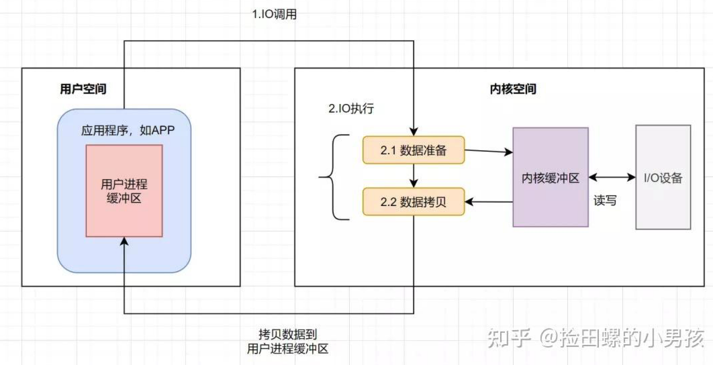

**二、具体举例**

传统的IO模式，主要包括 read 和 write 过程：

- read：把数据从磁盘读取到内核缓冲区，再拷贝到用户缓冲区
- write：先把数据写入到 socket缓冲区，最后写入网卡设备

**流程图如下**

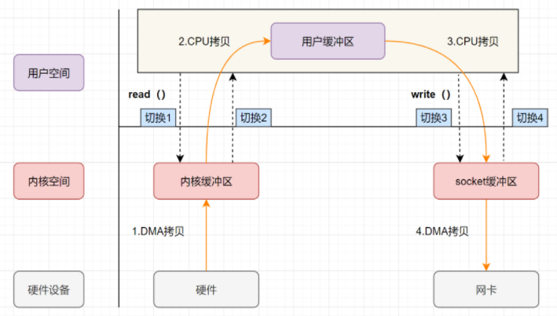

**流程**

1. 用户空间的应用程序通过read()函数，向操作系统发起IO调用，上下文从用户态到切换到内核态，然后再通过 DMA 控制器将数据从磁盘文件中读取到内核缓冲区
2. 接着CPU将内核空间缓冲区的数据拷贝到用户空间的数据缓冲区，然后read系统调用返回，而系统调用的返回又会导致上下文从内核态切换到用户态
3. 用户空间的应用程序通过write()函数向操作系统发起IO调用，上下文再次从用户态切换到内核态；接着CPU将数据从用户缓冲区复制到内核空间的 socket 缓冲区（也是内核缓冲区，只不过是给socket使用），然后write系统调用返回，再次触发上下文切换
4. 最后异步传输socket缓冲区的数据到网卡，也就是说write系统调用的返回并不保证数据被传输到网卡

​	**在传统的数据 IO 模式中，读取一个磁盘文件，并发送到远程端的服务，就共有四次用户空间与内核空间的上下文切换，四次数据复制，包括两次 CPU 数据复制，两次 DMA 数据复制**。但两次 CPU 数据复制才是最消耗资源和时间的，这个过程还需要内核态和用户态之间的来回切换，而CPU资源十分宝贵，要拷贝大量的数据，还要处理大量的任务，如果能把 CPU 的这两次拷贝给去除掉，既能节省CPU资源，还可以避免内核态和用户态之间的切换。而零拷贝技术就是为了解决这个问题。

> DMA（Direct Memory Access，直接内存访问）：DMA 本质上是一块主板上独立的芯片，允许外设设备直接与内存存储器进行数据传输，并且不需要CPU参与的技术

## 零拷贝

一、概述

​	零拷贝指在进行数据 IO 时，数据在用户态下经历了零次 CPU 拷贝，并非不拷贝数据。通过减少数据传输过程中 内核缓冲区和用户进程缓冲区 间不必要的CPU数据拷贝 与 用户态和内核态的上下文切换次数，降低 CPU 在这两方面的开销，释放 CPU 执行其他任务，更有效的利用系统资源，提高传输效率，同时还减少了内存的占用，也提升应用程序的性能。

​    由于零拷贝在内核空间中完成所有的内存拷贝，可以最大化使用 socket 缓冲区的可用空间，从而提高了一次系统调用中处理的数据量，进一步降低了上下文切换次数。零拷贝技术基于 PageCache，而 PageCache 缓存了最近访问过的数据，提升了访问缓存数据的性能，同时，为了解决机械磁盘寻址慢的问题，它还协助 IO 调度算法实现了 IO 合并与预读（这也是顺序读比随机读性能好的原因），这进一步提升了零拷贝的性能。

**二、Linux 中的零拷贝**

**1、mmap + write 实现的零拷贝**

​	在传统 IO 模式的4次内存拷贝中，与物理设备相关的2次拷贝（把磁盘数据拷贝到内存 以及 把数据从内存拷贝到网卡）是必不可少的。但与用户缓冲区相关的2次拷贝都不是必需的，如果内核在读取文件后，直接把内核缓冲区中的内容拷贝到 Socket 缓冲区，待到网卡发送完毕后，再通知进程，这样就可以减少一次 CPU 数据拷贝了。而**内存映射mmap**就是通过前面介绍的方式实现零拷贝的，它的**核心就是操作系统把内核缓冲区与应用程序共享，将一段用户空间内存映射到内核空间，当映射成功后，用户对这段内存区域的修改可以直接反映到内核空间；同样地，内核空间对这段区域的修改也直接反映用户空间。正因为有这样的映射关系, 就不需要在用户态与内核态之间拷贝数据**， 提高了数据传输的效率，这就是内存直接映射技术。具体示意图如下：

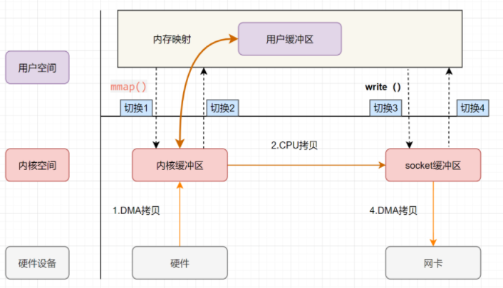

流程

1. 用户应用程序通过 mmap() 向操作系统发起 IO调用，上下文从用户态切换到内核态；然后通过 DMA 将数据从磁盘中复制到内核空间缓冲区
2. mmap 系统调用返回，上下文从内核态切换回用户态（这里不需要将数据从内核空间复制到用户空间，因为用户空间和内核空间共享了这个缓冲区）
3. 用户应用程序通过 write() 向操作系统发起 IO调用，上下文再次从用户态切换到内核态。接着 CPU 将数据从内核空间缓冲区复制到内核空间 socket 缓冲区；write 系统调用返回，导致内核空间到用户空间的上下文切换
4. DMA 异步将 socket 缓冲区中的数据拷贝到网卡

​	 **mmap 的零拷贝 I/O 进行了4次用户空间与内核空间的上下文切换，以及3次数据拷贝；其中3次数据拷贝中包括了2次 DMA 拷贝和1次 CPU 拷贝。**所以 mmap 通过内存地址映射的方式，节省了数据IO过程中的一次CPU数据拷贝以及一半的内存空间

**2、sendfile 实现的零拷贝**

​	只要我们的代码执行 read 或者 write 这样的系统调用，一定会发生 2 次上下文切换：首先从用户态切换到内核态，当内核执行完任务后，再切换回用户态交由进程代码执行。因此，如果想减少上下文切换次数，就一定要减少系统调用的次数，解决方案就是把 read、write 两次系统调用合并成一次，在内核中完成磁盘与网卡的数据交换。在 Linux 2.1 版本内核开始引入的 sendfile 就是通过这种方式来实现零拷贝的，具体流程图如下：

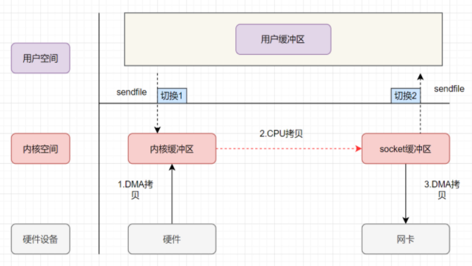

**流程**

* 用户应用程序发出 sendfile 系统调用，上下文从用户态切换到内核态；然后通过 DMA 控制器将数据从磁盘中复制到内核缓冲区中
* 然后CPU将数据从内核空间缓冲区复制到 socket 缓冲区
* sendfile 系统调用返回，上下文从内核态切换到用户态
* DMA 异步将内核空间 socket 缓冲区中的数据传递到网卡

​	**通过 sendfile 实现的零拷贝I/O使用了2次用户空间与内核空间的上下文切换，以及3次数据的拷贝。其中3次数据拷贝中包括了2次DMA拷贝和1次CPU拷贝。**那能不能将CPU拷贝的次数减少到0次呢？答案肯定是有的，那就是 带 DMA 收集拷贝功能的 sendfile

**3、带 DMA 收集拷贝功能的 sendfile 实现的零拷贝**

​	Linux 2.4 版本之后，对 sendfile 做了升级优化，引入了 SG-DMA技术，其实就是对DMA拷贝加入了 scatter/gather 操作，它可以直接从内核空间缓冲区中将数据读取到网卡，无需将内核空间缓冲区的数据再复制一份到 socket 缓冲区，从而省去了一次 CPU拷贝。具体流程如下

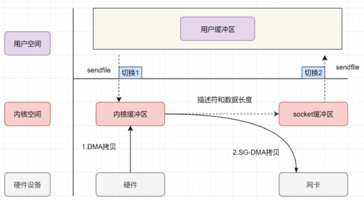

流程：

1. 用户应用程序发出 sendfile 系统调用，上下文从用户态切换到内核态；然后通过 DMA 控制器将数据从磁盘中复制到内核缓冲区中
2. 接下来**不需要CPU将数据复制到 socket 缓冲区，而是将相应的文件描述符信息复制到 socket 缓冲区，该描述符包含了两种的信息：①内核缓冲区的内存地址、②内核缓冲区的偏移量**
3. sendfile 系统调用返回，上下文从内核态切换到用户态
4. DMA 根据 socket 缓冲区中描述符提供的地址和偏移量直接将内核缓冲区中的数据复制到网卡

​	带有 DMA 收集拷贝功能的 sendfile 实现的 I/O 使用了2次用户空间与内核空间的上下文切换，以及2次数据的拷贝，而且这2次的数据拷贝都是非CPU拷贝，这样就实现了最理想的零拷贝I/O传输了，不需要任何一次的CPU拷贝，以及最少的上下文切换

> 备注：需要注意的是，零拷贝有一个缺点，就是不允许进程对文件内容作一些加工再发送，比如数据压缩后再发送。

## IO多路复用

**一、定义**

​	IO多路复用是一种同步 IO 模型，实现一个线程可以监视多个 I/O 操作（通常是文件描述符，如 socket）。一旦某个文件句柄就绪，就能够通知应用程序进行相应的读写操作；没有文件句柄就绪时会阻塞应用程序，交出 cpu。主要的IO多路复用机制有三种：`select`、`poll` 和 `epoll`。

**二、使用 IO 多路复用的流程**

1. **创建 socket 并绑定监听**：服务器创建一个 socket，绑定到一个端口，监听客户端连接。
2. **注册关注的事件**：将需要监控的 socket（可能是监听 socket 和已连接的客户端 socket）交给多路复用机制，告诉系统“我关心这些 socket 的可读或可写事件”。
3. **等待事件**：调用多路复用函数（如 select、poll 或 epoll_wait），阻塞等待，直到至少一个 socket 就绪。
4. **处理就绪事件**：函数返回后，程序根据返回的信息处理就绪的 socket（比如读取数据或接受新连接）。

**三、区别**

* select

  * 定义：通过位图（fd_set）管理需要监控的文件描述符集合（读、写、异常事件），每次调用需将整个集合从用户态拷贝到内核态 。内核通过遍历所有描述符判断是否就绪，就绪后再次将整个集合拷贝回用户态，用户需遍历所有描述符以确认哪些已就绪。
  * 缺点
    * 受限于 FD_SETSIZE（通常是 1024），即单个进程能监控的文件描述符数量有限。
    * 性能问题
      * 集合复制：每次调用 select 都需要从用户态复制集合到内核态，返回时再复制回来，开销较大。
      * 线性扫描：不能直接返回要处理的文件描述符，需要遍历判断,处理数量增加，性能下降

  * 优点
    * 跨平台支持好（Windows 和 Unix 系统都支持）。
    * 简单易用，适合少量连接的场景。

* poll：使用结构体数组（struct pollfd）替代位图，每个元素包含描述符和事件掩码，解决了select的FD数量限制问题。与select类似，仍需全量拷贝描述符到内核态，内核遍历检查就绪状态后返回用户态。

* epoll：用户态部分通过3个系统调用：epoll_create，epoll_ctl，epoll_wait和内核进行交互

  * 原理
    * 用户程序调用epoll_create函数后，会在内核创建struct eventpoll对象，同时会返回一个文件描述符给用户，该文件描述符用于查询进程文件表，找到对应的文件，再通过文件找到struct eventpoll对象
    * 用户程序通过epoll_ctl函数添加，修改，删除socket事件，注册成功的socket事件会插入红黑树。socket事件添加成功后，epoll才能监听socket读写事件
    * 如果epoll就绪队列有就绪事件，用户程序调用epoll_wait函数会成功获取到就绪事件。如果没有就绪事件，则epoll线程陷入休眠

  > 当socket接收到数据后，通过socket等待队列可以唤醒休眠的epoll线程，并将socket封装成epoll就绪事件插入就绪队列。此时epoll线程已经被唤醒，epoll线程可以将就绪事件拷贝至用户程序。

  * 原理图

  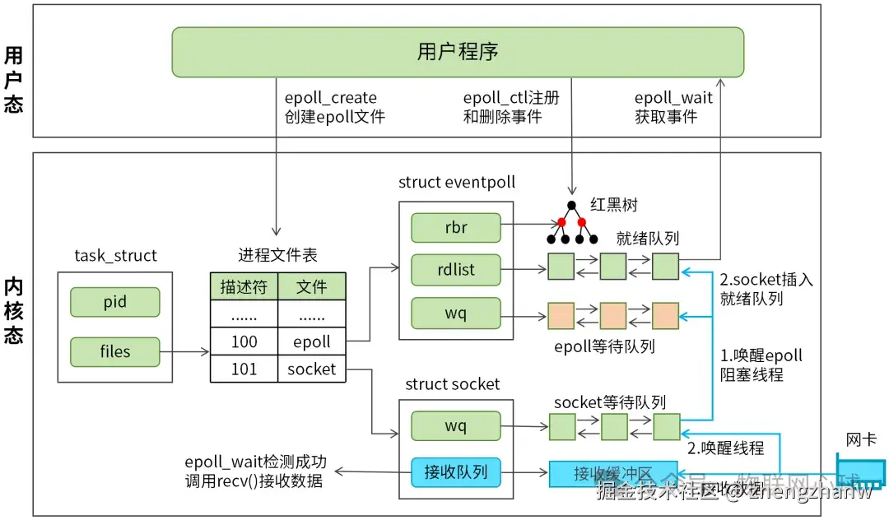

  * 工作模式
    * 边缘触发（Edge Triggered）：状态变化时通知一次，高效但要求一次性处理。
      * 读事件:如果epol_wait触发了读事件，表示有数据可读，如果程序没有把数据读完，再次调用epoll_wait的时候，将立即再次触发读事件。
      * 写事件:如果发送缓冲区没有满，表示可以写入数据，只要缓冲区没有被写满，再次调用epoll_wait的时候，将立即再次触发写事件。
    * 水平触发（Level Triggered）：状态满足条件时持续通知，简单但可能重复。**epoll 默认采用水平触发**
      * 读事件:epoll_wait触发读事件后，不管程序有没有处理读事件epoll_wait都不会再触发读事件，只有当新的数据到达时，才再次触发读事件。
      * 写事件: epoll_wait触发写事件之后，如果发送缓冲区仍可以写(发送缓冲区没有满)，epoll_wait不会再次触发写事件，只有当发送缓冲区由 满 变成 不满 时，才再次触发写事件。
        

  * 优点
    * 无连接限制
    * 性能高
      * 单次拷贝：fd 直接在内核态创建
      * 无需遍历：内核直接返回就绪的 fd
  * 缺点
    * 只有 linux支持

|            | select                                     | poll                                     | epoll                                             |
| ---------- | ------------------------------------------ | ---------------------------------------- | ------------------------------------------------- |
| 操作方式   | 阻塞+遍历                                  | 阻塞+遍历                                | 阻塞                                              |
| 底层实现   | 数组                                       | 链表                                     | 红黑树（增加删除文件节点）+链表(有变化的就绪链表) |
| I/O效率    | O(n) ,循环遍历找到有变化的                 | O(n) ,循环遍历找到有变化的               | 0(1)                                              |
| 最大连接数 | 1024 unix                                  | 无上限                                   | 无上限                                            |
| fd拷贝     | 每次调用select,fdset集合用户态拷贝到内核态 | 每次调用poll,fdset集合用户态拷贝到内核态 | 直接内核态创建                                    |

## Reactor 和Proactor

**一、Reactor**

​	高性能的网络设计模式。事实上，Reactor 模式也叫 `Dispatcher` 模式，我觉得这个名字更贴合该模式的含义，即 **I/O 多路复用监听事件，收到事件后，根据事件类型分配（Dispatch）给某个进程 / 线程**

**1、单 Reactor 单进程 / 线程**

​	一般来说，C 语言实现的是「单 Reactor 单进程」的方案，因为 C 语编写完的程序，运行后就是一个独立的进程，不需要在进程中再创建线程。

​	而 Java 语言实现的是「单 Reactor 单线程」的方案，因为 Java 程序是跑在 Java 虚拟机这个进程上面的，虚拟机中有很多线程，我们写的 Java 程序只是其中的一个线程而已。

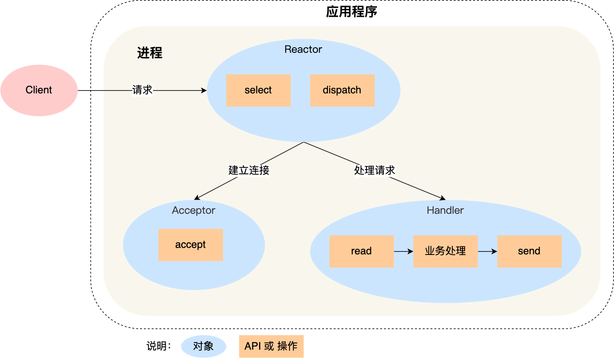

可以看到进程里有 **Reactor、Acceptor、Handler** 这三个对象：

- Reactor 对象的作用是监听和分发事件；
- Acceptor 对象的作用是获取连接；
- Handler 对象的作用是处理业务；

流程：

1. Reactor 对象通过 select （IO 多路复用接口） 监听事件，收到事件后通过 dispatch 进行分发，具体分发给 Acceptor 对象还是 Handler 对象，还要看收到的事件类型；
2. 如果是连接建立的事件，则交由 Acceptor 对象进行处理，Acceptor 对象会通过 accept 方法 获取连接，并创建一个 Handler 对象来处理后续的响应事件；
3. 如果不是连接建立事件， 则交由当前连接对应的 Handler 对象来进行响应；
4. Handler 对象通过 read -> 业务处理 -> send 的流程来完成完整的业务流程。

缺点

- 第一个缺点，因为只有一个进程，**无法充分利用 多核 CPU 的性能**；
- 第二个缺点，Handler 对象在业务处理时，整个进程是无法处理其他连接的事件的，**如果业务处理耗时比较长，那么就造成响应的延迟**；

使用场景

* 不适用 cpu密集型的场景，只适用于业务处理非常快速的场景

* Redis 是由 C 语言实现的，它采用的正是「单 Reactor 单进程」的方案，因为 Redis 业务处理主要是在内存中完成，操作的速度是很快的，性能瓶颈不在 CPU 上，所以 Redis 对于命令的处理是单进程的方案

**2、单 Reactor 多线程 / 多进程**

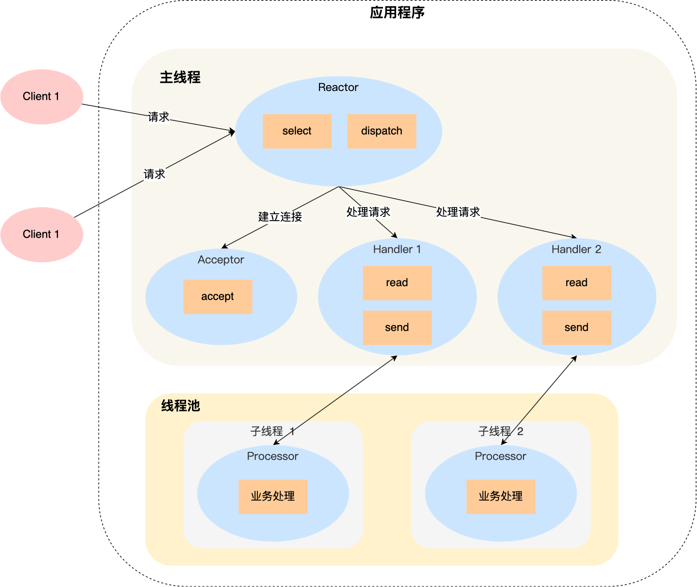

详细说一下这个方案：

* Reactor 对象通过 select （IO 多路复用接口） 监听事件，收到事件后通过 dispatch 进行分发，具体分发给 Acceptor 对象还是 Handler 对象，还要看收到的事件类型；
* 如果是连接建立的事件，则交由 Acceptor 对象进行处理，Acceptor 对象会通过 accept 方法 获取连接，并创建一个 Handler 对象来处理后续的响应事件；
* 如果不是连接建立事件， 则交由当前连接对应的 Handler 对象来进行响应；

​	上面的三个步骤和单 Reactor 单线程方案是一样的，接下来的步骤就开始不一样了：

* Handler 对象不再负责业务处理，只负责数据的接收和发送，Handler 对象通过 read 读取到数据后，会将数据发给子线程里的 Processor 对象进行业务处理；
* 子线程里的 Processor 对象就进行业务处理，处理完后，将结果发给主线程中的 Handler 对象，接着由 Handler 通过 send 方法将响应结果发送给 client；

缺点：因为一个 Reactor 对象承担所有事件的监听和响应，而且只在主线程中运行，在面对瞬间高并发的场景时，容易成为性能的瓶颈的地方

**3、多 Reactor 多进程 / 线程**

多 Reactor 多进程 / 线程方案的示意图如下（以线程为例）：

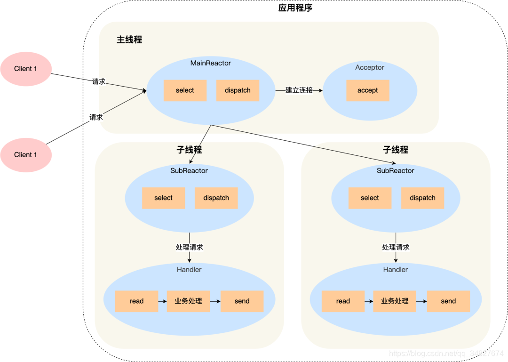

方案详细说明如下：

* 主线程中的 MainReactor 对象通过 select 监控连接建立事件，收到事件后通过 Acceptor 对象中的 accept 获取连接，将新的连接分配给某个子线程；
* 子线程中的 SubReactor 对象将 MainReactor 对象分配的连接加入 select 继续进行监听，并创建一个 Handler 用于处理连接的响应事件。
* 如果有新的事件发生时，SubReactor 对象会调用当前连接对应的 Handler 对象来进行响应。
* Handler 对象通过 read -> 业务处理 -> send 的流程来完成完整的业务流程。

多 Reactor 多线程的方案虽然看起来复杂的，但是实际实现时比单 Reactor 多线程的方案要简单的多，原因如下：

* 主线程和子线程分工明确，主线程只负责接收新连接，子线程负责完成后续的业务处理。

* 主线程和子线程的交互很简单，主线程只需要把新连接传给子线程，子线程无须返回数据，直接就可以在子线程将处理结果发送给客户端。
  

大名鼎鼎的两个开源软件 Netty 和 Memcache 都采用了「多 Reactor 多线程」的方案。

采用了「多 Reactor 多进程」方案的开源软件是 Nginx，不过方案与标准的多 Reactor 多进程有些差异。

**二、Proactor**

* Proactor 采用了异步 I/O 技术，所以被称为异步网络模型

* 可惜的是，在 Linux 下的异步 I/O 是不完善的，aio 系列函数是由 POSIX 定义的异步操作接口，不是真正的操作系统级别支持的，而是在用户空间模拟出来的异步，并且仅仅支持基于本地文件的 aio 异步操作，网络编程中的 socket 是不支持的，这也使得基于 Linux 的高性能网络程序都是使用 Reactor 方案
  

## 用户态和内核态

**一、概述**

​	用户态(User Mode)和内核态(Kernel Mode)是操作系统中的两种运行模式，用于区分应用程序与操作系统内核的操作权限。两者的区别在于权限级别：

* 用户态：应用程序在用户态下运行，权限较低，不能直接访问硬件或进行特权操作。应用程序需要通过系统调用与内核进行通信，由内核代为执行敏感操作。用户态的优势是安全性高，即使程序出现问题也不会影响操作系统的稳定性。
* 内核态：内核态是操作系统内核运行的模式，具有最高的权限，可以直接访问硬件资源和执行各种特权操作（如内存管理、进程调度）。当程序执行**系统调用**或**硬件中断**时，操作系统会将其切换到内核态。

**二、设计内核态和用户态的原因**

* 安全性：用户态和内核态的划分确保了普通应用程序无法直接访问硬件资源或执行敏感操作，避免了程序或用户恶意操作对系统核心的破坏。例如，防止应用程序随意读写内存或控制硬件设备，保护了操作系统和其他应用的安全。
* 稳定性：通过在内核态中运行关键系统服务(如内存管理、文件系统、设备驱动等)，操作系统可以对资源进行集中管理和保护。如果某个应用程序崩溃，只会影响用户态中的进程，不会影响到整个系统。
* 访问控制：通过设置不同的权限级别，操作系统能够更好地控制对资源的访问。只有在内核态下，操作系统才有权对硬件资源进行操作，而用户态程序必须通过系统调用请求内核服务，这种设计确保了对系统资源的统一管理。
* 性能优化：虽然用户态和内核态的切换有一定开销，但这种设计可以减少用户程序直接操作硬件带来的复杂性，避免频繁的资源争夺和死锁问题，从而提升系统的整体性能。

## 进程调度算法

进程调度算法也称 CPU 调度算法，毕竟进程是由 CPU 调度的。当 CPU 空闲时，操作系统就选择内存中的某个「就绪状态」的进程，并给其分配 CPU。

常见的进程调度算法有以下几种：

* 先来先服务(FCFS,First-Come,First-Served)
  * 每次从就绪队列选择最先进入队列的进程，然后一直运行，直到进程退出或被阻塞，才会继续从队列中选择第一个进程接着运行。
  * FCFS对长作业有利，适用于 CPU 繁忙型作业的系统，而不适用于IO 繁忙型作业的系统。

* 短作业优先(SF,Shortest Job First)：优先调度执行时间最短的进程，能减少平均等待时间。
* 优先级调度(Priority Scheduling)：
  * 根据进程的重要性（优先级）来调度，优先级高的进程先执行。适用于需要不同优先级服务的场景。可能导致“低优先级进程”长期得不到调度，造成饥饿现象。
  * 该算法也有两种处理优先级高的方法，非抢占式和抢占式
    * 非抢占式：当就绪队列中出现优先级高的进程，运行完当前进程，再选择优先级高的进程。
    * 抢占式：当就绪队列中出现优先级高的进程，当前进程挂起，调度优先级高的进程运行。

* 时间片轮转(RR,Round Robir)：为每个进程分配固定的时间片，时间片结束后调度下一个进程。适用于交互式系统，能提升系统响应性。时间片的选择对系统性能有重要影响。
* 最高响应比优先(HRRN,Highest Response Ratio Next):通过计算响应比来决定下一个被调度的进程，适合在批处理环境中平衡长短任务的等待时间，防止短任务过多导致长任务饥饿。
* 多级反馈队列调度（Multilevel Feedback Queue）
  * 多级反馈队列 调度算法是「时间片轮转算法」和「最高优先级算法」的综合和发展。
  * 工作流程
    * 设置了多个队列，赋予每个队列不同的优先级，每个队列优先级从高到低，同时优先级越高时间片越短；
    * 新的进程会被放入到第一级队列的末尾，按先来先服务的原则排队等待被调度，如果在第一级队列规定的时间片没运行完成，则将其转入到第二级队列的末尾，以此类推，直至完成；
    * 当较高优先级的队列为空，才调度较低优先级的队列中的进程运行。如果进程运行时，有新进程进入较高优先级的队列，则停止当前运行的进程并将其移入到原队列末尾，接着让较高优先级的进程运行；

  * 总结：可以发现，对于短作业可能可以在第一级队列很快被处理完。对于长作业，如果在第一级队列处理不完，可以移入下次队列等待被执行，虽然等待的时间变长了，但是运行时间也会更长了，所以该算法很好的兼顾了长短作业，同时有较好的响应时间。

## 内存页面置换算法

**一、页中断**

在了解内存页面置换算法前，我们得先谈一下缺页异常（缺页中断）。
当CPU 访问的页面不在物理内存时，便会产生一个缺页中断，请求操作系统将所缺页调入到物理内存。
那它与一般中断的主要区别在于：

* 缺页中断在指令执行「期间」产生和处理中断信号，而一般中断在一条指令执行「完成」后检查和处理
  中断信号。
* 缺页中断返回到该指令的开始重新执行「该指令」，而一般中断返回回到该指令的「下一个指令」执
  行。
  我们来看一下缺页中断的处理流程，如下图：

​	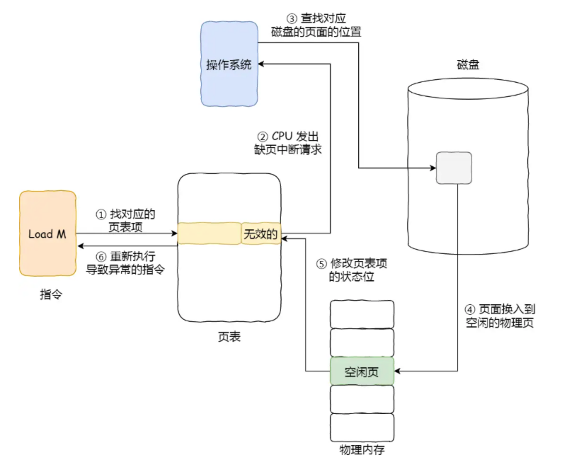

**总体流程**

1. 在 CPU 里访问一条 Load M 指令，然后 CPU 会去找 M 所对应的页表项。
2. 如果该页表项的状态位是「有效的」，那 CPU 就可以直接去访问物理内存了，如果状态位是「无效的」，则 CPU 则会发送缺页中断请求。
3. 操作系统收到了缺页中断，则会执行缺页中断处理函数，先会查找该页面在磁盘中的页面的位置。
4. 找到磁盘中对应的页面后，需要把该页面换入到物理内存中，但是在换入前，需要在物理内存中找空闲页，如果找到空闲页，就把页面换入到物理内存中。找不到空闲页的话，就说明此时内存已满了，这时候，就需要「页面置换算法」选择一个物理页，如果该物理页有被修改过（脏页），则把它换出到磁盘，然后把该被置换出去的页表项的状态改成「无效的」，最后把正在访问的页面装入到这个物理页中。
5. 页面从磁盘换入到物理内存完成后，则把页表项中的状态位修改为「有效的」。
6. 最后，CPU 重新执行导致缺页异常的指令。

**虚拟内存管理的整个流程**

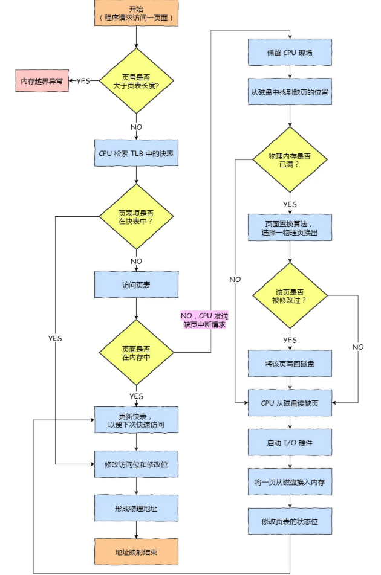

二、页面置换算法

*  OPT（Optimal，最优置换算法）
  * 原理：置换未来最长时间内不会被访问的页面。这是理论上的最优算法，因为它假设操作系统能预知未来的页面访问序列。
  * 优点：理论上缺页次数最少，是评判其他算法的基准
  * 缺点：需要预测未来页面访问顺序，现实中无法实现
* FIFO（First-In, First-Out，先入先出）
  * 原理：按照页面进入内存的顺序进行置换，最早进入内存的页面最先被替换出去
  * 实现：用一个队列记录页面进入的顺序，置换时移除队列头部页面
  * 缺点：不考虑页面使用频率，可能替换掉仍会频繁使用的页面
* LRU（Least Recently Used，最近最少使用）
  * 原理：置换最近最少使用的页面，认为最近没用过的页面未来也不太可能被使用
  * 实现：可以用一个栈或时间戳记录页面最近访问时间，置换时移除最久未使用的页面
  * 优点：接近最优算法，基于“局部性原理”（最近用过的页面未来可能还会被用）
  * 缺点：实现较复杂，需要记录每个页面的使用时间或顺序（硬件支持如计数器，或软件维护栈）
  * 适用场景：广泛应用于现代操作系统，是实际中最常用的算法之一

* LFU（Least Frequently Used，最不经常使用）

  * 原理：置换使用频率最低的页面，认为使用少的页面未来需求也低
  * 实现：为每个页面维护一个计数器，记录访问次数，置换时移除计数最低的页面

  

## 磁盘调度算法

​	磁盘访问：因为每个磁盘片都对应一个磁头，所以性能的关键就在于找行和列，即寻道和磁盘旋转。寻道即通过磁头找到数据所在的磁道，相当于换行到数据所在行。磁头只能沿径向移动以切换磁道，无法沿磁道圆周方向移动。因此，在定位到目标磁道后，硬盘靠盘片的高速旋转将目标扇区对准磁头

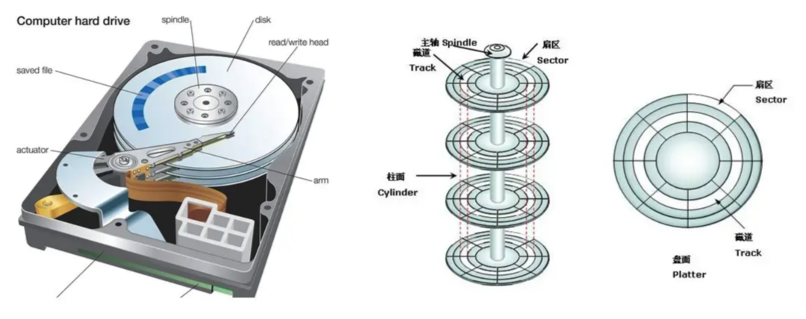

* 磁盘调度算法
  * 先来先服务（*First-Come，First-Served，FCFS*）
  * 最短寻道时间优先（Shortest Seek First,SSF）
    * 算法的工作方式是，优先选择从当前磁头位置所需寻道时间最短的请求
    * 缺点：容易产生饥饿，因为磁头可能在一小块区域内来回移动
  * 扫描算法（Scan）
    * 磁头**在一个方向上**移动，访问所有未完成的请求，直到磁头到达该方向上的最后的磁道，才调换方向。磁头先响应左边的请求，直到到达最左端（0磁道）后，才开始反向移动，响应右边的请求。
    * 扫描调度算法性能较好，不会产生饥饿现象，但是存在这样的问题，中间部分的磁道会比较占便宜，中间部分相比其他部分响应的频率会比较多，也就是说每个磁道的响应频率存在差异。
  * 循环扫描（Circular Scan,CSCAN）规定：只有磁头朝某个特定方向移动时，才处理磁道访问请求，而返
    回时直接快速移动至最靠边缘的磁道，也就是复位磁头，这个过程是很快的，**并且返回中途不处理任何请**
    **求**，该算法的特点，就是磁道只响应一个方向上的请求。
  * LOOK与 C-LOOK 算法：我们前面说到的扫描算法和循环扫描算法，都是磁头移动到磁盘「最始端或最末端」才开始调换方向。那这其实是可以优化的，优化的思路就是磁头在移动到「最远的请求」位置，然后立即反向移动。
    * 那针对 SCAN算法的优化则叫 LOOK算法，它的工作方式，磁头在每个方向上仅仅移动到最远的请求位置，然后立即反向移动，而不需要移动到磁盘的最始端或最末端，反向移动的途中会响应请求。
    * 而针 C-SCAN 算法的优化则叫C-LOOK，它的工作方式，磁头在每个方向上仅仅移动到最远的请求位
      置，然后立即反向移动，而不需要移动到磁盘的最始端或最末端，反向移动的途中不会响应请求。

## 僵尸进程和孤儿进程

**一、僵尸进程**

* 定义：僵尸进程是指一个已经执行完任务并终止的子进程，但它的父进程还没有回收它的资源（比如进程控制块 PCB 中的退出状态）。在操作系统中，当一个进程结束时，它不会立刻从系统中完全消失，而是会进入一种“僵尸状态”，等待父进程通过 wait() 或 waitpid() 系统调用来读取它的退出状态，完成清理工作。
* 危害：
  * 一个父进程如果创建了很多的子进程，就是不回收，会造成内存资源的浪费，因为 PCB 对象本身就要占用内存。
  * 造成内存泄漏。
* 解决办法
  * 父进程要负起责任，及时调用 wait() 或 waitpid() 来清理子进程。
  * fork() 两次：第一次fork的子进程在fork完成后直接退出，这样第二次fork得到的子进程就没有爸爸了，它会自动被老祖宗 init 进程收养，init会负责释放它的资源，这样就不会有"僵尸”产生了。
    * 父进程创建子进程 A。
    * 子进程 A 创建孙进程 B，然后退出。
    * 父进程用 wait() 清理子进程 A。
    * 孙进程 B 的父进程（子进程 A）已死，它被 init 收养（PPID 变成 1）。
    * 孙进程 B 结束后，init 自动清理，不会产生僵尸。
* 查看：ps aux | grep 'Z'

**二、孤儿进程**

* 定义：孤儿进程是指父进程在子进程结束之前就先挂掉了（比如崩溃或主动退出），导致子进程没了“爹”。在这种情况下，操作系统会把这些“孤儿”交给一个特殊的进程来收养，通常是 init 进程（Linux 系统中 PID 为 1 的进程），或者其他类似的系统进程。
* 危害：一般没啥大问题，因为有 init 兜底

## 大端序和小端序

**一、大端序**

* 定义：高位字节（最有意义的字节，Most Significant Byte，MSB）存储在较低的内存地址，低位字节（最不重要的字节，Least Significant Byte，LSB）存储在较高的内存地址。简单来说，就是“从左到右”按人类习惯的顺序存储。
* 优点：符合人类阅读习惯（从高位到低位），在调试和网络传输中更直观。
* 缺点：对某些计算（如加法）不够高效，因为需要从高地址读取低位字节。
* 适用场景
  * 网络协议：许多网络协议（如TCP/IP）使用大端序来传输数据，这被称为“网络字节顺序”。
    * 跨平台一致性：统一字节序避免了不同架构间的解析错误。
    * 历史惯例：早期大端序系统的影响和 TCP/IP 设计的延续。
    * 直观性：符合人类阅读习惯，便于协议设计和调试。

**二、小端序**

* 定义：低位字节存储在较低的内存地址，高位字节存储在较高的内存地址。顺序与大端序相反，像是“从右到左”存储。

* 优点：便于硬件实现数学运算，低位字节在低地址，计算时可以直接从最低地址开始处理。

* 缺点：调试时不够直观，需要逆向理解字节顺序。

* 适用场景

  * 高效计算：小端序的设计允许 CPU 更容易地进行多字节数据的加法、乘法等操作，因为它可以在处理高位时继续进行低位的计算

  * 主流处理器架构：x86 和 x86-64 架构（Intel、AMD处理器）使用小端序，几乎覆盖了所有现代个人电脑和服务器。

    

## 一致性哈希算法

* 普通哈希算法

  * 缺点：如果节点数量发生了变化，也就是在对系统做扩容或者缩容时，必须迁移改变了映射关系的数据，否则会出现查询不到数据的问题。比如节点的数量从3变化为 4时，要基于新的计算公式 hash（key）％4，重新对数据和节点做映射。

  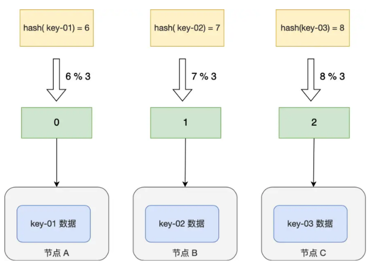

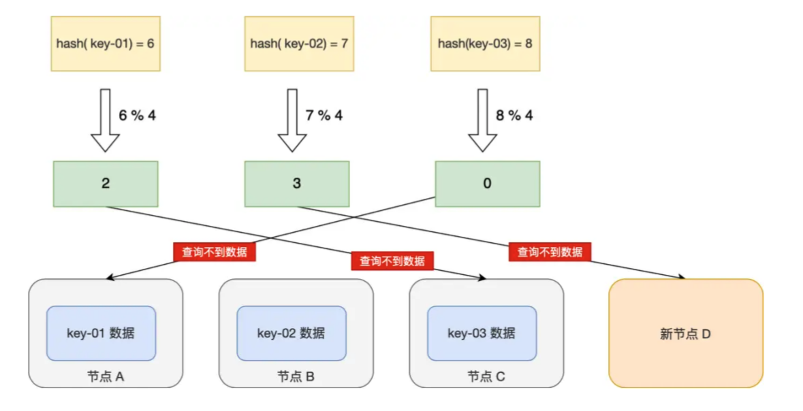

* 一致性哈希算法：也是使用取模的方法，但是取模算法是对服务器的数量进行取模，而一致性哈希算法是对 2^32 取模，具体步骤如下：
  * 步骤一：一致性哈希算法将整个哈希值空间按照顺时针方向组织成一个虚拟的圆环，称为 Hash 环；
  * 步骤二：接着将各个服务器使用 Hash 函数进行哈希，具体可以选择服务器的IP或主机名作为关键字进行哈希，从而确定每台机器在哈希环上的位置
  * 步骤三：最后使用算法定位数据访问到相应服务器：将数据key使用相同的函数Hash计算出哈希值，并确定此数据在环上的位置，从此位置沿环顺时针寻找，第一台遇到的服务器就是其应该定位到的服务器
    
