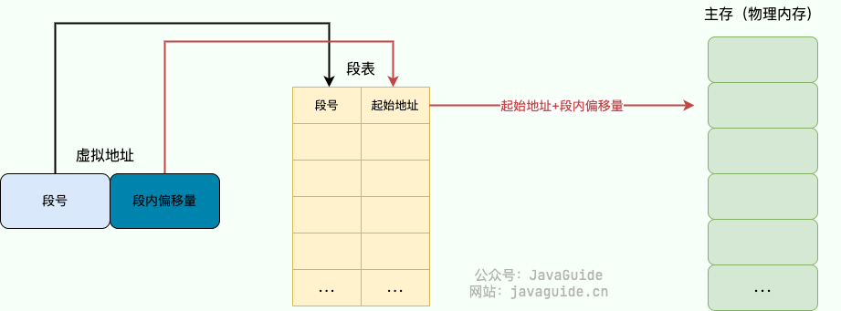

## Linux启动流程

* BIOS 引导阶段
  * 计算机通电后，首先由 BIOS（基本输入输出系统）或 UEFI（统一可扩展固件接口）进行初始化。它们负责进行硬件自检，检查硬件是否正常工作，如 CPU、内存、硬盘等设备是否存在故障。
  * 接着，会根据预设的启动顺序，查找可启动设备，如硬盘、光盘、U 盘等，找到后将其第一个扇区（MBR）加载到内存的特定位置，如 0x7c00 ，并将控制权交给该扇区中的引导程序（如GRUB程序）
  *  MBR 位于硬盘的第一个扇区（512 字节），其中包含了一小段引导代码（446 字节）和分区表信息（64 字节）。这段引导代码就是最开始的引导加载程序，它的主要任务是找到并加载真正的操作系统引导程序，如 GRUB（GRand Unified Bootloader）
* 引导加载阶段：加载 Linux 内核并传递控制权
  * 常见引导程序：GRUB（Grand Unified Bootloader）是最流行的，其他还有 LILO、Syslinux
  * 过程（以 GRUB 为例）
    * 加载第一阶段（GRUB Stage 1）：MBR（512 字节）中的小型代码加载，负责找到并加载下一阶段。
    * 加载第二阶段（GRUB Stage 2）则负责加载内核及相关文件，它会先把系统切换到保护模式，设置好 C 语言运行环境，然后查找配置文件，根据配置文件中的信息找到内核镜像和初始内存盘镜像，并将它们加载到内存中.
* 内核初始化阶段：内核接管系统，初始化硬件并准备用户空间
  * 内核镜像被加载到内存后，系统会对其进行解压缩操作，并开始执行内核的初始化代码（后面详细过程） 。内核初始化过程中会进行一系列的操作，如检测硬件设备、初始化内存管理、建立进程调度等，为系统的运行建立基本的环境。
  * 内核还会加载必要的驱动程序，以使硬件设备能够正常工作，比如硬盘控制器驱动、网络适配器驱动等

* 系统服务启动阶段：初始化用户环境，启动服务，最终提供登录界面
  * 内核初始化完成后，会启动系统的第一个进程，通常是 init 进程。在不同的 Linux 发行版中，init 进程可能会有所不同，如 SysVinit、Upstart、Systemd 等.
  * 以 Systemd 为例，它会按照配置文件中的顺序，启动各个系统服务和守护进程，如网络服务、文件系统服务、打印服务等，这些服务的启动顺序和依赖关系在配置文件中有明确的定义
* 用户登录阶段
  * 系统服务启动完成后，会显示登录界面，等待用户输入用户名和密码进行登录
  * 用户登录后，系统会根据用户的权限和配置文件，为用户启动相应的环境和应用程序，如 shell 环境、桌面环境等，用户就可以开始使用系统了

## 进程、线程和协程

| 特性         | 进程                 | 线程              | 协程               |
| ------------ | -------------------- | ----------------- | ------------------ |
| **管理层级** | 操作系统内核         | 操作系统内核      | 用户态（程序控制） |
| **资源**     | 独立内存和资源       | 共享进程内存      | 共享线程资源       |
| **切换开销** | 高（完整上下文切换） | 中（寄存器切换）  | 低（栈切换）       |
| **调度方式** | 抢占式（OS 控制）    | 抢占式（OS 控制） | 协作式（程序控制） |
| **隔离性**   | 强（进程间独立）     | 弱（线程间共享）  | 无（同一线程内）   |
| **并发模型** | 多进程并行           | 多线程并行        | 单线程内并发       |
| **典型应用** | 多任务隔离           | 多任务共享数据    | 高并发 I/O 处理    |

协程通常由编程语言的运行时或库提供：

- Python：asyncio 和 async/await。
- Go：goroutine（内置协程，底层基于线程池）。
- Lua：coroutine 模块。

协程的特点在于是一个线程执行，那和多线程比，协程有何优势？

* 极高的执行效率：因为子程序切换不是线程切换，而是由程序自身控制，因此，没有线程切换的开销，和多线程比，线程数量越多，协程的性能优势就越明显；

* 不需要多线程的锁机制：因为只有一个线程，也不存在同时写变量冲突，在协程中控制共享资源不加锁，只需要判断状态就好了，所以执行效率比多线程高很多
  

## 讲一下页表

## IO多路复用

**一、定义**

​	IO多路复用是一种同步 IO 模型，实现一个线程可以监视多个文件句柄。一旦某个文件句柄就绪，就能够通知应用程序进行相应的读写操作；没有文件句柄就绪时会阻塞应用程序，交出 cpu。主要的IO多路复用机制有三种：`select`、`poll` 和 `epoll`。

​	文件描述符可以代表多种不同类型的 IO 资源，包括：

* **网络套接字 (TCP/UDP)**：最常见的场景是监听多个 TCP 连接，特别是服务器端需要同时处理多个客户端的请求时。
* **文件**：文件描述符可以是打开的文件，IO 多路复用也可以用于监控文件的读写状态。
* **管道 (Pipe)**：进程间通信（IPC）中的管道可以通过文件描述符进行操作，IO 多路复用可以用来监视管道是否有数据可读或可写。
* **设备文件**：某些硬件设备，比如串口、键盘、显示器等也可以被操作系统抽象为文件描述符，可以通过 IO 多路复用监听这些设备的状态。
* **标准输入/输出**：比如监视标准输入 (`stdin`)，判断何时有用户输入的数据

**二、使用 IO 多路复用的流程**

1. **等待 IO 事件发生**：调用 `select()`，程序在此阻塞，直到有一个或多个连接变得可读或可写。
2. **处理 IO 事件**：`select()` 返回后，应用程序知道哪个连接可读，然后调用 `read()` 函数去读取数据，这个读操作是同步的，可能会阻塞，直到有数据可读取。
3. **继续监听**：处理完当前连接的 IO 事件后，再次调用 `select()`，继续等待下一个事件发生。

整个过程中，**程序会因为等待事件和执行 IO 操作而阻塞**，体现了同步的特性。

**使用异步 IO 的流程**

1. **发出异步 IO 请求**：程序请求读取某个连接的数据，并立即返回，而不是阻塞等待数据准备好。
2. **等待 IO 完成**：操作系统在后台完成 IO 操作，当数据准备好之后，通过回调函数或信号通知应用程序。
3. **处理数据**：程序接收到通知后，处理已经读到的数据。

**三、区别**

100 万个连接，里面有 1 万个连接是活跃，可以对比 select、poll、epoll 的性能表现：

* select：不修改宏定义默认是 1024，则需要100w/1024=977个进程才可以支持 100 万连接，会使得 CPU 性能特别的差。
  * select 会阻塞住监视 3 类文件描述符，等有数据、可读、可写、出异常或超时就会返回；返回后通过遍历 fdset 整个数组来找到就绪的描述符 fd，然后进行对应的 IO 操作。遍历文件描述符是指检查哪些文件描述符（如套接字、管道等）处于就绪状态，从而可以执行相应的读、写或其他操作

* poll：没有最大文件描述符限制，100 万个链接则需要 100 万个 fd，遍历都响应不过来了，还有空间的拷贝消耗大量的资源。
* epoll：请求进来时就创建 fd 并绑定一个 callback，只需要遍历 1 万个活跃连接的 callback 即可，既高效又不用内存拷贝。

>`epoll`的行为
>
>- 当你调用 **`epoll_wait()`** 时，如果没有任何文件描述符就绪，那么程序会**阻塞**在这个函数上，直到有一个或多个文件描述符变得可读、可写或有其他你所关心的事件发生。
>
>- 当有事件发生时，**`epoll_wait()`** 会立即返回，**并且直接告诉你哪些文件描述符已经就绪**。
>
>- 返回的就绪文件描述符被保存在一个数组中，你只需遍历这个数组来处理这些就绪的文件描述符。
>
> 例如，`epoll_wait()` 会返回一个已经就绪的文件描述符列表，你不需要再像 `select` 那样对整个集合进行遍历检查，只需要遍历那些**已经被通知为就绪的文件描述符**。
>
>`select` 和 `poll` 的行为
>
>- 当你调用 **`select()`** 或 **`poll()`** 时，同样，如果没有事件发生，程序会阻塞在这些调用上，直到有文件描述符状态发生变化。
>- 当它们返回时，**并不会直接告诉你具体哪些文件描述符已经就绪**，而是返回一个包含所有文件描述符状态的集合（对于 `select` 是一个 `fd_set`，对于 `poll` 是一个 `pollfd` 数组）。
>- 之后，应用程序需要**自己遍历整个集合**，检查每个文件描述符的状态，以确定哪些文件描述符是就绪的。

## 用户态和内核态

**一、概述**

​	用户态(User Mode)和内核态(Kernel Mode)是操作系统中的两种运行模式，用于区分应用程序与操作系统内核的操作权限。两者的区别在于权限级别：

* 用户态：应用程序在用户态下运行，权限较低，不能直接访问硬件或进行特权操作。应用程序需要通过系统调用与内核进行通信，由内核代为执行敏感操作。用户态的优势是安全性高，即使程序出现问题也不会影响操作系统的稳定性。
* 内核态：内核态是操作系统内核运行的模式，具有最高的权限，可以直接访问硬件资源和执行各种特权操作（如内存管理、进程调度）。当程序执行**系统调用**或**硬件中断**时，操作系统会将其切换到内核态。

**二、设计内核态和用户态的原因**

* 安全性：用户态和内核态的划分确保了普通应用程序无法直接访问硬件资源或执行敏感操作，避免了程序或用户恶意操作对系统核心的破坏。例如，防止应用程序随意读写内存或控制硬件设备，保护了操作系统和其他应用的安全。
* 稳定性：通过在内核态中运行关键系统服务(如内存管理、文件系统、设备驱动等)，操作系统可以对资源进行集中管理和保护。如果某个应用程序崩溃，只会影响用户态中的进程，不会影响到整个系统。
* 访问控制：通过设置不同的权限级别，操作系统能够更好地控制对资源的访问。只有在内核态下，操作系统才有权对硬件资源进行操作，而用户态程序必须通过系统调用请求内核服务，这种设计确保了对系统资源的统一管理。
* 性能优化：虽然用户态和内核态的切换有一定开销，但这种设计可以减少用户程序直接操作硬件带来的复杂性，避免频繁的资源争夺和死锁问题，从而提升系统的整体性能。

## 进程调度算法

常见的进程调度算法有以下几种：

* 先来先服务(FCFS,First-Come,First-Served):按照进程到达的顺序进行调度，适用于批处理系统。简单易实现，但可能造成“长任务”拖延其他任务的执行。
* 短作业优先(SF,Shortest Job First):优先调度执行时间最短的进程，能减少平均等待时间。分为非抢占式和抢占式（SRTF,Shortest Remaining Time First)。但它需要预先知道任务执行时间，不适用于交互式系统。
* 优先级调度(Priority Scheduling)：根据进程的重要性（优先级）来调度，优先级高的进程先执行。适用于需要不同优先级服务的场景。可能导致“低优先级进程”长期得不到调度，造成饥饿现象。
* 时间片轮转(RR,Round Robir)：为每个进程分配固定的时间片，时间片结束后调度下一个进程。适用于交互式系统，能提升系统响应性。时间片的选择对系统性能有重要影响。
* 最高响应t比优先(HRRN,Highest Response Ratio Next):通过计算响应比来决定下一个被调度的进程，适合在批处理环境中平衡长短任务的等待时间，防止短任务过多导致长任务饥饿。
* 多级反馈队列调度(MLFQ,Multilevel Feedback Queue):结合多个调度策略，通过将进程放入不同优先级的队列，实现灵活的调度机制。优先级较高的进程先被调度，随着执行时间增加，进程可能被降至低优先级队列。适合多任务、多类型的操作系统。

## 僵尸进程和孤儿进程

**一、僵尸进程**

* 定义：僵尸进程是指一个已经执行完任务并终止的子进程，但它的父进程还没有回收它的资源（比如进程控制块 PCB 中的退出状态）。在操作系统中，当一个进程结束时，它不会立刻从系统中完全消失，而是会进入一种“僵尸状态”，等待父进程通过 wait() 或 waitpid() 系统调用来读取它的退出状态，完成清理工作。
* 危害：
  * 一个父进程如果创建了很多的子进程，就是不回收，会造成内存资源的浪费，因为 PCB 对象本身就要占用内存。
  * 造成内存泄漏。
* 解决办法
  * 父进程要负起责任，及时调用 wait() 或 waitpid() 来清理子进程。
  * fork() 两次：第一次fork的子进程在fork完成后直接退出，这样第二次fork得到的子进程就没有爸爸了，它会自动被老祖宗 init 进程收养，init会负责释放它的资源，这样就不会有"僵尸”产生了。
    * 父进程创建子进程 A。
    * 子进程 A 创建孙进程 B，然后退出。
    * 父进程用 wait() 清理子进程 A。
    * 孙进程 B 的父进程（子进程 A）已死，它被 init 收养（PPID 变成 1）。
    * 孙进程 B 结束后，init 自动清理，不会产生僵尸。
* 查看：ps aux | grep 'Z'

**二、孤儿进程**

* 定义：孤儿进程是指父进程在子进程结束之前就先挂掉了（比如崩溃或主动退出），导致子进程没了“爹”。在这种情况下，操作系统会把这些“孤儿”交给一个特殊的进程来收养，通常是 init 进程（Linux 系统中 PID 为 1 的进程），或者其他类似的系统进程。
* 危害：一般没啥大问题，因为有 init 兜底

## 大端序和小端序

**一、大端序**

* 定义：高位字节（最有意义的字节，Most Significant Byte，MSB）存储在较低的内存地址，低位字节（最不重要的字节，Least Significant Byte，LSB）存储在较高的内存地址。简单来说，就是“从左到右”按人类习惯的顺序存储。
* 优点：符合人类阅读习惯（从高位到低位），在调试和网络传输中更直观。
* 缺点：对某些计算（如加法）不够高效，因为需要从高地址读取低位字节。
* 适用场景
  * 网络协议：许多网络协议（如TCP/IP）使用大端序来传输数据，这被称为“网络字节顺序”。
    * 跨平台一致性：统一字节序避免了不同架构间的解析错误。
    * 历史惯例：早期大端序系统的影响和 TCP/IP 设计的延续。
    * 直观性：符合人类阅读习惯，便于协议设计和调试。

**二、小端序**

* 定义：低位字节存储在较低的内存地址，高位字节存储在较高的内存地址。顺序与大端序相反，像是“从右到左”存储。

* 优点：便于硬件实现数学运算，低位字节在低地址，计算时可以直接从最低地址开始处理。

* 缺点：调试时不够直观，需要逆向理解字节顺序。

* 适用场景

  * 高效计算：小端序的设计允许 CPU 更容易地进行多字节数据的加法、乘法等操作，因为它可以在处理高位时继续进行低位的计算

  * 主流处理器架构：x86 和 x86-64 架构（Intel、AMD处理器）使用小端序，几乎覆盖了所有现代个人电脑和服务器。

    
