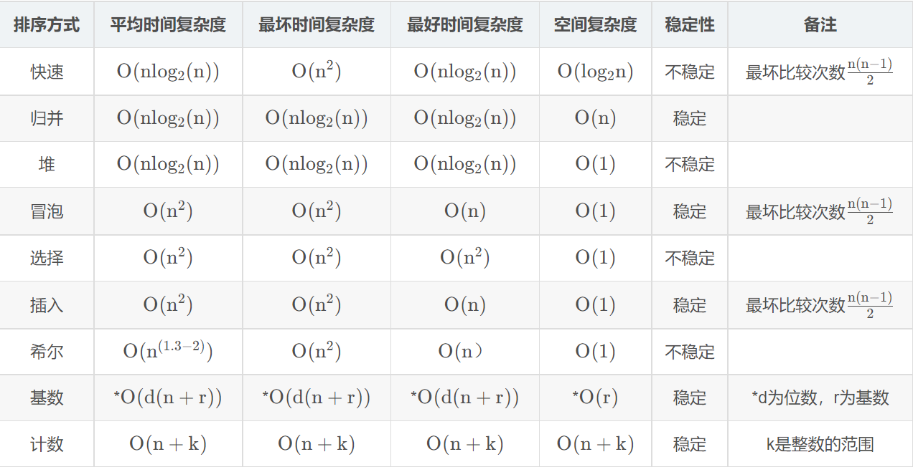
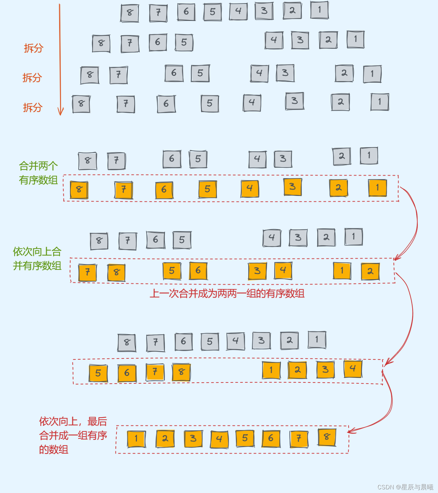

# 常见算法知识点

## 二分查找

```java
public int search(int nums[],int target){
    int left = 0 ;
    int right = nums.length-1;
    int mid;
    while(left<=right){
        mid = left + ((right-left)>>1);//直接(left+right)/2可能会溢出
        if(target == nums[mid]){
            return mid;
        }
        else if (target<nums[mid]){
            right = mid-1;
        }
        else if (target>nums[mid]){
            left = mid+1;
        }
    }
    return -1;
}
```

## 排序算法



稳定：如果a原本在b前面，而a=b，排序之后a仍然在b的前面

不稳定：如果a原本在b的前面，而a=b，排序之后 a 可能会出现在 b 的后面。

### 冒泡排序

一、步骤

1. 确定轮次（n-1），每一轮确定一个最值
2. 两两交换，共交换n-1-i次

二、时空复杂度

平均/最坏：O(n*n)

最好：原本就有序，第一轮两两比较完就会终止

```java
public class BubbleSort {
    public static void bubbleSortAscending(int[] arr) {
        int n = arr.length;
        for (int i = 0; i < n - 1; i++) {
            boolean swapped = false; // 优化：如果某轮没有交换，则说明已排序完成
            for (int j = 0; j < n - 1 - i; j++) {
                if (arr[j] > arr[j + 1]) { // 升序，降序则用<
                    swap(arr, j, j + 1);
                    swapped = true;
                }
            }
            if (!swapped) break; // 如果没有发生交换，说明数组已排序
        }
    }

    private static void swap(int[] arr, int i, int j) {
        int temp = arr[i];
        arr[i] = arr[j];
        arr[j] = temp;
    }

    public static void main(String[] args) {
        int[] arr = {64, 34, 25, 12, 22, 11, 90};
        bubbleSortAscending(arr);
        System.out.println("升序排序结果: ");
        for (int num : arr) {
            System.out.print(num + " ");
        }
    }
}

```

### 快速排序

[参考](https://blog.csdn.net/shujuelin/article/details/82423852)

​	快速排序之所比较快，因为相比冒泡排序，每次交换是跳跃式的。每次排序的时候设置一个基准点，将小于等于基准点的数全部放到基准点的左边，将大于等于基准点的数全部放到基准点的右边。这样在每次交换的时候就不会像冒泡排序一样每次只能在相邻的数之间进行交换，交换的距离就大的多了。因此总的比较和交换次数就少了，速度自然就提高了。当然在最坏的情况下，仍可能是相邻的两个数进行了交换。因此快速排序的最差时间复杂度和冒泡排序是一样的都是O(N2)，它的平均时间复杂度为O(NlogN)。其实快速排序是基于一种叫做“二分”的思想。

一、步骤

1. 设置基准，将数组中所有比基准数大的数放右边，比基准数小的数放在左边

2. 递归左右区间

二、时空复杂度

1. 时间复杂度
   * 每次找基准实际都会二分，二分的深度是logn，每个区间内进行交换是O(n),总的是O(nlogn)
   * 如果本来就有序，每次选择的基准是最小或最大值，导致一个子数组为空，退化为冒泡排序

2. 空间复杂度：递归深度为logn

三、代码示例：

```java
public class QuickSort {
    public static void quickSort(int[]nums,int low,int high){
        if(low>high) return;
        int temp;
        int base = nums[low];
        int i = low,j = high;
        while(i<j){
            while(i<j&&nums[j]>=base) j--;
            while(i<j&&nums[i]<=base) i++;
            if(i<j){
                temp = nums[i];
                nums[i] = nums[j];
                nums[j] = temp;
            }
        }
        nums[low] = nums[j];
        nums[j] = base;
        quickSort(nums,low,j-1);
        quickSort(nums,j+1,high);
    }
    public static void main(String[] args){
        int[] arr = {10,7,2,4,7,62,3,4,2,1,8,9,19};
        quickSort(arr, 0, arr.length-1);
        for (int i = 0; i < arr.length; i++) {
            System.out.println(arr[i]);
        }
    }
}


```


### 归并排序



​	下述代码是一个 **归并排序（Merge Sort）** 的实现，采用 **递归+辅助数组** 方式进行排序。归并排序的基本思想是 **分治（Divide and Conquer）**，即先递归地将数组分成左右两部分，再通过归并（合并）操作将两个有序子数组合并成一个有序数组

```java
import java.util.Arrays;

public class MergeSortExample {
    public static void mergeSort(int []nums, int left, int right, int []temp) {
        if (left == right) return;
        int mid = left + ((right - left) >> 1);
        mergeSort(nums, left, mid, temp);
        mergeSort(nums, mid + 1, right, temp);
        
        // 复制到辅助数组
        for (int i = left; i <= right; i++) {
            temp[i] = nums[i];
        }

        int i = left;
        int j = mid + 1;
        int k = left;

        // 归并两个有序数组
        while (i <= mid && j <= right) {
            if (temp[i] <= temp[j]) {
                nums[k++] = temp[i++];
            } else {
                nums[k++] = temp[j++];
            }
        }
        
        // 处理剩余元素
        while (i <= mid) nums[k++] = temp[i++];
        while (j <= right) nums[k++] = temp[j++];
    }

    public static void main(String[] args) {
        int[] nums = {8, 4, 5, 7, 1, 3, 6, 2};
        int[] temp = new int[nums.length];
        mergeSort(nums, 0, nums.length - 1, temp);
        System.out.println(Arrays.toString(nums)); // [1, 2, 3, 4, 5, 6, 7, 8]
    }
}

```

### 堆排序

一、过程

1. 构建堆

* 大根堆：每个节点的值都大于或者等于它的左右子节点的值

* 小根堆：每个节点的值都小于或者等于它的左右子节点的值

2. 将堆顶的元素值和尾部的元素交换并调整堆

二、时空复杂度：

1. 时间复杂度
   * 构建堆：O(n)
   * 首尾交换并调整堆：O(nlog n)

2. 空间复杂度

递归版本：O(log n)

迭代版本：O(1)

三、代码示例：

```java
public class HeapSort {
    public static void heapSort(int[] arr) {
        int n = arr.length;

        // 1. 构建最小堆（小根堆）
        for (int i = n / 2 - 1; i >= 0; i--) {
            minHeapify(arr, n, i);
        }

        // 2. 交换堆顶和末尾元素，并调整堆
        for (int i = n - 1; i > 0; i--) {
            swap(arr, 0, i);
            minHeapify(arr, i, 0);
        }
    }

    // 调整堆，使以 i 为根的子树满足最小堆性质
    private static void minHeapify(int[] arr, int n, int i) {
        int smallestIndex = i;
        int left = 2 * i + 1;
        int right = 2 * i + 2;

        if (left < n && arr[left] < arr[smallestIndex]) {
            smallestIndex = left;
        }

        if (right < n && arr[right] < arr[smallestIndex]) {
            smallestIndex = right;
        }

        if (smallestIndex != i) {
            swap(arr, i, smallestIndex);
            minHeapify(arr, n, smallestIndex);
        }
    }

    private static void swap(int[] arr, int i, int j) {
        int temp = arr[i];
        arr[i] = arr[j];
        arr[j] = temp;
    }

    public static void main(String[] args) {
        int[] arr = {1,3,2,4,5};
        System.out.println("原始数组: ");
        printArray(arr);

        heapSort(arr);

        System.out.println("排序后的数组: ");
        printArray(arr);
    }

    private static void printArray(int[] arr) {
        for (int num : arr) {
            System.out.print(num + " ");
        }
        System.out.println();
    }
}

```


TopK

找第k个最大用最小堆

找第k个最小用最大堆

1. 使用优先级队列

```java
class Solution {
    public int findKthLargest(int[] nums, int k) {
        PriorityQueue<Integer> queue = new PriorityQueue<>();
        for(int i=0;i<nums.length;i++){
            if(queue.size()==k){
                if(nums[i]>queue.peek()){
                    queue.poll();
                    queue.offer(nums[i]);
                }
            }else{
                queue.offer(nums[i]);
            }
        }
        int []res = new int[k];
        for(int i=0;i<k;i++){
            res[i]=queue.poll();
        }
        return res[0];
    }


}

```

2. 手动实现最小堆

```java
public class FindKthLargestMinHeap {
    private int[] heap; // 最小堆数组
    private int size;   // 当前堆大小
    private int capacity; // 堆的最大容量

    // 初始化最小堆，容量为 k
    public FindKthLargestMinHeap(int k) {
        this.capacity = k;
        this.heap = new int[k];
        this.size = 0;
    }

    // **插入新元素到堆**
    public void insert(int num) {
        if (size < capacity) {
            // 1. 如果堆未满，直接插入到最后一个位置
            heap[size] = num;
            size++;
            heapifyUp(size - 1); // 向上调整
        } else if (num > heap[0]) {
            // 2. 如果堆已满，且新元素比堆顶大，替换堆顶
            heap[0] = num;
            heapifyDown(0); // 向下调整
        }
    }

    // **向上调整（插入时）**
    private void heapifyUp(int i) {
        if (i == 0) return; // 根节点不需要调整
        int parent = (i - 1) / 2;

        if (heap[parent] > heap[i]) { // 如果父节点大于当前节点，交换
            swap(i, parent);
            heapifyUp(parent); // 递归调整父节点
        }
    }

    // **向下调整（删除堆顶时）**
    private void heapifyDown(int i) {
        int left = 2 * i + 1;
        int right = 2 * i + 2;
        int smallest = i;

        // 选取左右子节点中最小的
        if (left < size && heap[left] < heap[smallest]) {
            smallest = left;
        }
        if (right < size && heap[right] < heap[smallest]) {
            smallest = right;
        }

        if (smallest != i) { // 需要交换
            swap(i, smallest);
            heapifyDown(smallest); // 递归调整子节点
        }
    }

    // **交换数组中的两个元素**
    private void swap(int i, int j) {
        int temp = heap[i];
        heap[i] = heap[j];
        heap[j] = temp;
    }

    // **获取堆顶元素（即第 k 大的元素）**
    public int getKthLargest() {
        return heap[0];
    }

    // **寻找第 k 大元素**
    public static int findKthLargest(int[] nums, int k) {
        FindKthLargestMinHeap minHeap = new FindKthLargestMinHeap(k);

        // 遍历数组，直接 insert 处理
        for (int num : nums) {
            minHeap.insert(num);
        }

        // 返回堆顶，即第 k 大元素
        return minHeap.getKthLargest();
    }

    // **测试代码**
    public static void main(String[] args) {
        int[] nums = {3, 2, 3, 1, 2, 4, 5, 5, 6};
        int k = 4;
        System.out.println("第 " + k + " 大的元素是: " + findKthLargest(nums, k)); // 输出 4
    }
}

```


# 算法面经


## 美团


### 字符串相加

leetcod415 **简单**

实际我觉得算中等


### 两数之和

leetcode1 **简单**

**hot100 哈希**


### 三数之和

leetcode5 **中等**

**hot100双指针**

*

### 反转链表II

leetcode92 中等


### 无重复字符的最长子串

leetcode3 中等

**hot100滑动窗口**

*


### 删除链表中重复节点 II

leetcode82 **中等**


### 搜索二维数组

leetcode74 **中等**

**hot100二分查找**


### 最小的k个数


### 重排链表

leetcode143 **中等**


### 层序遍历

leetcode102 **中等**

**hot100二叉树**


### 最小高度树（21年的题了，应该是曾经的hard）

手撕：给定两个字符串s和t，求在字符串s中找出一个最短的子字符串，使得该子字符串包含字符串t中的所有字符，如果不存在这样的子字符串，则返回空字符串


### 合并两个有序数组

leetcode88 **简单**

### 快排


### 求第k个最大的数


### 二叉树的最大路径和

leetcode124 困难

实际最多算中等

**hot100二叉树**


### 最长回文子序列

leetcode516 中等


### k个一组反转链表

leetcode25 困难

实际上算中等

**hot100 链表**


## 小红书

### LRU


### 最长有效括号

leetcode32困难

用栈来做算中等，就是难想到


### 最长回文子串

**leetcode5 中等**

**hot100多维动态规划**

*

### 多线程循环打印

见java笔记

反转二叉树


### 和为k的子数组个数

leetcode560

**hot100 字串**

*

### 字符串解码


### 两数之和

leetcode1

**hot100 哈希**


### 最小和分割

leetcode 2578 简单

但我不会


### 最小覆盖子串

leetcode76困难，还未做


### 字符串相加


### 合并区间

### 螺旋矩阵

### 三数之和

### 全排列

### 无重复字符的最长子串

### 快排
