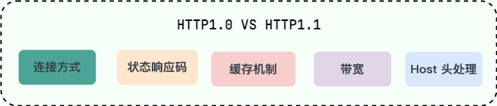
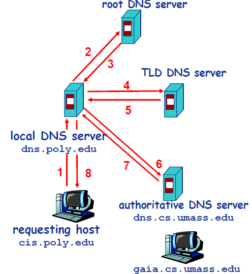

# HTTP基本概念

一、定义

HTTP：超文本传输协议（HyperText Transfer Protocol），HTTP 是一个在计算机世界里专门在「两点」之间「传输」文字、图片、音频、视频等「超文本」数据的「约定和规范」

二、特点

* 基于TCP/IP（HTTP/1.1，HTTP/2.0)
* 无状态：客户端发送请求，服务端处理请求后不记录信息，这就意味着如果后续处理需要前面的信息，则它必须重传(不需要额外的资源来记录状态信息，这能减轻服务器的负担)
  * 用session和cookie来记忆

* 无连接：无连接的含义是限制每次连接只处理一个请求。服务器处理完客户的请求，并收到客户的应答后，即断开连接。采用这种方式可以节省传输时间。
  * 用keep-alive来维持连接
* 灵活：可以传输任意对象，对象类型由Content-Type标记

三、HTTP常见状态码

* 1xx：提示信息，表示目前是协议处理的中间状态
  * 100 Continue：服务器已手接受请求的初步部分，客户端应继续请求
  * 101 Switching Protocols：服务器同意切换协议，如从HTTP切换到WebSocket

* 2xx：表示服务器成功处理了客户端的请求
  - 「200 OK」是最常见的成功状态码，表示一切正常。如果是非HEAD 请求，服务器返回的响应头都会有 body 数据。
  - 「204 No Content」也是常见的成功状态码，与 200 OK 基本相同，但响应头没有 body 数据。
  - 「206 Partial Content」是应用于 HTTP 分块下载或断点续传，表示响应返回的 body 数据并不是资源的全部，而是其中的一部分，也是服务器处理成功的状态。
* 3xx：表示客户端请求的资源发生了变动，需要客户端用新的 URL 重新发送请求获取资源，也就是**重定向**。
  - 「301 Moved Permanently」表示永久重定向，被请求的资源已永久移动到新位置
  - 「302 Found」表示临时重定向，请求的资源暂时发生了转移。搜索引擎会抓取新的内容而保存旧的网址
    - 302会导致URL劫持：某个人在他自己的网址上做了一个302跳转，(redirect)重定向到一家知名网址，处于某种原因，搜索引擎仍然收录了他自己的网址，但是所展示的网页内容却是知名网址的内容。在不知不觉中，知名网站就给他自己的网站做贡献，然后他自己的网站排名就靠前了。这种情况就是网址URL劫持。
  - [304 Not Modified」不具有跳转的含义，表示资源未修改，重定向已存在的缓冲文件，也称缓存重定向，也就是告诉客户端可以继续使用缓存资源，用于缓存控制。
* 4xx：表示客户端发送的报文有误，服务器无法处理，也就是错误码的含义。
  - 「400 Bad Request」表示客户端请求的报文有错误，但只是个笼统的错误。
  - 「403 Forbidden」表示服务器禁止访问资源，并不是客户端的请求出错。
  - 「404 Not Found」表示请求的资源在服务器上不存在或未找到，所以无法提供给客户端。
* 5xx：表示客户端请求报文正确，但是服务器处理时内部发生了错误，属于服务器端的错误码。
  * 「500 Internal Server Error」与 400 类型，是个笼统通用的错误码，服务器发生了什么错误，我们并不知道。
  * 「501 Not Implemented」表示客户端请求的功能还不支持，类似“即将开业，敬请期待”的意思。
  * 「502 Bad Gateway」通常是服务器作为网关或代理时返回的错误码，表示服务器自身工作正常，访问后端服务器发生了错误。
  * 「503 Service Unavailable」表示服务器当前很忙，暂时无法响应客户端，类似“网络服务正忙，请稍后重试”的意思。

4. HTTP请求报文

* 请求行
  * 请求方法：get/post
  * 请求的资源路径（如/index.html）
  * 协议名称和版本号(如HTTP/1.1)
* 请求头：包含各种键值对，用于传输客户端环境，请求内容、认证信息等
  * Host：客户端想访问的主机名
  * Accept：接受的数据类型（如Accept:text/plain表明接受纯文本数据）
  * Accept-Encoding：接受的数据压缩方式
  * Cookie：告诉服务器哪些个请求是隶属于一个Session
  * User-Agent：浏览器类型
* 请求体：浏览器发送给服务器的数据

# HTTP中GET和POST有什么区别

相同点：

* Get和Post都是HTTP的请求方式，底层都是TCP/IP协议

不同点：

* 用处：Get通常是请求数据，从服务器获取制定的资源；Post通常是提交数据，可以对服务器数据进行修改
* 安全性：Get是安全且幂等（只读），Post是不安全不幂等（修改），这只是通常来说，真要安全还得https
* 请求缓存：Get可以缓存，Post不缓存
* 请求参数：Get参数放在url中，Post参数放在body中
* 请求参数长度限制：Get通常在2k-8k（浏览器的限制）,Post无限制
* 数据包：Get产生一个数据包；Post产生两个数据包（并不是所有浏览器都会在POST中发送两次包，Firefox就只发送一次。）

# HTTP和HTTPS

1. 区别

* HTTP是明文传输，不安全；HTTPS在http层和tcp层之间加了SSL/TLS安全协议，使得报文可以加密传输
* HTTP建立连接相对简单，tcp三次握手后就可进行http报文传输；HTTPS还需进行SSL/TLS握手过程，才可进行加密传输
* HTTP是80端口，HTTPS是443端口
* HTTP不验证服务器身份，HTTPS需要向CA（证书权威机构）申请数字证书，来保证服务器的身份是可信的

2. HTTPS解决了HTTP的哪些问题?

​	HTTP 由于是明文传输，所以安全上存在以下三个风险

* 窃听风险
* 篡改风险
* 冒充风险

3. HTTPS如何解决上述问题

* 解决窃听风险：通过**混合加密**的方式可以保证信息的机密性。HTTPS采用的是**对称加密和非对称加密结合**的混合加密方式。
* 解决篡改风险：通过**摘要算法**来保证数据完整性（客户端对内容计算哈希值，将内容和哈希值一起传给服务器，服务器再对内容计算哈希值，并与传来的哈希值比对，如果一样就没篡改）。但是有可能[内容+哈希值]一起被掉包，因为这里缺少对客户端收到的消息是否来源于服务端的证明，因此通过私钥加密，公钥解密的方式来验证服务器身份。但依旧存在公私钥伪造的问题
* 解决冒充风险：通过数字证书的方式保证服务器公钥的身份，解决冒充的风险

(公钥加密|私钥解密用于防止密文被破解、被第三方得到明文，保证信息安全)

# HTTP缓存

1. 缓存分类：

* 强制缓存：指的是只要浏览器判断缓存没有过期，则直接使用浏览器的本地缓存，决定是否使用缓存的主动性在于浏览器这边。

  * 当浏览器第一次请求访问服务器资源时，服务器会在返回这个资源的同时，在 Response 头部加上 Cache-Control，Cache-Control 中设置了过期时间大小；
  * 浏览器再次请求访问服务器中的该资源时，会先通过请求资源的时间与 Cache-Control 中设置的过期时间大小，来计算出该资源是否过期，如果没有，则使用该缓存，否则重新请求服务器；
  * 服务器再次收到请求后，会再次更新 Response 头部的 Cache-Control。

* 协商缓存:有时我们会看到某些请求的响应码是 304，这个是服务器告诉浏览器可以使用本地缓存的资源，通常这种通过服务端告知客户端是否可以使用缓存的方式被称为协商缓存。

  * 比较修改时间（Last-Modified）
  * 比较Etag标识

  如果两个字段都有，则etag优先级更高，因为有时候没有修改文件内容也会导致最后修改时间改变；etag能检测到秒级内的修改

​	协商缓存这两个字段都需要配合强制缓存中 Cache-control 字段来使用，只有在未能命中强制缓存的时候，才能发起带有协商缓存字段的请求。

2. 当使用 ETag 字段实现的协商缓存的过程：

- 当浏览器第一次请求访问服务器资源时，服务器会在返回这个资源的同时，在 Response 头部加上 ETag 唯一标识，这个唯一标识的值是根据当前请求的资源生成的；

- 当浏览器再次请求访问服务器中的该资源时，首先会先检查强制缓存是否过期：

  - 如果没有过期，则直接使用本地缓存；
  - 如果缓存过期了，会在 Request 头部加上 If-None-Match 字段，该字段的值就是 ETag 唯一标识；

- 服务器再次收到请求后，

  会根据请求中的 If-None-Match 值与当前请求的资源生成的唯一标识进行比较

  - 如果值相等，则返回 304 Not Modified，不会返回资源；
  - 如果不相等，则返回 200 状态码和返回资源，并在 Response 头部加上新的 ETag 唯一标识；

- 如果浏览器收到 304 的请求响应状态码，则会从本地缓存中加载资源，否则更新资源。

# HTTPS是对称加密还是非对称加密

SSL/TLS原理：

* 使用非对称加密来安全地交换对称加密密钥
  * CA颁发的数字证书包含服务器的公钥及其身份信息。这些证书由可信的CA签名，客户端可以验证证书的真实性，即用于信任服务器发来的公钥。之后会拿这个公钥来加密预主密钥并传给服务器（预主密钥用于生成后续对称加密需要用到的会话密钥，会话密钥是客户端和服务端使用相同的方法一起生成的，不是服务端生成后再给客户端），服务器再用私钥接密获取预主密钥
* 对称加密则用于加密解密实际传输的数据

> 1. 为什么数据传输是用对称加密的？
>    首先：非对称加密的加解密效率是非常低的，而 http 的应用场景中通常端与端之间存在大量的交互，非对称加密的效率是无法接受的。
>
>    另外：在 HTTPS 的场景中只有服务端保存了私钥，一对公私钥只能实现单向的加解密，所以HTTPS 中内容传输加密采取的是对称加密，而不是非对称加密
>
> 2. 为什么需要CA机构颁发证书？
>
>    防止”中间人“攻击，同时可以为网站提供身份证明。

# HTTPS的Get请求参数是放在query string里面的，那么query里面的请求会被加密吗？

会加密

HTTPS 传输的安全性

* 加密：HTTPS 使用 TLS（传输层安全性）协议来加密数据传输。加密范围 ，包括 URL、Header 和 Body，都是加密的。
* 防止窃听：由于数据是加密的，第三方无法窃听或读取传输中的数据。
* 防止篡改：HTTPS 还提供数据完整性，防止数据在传输过程中被篡改。
  

# http1和http2的区别

**一、http1.0与http1.1**

* **连接方式** : HTTP/1.0 为短连接，HTTP/1.1 支持长连接。HTTP 协议的长连接和短连接，实质上是 TCP 协议的长连接和短连接
* **状态响应码** : HTTP/1.1 中新加入了大量的状态码，光是错误响应状态码就新增了 24 种。比如说，`100 (Continue)`——在请求大资源前的预热请求，`206 (Partial Content)`——范围请求的标识码，`409 (Conflict)`——请求与当前资源的规定冲突，`410 (Gone)`——资源已被永久转移，而且没有任何已知的转发地址。
* **缓存机制** : 在 HTTP/1.0 中主要使用 Header 里的 If-Modified-Since,Expires 来做为缓存判断的标准，HTTP/1.1 则引入了更多的缓存控制策略例如 Entity tag，If-Unmodified-Since, If-Match, If-None-Match 等更多可供选择的缓存头来控制缓存策略。
* **带宽**：HTTP/1.0 中，存在一些浪费带宽的现象，例如客户端只是需要某个对象的一部分，而服务器却将整个对象送过来了，并且不支持断点续传功能，HTTP/1.1 则在请求头引入了 range 头域，它允许只请求资源的某个部分，即返回码是 206（Partial Content），这样就方便了开发者自由的选择以便于充分利用带宽和连接。
* **Host 头（Host Header）处理** :HTTP/1.1 引入了 Host 头字段，允许在同一 IP 地址上托管多个域名，从而支持虚拟主机的功能。而 HTTP/1.0 没有 Host 头字段，无法实现虚拟主机。

**二、http1.1与http2.0**

* **多路复用（Multiplexing）**：HTTP/2.0 在同一连接上可以同时传输多个请求和响应（可以看作是 HTTP/1.1 中长链接的升级版本），互不干扰。HTTP/1.1 则使用串行方式，每个请求和响应都需要独立的连接，而浏览器为了控制资源会有 6-8 个 TCP 连接的限制。。这使得 HTTP/2.0 在处理多个请求时更加高效，减少了网络延迟和提高了性能。
* **二进制帧（Binary Frames）**：HTTP/2.0 使用二进制帧进行数据传输，而 HTTP/1.1 则使用文本格式的报文。二进制帧更加紧凑和高效，减少了传输的数据量和带宽消耗。
* **头部压缩（Header Compression）**：HTTP/1.1 支持`Body`压缩，`Header`不支持压缩。HTTP/2.0 支持对`Header`压缩，使用了专门为`Header`压缩而设计的 HPACK 算法，减少了网络开销。
* **服务器推送（Server Push）**：HTTP/2.0 支持服务器推送，可以在客户端请求一个资源时，将其他相关资源一并推送给客户端，从而减少了客户端的请求次数和延迟。而 HTTP/1.1 需要客户端自己发送请求来获取相关资源。

# TCP和UDP的区别

* TCP提供了可靠、面向连接的传输，适用于需要数据完整性和顺序的场景
* UDP则提供了更轻量、面向报文的传输，适用于实时性要求高的场景。

| 特性              | TCP                                   | UDP                                        |
| ----------------- | ------------------------------------- | ------------------------------------------ |
| 连接方式          | 面向连接                              | 无连接                                     |
| 可靠性            | 提供可靠性，保证数据按顺序到达        | 不可靠，不保证顺序或完整性                 |
| 流量控制/拥塞控制 | 提供流量控制和拥塞控制                | 没有流量控制和拥塞控制                     |
| 顺序保证          | 保证数据顺序                          | 不保证数据顺序                             |
| 头部大小          | 较大（20字节及以上）                  | 较小（8字节）                              |
| 性能              | 较低，延迟大                          | 较高，延迟小                               |
| 数据传输模式      | 字节流传输模式                        | 数据报传输模式                             |
| 适用场景          | 文件传输、Web、邮件等需要可靠性的应用 | 实时通讯、语音、视频、游戏等高性能要求应用 |

# TCP如何实现可靠传输？

* 校验和：在数据传输的过程中，将发送的数据段都当做一个16位的整数。将这些整数加起来。并且前面的进位不能丢弃，补在后面，最后取反，得到校验和

  * 发送方：在发送数据之前计算检验和，并进行校验和的填充，放在TCP头部。

  * 接收方：收到数据后，对数据以同样的方式进行计算，求出校验和，与发送方的进行比对。

    如果接收方比对校验和与发送方不一致，那么数据一定传输有误。但是如果接收方比对校验和与发送方一致，数据不一定传输成功。

* 确认应答机制：实现可靠传输就是依靠该机制，超时重传是对确认应答的补充

  * 序列号

    * TCP 给发送的每一个包进行编号，接收方对数据包进行排序，把有序数据传送给应用层。

    * TCP 的接收端会丢弃重复的数据，数据是否重复就是根据序列号进行判断的。
  * 确认应答：TCP传输的过程中，每次接收方收到数据后，都会对传输方进行确认应答。也就是发送ACK报文。这个ACK报文当中带有对应的确认序列号，告诉发送方，接收到了哪些数据，下一次的数据从哪里发

  

* 超时重传：是发送方在发送完数据后等待一个时间，时间到达没有接收到ACK报文，那么对刚才发送的数据进行重新发送

  * 原因
    * 数据在传输过程中由于网络原因等直接全体丢包，接收方根本没有接收到
    * 接收方接收到了响应的数据，但是发送的ACK报文响应却由于网络原因丢包了。
  * 由于TCP传输时保证能够在任何环境下都有一个高性能的通信，因此这个最大超时时间（也就是等待的时间）是动态计算的

  > 在Linux中（BSD Unix和Windows下也是这样）超时以500ms为一个单位进行控制，每次判定超时重发的超时时间都是500ms的整数倍。重发一次后，仍未响应，那么等待2X500ms的时间后，再次重传。等待4X500ms的时间继续重传。以一个指数的形式增长。累计到一定的重传次数，TCP就认为网络或者对端出现异常，强制关闭连接。

* 流量控制：当接收方来不及处理发送方的数据，能通过滑动窗口，提示发送方降低发送的速率，防止包丢失。**流量控制看的是接收方能力**

> 在TCP协议的报头信息当中，有一个16位字段的窗口大小。在介绍这个窗口大小时我们知道，窗口大小的内容实际上是接收端接收数据缓冲区的剩余大小。这个数字越大，证明接收端接收缓冲区的剩余空间越大，网络的吞吐量越大。接收端会在确认应答发送ACK报文时，将自己的即时窗口大小填入，并跟随ACK报文一起发送过去。而发送方根据ACK报文里的窗口大小的值的改变进而改变自己的发送速度。如果接收到窗口大小的值为0，那么发送方将停止发送数据。并定期的向接收端发送窗口探测数据段，让接收端把窗口大小告诉发送端。

* 拥塞控制：拥塞控制是作用于网络的，当网络拥塞时，通过拥塞窗口，减少数据的发送，防止包丢失。**拥塞控制看的是网络能力**

  * 慢启动：慢开始的含义就是讲窗口先设置为1,发送窗口swnd等于拥塞窗口cwnd，每个传输轮次大小增长一倍,直到大道慢开始的门限(ssthresh),这时候慢开始阶段结束。

  * 拥塞避免：慢开始结束后,接下来就是拥塞避免,这个阶段拥塞窗口在每个传输轮次数量加1,直到触发了网络拥塞（比如数据丢失后没收到ack则会判断为网络拥塞）,则将窗口重新设置为1，门限设置为原来的一半，然后重新开始慢开始阶段（满足快重传机制的话则执行的是快恢复，而不是慢启动）

    

  * 快重传：它通过检测三个或更多的重复ACK,认为数据包丢失，从而触发立即重传。因为连续收到三次相同ACK证明当前网络状况是Ok的，那么确认是丢包了，于是立马重发，没必要等这么久。

    

    

  * 快恢复：发送方将慢开始门限和拥塞窗口的值都设置为当前窗口的一半，开始执行拥塞避免算法。

# TCP流量控制

一、概述

​	TCP滑动窗口机制的主要作用是实现流量控制(Flow Control),，即协调发送方和接收方的数据传输速率，确保发送方不会发送超出接收方处理能力的数据量，防止接收端缓冲区溢出。
​	滑动窗口允许发送方在未收到前一个数据包的确认(ACK)前继续发送多个数据包，从而提高网络吞吐量，减少等待时间，实现高效的数据流传输。

**二、发送端发送了十个包，接收端有几个包没收到，滑动窗口怎么变**？

# TCP拥塞控制

# TCP/IP网络模型与OSI网络模型？

OSI模型：

1. 应用层(Application Layer):用户交互界面，提供网络服务，如HTTP、FTP、SMTP等
2. 表示层(Presentation Layer):数据格式转换、加密、解密，如PEG、MPEG、SSL/TLS等。
3. 会话层(Session Layer):建立、管理、终止会话，如NetBIOS、RPC等。
4. 传输层(Transport Layer)：可靠传输，流量控制，错误检测，如TCP、UDP等。
5. 网络层(Network Layer):路径选择和逻辑地址(IP)管理，如IP、ICMP等。
6. 数据链路层(Data Link Layer):物理地址(MAC)寻址，错误检测与纠正，如以太网、PPP等。
7. 物理层(Physical Layer):比特流传输，物理连接，如光纤、网线、无线电波等。

# TCP三次握手

## 一、定义

​	具体流程文字描述就是：客户端首先发送一个SYN(同步序列编号)消息给服务器，服务器收到后回复一个SYN-ACK(同步序列编号-确认)消息，最后客户端再发送一个ACK(确认)消息，确认服务器已经收到SYN-ACK消息，从而完成三次握手，建立起一个可靠的TCP连接。

* 第一次握手：客户端给服务端发一个 SYN 报文，并指明客户端的初始化序列号 ISN。此时客户端处于 SYN_SENT 状态。

​	 （首部的同步位SYN=1，初始序号seq=x，SYN=1的报文段不能携带数据，但要消耗掉一个序号）

* 第二次握手：服务器收到客户端的 SYN 报文之后，会以自己的 SYN 报文作为应答，并且也是指定了自己的初始化序列号 ISN(s)。同时会把客户端的 ISN + 1 作为ACK 的值，表示自己已经收到了客户端的 SYN，此时服务器处于 SYN_RCVD 的状态。

​	（ 在确认报文段中SYN=1，ACK=1，确认号ack=x+1，初始序号seq=y）

* 第三次握手：客户端收到 SYN 报文之后，会发送一个 ACK 报文，当然，也是一样把服务器的 ISN + 1 作为 ACK 的值，表示已经收到了服务端的 SYN 报文，此时客户端处于 ESTABLISHED 状态。服务器收到 ACK 报文之后，也处于 ESTABLISHED 状态，此时，双方已建立起了连接。

​	 （确认报文段ACK=1，确认号ack=y+1，序号seq=x+1（初始为seq=x，第二个报文段所以要+1），ACK报文段可以携带数据，不携带数据则不消耗序号。）

## **二、为什么是三次握手，不是两次，四次？**

- 两次握手：无法防止历史连接的建立，会造成双方资源的浪费，也无法可靠的同步双方序列号；
- 四次握手：三次握手就已经理论上最少可靠连接建立，所以不需要使用更多的通信次数

**1、两次握手为什么不能防止历史连接？**

* 采用两次握手时，服务器在收到客户端的 `SYN` 报文后，会直接进入 **ESTABLISHED** 状态（而不是 `SYN-RECEIVED` 状态）。
* 由于服务器认为连接已经建立，它可能会立即向客户端发送数据，而客户端如果识别出该连接是历史连接，就会发送 `RST` 报文。
* 由于服务器在收到 `RST` 之前已经发送了数据，因此会导致资源浪费

**2、三次握手如何阻止历史连接**

​	客户端连续发送多次 SYN （都是同一个四元组）建立连接的报文，在**网络拥堵**情况下：

- 一个「旧 SYN 报文」比「最新的 SYN 」 报文早到达了服务端，那么此时服务端就会回一个 SYN + ACK 报文给客户端，此报文中的确认号是 91（90+1）。
- 客户端收到后，发现自己期望收到的确认号应该是 100+1，而不是 90 + 1，于是就会回 RST 报文。
- 服务端收到 RST 报文后，就会释放连接。
- 后续最新的 SYN 抵达了服务端后，客户端与服务端就可以正常的完成三次握手了。

上述中的「旧 SYN 报文」称为历史连接，TCP 使用三次握手建立连接的**最主要原因就是防止「历史连接」初始化了连接**。

## 三、握手丢失会发生什么？

**1、第一次握手丢失会发生什么？**

（假设 tcp_syn_retries 参数值为 3）

* 如果客户端迟迟收不到服务端的 SYN-ACK 报文（第二次握手），就会触发「超时重传」机制，重传 SYN 报文，而且重传的 SYN 报文的序列号都是一样的
* 当客户端超时重传 3 次 SYN 报文后，由于 tcp_syn_retries 为 3，已达到最大重传次数，于是再等待一段时间（时间为上一次超时时间的 2 倍），如果还是没能收到服务端的第二次握手（SYN-ACK 报文），那么客户端就会断开连接

**2、第二次握手丢失会发生什么？**

当第二次握手丢失了，客户端和服务端都会重传

具体过程：（假设 tcp_syn_retries 参数值为 1，tcp_synack_retries 参数值为 2）

- 当客户端超时重传 1 次 SYN 报文后，由于 tcp_syn_retries 为 1，已达到最大重传次数，于是再等待一段时间（时间为上一次超时时间的 2 倍），如果还是没能收到服务端的第二次握手（SYN-ACK 报文），那么客户端就会断开连接。
- 当服务端超时重传 2 次 SYN-ACK 报文后，由于 tcp_synack_retries 为 2，已达到最大重传次数，于是再等待一段时间（时间为上一次超时时间的 2 倍），如果还是没能收到客户端的第三次握手（ACK 报文），那么服务端就会断开连接。

3. 第三次握手丢失会发生什么？

​	因为这个第三次握手的 ACK 是对第二次握手的 SYN 的确认报文，所以当第三次握手丢失了，如果服务端那一方迟迟收不到这个确认报文，就会触发超时重传机制，重传 SYN-ACK 报文，直到收到第三次握手，或者达到最大重传次数

# TCP四次挥手

## 一、定义

* 第一次挥手：客户端发送一个 FIN 报文，报文中会指定一个序列号。此时客户端处于 FIN_WAIT1 状态。
  即发出连接释放报文段（FIN=1，序号seq=u），并停止再发送数据，主动关闭TCP连接，进入FIN_WAIT1（终止等待1）状态，等待服务端的确认。

* 第二次挥手：服务端收到 FIN 之后，会发送 ACK 报文，且把客户端的序列号值 +1 作为 ACK 报文的序列号值，表明已经收到客户端的报文了，此时服务端处于 CLOSE_WAIT 状态。
  即服务端收到连接释放报文段后即发出确认报文段（ACK=1，确认号ack=u+1，序号seq=v），服务端进入CLOSE_WAIT（关闭等待）状态，此时的TCP处于半关闭状态，客户端到服务端的连接释放。客户端收到服务端的确认后，进入FIN_WAIT2（终止等待2）状态，等待服务端发出的连接释放报文段。

* 第三次挥手：如果服务端也想断开连接了，和客户端的第一次挥手一样，发给 FIN 报文，且指定一个序列号。此时服务端处于 LAST_ACK 的状态。
  即服务端没有要向客户端发出的数据，服务端发出连接释放报文段（FIN=1，ACK=1，序号seq=w，确认号ack=u+1），服务端进入LAST_ACK（最后确认）状态，等待客户端的确认。

* 第四次挥手：客户端收到 FIN 之后，一样发送一个 ACK 报文作为应答，且把服务端的序列号值 +1 作为自己 ACK 报文的序列号值，此时客户端处于 TIME_WAIT 状态。需要过一阵子以确保服务端收到自己的 ACK 报文之后才会进入 CLOSED 状态，服务端收到 ACK 报文之后，就处于关闭连接了，处于 CLOSED 状态。
  即客户端收到服务端的连接释放报文段后，对此发出确认报文段（ACK=1，seq=u+1，ack=w+1），客户端进入TIME_WAIT（时间等待）状态。此时TCP未释放掉，需要经过时间等待计时器设置的时间2MSL后，客户端才进入CLOSED状态。

## 二、为什么挥手需要四次？

再来回顾下四次挥手双方发 FIN 包的过程，就能理解为什么需要四次了。

- 关闭连接时，客户端向服务端发送 FIN 时，仅仅表示客户端不再发送数据了但是还能接收数据。
- 服务端收到客户端的 FIN 报文时，先回一个ACK应答报文，而服务端可能还有数据需要处理和发送，等服务端不再发送数据时，才发送FIN报文给客户端来表示同意现在关闭连接。

从上面过程可知，服务端通常需要等待完成数据的发送和处理，所以服务端的ACK和FIN一般都会分开发送，因此是需要四次挥手。

# Ping的工作原理

PING 命令是一种常用的网络诊断工具，经常用来测试网络中主机之间的连通性和网络延迟。

**一、原理概述**

PING 基于网络层的 **ICMP（Internet Control Message Protocol，互联网控制报文协议）**，其主要原理就是通过在网络上发送和接收 ICMP 报文实现的。

ICMP 报文中包含了类型字段，用于标识 ICMP 报文类型。ICMP 报文的类型有很多种，但大致可以分为两类：

- **查询报文类型**：向目标主机发送请求并期望得到响应。
- **差错报文类型**：向源主机发送错误信息，用于报告网络中的错误情况。

PING 用到的 ICMP Echo Request（类型为 8 ） 和 ICMP Echo Reply（类型为 0） 属于查询报文类型 。

- PING 命令会向目标主机发送 ICMP Echo Request。
- 如果两个主机的连通性正常，目标主机会返回一个对应的 ICMP Echo Reply。

**二、详解与举例**

假设在同个局域网下，主机A ping 主机B，我们重点看下ping的发送、接收、响应过程

1. 发送过程：

   * ping 命令执行的时候，源主机首先会构建一个 **ICMP 回送请求消息**数据包。ICMP 数据包内包含多个字段，最重要的是两个：
     * 类型：对于回送请求消息而言该字段为8
     * 序号：主要用于区分连续ping时发出的多个数据包

   * 每发送一个请求数据包，序号会自动加1。为了能计算往返时间RTT，它会在报文的数据部分插入发送时间

   * 然后，由ICMP协议将这个数据包交给IP层，包装上源地址，目的地址，协议字段（协议字段为1，表示ICMP协议）和一些控制信息，组建成一个IP数据包

   * 接下来，在数据链路层，加上MAC头，构建一个数据帧，通过以太网传输出去

2. 接收过程：

   * 主机B接收到这个数据帧后，先检查它的目的MAC地址，并和本地的MAC地址比对，如符合，则接受，否则丢弃

   * 接收后检查该数据帧，将IP数据包从帧中提取出来，交给本机的IP层。同样，IP层检查后，将有用的信息提取后交给ICMP协议

3. 响应过程：

   * 主机B会构建一个**回送响应消息数据包**，回送响应数据包的类型字段为0，序号为接受到的请求数据包中的序号，然后再发送给主机A

   * 在规定的时间内，主机A如果没有接收到ICMP的应答包，则说明主机不可达；如果接收到了ICMP回送响应消息，则说明主机可达

# URI和URL

* URI：统一资源标志符(Uniform Resource Identifier)，表示的是web上每一种可用的资源，如 HTML文档、图像、视频片段、程序等都由一个URI进行标识的。
* URL：统一资源定位符（Uniform Resource Locator），URL是URI的一个子集。通俗地说，URL是Internet上描述信息资源的字符串，主要用在各种WWW客户程序和服务器程序上。

只要能唯一标识资源的就是URI，在URI的基础上给出其资源的访问方式的就是URL（URL通常就是一个直接访问的网址链接）

# 常用端口号

端口号的范围是从1～65535

> 其中1～1024是被RFC 3232规定好了的，被称作“众所周知的端口”(Well Known Ports)；
>
> 从1025～65535的端口被称为动态端口（Dynamic Ports），可用来建立与其它主机的会话，也可由用户自定义用途

21端口：FTP 文件传输服务
22端口：SSH 远程连接服务
80端口：HTTP 超文本传输服务
443端口：HTTPS 加密的超文本传输服务
3306端口：MYSQL数据库端口
6379端口：Redis数据库端口
8080端口：TCP服务端默认端口
9200端口：Elasticsearch服务器端口
27017端口：mongoDB数据库默认端口

# http和rpc的区别

| **特性**           | **RPC**                          | **HTTP**                         |
| ------------------ | -------------------------------- | -------------------------------- |
| **数据格式**       | **二进制（Protobuf、Thrift）**   | **文本（JSON、XML）**            |
| **性能**           | **高效，低延迟**                 | **相对较低**                     |
| **开发复杂度**     | **较高，需要序列化、服务治理等** | **低，开发工具丰富，易于集成**   |
| **可读性和调试性** | **较差（因为使用二进制）**       | **好（因为使用文本格式）**       |
| **历史**           | **出现较早**                     | **比rpc晚**                      |
| **适用场景**       | **内部微服务，高性能系统**       | **对外开放接口，跨平台系统集成** |

# rpc的原理

RPC（远程过程调用）的原理是让程序可以调用远程服务器上的方法，就像调用本地函数一样简单，屏蔽了底层网络通信的细节。它的基本工作流程如下：

1. **客户端调用存根（Client Stub）**：
   - 客户端通过本地的存根调用远程方法，这看起来像调用本地函数。
2. **请求打包与序列化**：
   - 客户端存根将函数名称和参数序列化为可通过网络传输的格式，然后发送给服务端。
3. **服务端解包与执行**：
   - 服务端存根接收请求，解包和反序列化后，调用实际的服务逻辑（方法）。
4. **结果打包与返回**：
   - 执行完方法后，服务端存根将结果序列化，通过网络返回给客户端。
5. **客户端接收结果**：
   - 客户端存根解包并反序列化响应，将结果返回给调用者。

# 银行家算法

​	当一个进程申请使用资源的时候，银行家算法通过先 **试探** 分配给该进程资源，然后通过安全性算法判断分配后的系统是否处于安全状态，若不安全则试探分配作废，让该进程继续等待。

[参考地址](https://blog.csdn.net/qq_33414271/article/details/80245715?ops_request_misc=%257B%2522request%255Fid%2522%253A%252242A14BF8-BA74-499A-9DFD-F2467EA6B0CA%2522%252C%2522scm%2522%253A%252220140713.130102334.pc%255Fall.%2522%257D&request_id=42A14BF8-BA74-499A-9DFD-F2467EA6B0CA&biz_id=0&utm_medium=distribute.pc_search_result.none-task-blog-2~all~first_rank_ecpm_v1~rank_v31_ecpm-2-80245715-null-null.142^v100^pc_search_result_base5&utm_term=%E8%AE%B2%E4%B8%80%E4%B8%8B%E9%93%B6%E8%A1%8C%E5%AE%B6%E7%AE%97%E6%B3%95&spm=1018.2226.3001.4187)

# 访问谷歌的时候如果没有翻墙是访问不到的吧？这个防火墙是怎么做到的

GFW的屏蔽技术主要包括以下几种方式：

1. **DNS污染（DNS Poisoning）**
   - 当你在浏览器输入 `www.google.com`，你的设备会向DNS服务器请求解析IP地址。但GFW会拦截这个请求，并返回错误的IP地址，导致你的浏览器无法正确访问Google。
   - 比如，你请求 `www.google.com`，正常应该解析到Google的IP，但GFW可能返回一个错误的IP，甚至是一个不可用的IP。
2. **IP封锁（IP Blocking）**
   - GFW会直接屏蔽Google服务器的IP地址。即使你知道Google的IP地址并直接访问，也会被防火墙阻断。
   - 这意味着你即便使用不依赖DNS的方式（比如直接输入IP），也无法访问Google。

# DNS工作流程

**一、DNS服务器**

DNS 服务器自底向上可以依次分为以下几个层级(所有 DNS 服务器都属于以下四个类别之一):

- 根 DNS 服务器。根 DNS 服务器提供 TLD 服务器的 IP 地址。目前世界上只有 13 组根服务器，我国境内目前仍没有根服务器。
- 顶级域 DNS 服务器（TLD 服务器）。顶级域是指域名的后缀，如com、org、net和edu等。国家也有自己的顶级域，如uk、fr和ca。TLD 服务器提供了权威 DNS 服务器的 IP 地址。
- 权威 DNS 服务器。在因特网上具有公共可访问主机的每个组织机构必须提供公共可访问的 DNS 记录，这些记录将这些主机的名字映射为 IP 地址。**存储是的DNS记录并提供最终的解析成果**
- 本地 DNS 服务器。每个 ISP（互联网服务提供商）都有一个自己的本地 DNS 服务器。当主机发出 DNS 请求时，该请求被发往本地 DNS 服务器，它起着代理的作用，并将该请求转发到 DNS 层次结构中。严格说来，不属于 DNS 层级结构。

**二、工作流程**

DNS 的查询解析过程分为两种模式：

- **迭代**
- **递归**

迭代图：

现在，主机`cis.poly.edu`想知道`gaia.cs.umass.edu`的 IP 地址。假设主机`cis.poly.edu`的本地 DNS 服务器为`dns.poly.edu`，并且`gaia.cs.umass.edu`的权威 DNS 服务器为`dns.cs.umass.edu`。

1. 首先，用户在浏览器输入URL地址后，则先查询浏览器缓存是否有该域名对应的IP地址

2. 缓存没有，主机`cis.poly.edu`向本地 DNS 服务器`dns.poly.edu`发送一个 DNS 请求，该查询报文包含被转换的域名`gaia.cs.umass.edu`。

3. 本地 DNS 服务器`dns.poly.edu`检查本机缓存，发现并无记录，也不知道`gaia.cs.umass.edu`的 IP 地址该在何处，不得不向根服务器发送请求。

4. 根服务器注意到请求报文中含有`edu`顶级域，因此告诉本地 DNS，你可以向`edu`的 TLD DNS 发送请求，因为目标域名的 IP 地址很可能在那里。

5. 本地 DNS 获取到了`edu`的 TLD DNS 服务器地址，向其发送请求，询问`gaia.cs.umass.edu`的 IP 地址。

6. `edu`的 TLD DNS 服务器仍不清楚请求域名的 IP 地址，但是它注意到该域名有`umass.edu`前缀，因此返回告知本地 DNS，`umass.edu`的权威服务器可能记录了目标域名的 IP 地址。

7. 这一次，本地 DNS 将请求发送给权威 DNS 服务器`dns.cs.umass.edu`。

8. 终于，由于`gaia.cs.umass.edu`向权威 DNS 服务器备案过，在这里有它的 IP 地址记录，权威 DNS 成功地将 IP 地址返回给本地 DNS。

9. 最后，本地 DNS 获取到了目标域名的 IP 地址，将其返回给请求主机，并且将域名解析的结果缓存本地

# DNS用的tcp还是udp，为什么

DNS占用53号端口，同时使用TCP和UDP协议。那么DNS在什么情况下使用这两种协议？

DNS在区域传输的时候使用TCP协议，其他时候使用UDP协议

* **普通的DNS查询** → **UDP**（默认，快，适用于小数据包，不超过548字节）

> UDP的数据最大为1472字节最好(避免分片重组)。 　　
> 但在网络编程中，Internet中的路由器可能有设置成不同的值(小于默认值)，Internet上的标准MTU值为576，所以Internet的UDP编程时数据长度最好在576－20－8＝548字节以内

* 区域传输：在 **DNS主从服务器（如BIND）之间同步域名解析记录**（AXFR/IXFR）时，由于数据量较大，DNS会使用 **TCP** 来保证完整传输和可靠性。
  * 数据量大
  * 可靠传输

# 从地址栏输入URL到显示页面都发生了什么？

1. DNS解析：将你输入的域名解析为IP地址
2. TCP连接：找到服务器的ip地址后，通过TCP三次握手建立连接
3. 发起HTTP请求：客户端的HTTP进程向服务端发起HTTP请求报文，报文内容为:"首页内容是什么？"。HTTP报文会封装在tcp报文中，tcp报文首部会有源端口和目的端口。之后将TCP报文段封装在IP数据报中（在数据链路层，还需加上mac头部等），通过以太网发送给Web服务器。
   * 简要说法：发送http请求，请求会先封装成tcp段，再封装成ip数据包，最后在链路层封装层帧，最后由物理层发出去

4. 服务器处理请求，返回响应：服务器收到该数据包后，从中解封出TCP数据报，通过其首部的端口号，再发送给相应的HTTP服务器端进程。HTTP服务器端进程解析HTTP请求报文的内容，然后按其要求查找首页内容，之后会给用户PC发送HTTP响应报文，其内容是HTTP 客户端所请求的首页内容。同样也是将TCP报文段封装在IP数据报文中，通过以太网发送给客户端

5. 浏览器渲染：客户端收到该数据报后，从中解封出TCP报文段，根据其首部的目的端口，将报文给到相应HTTP进程，HTTP进程解析出HTTP相应报文的内容，并在网页浏览器中进行显示

6. TCP断开连接：TCP进行四次挥手与服务器断开连接

# Cookie、Session和Token

一、概述

1. Cookie

   * Cookie是存储在用户浏览器端的一个小型数据文件，用于跟踪和保存用户的状态信息。

   * 主要用于保特用户登录状态、跟踪用户行为、存储用户偏好等。

   * 存储在**浏览器端**。

2. Session
   * Session是服务器端保存用户状态的机制，每个用户会话都有一个唯一的Session ID
   * 主要用于跟踪用户在服务器上的状态信息，例如登录状态和购物车内容。
   * 存储在**服务器端**，然后对应的Session ID通过Cookie保存在客户端浏览器中。
   * 缺点：分布式场景下，请求被转发到不同服务器，导致要重复登录等
     * Session复制
     * Session绑定/粘滞：服务器会把某个用户的请求，交给wb服务器集群中的一个节点，然后以此节点负责保护该用户的Session
     * 第三方存储：如Spring Session存储在Redis中
3. Token
   * Token是一种**加密的字符串**，用于**无状态**的身份认证机制。Token由服务器生成，包含用户的身份信息和权限声明，通常通过加密技术（如JWT)确保安全。Token的核心特性是无状态，即服务器不需要存储Token数据，而是通过验证Token的有效性来确定用户身份。

**它们之间使用场景区别**

* Cookie:主要用于客户端状态的简单存储和追踪。
* Session:用于服务器端的复杂状态管理，特别是在需要存储大量会话数据时。
* Token:用于无状态的认证和授权，特别是在分布式和跨域环境下。

# WebSocket与HTTP有什么区别

**一、概述**

​	WebSocket适用于需要实时通信和双向数据流的场景，而HTTP更适合于传统的客户端与服务器之间的短时请求响应场景。主要区别在于通信模式：

* HTTP:请求/响应模型，客户端发起请求，服务器响应，连接后即关闭。
* WebSocket:双向全双工通信，客户端和服务器建立持久连接后，双方可以随时发送消息，直到主动关闭连接。

**二、websocket工作流程**

1. 客户端发起请求：
   * 客户端向服务器发送一个 HTTP 请求，请求头中包含 `Upgrade: websocket` 表示要求升级协议为 WebSocket；
   * 请求中还包含Sec-WebSocket-Key,用于服务器验证请求是否来自合法客户端。

2. 服务器响应：服务器收到这个请求后，会进行升级协议的操作，如果支持 WebSocket，它将回复一个 HTTP 101 状态码（Switching Protocols），响应头中包含 ，`Connection: Upgrade`和 `Sec-WebSocket-Accept: xxx` 等字段、表示成功升级到 WebSocket 协议。

3. 连接建立：客户端和服务器之间建立了一个 WebSocket 连接，可以进行双向的数据传输。数据以帧（frames）的形式进行传送，WebSocket 的每条消息可能会被切分成多个数据帧（最小单位）。发送端会将消息切割成多个帧发送给接收端，接收端接收消息帧，并将关联的帧重新组装成完整的消息。

4. 关闭连接：客户端或服务器可以主动发送一个关闭帧，表示要断开连接。另一方收到后，也会回复一个关闭帧，然后双方关闭 TCP 连接。

