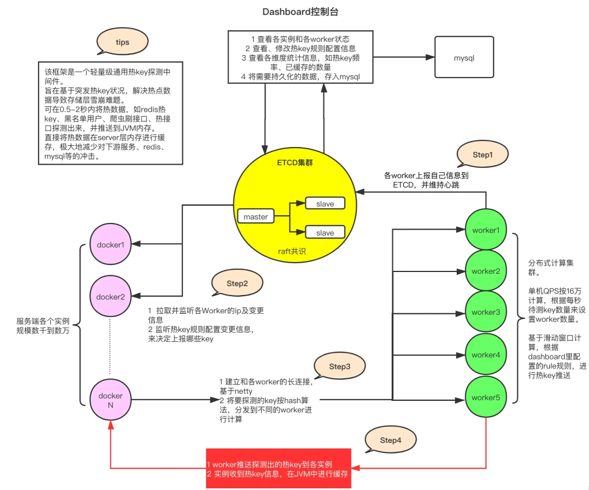
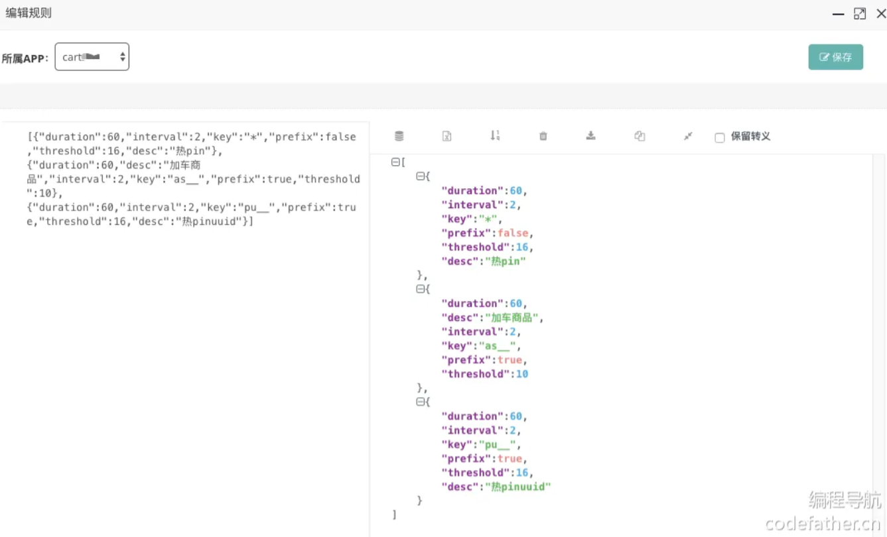
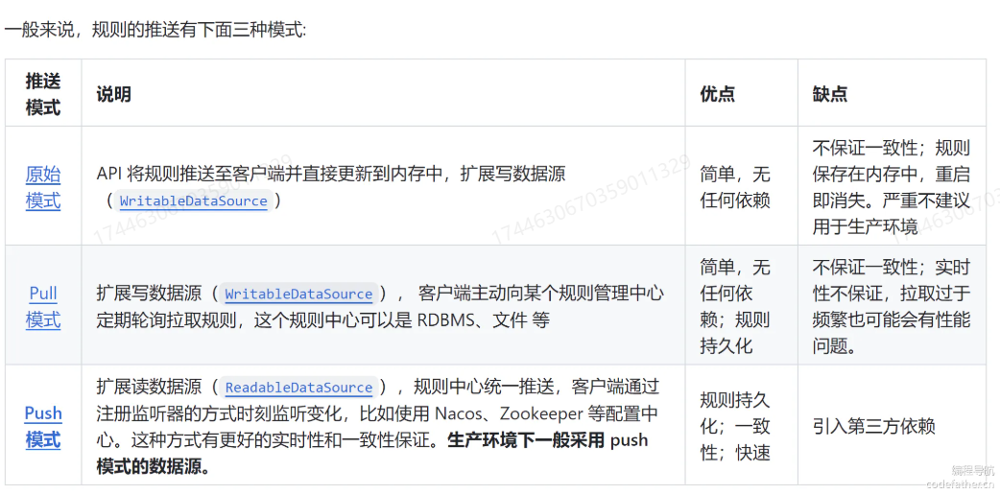
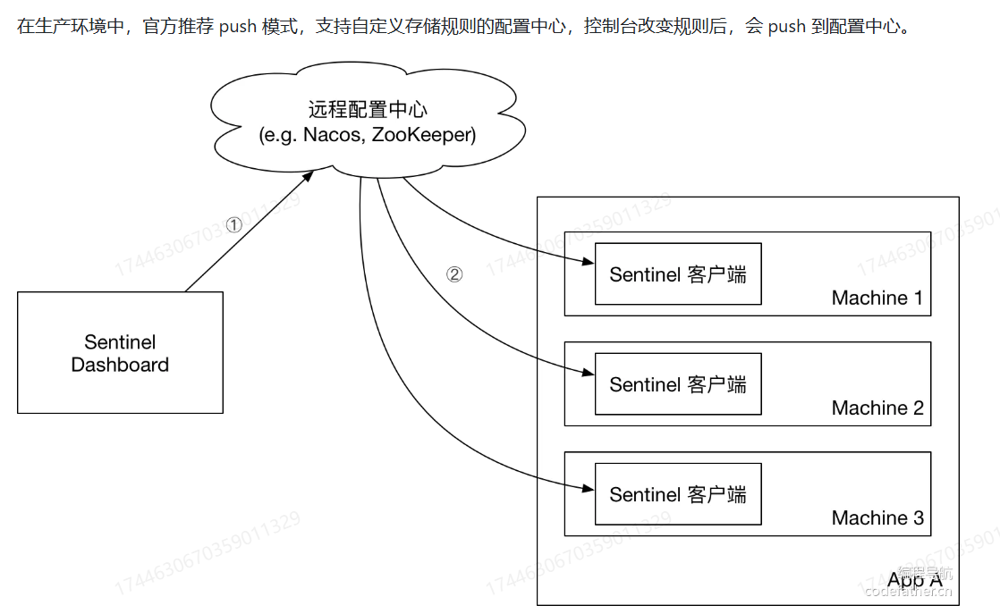

# 项目

## 智能刷题平台

### 一、概述

项目名称：智能刷题平台

基于SpringBoot+Redis+MySQL+Elasticsearch的刷题平台,并运用HotKey+Sentinel+Nacos全面优化性能和安全性。用户可以分词检索题目、在线刷题并查看刷题记录日历等。管理员可以创建题库并批量关联题目；


主要工作：

1. 存储优化：基于Redis BitMap+Redisson实现用户年度刷题记录的统计，相比数据库存储节约几百倍空间。并通过本地缓存+返回值优化+位运算进一步提升接口性能。
2. 批量操作优化：基于MyBatis的batch操作实现题目批量管理，并通过任务拆分+CompletableFuture+线程池并发编程提升批处理性能。
3. 查询优化：使用Redis缓存提升题库查询性能，并通过接入Hotkey并配置热key探测规则来自动缓存热门题目，防止瞬时流量击垮数据库。
4. 系统保护：基于Sentinel注解对获取题库列表接口进行限流，并基于热点参数限流机制对单IP获取题目进行流控
5. 黑名单过滤：为限制恶意用户访问，基于WebFilter+BloomFilter实现IP黑名单拦截，并通过Nacos配置中心动态更新黑名单便于维护。
6. 设计分级反爬虫策略：基于Redis实现用户访问题目频率统计，并通过Lua脚本保证原子更新，超限时自动给管理员发送告警和封禁用户，有效防止内容盗取。


### 二、详解

#### 存储优化

* 存储方案选择与优化

  * 基于数据库：存储100万个用户365天的签到记录，需要20GB左右。

  ```mysql
  #表设计如下
  CREATE TABLE user_sign_in (
    id BIGINT AUTO_INCREMENT PRIMARY KEY,  -- 主键，自动递增
    userId BIGINT NOT NULL,               -- 用户ID，关联用户表
    signDate DATE NOT NULL,            -- 签到日期
    createdTime TIMESTAMP DEFAULT CURRENT_TIMESTAMP,  -- 记录创建时间
    UNIQUE KEY uq_user_date (userId, signDate)  -- 用户ID和签到日期的唯一性约束
  );
  
  ```

  * 基于缓存Redis Set：存储100万个用户的365天签到记录，使用Redis集合类型来存储每个用户的签到信息，每个用户需要大约1880字节的空间，总共需要大约2GB的内存空间，相比数据库节约了10倍左右。

  ```
  SADD user:signins:2024:123 "09-01"
  SADD user:signins:2024:123 "10-01"
  ```

  * 基于BitMap位图：对于刷题签到记录场景，一个用户存储一年的数据仅需占用46字节，因为46*8=368，能覆盖365天的记录。那一百万用户也才占用43.8MB,相比于Redis Set结构节约了40多倍存储空间！

* 性能优化

  * 本地缓存：加载 BitSet 到内存中，避免后续读取时发送多次请求
  * 计算优化：使用nextSetBit,可以跳过无意义的循环检查，通过位运算来获取被设置为1的位置，性能更高
  * 返回值优化：实际上没必要完全组装好数据传输给前端，仅需告诉前端哪天有刷题就行（大部分同学不可能一年365天每天都刷题)，这样能大大减少传输的数据量以及后端服务的CPU占用，将部分计算压力均摊到用户的客户端（浏览器身上）。

  ```java
  @Override
  public List<Integer> getUserSignInRecord(long userId, Integer year) {
      if (year == null) {
          LocalDate date = LocalDate.now();
          year = date.getYear();
      }
      String key = RedisConstant.getUserSignInRedisKey(year, userId);
      RBitSet signInBitSet = redissonClient.getBitSet(key);
      // 加载 BitSet 到内存中，避免后续读取时发送多次请求
      BitSet bitSet = signInBitSet.asBitSet();
      // 统计签到的日期
      List<Integer> dayList = new ArrayList<>();
      // 从索引 0 开始查找下一个被设置为 1 的位
      int index = bitSet.nextSetBit(0);
      while (index >= 0) {
          dayList.add(index);
          // 查找下一个被设置为 1 的位
          index = bitSet.nextSetBit(index + 1);
      }
      return dayList;
  }
  
  ```

#### 批量操作优化

* 基于MyBatis的batch操作实现题目批量管理，并通过任务拆分+CompletableFuture+线程池并发编程提升批处理性能

* 代码示例：

  ```java
          // 自定义线程池
          ThreadPoolExecutor customExecutor = new ThreadPoolExecutor(
                  20,                         // 核心线程数
                  50,                        // 最大线程数
                  60L,                       // 线程空闲存活时间
                  TimeUnit.SECONDS,           // 存活时间单位
                  new LinkedBlockingQueue<>(10000),  // 阻塞队列容量
                  new ThreadPoolExecutor.CallerRunsPolicy() // 拒绝策略：由调用线程处理任务
          );
  
          // 用于保存所有批次的 CompletableFuture
          List<CompletableFuture<Void>> futures = new ArrayList<>();
  
          // 分批处理避免长事务，假设每次处理 1000 条数据
          int batchSize = 1000;
          int totalQuestionListSize = validQuestionIdList.size();
          for (int i = 0; i < totalQuestionListSize; i += batchSize) {
              // 生成每批次的数据
              List<Long> subList = validQuestionIdList.subList(i, Math.min(i + batchSize, totalQuestionListSize));
              List<QuestionBankQuestion> questionBankQuestions = subList.stream().map(questionId -> {
                  QuestionBankQuestion questionBankQuestion = new QuestionBankQuestion();
                  questionBankQuestion.setQuestionBankId(questionBankId);
                  questionBankQuestion.setQuestionId(questionId);
                  questionBankQuestion.setUserId(loginUser.getId());
                  return questionBankQuestion;
              }).collect(Collectors.toList());
  
              QuestionBankQuestionService questionBankQuestionService = (QuestionBankQuestionServiceImpl) AopContext.currentProxy();
              // 异步处理每批数据并添加到 futures 列表
              CompletableFuture<Void> future = CompletableFuture.runAsync(() -> {
                  questionBankQuestionService.batchAddQuestionsToBankInner(questionBankQuestions);
              }, customExecutor).exceptionally(ex -> {
                  log.error("批处理任务执行失败", ex);
                  return null;
              });
  
              futures.add(future);
          }
  
          // 等待所有批次操作完成
          CompletableFuture.allOf(futures.toArray(new CompletableFuture[0])).join();
  
          // 关闭线程池
          customExecutor.shutdown();
  ```

  


#### 查询优化（Hotkey）

* 使用Caffeine本地缓存提升题库查询性能，并通过接入Hotkey并配置热key探测规则来自动缓存热门题目，防止瞬时流量击垮数据库

* hotkey架构

  * 架构图

  

  * hotkey dashboard编辑规则示例：我们解析下其中的第二条rule:as开头的热key的规则就是interval-2秒内出现了threshold-10次就认为它是热key,它就会被推送到jvm内存中，并缓存60秒，prefix-true代表前缀匹配。那么在应用中，就可以把一组key,都用as_开头，用来探测。

    

* 扩展

  * 和Redis分布式缓存结合：不是热key,就查数据库。对于热key,写缓存时，再判断一下是否为热key,是热key才设置Redis分布式缓存。后续的热key就可以从分布式缓存中获取值。（缓存存储的技术或者位置变了）

  > 用redis作缓存，可以引出数据更新一致性策略是怎么做的，也能扯到redis缓存三兄弟

  * 自动续期问题：可以先自己测试一下。比如针对某个热点key再多次发送请求查询缓存，发现在热key生效（缓存生效）期间，如果该key仍然被不断访问，并不会刷新缓存时间，直到过期。然后看下源码，就知道为什么了。源码中的逻辑是，如果已经是热key则不会再push,离过期还有2秒内的时候，会再次push,这样这个key可能被继续设置为热key。也就是说，如果一个key持续被访问，很有可能在过期前一直被设置为热点，减少了出现雪崩问题的可能性。

* 代码示例

  ```java
  @GetMapping("/get/vo")
  public BaseResponse<QuestionBankVO> getQuestionBankVOById(QuestionBankQueryRequest questionBankQueryRequest, HttpServletRequest request) {
      ThrowUtils.throwIf(questionBankQueryRequest == null, ErrorCode.PARAMS_ERROR);
      Long id = questionBankQueryRequest.getId();
      ThrowUtils.throwIf(id <= 0, ErrorCode.PARAMS_ERROR);
  
      // 生成 key
      String key = "bank_detail_" + id;
      // 如果是热 key
      if (JdHotKeyStore.isHotKey(key)) {
          // 从本地缓存中获取缓存值
          Object cachedQuestionBankVO = JdHotKeyStore.get(key);
          if (cachedQuestionBankVO != null) {
              // 如果缓存中有值，直接返回缓存的值
              return ResultUtils.success((QuestionBankVO) cachedQuestionBankVO);
          }
      }
  
      // 原本查询数据的逻辑（查数据库）
  
      // 设置本地缓存
      JdHotKeyStore.smartSet(key, questionBankVO);
      
      // 获取封装类
      return ResultUtils.success(questionBankVO);
  }
  
  ```

  

#### 系统保护（Sentinel 限流熔断降级）

* 为保护系统,基于Sentinel注解对获取题库列表接口进行限流，并基于热点参数限流机制对单IP获取题目进行流控

  * 为保护系统，基于Sentinel注解+Dashboard对获取题库列表接口进行限流，并通过fallbackHandler配置熔断调用异常率超过10%时直接返回本地缓存。

    *  对题库接口限流代码示例

      ```java
          /**
           * 分页获取题库列表（封装类）
           *
           * @param questionBankQueryRequest
           * @param request
           * @return
           */
          @PostMapping("/list/page/vo")
          @SentinelResource(value = "listQuestionBankVOByPage",
                  blockHandler = "handleBlockException",
                  fallback = "handleFallback")
          public BaseResponse<Page<QuestionBankVO>> listQuestionBankVOByPage(@RequestBody QuestionBankQueryRequest questionBankQueryRequest,
                                                                     HttpServletRequest request) {
              long current = questionBankQueryRequest.getCurrent();
              long size = questionBankQueryRequest.getPageSize();
              // 限制爬虫
              ThrowUtils.throwIf(size > 200, ErrorCode.PARAMS_ERROR);
              // 查询数据库
              Page<QuestionBank> questionBankPage = questionBankService.page(new Page<>(current, size),
                      questionBankService.getQueryWrapper(questionBankQueryRequest));
              // 获取封装类
              return ResultUtils.success(questionBankService.getQuestionBankVOPage(questionBankPage, request));
          }
      
          /**
           * listQuestionBankVOByPage 降级操作：直接返回本地数据
           */
          public BaseResponse<Page<QuestionBankVO>> handleFallback(@RequestBody QuestionBankQueryRequest questionBankQueryRequest,
                                                                   HttpServletRequest request, Throwable ex) {
              // 可以返回本地数据或空数据
              return ResultUtils.success(null);
          }
      
          /**
           * listQuestionBankVOByPage 流控操作
           * 限流：提示“系统压力过大，请耐心等待”
           * 熔断：执行降级操作
           */
          public BaseResponse<Page<QuestionBankVO>> handleBlockException(@RequestBody QuestionBankQueryRequest questionBankQueryRequest,
                                                                         HttpServletRequest request, BlockException ex) {
              // 测试发现只有业务异常才会走handleFallBack，所以下面要配置熔断以后也要走handleFallBack
              // 降级操作
              if (ex instanceof DegradeException) {
                  return handleFallback(questionBankQueryRequest, request, ex);
              }
              // 限流操作
              return ResultUtils.error(ErrorCode.SYSTEM_ERROR, "系统压力过大，请耐心等待");
          }
      ```

      

  * 为保护系统，基于Sentinel的热点参数限流机制对IP获取题目进行流控，并通过拉模式配置将规则持久化到本地文件。

    > 由于需要针对每个用户进一步精细化限流而不是整体接口限流，可以采用热点参数限流机制，允许根据参数控制限流
    >
    > 热点参数限流会统计传入参数中的热点参数，并根据配置的限流阈值与模式，对包含热点参数的资源调用进行限流。热点参数限流可以看做是一种特殊的流量控制，仅对包含热点参数的资源调用生效。

    * 对IP限流代码示例

      ```java
          /**
           * 分页获取题目列表（封装类 - 限流版）
           *
           * @param questionQueryRequest
           * @param request
           * @return
           */
          @PostMapping("/list/page/vo/sentinel")
          public BaseResponse<Page<QuestionVO>> listQuestionVOByPageSentinel(@RequestBody QuestionQueryRequest questionQueryRequest,
                                                                     HttpServletRequest request) {
              ThrowUtils.throwIf(questionQueryRequest==null,ErrorCode.PARAMS_ERROR);
              long size = questionQueryRequest.getPageSize();
              // 限制爬虫
              ThrowUtils.throwIf(size > 20, ErrorCode.PARAMS_ERROR);
              String remoteAddr = request.getRemoteAddr();
              Entry entry = null;
              // 基于 IP 限流
              try {
                  entry = SphU.entry("listQuestionVOByPage", EntryType.IN, 1, remoteAddr);
                  // 被保护的业务逻辑
                  // 查询数据库
                  Page<Question> questionPage = questionService.listQuestionByPage(questionQueryRequest);
                  // 获取封装类
                  return ResultUtils.success(questionService.getQuestionVOPage(questionPage, request));
              } catch (Throwable ex) {
                  // 业务异常
                  if (!BlockException.isBlockException(ex)) {
                      Tracer.trace(ex);
                      return ResultUtils.error(ErrorCode.SYSTEM_ERROR, "系统错误");
                  }
                  // 降级操作
                  if (ex instanceof DegradeException) {
                      return handleFallback(questionQueryRequest, request, ex);
                  }
                  // 限流操作
                  return ResultUtils.error(ErrorCode.SYSTEM_ERROR, "访问过于频繁，请稍后再试");
              } finally {
                  if (entry != null) {
                      entry.exit(1, remoteAddr);
                  }
              }
          }
      ```

      

    * sentinel规则推送机制

      

      

      * 拉模式代码示例

      ```java
      /**
       * 持久化配置为本地文件
       */
      public void listenRules() throws Exception {
          // 获取项目根目录
          String rootPath = System.getProperty("user.dir");
          // sentinel 目录路径
          File sentinelDir = new File(rootPath, "sentinel");
          // 目录不存在则创建
          if (!FileUtil.exist(sentinelDir)) {
              FileUtil.mkdir(sentinelDir);
          }
          // 规则文件路径
          String flowRulePath = new File(sentinelDir, "FlowRule.json").getAbsolutePath();
          String degradeRulePath = new File(sentinelDir, "DegradeRule.json").getAbsolutePath();
      
          // Data source for FlowRule
          ReadableDataSource<String, List<FlowRule>> flowRuleDataSource = new FileRefreshableDataSource<>(flowRulePath, flowRuleListParser);
          // Register to flow rule manager.
          FlowRuleManager.register2Property(flowRuleDataSource.getProperty());
          WritableDataSource<List<FlowRule>> flowWds = new FileWritableDataSource<>(flowRulePath, this::encodeJson);
          // Register to writable data source registry so that rules can be updated to file
          WritableDataSourceRegistry.registerFlowDataSource(flowWds);
      
          // Data source for DegradeRule
          FileRefreshableDataSource<List<DegradeRule>> degradeRuleDataSource
                  = new FileRefreshableDataSource<>(
                  degradeRulePath, degradeRuleListParser);
          DegradeRuleManager.register2Property(degradeRuleDataSource.getProperty());
          WritableDataSource<List<DegradeRule>> degradeWds = new FileWritableDataSource<>(degradeRulePath, this::encodeJson);
          // Register to writable data source registry so that rules can be updated to file
          WritableDataSourceRegistry.registerDegradeDataSource(degradeWds);
      }
      
      private Converter<String, List<FlowRule>> flowRuleListParser = source -> JSON.parseObject(source,
              new TypeReference<List<FlowRule>>() {
              });
      private Converter<String, List<DegradeRule>> degradeRuleListParser = source -> JSON.parseObject(source,
              new TypeReference<List<DegradeRule>>() {
              });
      
      private <T> String encodeJson(T t) {
          return JSON.toJSONString(t);
      }
      
      ```

      

#### 黑名单过滤（Nacos）

​	为限制恶意用户访问，基于WebFilter+BloomFilter实现IP黑名单拦截，并通过Nacos配置中心动态更新黑名单便于维护


* 黑名单过滤工具类

  ```java
  @Slf4j
  public class BlackIpUtils {
  
      private static BitMapBloomFilter bloomFilter;
  
      // 判断 ip 是否在黑名单内
      public static boolean isBlackIp(String ip) {
          return bloomFilter.contains(ip);
      }
  
      // 重建 ip 黑名单
      public static void rebuildBlackIp(String configInfo) {
          if (StrUtil.isBlank(configInfo)) {
              configInfo = "{}";
          }
          // 解析 yaml 文件
          Yaml yaml = new Yaml();
          Map map = yaml.loadAs(configInfo, Map.class);
          // 获取 ip 黑名单
          List<String> blackIpList = (List<String>) map.get("blackIpList");
          // 加锁防止并发
          synchronized (BlackIpUtils.class) {
              if (CollectionUtil.isNotEmpty(blackIpList)) {
                  // 注意构造参数的设置
                  BitMapBloomFilter bitMapBloomFilter = new BitMapBloomFilter(958506);
                  for (String ip : blackIpList) {
                      bitMapBloomFilter.add(ip);
                  }
                  bloomFilter = bitMapBloomFilter;
              } else {
                  bloomFilter = new BitMapBloomFilter(100);
              }
          }
      }
  }
  
  ```

* Nacos监听类（直接通过Nacos控制台获取示例代码）

  ```java
  @Slf4j
  @Component
  public class NacosListener implements InitializingBean {
  
      @NacosInjected
      private ConfigService configService;
  
      @Value("${nacos.config.data-id}")
      private String dataId;
  
      @Value("${nacos.config.group}")
      private String group;
  
      @Override
      public void afterPropertiesSet() throws Exception {
          log.info("nacos 监听器启动");
  
          String config = configService.getConfigAndSignListener(dataId, group, 3000L, new Listener() {
              final ThreadFactory threadFactory = new ThreadFactory() {
                  private final AtomicInteger poolNumber = new AtomicInteger(1);
                  @Override
                  public Thread newThread(@NotNull Runnable r) {
                      Thread thread = new Thread(r);
                      thread.setName("refresh-ThreadPool" + poolNumber.getAndIncrement());
                      return thread;
                  }
              };
              final ExecutorService executorService = Executors.newFixedThreadPool(1, threadFactory);
  
              // 通过线程池异步处理黑名单变化的逻辑
              @Override
              public Executor getExecutor() {
                  return executorService;
              }
  
              // 监听后续黑名单变化
              @Override
              public void receiveConfigInfo(String configInfo) {
                  log.info("监听到配置信息变化：{}", configInfo);
                  BlackIpUtils.rebuildBlackIp(configInfo);
              }
          });
          // 初始化黑名单
          BlackIpUtils.rebuildBlackIp(config);
      }
  }
  
  ```

* 黑名单过滤器

  ```java
  @WebFilter(urlPatterns = "/*", filterName = "blackIpFilter")
  public class BlackIpFilter implements Filter {
  
      @Override
      public void doFilter(ServletRequest servletRequest, ServletResponse servletResponse, FilterChain filterChain) throws IOException, ServletException {
  
          String ipAddress = NetUtils.getIpAddress((HttpServletRequest) servletRequest);
          if (BlackIpUtils.isBlackIp(ipAddress)) {
              servletResponse.setContentType("text/json;charset=UTF-8");
              servletResponse.getWriter().write("{\"errorCode\":\"-1\",\"errorMsg\":\"黑名单IP，禁止访问\"}");
              return;
          }
          filterChain.doFilter(servletRequest, servletResponse);
      }
  
  }
  
  ```

  

#### 反爬虫设计（Redis）

**一、概述**

​	基于Redis实现用户访问题目频率统计，并通过Lua脚本保证原子更新，超限时自动给管理员发送告警和封禁用户，有效防止内容盗取。

**二、策略**

​	如果项目多机分布式部署，那么就需要利用一个独立的持久化存储来统计访问频率。分布式存储Redis的string结构支持incr累加操作，可以对每个用户分钟（或其他时间精度）级别的访问次数进行累加统计。

​	建议采用分级反爬虫策略，先告警、再采取强制措施，可以有效减少误封的风险：

* 如果每分钟超过10道题目，则给管理员发送告警，比如发送邮件或者短信
* 如果每分钟超过20道题目，则直接将账号踢下线，且进行封号操作。（或者限制一段时间无法问）

**Redis键值对设计**

要能区分出用户和时间窗，示例key为：`user:access:{userId}:[timestamp_in_minutes}`

* `{userld}`是用户ID。
* `(timestamp_in_minutes}`是当前的分钟级时间戳，即将当前时间戳转化为分钟，这样每分钟的访问都会被统计到一个key中。

每个key的value,就是该用户在这分钟内的访问次数。

**Redis操作逻辑**

```
//假设使用 jedis 客户端
// 使用 Redis 的 INCR 操作增加当前秒的访问次数
jedis.incr(redisKey);

// 设置过期时间（TTL），例如只保存60秒的数据
jedis.expire(redisKey, 60);  // 60秒后自动过期

```

然而，这种方法存在潜在的设计陷阱：incr和expire是两个独立的操作。如果你在高并发情况下调用incr()之后发生上下文切换（比如另一个线程执行操作），可能会导致两个问题：

1. 过期时间重置：如果在高并发场景下，多次调用incr()后又多次调用expire(),可能会不断重置该key的过期时间，导致这个key永远不会过期。（当前场景不会，但是连续性访问的场景就有可能发生）

2. 非原子操作：由于incr()和expire()是独立操作，在并发情况下，两个线程都可能先判断key不存在，然后各自执行set操作，导致计数逻辑出错。

​	所以我们要确保计数和过期时间的操作是原子性的，可以使用Redis的Lua脚本来完成。如果key不存在，则初始化并设置过期时间，否则只进行计数。

**三、后端开发**

1. 通用计数器

   ```java
   @Slf4j
   @Service
   public class CounterManager {
   
       @Resource
       private RedissonClient redissonClient;
   
       /**
        * 增加并返回计数，默认统计一分钟内的计数结果
        *
        * @param key 缓存键
        * @return
        */
       public long incrAndGetCounter(String key) {
           return incrAndGetCounter(key, 1, TimeUnit.MINUTES);
       }
   
       /**
        * 增加并返回计数
        *
        * @param key          缓存键
        * @param timeInterval 时间间隔
        * @param timeUnit     时间间隔单位
        * @return
        */
       public long incrAndGetCounter(String key, int timeInterval, TimeUnit timeUnit) {
           int expirationTimeInSeconds;
           switch (timeUnit) {
               case SECONDS:
                   expirationTimeInSeconds = timeInterval;
                   break;
               case MINUTES:
                   expirationTimeInSeconds = timeInterval * 60;
                   break;
               case HOURS:
                   expirationTimeInSeconds = timeInterval * 60 * 60;
                   break;
               default:
                   throw new IllegalArgumentException("Unsupported TimeUnit. Use SECONDS, MINUTES, or HOURS.");
           }
   
           return incrAndGetCounter(key, timeInterval, timeUnit, expirationTimeInSeconds);
       }
   
       /**
        * 增加并返回计数
        *
        * @param key                     缓存键
        * @param timeInterval            时间间隔
        * @param timeUnit                时间间隔单位
        * @param expirationTimeInSeconds 计数器缓存过期时间
        * @return
        */
       public long incrAndGetCounter(String key, int timeInterval, TimeUnit timeUnit, int expirationTimeInSeconds) {
           if (StrUtil.isBlank(key)) {
               return 0;
           }
   
           // 根据时间粒度生成 redisKey
           long timeFactor;
           switch (timeUnit) {
               case SECONDS:
                   timeFactor = Instant.now().getEpochSecond() / timeInterval;
                   break;
               case MINUTES:
                   timeFactor = Instant.now().getEpochSecond() / 60 / timeInterval;
                   break;
               case HOURS:
                   timeFactor = Instant.now().getEpochSecond() / 3600 / timeInterval;
                   break;
               default:
                   throw new IllegalArgumentException("Unsupported TimeUnit. Use SECONDS, MINUTES, or HOURS.");
           }
   
           String redisKey = key + ":" + timeFactor;
   
           // Lua 脚本
           String luaScript =
                   "if redis.call('exists', KEYS[1]) == 1 then " +
                           "  return redis.call('incr', KEYS[1]); " +
                           "else " +
                           "  redis.call('set', KEYS[1], 1); " +
                           "  redis.call('expire', KEYS[1], ARGV[1]); " +
                           "  return 1; " +
                           "end";
   
           // 执行 Lua 脚本
           RScript script = redissonClient.getScript(IntegerCodec.INSTANCE);
           Object countObj = script.eval(
                   RScript.Mode.READ_WRITE,
                   luaScript,
                   RScript.ReturnType.INTEGER,
                   Collections.singletonList(redisKey), expirationTimeInSeconds);
           return (long) countObj;
       }
   }
   
   ```

2. 检测爬虫逻辑

   ```java
   @Resource
   private CounterManager counterManager;
   
   /**
    * 检测爬虫
    *
    * @param loginUserId
    */
   private void crawlerDetect(long loginUserId) {
       // 调用多少次时告警
       final int WARN_COUNT = 10;
       // 超过多少次封号
       final int BAN_COUNT = 20;
       // 拼接访问 key
       String key = String.format("user:access:%s", loginUserId);
       // 一分钟内访问次数，180 秒过期
       long count = counterManager.incrAndGetCounter(key, 1, TimeUnit.MINUTES, 180);
       // 是否封号
       if (count > BAN_COUNT) {
           // 踢下线
           StpUtil.kickout(loginUserId);
           // 封号
           User updateUser = new User();
           updateUser.setId(loginUserId);
           updateUser.setUserRole("ban");
           userService.updateById(updateUser);
           throw new BusinessException(ErrorCode.NO_AUTH_ERROR, "访问太频繁，已被封号");
       }
       // 是否告警
       if (count == WARN_COUNT) {
           // 可以改为向管理员发送邮件通知
           throw new BusinessException(110, "警告访问太频繁");
       }
   }
   
   ```


3. 使用爬虫检测方法

   ```java
   @GetMapping("/get/vo")
   public BaseResponse<QuestionVO> getQuestionVOById(long id, HttpServletRequest request) {
       ThrowUtils.throwIf(id <= 0, ErrorCode.PARAMS_ERROR);
       // 检测和处置爬虫
       User loginUser = userService.getLoginUser(request);
       crawlerDetect(loginUser.getId());
       // 查询数据库
       Question question = questionService.getById(id);
       ThrowUtils.throwIf(question == null, ErrorCode.NOT_FOUND_ERROR);
       // 获取封装类
       return ResultUtils.success(questionService.getQuestionVO(question, request));
   }
   
   ```

   

# 实习

## 蓝矩科技

**工作内容**

1. 数据迁移：使用Python和Kettle进行Oracle与MySQL之间的大规模数据迁移。

2. 数据爬取：使用Scrapy爬取百度百科全部人物数据和天眼查手机端企业与人物数据等，并入库Mongo和ES，并在Crawlab上定期运行同步脚本。

3. 后端搭建：使用SpringBoot搭建校友数据查询系统后端,根据条件从ES中模糊或精确查询校友简要信息，并配合Mongo展示单个校友详细数据。并使用ES的聚合搜索功能返回大屏所需的聚合统计数据。

4. AI提取功能：后端调用自部署的ChatGLM4对校友信息进行批量数据处理与结构化信息提取，并使用websocket汇报提取进度。

5. 日志汇总：通过filebeat+kibana统一展示和查询各个服务的日志，便于管理和维护。

   


